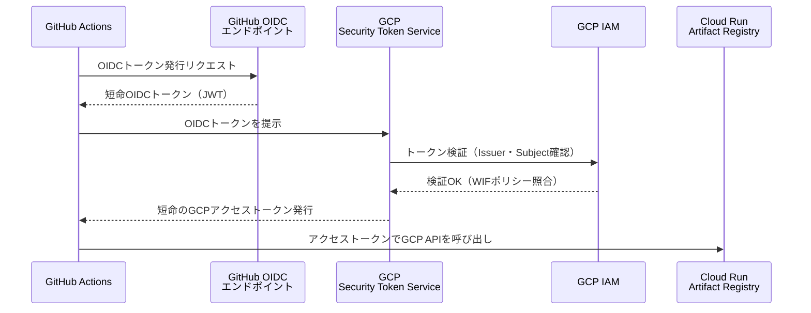
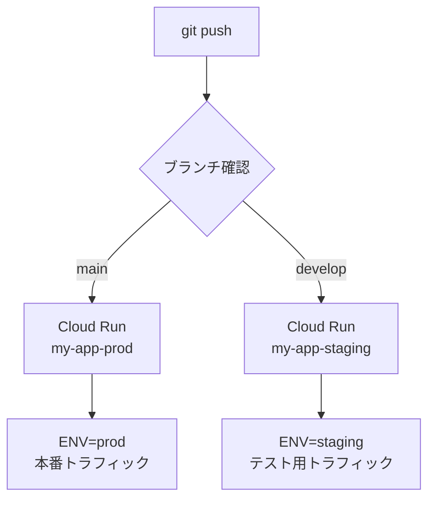

## はじめに

GitHub ActionsからGCPへデプロイする際、多くのチュートリアルではサービスアカウントキー（JSON）をGitHub Secretsに貼り付ける方法を紹介しています。この方法は手軽に設定できますが、次のようなリスクを抱えています。

- **キー漏洩のリスク**: 長期有効なキーが外部に漏洩すると、GCPリソースへの不正アクセスが発生する
- **ローテーションの手間**: 定期的にキーを更新し、GitHub Secretsも更新する必要がある
- **キー管理の複雑化**: 環境（開発・staging・本番）が増えるほど、管理すべきキーが増加する

本記事では **Workload Identity Federation（WIF）** を使ったキーレス認証を採用します。GitHubが発行するOIDCトークンをGCPのIAMが直接信頼する仕組みのため、サービスアカウントキーを一切作成・配布せずにデプロイパイプラインを構築できます。

### 本記事で構築するパイプライン

- mainブランチへのpush → Cloud Run（本番）へ自動デプロイ
- developブランチへのpush → Cloud Run（ステージング）へ自動デプロイ
- Workload Identity Federationによるキーレス認証
- Artifact RegistryへのDockerイメージpush
- `GITHUB_SHA` をタグとして使うイミュータブルなイメージ管理

### 前提条件

- GCPプロジェクトが作成済みであること
- `gcloud` CLIがインストール・認証済みであること
- GitHubリポジトリが存在すること
- Dockerの基本知識があること

---

## 1. Workload Identity Federationの仕組み

設定手順に入る前に、WIFがどのように動作するかを理解しておきます。



認証フローは以下の通りです。

1. GitHub Actionsのジョブ開始時に、GitHubのOIDCエンドポイントから短命のJWTトークンが発行される
2. そのJWTトークンをGCPのSecurity Token Service（STS）に提示する
3. STSがトークンの発行元（issuer）やリポジトリ情報（subject）を検証する
4. WIFのポリシーに合致すれば、短命のGCPアクセストークンが発行される
5. そのアクセストークンを使ってCloud RunやArtifact Registryに操作する

サービスアカウントキーは一切存在しないため、漏洩リスクがゼロです。トークンはジョブごとに自動発行・自動失効するため、ローテーション作業も不要です。

---

## 2. GCP側のセットアップ

### 2-1. 必要なAPIを有効化する

まず、必要なGCP APIをすべて有効化します。

```bash
gcloud services enable \
  iam.googleapis.com \
  cloudresourcemanager.googleapis.com \
  iamcredentials.googleapis.com \
  sts.googleapis.com \
  run.googleapis.com \
  artifactregistry.googleapis.com \
  --project={PROJECT_ID}
```

`{PROJECT_ID}` は自分のGCPプロジェクトIDに置き換えてください。

### 2-2. サービスアカウントを作成する

GitHub Actionsが「なりすます」対象となるサービスアカウントを作成します。

```bash
gcloud iam service-accounts create github-actions-sa \
  --display-name="GitHub Actions Service Account" \
  --project={PROJECT_ID}
```

### 2-3. IAMロールを付与する

サービスアカウントに必要な権限を付与します。

```bash
# Artifact Registryへのイメージpush権限
gcloud projects add-iam-policy-binding {PROJECT_ID} \
  --member="serviceAccount:github-actions-sa@{PROJECT_ID}.iam.gserviceaccount.com" \
  --role="roles/artifactregistry.writer"

# Cloud Runのデプロイ権限
gcloud projects add-iam-policy-binding {PROJECT_ID} \
  --member="serviceAccount:github-actions-sa@{PROJECT_ID}.iam.gserviceaccount.com" \
  --role="roles/run.admin"

# サービスアカウント自身へのアクセス委任（Cloud Runデプロイ時に必要）
gcloud projects add-iam-policy-binding {PROJECT_ID} \
  --member="serviceAccount:github-actions-sa@{PROJECT_ID}.iam.gserviceaccount.com" \
  --role="roles/iam.serviceAccountUser"
```

### 2-4. Workload Identity Poolを作成する

WIFの基盤となるプールを作成します。プールは複数のIDプロバイダー（GitHub、AWS等）をまとめる入れ物です。

```bash
gcloud iam workload-identity-pools create "github-pool" \
  --project={PROJECT_ID} \
  --location="global" \
  --display-name="GitHub Actions Pool"
```

### 2-5. GitHubのOIDCプロバイダーを登録する

プールに対して、GitHubのOIDCエンドポイントをプロバイダーとして登録します。

```bash
gcloud iam workload-identity-pools providers create-oidc "github-provider" \
  --project={PROJECT_ID} \
  --location="global" \
  --workload-identity-pool="github-pool" \
  --display-name="GitHub Actions OIDC Provider" \
  --attribute-mapping="google.subject=assertion.sub,attribute.repository=assertion.repository,attribute.repository_owner=assertion.repository_owner" \
  --issuer-uri="https://token.actions.githubusercontent.com"
```

`--attribute-mapping` でGitHubのトークンクレーム（`assertion.*`）をGCPの属性（`attribute.*`）にマッピングします。`attribute.repository` には `owner/repo` 形式のリポジトリ名が入ります。

### 2-6. WIFバインディングを設定する

特定のGitHubリポジトリからのリクエストのみがサービスアカウントを使えるよう、バインディングを設定します。

まず、プロジェクト番号を確認します。

```bash
gcloud projects describe {PROJECT_ID} --format="value(projectNumber)"
```

次にバインディングを作成します。`{PROJECT_NUMBER}` は上記コマンドで取得した数値です。

```bash
gcloud iam service-accounts add-iam-policy-binding \
  "github-actions-sa@{PROJECT_ID}.iam.gserviceaccount.com" \
  --project={PROJECT_ID} \
  --role="roles/iam.workloadIdentityUser" \
  --member="principalSet://iam.googleapis.com/projects/{PROJECT_NUMBER}/locations/global/workloadIdentityPools/github-pool/attribute.repository/{GITHUB_OWNER}/{GITHUB_REPO}"
```

`{GITHUB_OWNER}` はGitHub組織名またはユーザー名、`{GITHUB_REPO}` はリポジトリ名です。この設定により、指定したリポジトリ以外からの認証リクエストはすべて拒否されます。

---

## 3. Artifact Registryのセットアップ

Dockerイメージを格納するリポジトリを作成します。

```bash
gcloud artifacts repositories create my-repo \
  --repository-format=docker \
  --location=asia-northeast1 \
  --description="Docker image repository" \
  --project={PROJECT_ID}
```

東京リージョン（`asia-northeast1`）を使用することで、Cloud Runとの通信レイテンシを最小化できます。

作成後、リポジトリが正しく作成されたか確認します。

```bash
gcloud artifacts repositories list \
  --location=asia-northeast1 \
  --project={PROJECT_ID}
```

イメージのパス形式は次の通りです。

```
asia-northeast1-docker.pkg.dev/{PROJECT_ID}/my-repo/{IMAGE_NAME}:{TAG}
```

---

## 4. Dockerfileの最適化

Cloud Runは起動時のコンテナイメージをプルするため、イメージサイズが小さいほどコールドスタートが高速になります。マルチステージビルドを使ってイメージを最小化します。

### Node.jsアプリの例

```dockerfile
# ビルドステージ
FROM node:22-slim AS builder
WORKDIR /app
COPY package*.json ./
RUN npm ci --omit=dev
COPY . .
RUN npm run build

# 実行ステージ
FROM node:22-slim AS runner
WORKDIR /app
ENV NODE_ENV=production
COPY --from=builder /app/node_modules ./node_modules
COPY --from=builder /app/dist ./dist
COPY --from=builder /app/package.json ./

# Cloud Runはデフォルトでポート8080を使用
EXPOSE 8080
ENV PORT=8080

CMD ["node", "dist/index.js"]
```

### Pythonアプリの例

```dockerfile
# ビルドステージ
FROM python:3.12-slim AS builder
WORKDIR /app
COPY requirements.txt .
RUN pip install --no-cache-dir --target=/app/packages -r requirements.txt

# 実行ステージ
FROM python:3.12-slim AS runner
WORKDIR /app
COPY --from=builder /app/packages /app/packages
COPY . .
ENV PYTHONPATH=/app/packages
ENV PORT=8080

CMD ["python", "-m", "uvicorn", "main:app", "--host", "0.0.0.0", "--port", "8080"]
```

`.dockerignore` も必ず作成して不要なファイルを除外します。

```
.git
.github
node_modules
.env
.env.*
*.log
__pycache__
.pytest_cache
README.md
```

---

## 5. GitHub Secretsの設定

GitHub Actionsのワークフローで使用するシークレットを設定します。

リポジトリの「Settings」→「Secrets and variables」→「Actions」→「New repository secret」から以下の3つを登録します。

| シークレット名 | 値の形式 | 取得方法 |
|---|---|---|
| `WIF_PROVIDER` | `projects/{PROJECT_NUMBER}/locations/global/workloadIdentityPools/github-pool/providers/github-provider` | 後述のコマンドで確認 |
| `SERVICE_ACCOUNT` | `github-actions-sa@{PROJECT_ID}.iam.gserviceaccount.com` | サービスアカウントのメールアドレス |
| `GCP_PROJECT_ID` | `{PROJECT_ID}` | GCPプロジェクトID |

`WIF_PROVIDER` の値は次のコマンドで確認できます。

```bash
gcloud iam workload-identity-pools providers describe github-provider \
  --project={PROJECT_ID} \
  --location="global" \
  --workload-identity-pool="github-pool" \
  --format="value(name)"
```

---

## 6. GitHub Actionsワークフロー（完全版）

いよいよメインとなるワークフローファイルです。`.github/workflows/deploy.yml` として保存します。

```yaml
name: Deploy to Cloud Run

on:
  push:
    branches:
      - main     # 本番デプロイ
      - develop  # ステージングデプロイ

env:
  PROJECT_ID: ${{ secrets.GCP_PROJECT_ID }}
  REGION: asia-northeast1
  REPOSITORY: my-repo
  IMAGE: my-app
  PROD_SERVICE: my-app-prod
  STAGING_SERVICE: my-app-staging

jobs:
  deploy:
    name: Build and Deploy
    runs-on: ubuntu-latest

    permissions:
      contents: read
      id-token: write  # Workload Identity Federation認証に必須

    steps:
      # 1. ソースコードのチェックアウト
      - name: Checkout repository
        uses: actions/checkout@v4

      # 2. WIFを使ってGCPに認証（キーレス）
      - name: Authenticate to Google Cloud
        id: auth
        uses: google-github-actions/auth@v2
        with:
          workload_identity_provider: ${{ secrets.WIF_PROVIDER }}
          service_account: ${{ secrets.SERVICE_ACCOUNT }}

      # 3. gcloud CLIのセットアップ
      - name: Set up Cloud SDK
        uses: google-github-actions/setup-gcloud@v2

      # 4. DockerをArtifact Registryに認証
      - name: Configure Docker for Artifact Registry
        run: gcloud auth configure-docker ${{ env.REGION }}-docker.pkg.dev --quiet

      # 5. デプロイ先サービス名を決定（branchによって切り替え）
      - name: Set deployment target
        id: target
        run: |
          if [[ "${{ github.ref }}" == "refs/heads/main" ]]; then
            echo "service=${{ env.PROD_SERVICE }}" >> $GITHUB_OUTPUT
            echo "env_suffix=prod" >> $GITHUB_OUTPUT
          else
            echo "service=${{ env.STAGING_SERVICE }}" >> $GITHUB_OUTPUT
            echo "env_suffix=staging" >> $GITHUB_OUTPUT
          fi

      # 6. Dockerイメージをビルド
      - name: Build Docker image
        run: |
          docker build \
            --tag "${{ env.REGION }}-docker.pkg.dev/${{ env.PROJECT_ID }}/${{ env.REPOSITORY }}/${{ env.IMAGE }}:${{ github.sha }}" \
            --tag "${{ env.REGION }}-docker.pkg.dev/${{ env.PROJECT_ID }}/${{ env.REPOSITORY }}/${{ env.IMAGE }}:latest" \
            .

      # 7. Artifact RegistryにDockerイメージをpush
      - name: Push Docker image to Artifact Registry
        run: |
          docker push "${{ env.REGION }}-docker.pkg.dev/${{ env.PROJECT_ID }}/${{ env.REPOSITORY }}/${{ env.IMAGE }}:${{ github.sha }}"
          docker push "${{ env.REGION }}-docker.pkg.dev/${{ env.PROJECT_ID }}/${{ env.REPOSITORY }}/${{ env.IMAGE }}:latest"

      # 8. Cloud Runにデプロイ
      - name: Deploy to Cloud Run
        id: deploy
        run: |
          gcloud run deploy ${{ steps.target.outputs.service }} \
            --image "${{ env.REGION }}-docker.pkg.dev/${{ env.PROJECT_ID }}/${{ env.REPOSITORY }}/${{ env.IMAGE }}:${{ github.sha }}" \
            --region ${{ env.REGION }} \
            --platform managed \
            --allow-unauthenticated \
            --set-env-vars "ENV=${{ steps.target.outputs.env_suffix }}" \
            --quiet

      # 9. デプロイ結果（サービスURL）を出力
      - name: Show deployed service URL
        run: |
          SERVICE_URL=$(gcloud run services describe ${{ steps.target.outputs.service }} \
            --region ${{ env.REGION }} \
            --format="value(status.url)")
          echo "Deployed to: ${SERVICE_URL}"
          echo "Image: ${{ env.REGION }}-docker.pkg.dev/${{ env.PROJECT_ID }}/${{ env.REPOSITORY }}/${{ env.IMAGE }}:${{ github.sha }}"
```

### ワークフローの重要ポイント

**`permissions.id-token: write` は必須**

WIF認証を行うためには、ジョブレベルで `id-token: write` 権限を明示的に付与する必要があります。この設定がないと `google-github-actions/auth@v2` がOIDCトークンを取得できずにエラーになります。

**`GITHUB_SHA` によるイミュータブルなタグ**

イメージタグに `${{ github.sha }}` (コミットSHA) を使うことで、どのコミットからビルドされたイメージかを明確に追跡できます。デプロイのロールバック時にも特定のSHAタグを指定するだけで済みます。

**`--quiet` フラグ**

`gcloud` コマンドに `--quiet` を付けると、確認プロンプトをスキップします。CI/CD環境では必ず付与してください。

---

## 7. staging / production の環境分岐

本ワークフローでは、pushされたブランチ名によってデプロイ先を自動で切り替えます。



staging環境には `ENV=staging`、本番環境には `ENV=prod` を環境変数として渡しています。アプリケーション側でこの変数を参照することで、接続するデータベースやAPIエンドポイントを切り替えられます。

### 環境ごとのCloud Runサービスを事前作成する

初回デプロイ前に、各環境のCloud Runサービスを作成しておくことを推奨します。

```bash
# ステージング環境
gcloud run services create my-app-staging \
  --region=asia-northeast1 \
  --image=asia-northeast1-docker.pkg.dev/{PROJECT_ID}/my-repo/my-app:latest \
  --platform=managed \
  --project={PROJECT_ID}

# 本番環境
gcloud run services create my-app-prod \
  --region=asia-northeast1 \
  --image=asia-northeast1-docker.pkg.dev/{PROJECT_ID}/my-repo/my-app:latest \
  --platform=managed \
  --project={PROJECT_ID}
```

---

## 8. 環境変数・シークレットの管理

アプリケーションが使用する環境変数は、Cloud Runのサービスに直接設定します。GitHub Secretsに入れるのはデプロイ自体に必要な認証情報のみにとどめることが原則です。

### Secret Managerを使う場合

データベースのパスワードやAPIキーなど機密性の高い値は、Secret Managerで管理します。

```bash
# シークレットを作成
echo -n "your-secret-value" | gcloud secrets create my-database-password \
  --data-file=- \
  --project={PROJECT_ID}

# サービスアカウントにシークレット読み取り権限を付与
gcloud secrets add-iam-policy-binding my-database-password \
  --member="serviceAccount:github-actions-sa@{PROJECT_ID}.iam.gserviceaccount.com" \
  --role="roles/secretmanager.secretAccessor" \
  --project={PROJECT_ID}
```

ワークフローのデプロイコマンドに `--set-secrets` オプションを追加します。

```yaml
- name: Deploy to Cloud Run
  run: |
    gcloud run deploy ${{ steps.target.outputs.service }} \
      --image "${{ env.REGION }}-docker.pkg.dev/${{ env.PROJECT_ID }}/${{ env.REPOSITORY }}/${{ env.IMAGE }}:${{ github.sha }}" \
      --region ${{ env.REGION }} \
      --platform managed \
      --set-secrets "DATABASE_PASSWORD=my-database-password:latest" \
      --quiet
```

### 環境変数を使う場合（非機密値）

ログレベルやフィーチャーフラグなど、機密性のない設定値は `--set-env-vars` で直接指定します。

```yaml
- name: Deploy to Cloud Run
  run: |
    gcloud run deploy ${{ steps.target.outputs.service }} \
      --image "${{ env.REGION }}-docker.pkg.dev/${{ env.PROJECT_ID }}/${{ env.REPOSITORY }}/${{ env.IMAGE }}:${{ github.sha }}" \
      --region ${{ env.REGION }} \
      --platform managed \
      --set-env-vars "LOG_LEVEL=info,APP_ENV=${{ steps.target.outputs.env_suffix }}" \
      --quiet
```

---

## 9. デプロイ後の確認

### サービスのステータス確認

```bash
gcloud run services describe my-app-prod \
  --region=asia-northeast1 \
  --project={PROJECT_ID}
```

### デプロイ履歴の確認

```bash
gcloud run revisions list \
  --service=my-app-prod \
  --region=asia-northeast1 \
  --project={PROJECT_ID}
```

### ログの確認

```bash
gcloud logging read \
  "resource.type=cloud_run_revision AND resource.labels.service_name=my-app-prod" \
  --limit=50 \
  --project={PROJECT_ID}
```

### ロールバック手順

問題が発生した場合は、以前のリビジョンにトラフィックを戻します。

```bash
# リビジョン一覧を確認
gcloud run revisions list \
  --service=my-app-prod \
  --region=asia-northeast1 \
  --project={PROJECT_ID}

# 特定リビジョンに100%トラフィックを向ける
gcloud run services update-traffic my-app-prod \
  --to-revisions={REVISION_NAME}=100 \
  --region=asia-northeast1 \
  --project={PROJECT_ID}
```

---

## まとめ

本記事で構築したパイプラインを振り返ります。

| 項目 | 採用した方法 | メリット |
|---|---|---|
| GCP認証 | Workload Identity Federation | キー不要、漏洩リスクゼロ |
| イメージ管理 | Artifact Registry | GCRの後継、アクセス制御が細かい |
| デプロイ先 | Cloud Run | サーバーレス、スケール自動化 |
| 環境分岐 | branchによる切り替え | シンプル、レビューしやすい |
| イメージタグ | `GITHUB_SHA` | イミュータブル、追跡が容易 |

Workload Identity Federationの初期設定はやや手順が多いですが、一度設定してしまえばサービスアカウントキーの管理から完全に解放されます。セキュリティを高めながら運用負荷を下げられるため、新規プロジェクトでは最初からこの構成を採用することをお勧めします。

まずは `develop` ブランチへのpushでstagingデプロイが動作することを確認し、問題なければ `main` へのマージで本番デプロイが走る流れを体験してみてください。
