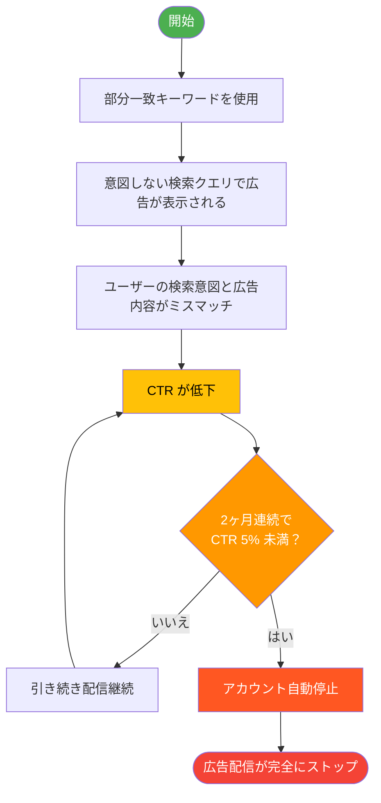
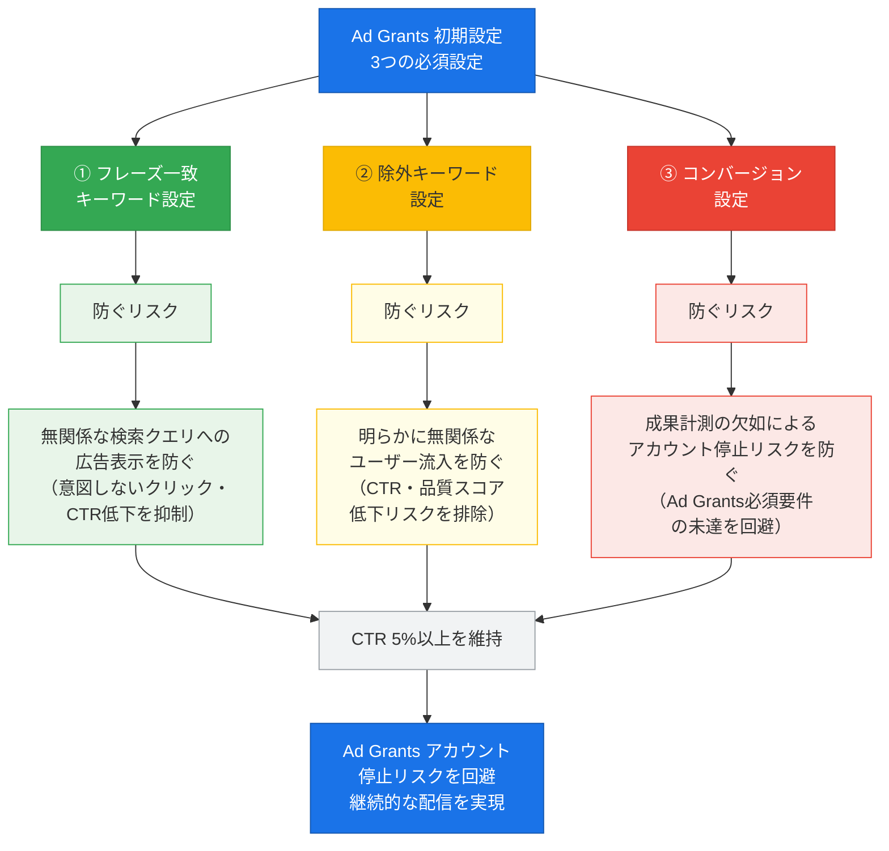
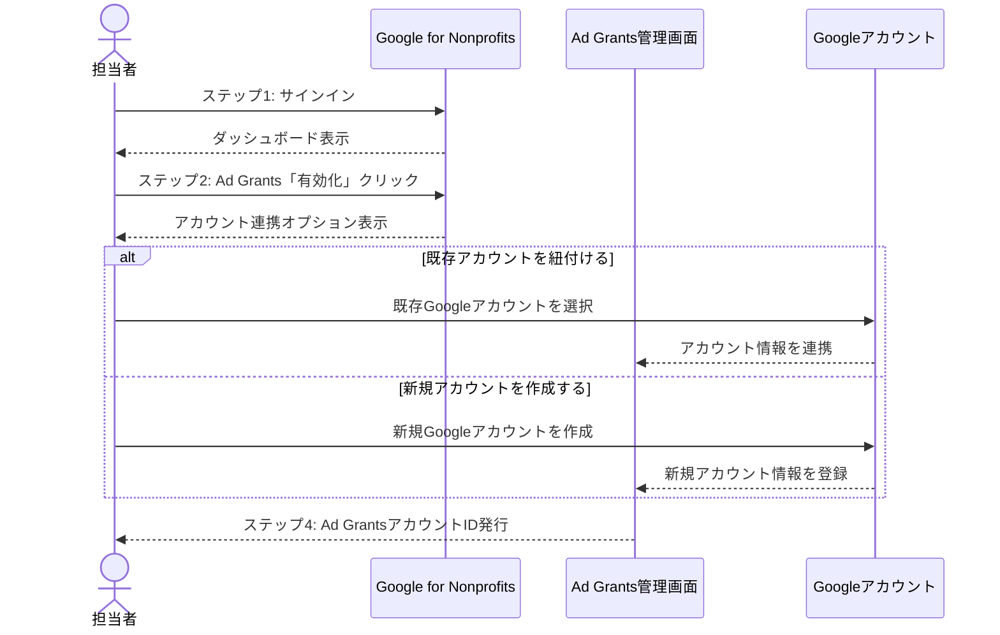
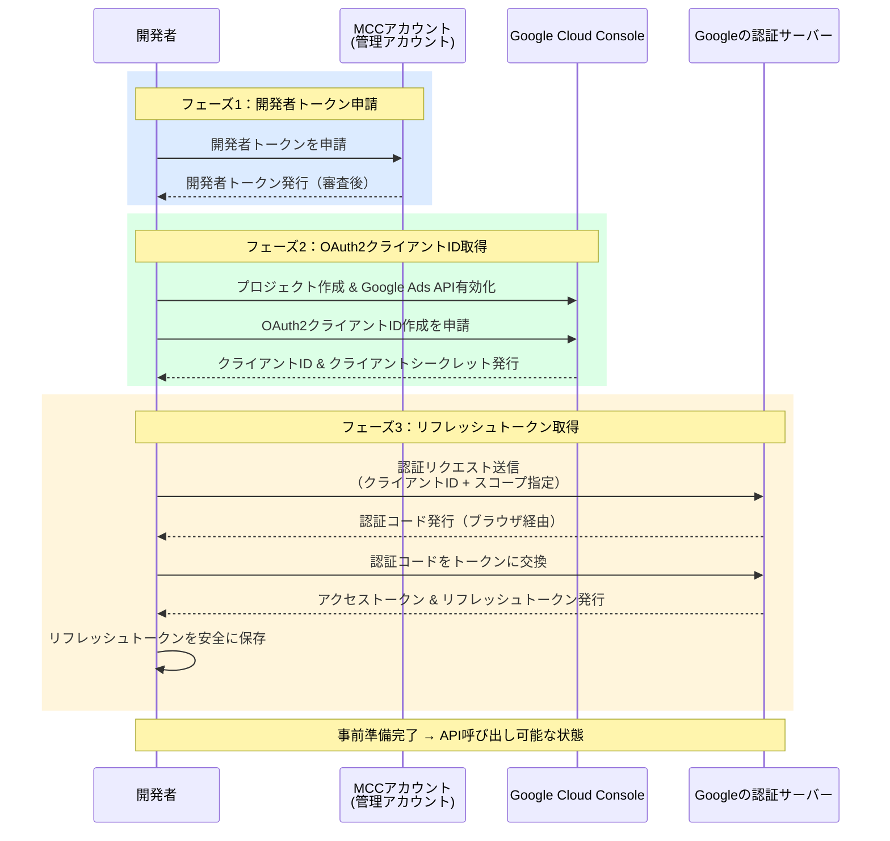
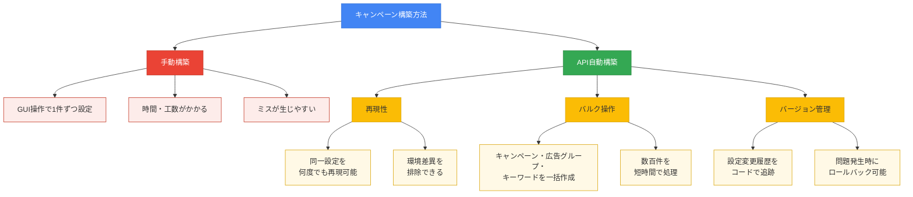

## はじめに：申請が通った後こそが本番です

Google Ad Grantsの申請が承認された瞬間、多くの非営利団体の担当者は安堵感を覚えるでしょう。しかし実際には、 **承認後の初期設定こそが運用の成否を分ける最重要フェーズ** です。

Ad Grantsは月額$10,000（約150万円相当、レート換算・時期により変動）の無料広告枠を提供するGoogleの非営利団体支援プログラムですが、運用ルールは一般のGoogle広告より厳格です。なかでも **2ヶ月連続でCTR（クリック率）5%未満が続くとアカウントが停止される** というルールは、設定を誤ると広告配信が止まる深刻なリスクをはらんでいます。

日本語で公開されている情報の大半は「申請方法」に集中しており、アクティベーション後の技術的な設定手順——とりわけGoogle Ads APIを使った自動構築——を体系的に解説した記事はほとんど存在しません。本記事では、以下の4つのフェーズを一本のガイドとしてまとめています。

1. **アクティベーション** ：Ad Grantsアカウントの初期設定と必須ポリシー確認
2. **API自動構築** ：Google Ads API（Python）によるキャンペーン・広告グループ・キーワードの一括作成
3. **計測基盤の整備** ：GA4・GTM・BigQueryとの連携設定
4. **DAレビュー** ：セキュリティ・品質チェックと改善対応

この記事は「申請が通ったけど、次に何をすればいいかわからない」という方を主な読者として想定しています。コードサンプルを含む実践的な内容ですので、技術担当者と広告担当者が一緒に読み進めることをおすすめします。各コードブロックには、広告担当者向けの役割説明も添えています。

---

## Ad Grantsの基本ルールと停止リスクの全体像



### なぜ初期設定で失敗するのか

Ad Grantsが一般のGoogle広告と大きく異なる点は、 **パフォーマンス基準を下回ると自動的に配信が停止される** という点です。一般の広告ではCTRが低くても広告費を支払う限り配信は続きますが、Ad Grantsは無料枠であるがゆえに、Googleが定めた品質基準への準拠が配信継続の条件になっています。

主なルールは以下のとおりです。

| ルール | 内容 |
|--------|------|
| CTR基準 | アカウント全体のCTRが2ヶ月連続で5%未満になると停止 |
| キーワード品質 | 品質スコア2以下のキーワードは使用不可 |
| 1語キーワード禁止 | 単一単語のキーワード（例：「ボランティア」）は原則禁止 |
| 過度に一般的なKW禁止 | ブランドに関係のない汎用キーワードは使用不可 |
| コンバージョン設定必須 | 意味のあるコンバージョンが少なくとも1つ設定されている必要がある |
| ジオターゲティング設定 | 「すべての国と地域」への設定は非推奨 |

これらのルールを知らずに設定を進めると、広告が配信されても低品質なクリックばかりが集まりCTRが下がり続ける、あるいは品質スコアの低いキーワードによってアカウントが審査対象になる、という悪循環に陥ります。

### 停止を避けるための3つの必須設定



初期設定の段階で必ず実施すべき設定は次の3つです。これらは後述するAPI自動構築でも中心的な役割を果たします。

**① フレーズ一致（PHRASE match）の採用**

Ad Grantsでは部分一致（BROAD match）を使用すると、意図しない検索クエリに広告が表示され、CTRが急激に低下するリスクがあります。初期設定では **フレーズ一致（PHRASE match）または完全一致（EXACT match）を基本とする** ことが強く推奨されます。

**② 除外キーワードの事前設定**

組織のブランドや活動と無関係な検索クエリへの表示を防ぐために、除外キーワードリストを初期段階で整備します。除外設定が不十分だと、関連性の低い検索者に広告が表示され、CTRとコンバージョン率の両方が低下します。

**③ コンバージョン設定の完備**

Ad Grantsのポリシーでは、少なくとも1つの「意味のあるコンバージョン」が設定されていることが求められます。ここでいうコンバージョンとは、問い合わせフォームの送信、寄付の完了、ボランティア登録など、組織の目標に直結するアクションです。GA4との連携が、この設定を正確に行うための基盤になります。

---

## フェーズ1：アクティベーション — Ad Grantsアカウントの初期設定



### Google for Nonprofitsとの接続確認

Ad Grantsを利用するためには、まずGoogle for Nonprofitsへの登録が完了している必要があります。承認通知を受け取った後、以下の手順でAd Grantsアカウントを有効化します。

1. [Google for Nonprofits](https://www.google.com/nonprofits/)にサインインする
2. 「Google広告」のセクションで「有効化」をクリックする
3. 既存のGoogle広告アカウントと紐付けるか、新規アカウントを作成する
4. Ad Grants専用のアカウントIDが発行されることを確認する

**重要：** Ad Grantsは通常のGoogle広告アカウントとは別のアカウントとして管理されます。既存の有料広告アカウントにAd Grantsを統合することはできません。

### 請求設定と予算上限の確認

Ad Grantsアカウントでは、請求情報の入力は不要ですが、以下の設定を確認します。

- **1日の予算上限：** Ad Grantsの上限は$329/日（月換算で約$10,000）です。キャンペーンレベルの1日予算の合計がこれを超えないよう設定します
- **入札上限：** 手動CPC（クリック単価）を使用する場合、1クリックあたり$2.00が上限です。ただしスマート自動入札（コンバージョン最大化など）を使用する場合はこの制限が適用されません

### タイムゾーンと通貨の設定

アカウント作成時にタイムゾーンと通貨を設定します。 **一度設定すると変更できないため、慎重に選択してください。**

日本の団体の場合：
- タイムゾーン：`(GMT+9:00) Tokyo`
- 通貨：`JPY - 日本円`（ただしAd Grantsの上限は常に$10,000/月でUSD換算で管理されます）

---

## フェーズ2：Google Ads APIによるキャンペーン自動構築

### APIアクセスの前提条件



フェーズ2のコード実装に進む前に、以下の準備が必要です。まだ取得していない場合は順に手続きを行ってください。

#### ① 開発者トークンの申請（MCC経由）

Google Ads APIを使用するには、 **開発者トークン（Developer Token）** が必要です。取得手順は以下のとおりです。

1. マネージャーアカウント（MCC）にサインインする
2. 「ツールと設定」→「設定」→「APIセンター」に移動する
3. 利用規約に同意し、開発者トークンを申請する
4. 初回は「テストアカウント」アクセスレベルで発行される。本番環境での使用には「スタンダード」または「ベーシック」アクセスへの申請が別途必要

#### ② OAuth2クライアントIDの取得

1. [Google Cloud Console](https://console.cloud.google.com/)でプロジェクトを作成する
2. 「APIとサービス」→「認証情報」→「認証情報を作成」→「OAuth 2.0 クライアント ID」を選択する
3. アプリケーションの種類を「デスクトップアプリ」に設定し、クライアントIDとクライアントシークレットを取得する
4. Google Ads APIを有効化する（「APIとサービス」→「ライブラリ」から検索）

#### ③ リフレッシュトークンの取得

`google-ads.yaml`に記載する`refresh_token`は、以下の手順で取得します。`google-auth-oauthlib`を使ったフローが最も簡単です。

```bash
pip install google-auth-oauthlib
```

```python
from google_auth_oauthlib.flow import InstalledAppFlow

# client_secret.jsonはCloud Consoleからダウンロードしたファイル
flow = InstalledAppFlow.from_client_secrets_file(
    "client_secret.json",
    scopes=["https://www.googleapis.com/auth/adwords"]
)
credentials = flow.run_local_server(port=0)
print(f"refresh_token: {credentials.refresh_token}")
```

上記スクリプトを実行するとブラウザが起動し、Googleアカウントでの認証後に`refresh_token`が表示されます。この値を`google-ads.yaml`に記載してください。

---

### なぜAPIを使うのか



手動でGoogle広告の管理画面からキャンペーンを構築することも可能ですが、Ad Grantsの活用を最大化するには **複数のキャンペーン・広告グループ・キーワードを体系的に設定する** 必要があります。手動作業では設定ミスや漏れが生じやすく、特にキーワードマッチタイプの統一や除外キーワードの一括設定が煩雑になります。

Google Ads APIを使うことで：
- **再現性のある設定** が可能になる（チームメンバーが変わっても同じ構成を再現できる）
- **バルク操作** が容易になる（50個のキーワードを一括で追加・修正できる）
- **バージョン管理** ができる（Gitでキャンペーン構成の変更履歴を追える）

### 環境構築：google-ads-python のインストール

まず開発環境を準備します。Python 3.8以上が必要です。

```bash
# 仮想環境の作成（推奨）
python -m venv ads-env
source ads-env/bin/activate  # Windowsの場合: ads-env\Scripts\activate

# google-ads ライブラリのインストール
pip install google-ads
```

次に、Google Ads APIの認証情報ファイル（`google-ads.yaml`）を作成します。

```yaml
# google-ads.yaml
developer_token: "YOUR_DEVELOPER_TOKEN"
client_id: "YOUR_CLIENT_ID"
client_secret: "YOUR_CLIENT_SECRET"
refresh_token: "YOUR_REFRESH_TOKEN"
login_customer_id: "YOUR_MANAGER_ACCOUNT_ID"  # MCC使用時
```

**セキュリティ注意事項：** `google-ads.yaml`には機密情報が含まれます。このファイルは絶対にGitリポジトリにコミットしないでください。`.gitignore`に追加することを徹底してください。後述のDAレビューセクションでシークレット漏洩の修復方法についても説明します。

```bash
# .gitignoreにgoogle-ads.yamlのみを明示的に追加する
# （*.yaml と書くとGitHub ActionsやCI/CD設定など他のYAMLファイルも
#   Git管理外になるため、必ずファイル名を直接指定してください）
echo "google-ads.yaml" >> .gitignore
```

### キャンペーン作成：基本構造のセットアップ

> **広告担当者へ：** このコードは「Ad Grants用の検索キャンペーンと予算」を作成する処理です。`amount_micros`（予算額）と`campaign.name`（キャンペーン名）が主な設定値です。担当者はこれらの値が組織の運用方針と合っているか確認してください。

```python
from google.ads.googleads.client import GoogleAdsClient
from google.ads.googleads.errors import GoogleAdsException
from datetime import datetime

def create_campaign(client, customer_id):
    """Ad Grants用の検索キャンペーンを作成する"""

    campaign_service = client.get_service("CampaignService")
    campaign_budget_service = client.get_service("CampaignBudgetService")

    # Step 1: キャンペーン予算の作成
    budget_operation = client.get_type("CampaignBudgetOperation")
    campaign_budget = budget_operation.create
    timestamp = datetime.now().strftime("%Y%m%d_%H%M%S")
    campaign_budget.name = f"Ad Grants Budget {timestamp}"
    campaign_budget.delivery_method = client.enums.BudgetDeliveryMethodEnum.BudgetDeliveryMethod.STANDARD
    # Ad Grantsの1日予算上限: $329 = 329,000,000 micros
    campaign_budget.amount_micros = 329_000_000
    campaign_budget.explicitly_shared = False

    budget_response = campaign_budget_service.mutate_campaign_budgets(
        customer_id=customer_id,
        operations=[budget_operation]
    )
    budget_resource_name = budget_response.results[0].resource_name
    print(f"キャンペーン予算を作成しました: {budget_resource_name}")

    # Step 2: キャンペーンの作成
    campaign_operation = client.get_type("CampaignOperation")
    campaign = campaign_operation.create
    campaign.name = f"Ad Grants Campaign {timestamp}"
    campaign.advertising_channel_type = (
        client.enums.AdvertisingChannelTypeEnum.AdvertisingChannelType.SEARCH
    )
    campaign.status = client.enums.CampaignStatusEnum.CampaignStatus.PAUSED
    campaign.campaign_budget = budget_resource_name

    # Ad Grants必須: 手動CPC（スマート入札を使用する場合は変更可）
    campaign.manual_cpc.enhanced_cpc_enabled = False

    campaign_response = campaign_service.mutate_campaigns(
        customer_id=customer_id,
        operations=[campaign_operation]
    )
    campaign_resource_name = campaign_response.results[0].resource_name
    print(f"キャンペーンを作成しました: {campaign_resource_name}")

    return campaign_resource_name
```

---

:::message
この記事は現在執筆中です。フェーズ3（計測基盤の整備）以降は順次追加予定です。
:::
