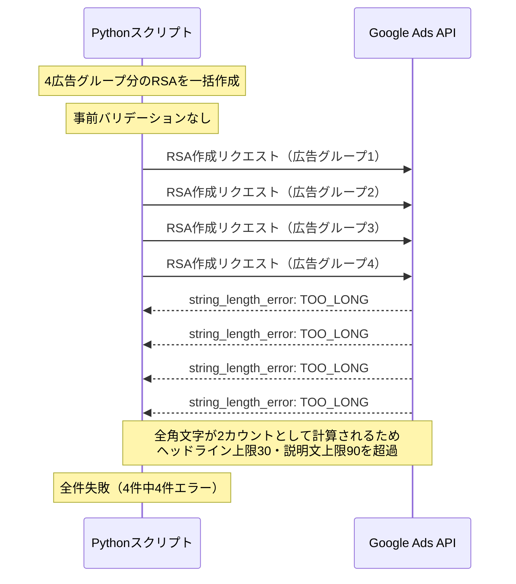
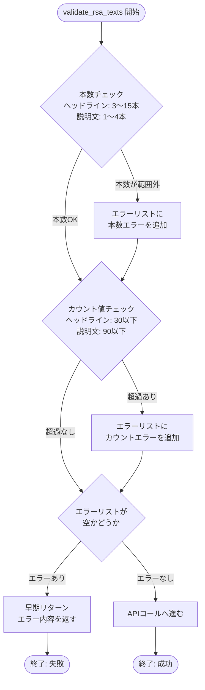
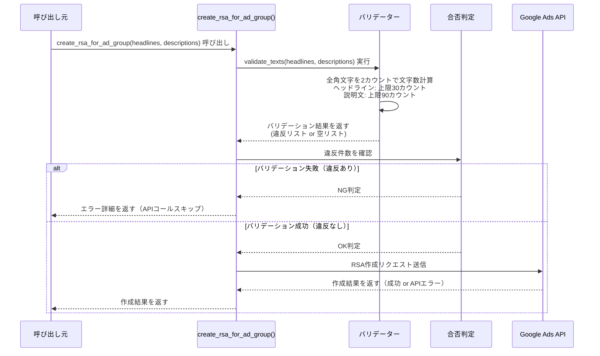

## はじめに

Google Ads APIを使ってレスポンシブ検索広告（RSA）を自動生成しようとしたとき、「文字数制限」という思わぬ壁にぶつかりました。

管理画面から手動で広告を作成する場合は、入力フォームがリアルタイムでカウントしてくれるので問題になりにくい話です。しかしAPI経由で一括処理をしようとすると、事前に制約を理解していなければ、リクエストが丸ごと失敗します。

実際に起きたのは、4広告グループ分のRSAを一括作成しようとしたところ、全件が `string_length_error: TOO_LONG` で返ってきた、という事態です。

この記事では、その失敗の経緯と原因、そして再発を防ぐために実装した事前バリデーション関数の設計パターンを解説します。Google Ads APIを使って日本語広告を自動化しようとしている方に、特に役立てていただけると思います。

> 用語の定義: 本記事では「カウント値」はAPIが計算する文字数を指します。日本語1文字は2カウントとして計算されるため、「45文字相当」という表現は「90カウント枠を全角文字で使い切った場合」を意味します。英数字を混在させた場合、使用できる文字数は変わります。

## RSA文字数制限の基本仕様

### ヘッドラインと説明文それぞれの上限

RSAには、ヘッドラインと説明文という2種類のテキスト要素があります。それぞれの文字数制限と本数制限は以下のとおりです。

| 要素 | カウント上限 | 最小本数 | 最大本数 |
|------|------------|---------|---------|
| ヘッドライン | 30カウント | 3本 | 15本 |
| 説明文 | 90カウント | 1本 | 4本 |

カウント数だけを見ると、説明文は90カウントとそれなりの余裕があるように見えます。しかしこれには重大な前提条件があります。

### 全角文字は2カウント — 日本語の実質上限

Google Ads APIのカウントルールでは、全角文字を2カウントとして扱います（執筆時点の動作確認に基づく。詳細は[Google Ads API公式ドキュメント StringLengthErrorEnum](https://developers.google.com/google-ads/api/reference/rpc/latest/StringLengthErrorEnum.StringLengthError)を参照）。

> 本記事では「カウント値」と「文字数」を区別します。日本語1文字は2カウントとして積み上がるため、「90カウント上限」を日本語のみで使い切ると45文字相当になります。英数字（1カウント）と混在させると、使用できる文字数は変わります。

結果として、日本語のみで構成された場合の実質的な上限は次のとおりです。

| 要素 | カウント上限 | 日本語のみの場合（目安） |
|------|------------|----------------------|
| ヘッドライン | 30カウント | 15文字相当 |
| 説明文 | 90カウント | 45文字相当 |

説明文で言えば、日本語のみなら45文字相当のカウント枠ということになります。広告文として訴求力のある文章を45文字相当以内に収めるのは、想像以上に制約がきつく感じられます。

### なぜAPIでは特に問題になるのか

管理画面では、テキスト入力欄がリアルタイムでカウントを表示・警告してくれます。人間が目で確認しながら入力する分には、上限を超えてしまう前に気づくことができます。

一方、APIでは事前にカウントを検証するロジックを自分で用意しない限り、制限違反のリクエストをそのままサーバーに送ってしまいます。そして返ってくるのは `string_length_error: TOO_LONG` というエラーだけです。バッチ処理であれば、複数のリクエストがまとめて失敗します。

## 全滅した話 — 4広告グループ分のRSAがすべて失敗した経緯



### 何をしようとしていたか

実際のケースでは、あるキャンペーンに紐づく4つの広告グループに対して、それぞれRSAを1件ずつ作成しようとしていました。処理はPythonスクリプトで実装し、Google Ads Python APIクライアントを通じて一括実行する設計です。

広告文は日本語で用意しており、説明文は各広告グループのターゲットに合わせた訴求内容を含んでいました。文章としての自然さを優先してライティングしたため、カウント数の厳密なチェックは後回しにしていました。

### 実行したら全件 TOO_LONG

スクリプトを実行すると、4件すべてが以下のようなエラーで失敗しました。

```
string_length_error: TOO_LONG
field: ad.responsive_search_ad.descriptions[x].text
```

エラーを一件ずつ確認すると、説明文のカウントが90を超えていました。例えば次のような説明文がありました。

```
「転職を考えているなら、まずは無料カウンセリングへ。経験豊富なアドバイザーが丁寧にサポートします。」
→ 47文字・96カウント（上限90カウントを6オーバー）
```

日本語で書いた説明文は、文字数としては40〜50文字程度でも、全角2カウントで計算すると80〜100カウントに達していたのです。

管理画面でプレビューしてから書いた文章ではなかったため、カウント超過に気づかないまま全件を投入してしまいました。

### 失敗から得た認識

このエラーは、設計段階で防ぐことができる類のものです。APIリクエストを送る前に、カウント数をコード側で検証するバリデーションレイヤーがあれば、エラーは発生しません。

失敗の本質は「仕様を知らなかった」ことではなく、「仕様を知っていたとしても検証ステップがなければ同じ結果になる」構造的な問題でした。この認識が、事前バリデーション関数の実装につながりました。

## 事前バリデーション関数の設計



### 基本方針 — APIを呼ぶ前に弾く

設計の方針はシンプルです。APIリクエストを送る前に、カウント上限を超えるテキストを検出して処理を止めること。

エラーハンドリング（API呼び出し後のエラー処理）ではなく、バリデーション（API呼び出し前の入力検証）として実装します。これにより、不要なAPIコールを減らしつつ、エラーの原因を明示的なメッセージとして返すことができます。

### `_count_ads_chars()` 関数の実装

カウントロジックの核となる関数が `_count_ads_chars()` です。この関数は、与えられた文字列のGoogle Ads API的なカウント値を返します。

```python
import unicodedata

# モジュールレベル定数
RSA_HEADLINE_LIMIT = 30
RSA_DESCRIPTION_LIMIT = 90
HEADLINE_MIN, HEADLINE_MAX = 3, 15
DESC_MIN, DESC_MAX = 1, 4


def _count_ads_chars(text: str) -> int:
    """
    Google Ads APIのカウントルールに従い文字数を計算する。

    East Asian Width プロパティが W（Wide）または F（Fullwidth）の
    文字を2カウント、それ以外を1カウントとして扱う。

    Note:
        - ひらがな・カタカナ・漢字・全角記号は W/F に該当し2カウント
        - 半角カナ（U+FF65〜U+FF9F）は Halfwidth(H) に該当し1カウント
        - ラテン拡張文字（é, ñ, ü など）は Narrow(Na) または
          Not East Asian(N) に該当し1カウント
        - 執筆時点（2025年）の動作確認に基づく実装。
          APIの仕様変更がないか定期的に確認を推奨。
    """
    count = 0
    for char in text:
        eaw = unicodedata.east_asian_width(char)
        count += 2 if eaw in ('W', 'F') else 1
    return count
```

`unicodedata.east_asian_width()` を使うことで、East Asian Width プロパティが W（Wide）または F（Fullwidth）の文字を2カウントとして扱います。この方法により、半角カナ（U+FF65〜U+FF9F）やラテン拡張文字（`é`, `ñ`, `ü` など）を正しく1カウントとして扱うことができます。`ord(char) > 127` による単純な判定では、これらの文字が誤って2カウントになるため採用していません。

### バリデーション関数の全体構成

`_count_ads_chars()` を使って、ヘッドラインと説明文それぞれを検証する関数を構成します。本数制限（ヘッドライン3〜15本、説明文1〜4本）も合わせて検証します。

```python
def validate_rsa_texts(
    headlines: list[str],
    descriptions: list[str],
) -> list[str]:
    """
    RSAのヘッドラインと説明文を検証し、
    制限違反がある場合はエラーメッセージのリストを返す。
    問題がなければ空リストを返す。

    検証内容:
        - ヘッドライン本数: 3〜15本
        - 説明文本数: 1〜4本
        - 各ヘッドラインのカウント値: 30以下
        - 各説明文のカウント値: 90以下
    """
    errors = []

    # 本数チェック
    if not (HEADLINE_MIN <= len(headlines) <= HEADLINE_MAX):
        errors.append(
            f"ヘッドライン数が不正: {len(headlines)}本 "
            f"(許容: {HEADLINE_MIN}〜{HEADLINE_MAX}本)"
        )

    if not (DESC_MIN <= len(descriptions) <= DESC_MAX):
        errors.append(
            f"説明文数が不正: {len(descriptions)}本 "
            f"(許容: {DESC_MIN}〜{DESC_MAX}本)"
        )

    # カウント値チェック
    for i, headline in enumerate(headlines):
        count = _count_ads_chars(headline)
        if count > RSA_HEADLINE_LIMIT:
            errors.append(
                f"ヘッドライン[{i}] '{headline}' のカウントが上限を超えています "
                f"({count} / {RSA_HEADLINE_LIMIT})"
            )

    for i, description in enumerate(descriptions):
        count = _count_ads_chars(description)
        if count > RSA_DESCRIPTION_LIMIT:
            errors.append(
                f"説明文[{i}] '{description}' のカウントが上限を超えています "
                f"({count} / {RSA_DESCRIPTION_LIMIT})"
            )

    return errors
```

> テストについて: バリデーション関数自体のバグを防ぐために、境界値テストの実装を強く推奨します。最低限、「30カウントぴったりのヘッドラインはパス」「31カウントはエラー」「半角カナが1カウントになること」などを `pytest` 等で確認しておくと安全です。

### 呼び出し側での使い方



広告グループごとのRSA作成処理の冒頭で、バリデーションを挟みます。

```python
def create_rsa_for_ad_group(
    ad_group_id: str,
    headlines: list[str],
    descriptions: list[str],
    client,
) -> None:
    """
    指定した広告グループにRSAを1件作成する。

    Args:
        ad_group_id: 対象広告グループのID
        headlines: ヘッドラインのリスト（3〜15本）
        descriptions: 説明文のリスト（1〜4本）
        client: Google Ads APIクライアント

    Returns:
        成功時はNone。バリデーションエラー時はNoneを返して早期リターン。

    Note:
        APIコール部分（RSA作成ミューテーションの送信）は
        本記事のスコープ外のため省略しています。
        実装例は Google Ads API公式サンプル を参照してください。
        https://developers.google.com/google-ads/api/docs/samples
    """
    # 事前バリデーション（カウント値・本数）
    errors = validate_rsa_texts(headlines, descriptions)
    if errors:
        for error in errors:
            print(f"[VALIDATION ERROR] {error}")
        return None  # APIコールを行わず早期リターン

    # バリデーションを通過した場合のみAPIコール
    # （RSA作成ミューテーションの実装は公式サンプルを参照）
    print(f"広告グループ {ad_group_id} のRSAを作成します...")
    # ad_group_ad_service.mutate_ad_group_ads(...)
```

この設計により、カウント超過のテキストがAPIに送信されることはなくなります。エラーメッセージにはどのテキストが何カウント超過しているかが含まれるため、修正箇所の特定も容易です。

## まとめ

Google Ads APIで日本語のRSAを自動生成する際に押さえておくべきポイントを整理します。

1. 全角文字は2カウントとして計算される。ヘッドラインは30カウント（日本語のみで15文字相当）、説明文は90カウント（同45文字相当）が上限
2. 管理画面にはリアルタイムのカウント表示があるが、API経由では自分でバリデーションロジックを用意する必要がある
3. `unicodedata.east_asian_width()` を使えば、半角カナやラテン拡張文字も含めて正確にカウントできる
4. バリデーションはAPIコールの前に実行し、不要なリクエストとエラーを未然に防ぐ設計にする

事前バリデーションの有無は、単発の手動実行では大きな差にならないかもしれません。しかし、バッチ処理や定期実行で広告文を自動管理する場面では、この1ステップが運用の安定性を大きく左右します。

同じようにGoogle Ads APIで日本語広告の自動化に取り組んでいる方の参考になれば幸いです。
