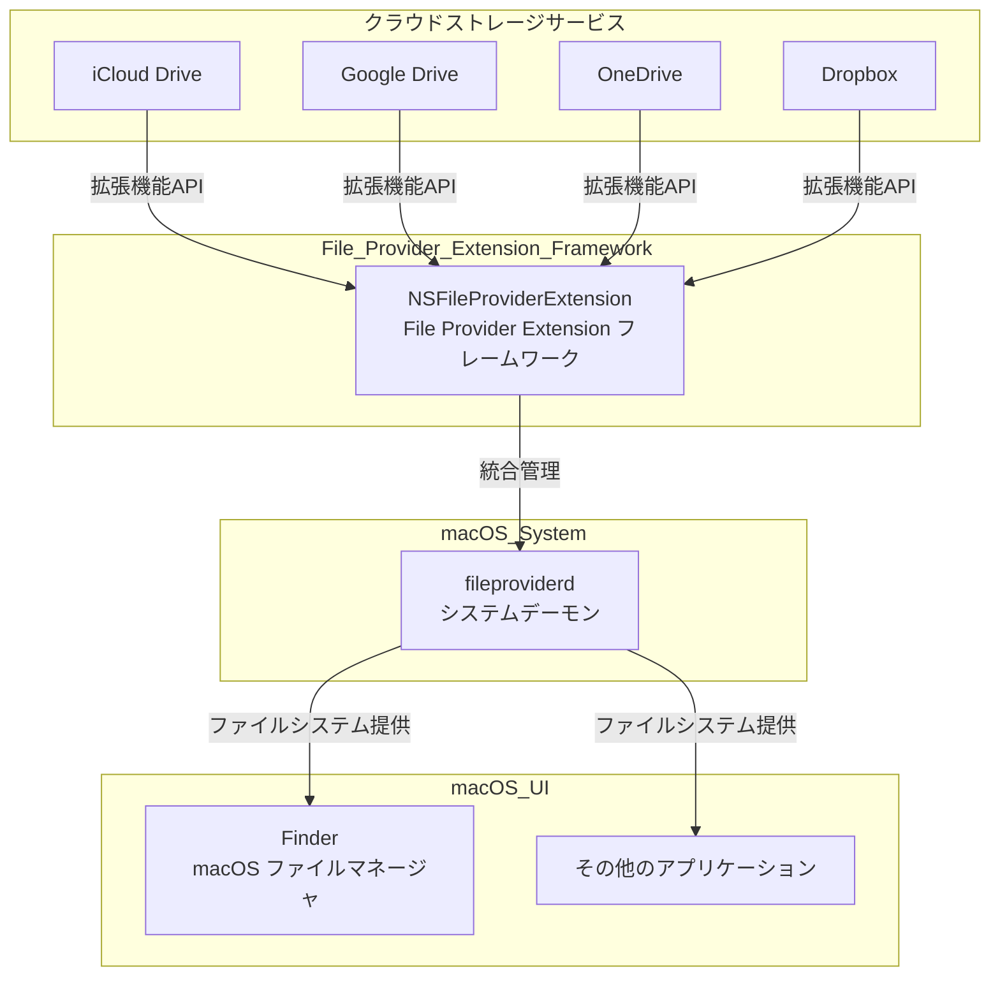
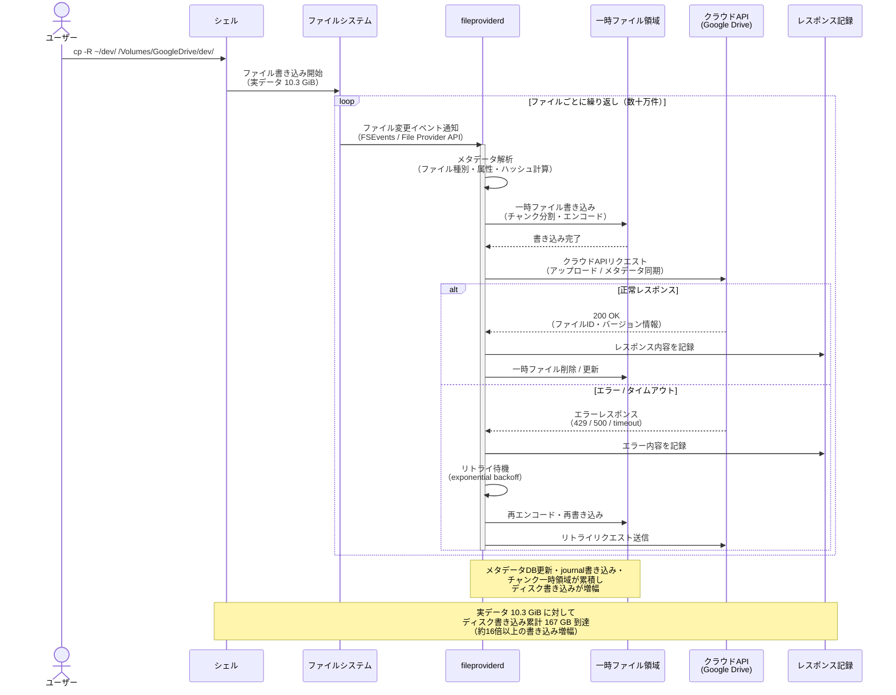
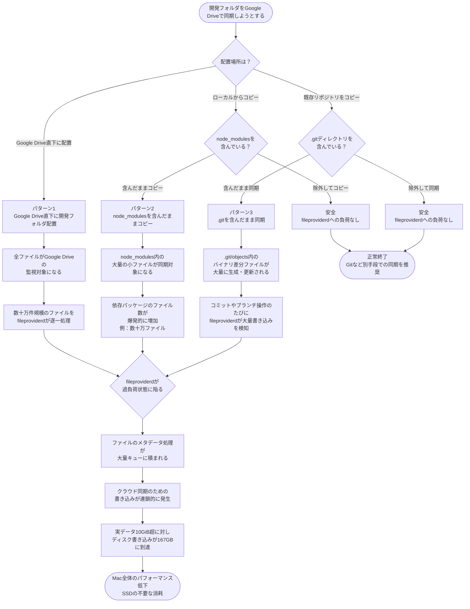
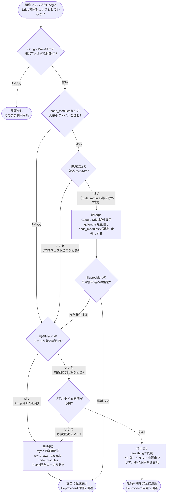
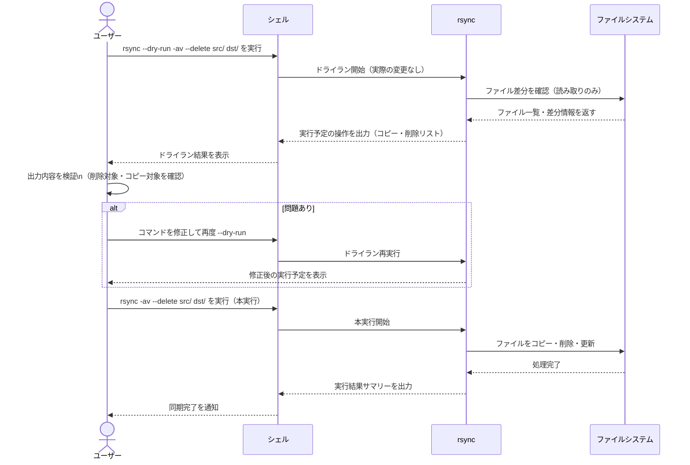
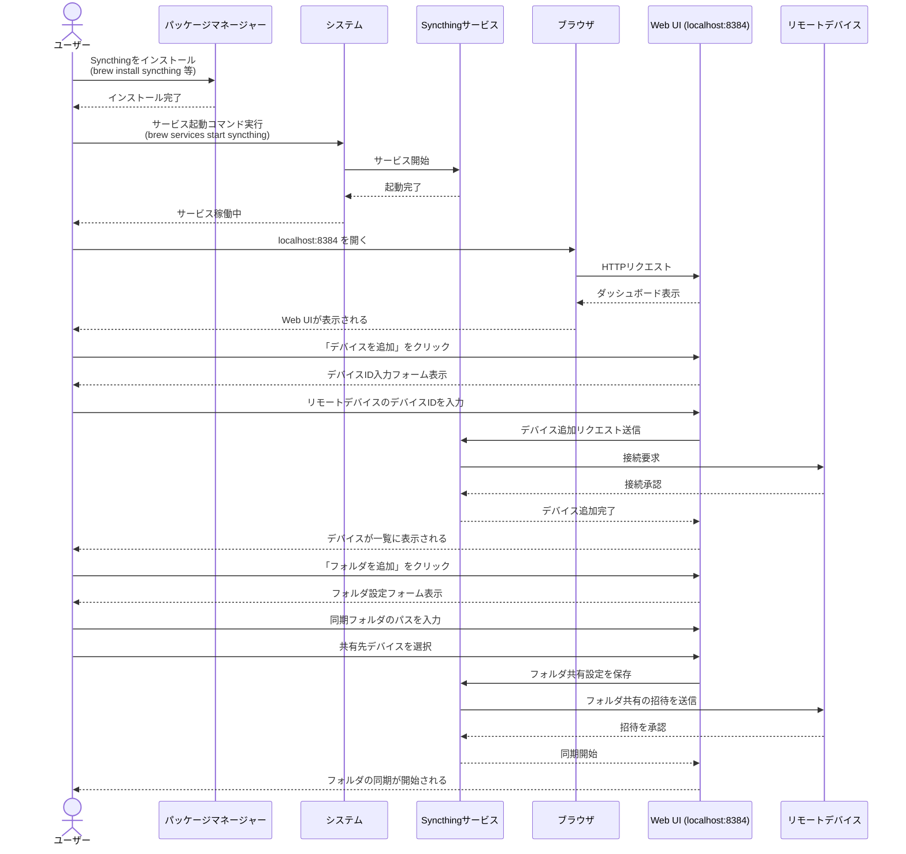

## はじめに - 何が起きたのか

新しいMac mini M4 Proが手元に届いた日、筆者はいつもと同じように環境移行を始めました。既存のMacBook ProからGoogle Drive File Stream経由で開発フォルダを移そうとして、`cp -R`コマンドを実行しました。その後、アクティビティモニタを眺めていると、見慣れないプロセスが異常な勢いでディスクに書き込みを続けていることに気づきました。

プロセス名は `fileproviderd`。ディスク書き込みの累計は止まる気配がなく、最終的に **167GB（アクティビティモニタの「書き込まれたバイト数」列の表示値）に到達** しました。

> **計測方法について**: アクティビティモニタ → 「ディスク」タブ → 「書き込まれたバイト数」列で確認しました。対象フォルダは複数のNode.jsプロジェクトを含む `~/dev/`（`node_modules` を含む状態）で、合計ファイル数はおよそ数十万件規模でした。なお、アクティビティモニタの表示は「GB」と表記されますが、実際の換算方式（SI単位系か2進数単位系か）はmacOSのバージョンによって異なる場合があります。

移行しようとした開発フォルダの実際のサイズは **10.3GiB** です。実データの16倍以上のディスク書き込みが、静かに、しかし着実に発生していたわけです。

この記事では、なぜこのようなことが起きるのか、fileproviderdのメカニズムを交えながら解説し、開発フォルダを安全に複数のMac間で同期するための現実的な代替手段を紹介します。Google Driveは書類管理には優れたツールです。ただ、開発フォルダとの相性は、構造的に良くありません。

---

## なぜこうなるのか - fileproviderdの仕組み



### fileproviderdとは

`fileproviderd` はmacOSに標準搭載されているシステムデーモンです。iCloud Drive、Google Drive、OneDrive、Dropboxといった、さまざまなクラウドストレージサービスをmacOS上で統合管理する役割を担っています。

具体的には、Apple の **File Provider Extension フレームワーク（NSFileProviderExtension）** を通じて動作します。各クラウドサービスのアプリがこのフレームワークに対応することで、Finderとの統合、オンデマンドダウンロード、ファイルの変更検知といった機能が実現されています。

macOS Ventura以降（とくにSonoma以降）でその仕様が大きく変更され、Google Driveなどのサードパーティ製クラウドサービスもこのFile Providerフレームワークへの移行が進んでいます。この変更に伴い、Apple Community や Google Drive サポートフォーラム（[例: Google Drive Community](https://support.google.com/drive/threads)）では `fileproviderd` のCPU使用率や異常なディスク書き込みに関するスレッドが多数報告されるようになっています。

### 開発フォルダが地雷になる理由

通常のドキュメントフォルダをクラウドで同期する場合、ファイル数はせいぜい数百〜数千程度です。しかし開発フォルダには、クラウド同期サービスにとって本質的に相性が悪い要素が含まれています。

**`node_modules`** は、その代表格です。小〜中規模のNode.jsプロジェクトでも、`node_modules` 以下のファイル数は数万に及ぶことは珍しくありません。それぞれが独立したファイルとして扱われるため、1つのプロジェクトを同期しようとするだけで、fileproviderdのキューに数万件の処理が積み上がります。

**`.git`** ディレクトリも同様です。Gitはファイルの差分をオブジェクトファイルとして `.git/objects/` 以下に格納します。コミット履歴が積み重なったリポジトリでは、この中のファイル数が数千〜数万になります。さらに、`git commit` や `git fetch` のたびにこれらのファイルが更新・追加されるため、fileproviderdは継続的に変更を検知し続けます。

**`vendor`** （PHPプロジェクトのComposer依存パッケージ格納先）や **`.venv`** （Pythonの仮想環境）なども同じ理由で問題になります。

これらの特徴をまとめると、次のようになります。なお、以下のファイル数の目安は、リポジトリ歴2〜3年相当の中規模プロジェクトを想定した参考値です。

| フォルダ | ファイル数の目安 | 更新頻度 |
|---|---|---|
| `node_modules` | 数万〜十数万 | `npm install` のたび |
| `.git/objects` | 数千〜数万 | コミット・フェッチのたび |
| `vendor` | 数千〜数万 | `composer install` のたび |
| `.venv` | 数千 | パッケージ追加のたび |

### なぜ167GBになったのか（推定メカニズム）



> **注意**: 以下はAppleの公式ドキュメントおよび著者の観測をもとにした推定です。macOS内部の動作はAppleが公開していない部分を含むため、あくまで参考として捉えてください。

実データ10.3GiBに対して167GBのディスク書き込みが発生した理由は、以下のメカニズムが複合的に作用したものと推定されます。

まず、fileproviderdはファイルごとにメタデータ（更新日時、サイズ、クラウド側との差分情報など）を処理します。数万のファイルがキューに積み上がると、このメタデータ処理だけでも相当量の一時ファイルやインデックスの書き込みが発生します。

次に、クラウドストレージAPIとの往復通信のオーバーヘッドがあります。ファイルを1件アップロードするたびに、APIリクエスト・レスポンスの処理がローカルに記録されます。さらに、一部のファイルで同期エラーや競合が発生した場合、リトライが繰り返されます。これが大量のファイル数と掛け合わさることで、実サイズをはるかに超える書き込みが発生します。

重要なのは、 **167GBはネットワーク転送量ではなく、ローカルディスクへの書き込み量** である点です。SSDの書き込み寿命（TBW）を消費するという意味でも、無視できない問題です。

---

## 問題のある同期パターン3選



### パターン1: 開発フォルダをGoogle Driveに直接配置

`~/Google Drive/dev/` のような形で、Google Driveの同期対象フォルダ直下に開発フォルダを置くパターンです。Google Driveが管理するフォルダに開発ファイルが入った瞬間から、すべてのファイルが同期対象になります。これは最も問題が起きやすい構成です。

### パターン2: node_modulesを含んだまま同期

開発フォルダをGoogle Driveの外に置いていても、後から「このフォルダも同期したい」とGoogle Driveに追加した場合や、`cp -R` でGoogle Drive配下にコピーした場合は同様の問題が起きます。`node_modules` を明示的に除外しないかぎり、Google Drive for Desktopにはフィルタリング機能（`.gitignore` に相当するもの）が **存在しない** ため、すべてのファイルが同期対象になります。

### パターン3: .gitを含んだまま同期

ソースコードを「バックアップとして」Google Driveに同期したいと考えるケースです。`.git` ディレクトリを除外せずに同期すると、コミットのたびにfileproviderdが変更を検知して処理を走らせます。開発中は常にバックグラウンドで負荷がかかり続ける状態になります。

---

## 解決策 - どうすればよいか



### 解決策1: 開発フォルダをGoogle Driveから除外する（最も簡単）

根本的かつ最もシンプルな解決策は、 **開発フォルダをGoogle Driveの同期対象から外す** ことです。

Google Drive for Desktop（macOS版）では、特定のフォルダをMyDriveの同期対象から除外できます。Google Driveメニューバーアイコン → 設定 → 「マイドライブの同期設定」から、フォルダ単位で同期のオン/オフを切り替えられます。

開発フォルダを最初からGoogle Driveのマウントポイント（`/Volumes/GoogleDrive/`）の外に置くのが最善です。`~/dev/` や `~/projects/` といったホームディレクトリ直下のパスに開発フォルダを置き、Google Drive管理外であることを明示しましょう。

### 解決策2: rsyncで必要なファイルだけ同期する



すでにGoogle Driveに開発フォルダが入ってしまっている場合、または別のMacに開発ファイルをコピーする必要がある場合は、`rsync` を使った除外パターン付きのコピーが有効です。

macOS標準搭載の `rsync` は `--exclude` オプションで細かいフィルタリングが可能です。以下のコマンドは、開発フォルダから不要なファイルを除外しながら別の場所にコピーする例です。

```bash
rsync -avh --progress \
  --exclude='node_modules/' \
  --exclude='.git/' \
  --exclude='vendor/' \
  --exclude='.venv/' \
  --exclude='__pycache__/' \
  --exclude='.DS_Store' \
  --exclude='*.log' \
  --exclude='.env' \
  --exclude='dist/' \
  --exclude='build/' \
  --exclude='.next/' \
  --exclude='.nuxt/' \
  ~/dev/ \
  /Volumes/GoogleDrive/MyDrive/dev-backup/
```

Mac 2台間で定期的に同期する場合は、`--delete` オプションを追加するとコピー先にある余分なファイルが削除され、ミラーリングに近い状態を保てます。

```bash
rsync -avh --progress --delete \
  --exclude='node_modules/' \
  --exclude='.git/' \
  --exclude='vendor/' \
  ~/dev/ \
  /path/to/destination/dev/
```

**`--delete` オプションの注意点**: このオプションを指定すると、コピー先にあってコピー元にないファイルはすべて削除されます。誤ったパスを指定した場合、意図しないファイルが失われる可能性があります。必ず実行前に `--dry-run`（または `-n`）オプションで動作を確認してください。

```bash
# まず --dry-run で確認する
rsync -avhn --progress --delete \
  --exclude='node_modules/' \
  --exclude='.git/' \
  ~/dev/ \
  /path/to/destination/dev/
```

rsyncはあくまでコマンド手動実行またはcron/launchdによる定期実行です。リアルタイム同期ではない点に注意してください。

### 解決策3: Syncthingで開発フォルダを同期する



**Syncthing** （https://syncthing.net/）は、オープンソースで無料のP2P型ファイル同期ツールです。中継サーバーを経由せずデバイス間で直接ファイルを同期する設計になっており、開発者コミュニティでの採用実績も豊富です。こうした特性から、開発フォルダの同期においてGoogle Driveの代替として有力な選択肢です。なお、同種のツールとしてResilio Syncなどもありますが、本記事ではオープンソースで無償利用できるSyncthingを取り上げます。

**Syncthingのインストール（macOS）**

Homebrewを使う場合は以下のコマンドでインストールできます。

```bash
brew install syncthing
```

インストール後、Syncthingをバックグラウンドサービスとして起動するには以下を実行します。

```bash
brew services start syncthing
```

起動後、ブラウザで `http://localhost:8384` にアクセスするとWeb UIが表示されます。設定はWebブラウザのGUIで行います（CLIでの設定もXML設定ファイルの直接編集で可能ですが、本記事ではGUIを使用します）。

**Syncthingの基本設定手順**

1. Mac mini（新しいMac）でもSyncthingをインストール・起動する
2. どちらか一方のWeb UIで「デバイスを追加」をクリックし、もう一方のデバイスIDを入力する
3. 同期したいフォルダ（例: `~/dev/`）を「フォルダを追加」から設定し、共有先デバイスを選択する
