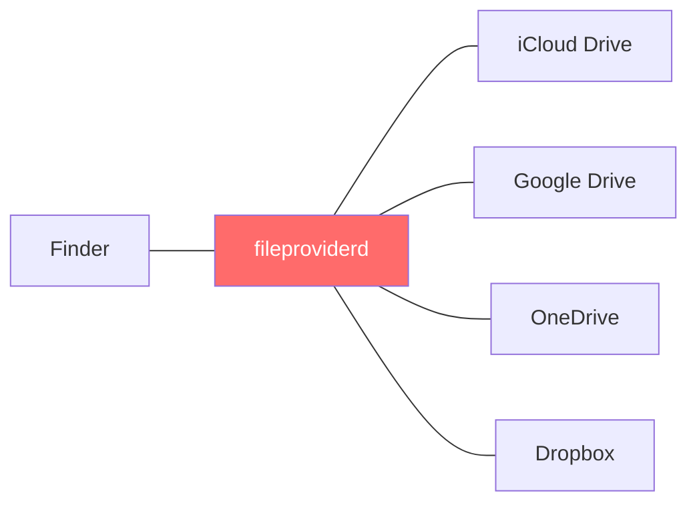
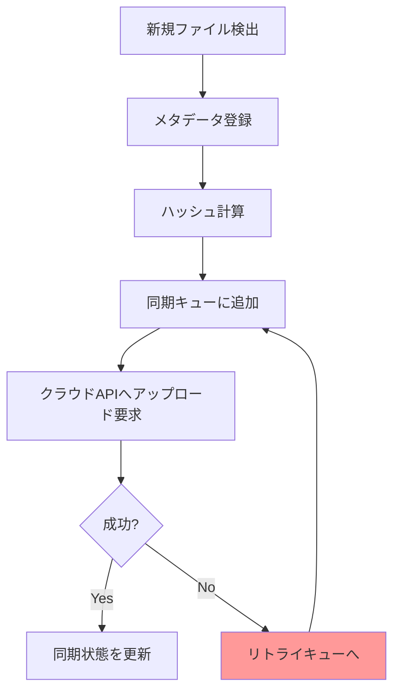

## はじめに

Mac mini M4 Proを買いました。開発環境を移行するにあたり、MacBook Proの`~/dev/`フォルダをそのまま新マシンにコピーしたい。Google Drive for Desktop（旧: Drive File Stream）が動いているし、クラウド経由で同期すれば楽だろう――そう考えた結果がこちら。

:::message alert
fileproviderdプロセスが167GBのディスク書き込みを発生。開発フォルダの実サイズはわずか10.3GiB。約15倍の書き込みが走り、マシンは完全にフリーズ状態に陥りました。
:::

「Google Driveで開発フォルダを同期してはいけない」――これ、知っている人には当たり前かもしれません。でも私はやってしまった。同じ轍を踏む人を一人でも減らすために、何が起きたのか、なぜ起きたのか、そしてどう対処したのかを記録しておきます。

## 何が起きたか

### 状況

新しいMac mini M4 Pro（64GB RAM）のセットアップ中。MacBook Proから開発フォルダを移行しようとして、Google Drive for Desktop経由で`cp -R`を実行しました。

「クラウドにあるんだからコピーできるでしょ」という軽い気持ち。開発フォルダの中身はこんな構成。

| 項目 | 数値 |
|------|------|
| 総ファイル数 | 87,716 |
| 総サイズ | 10.3GiB |
| node_modulesフォルダ数 | 複数プロジェクト分（20以上） |
| .gitディレクトリ数 | 30以上 |
| vendor（PHP）ディレクトリ | 10以上 |

### 発生した症状

`cp -R`実行直後から異変が始まりました。

1. 大量のコピーエラー: `cp`コマンドがファイルコピー中にエラーを連発
2. ディスクI/Oの飽和: Activity Monitorで`fileproviderd`のディスク書き込みが異常な速度で増加
3. マシンの著しい遅延: UI操作すらままならない状態に
4. 最終的な書き込み量: 167GB（実データの約15倍）


*実データ10.3GiBに対してfileproviderdは167GBを書き込んだ（約15倍）*

167GBという数字、ピンとこないかもしれません。SSDには書き込み寿命（TBW: Total Bytes Written）があり、一般的なコンシューマー向け1TB SSDで600TB程度。167GBの無駄な書き込みを繰り返せば、SSDの寿命を確実に縮めることになる。たった1回の同期ミスでこれだけの書き込みが走るのは、地味に怖い話ですよね。

## なぜ起きたか

### fileproviderdとは何か

`fileproviderd`は、macOSに搭載されているデーモンプロセスです。iCloud Drive、Google Drive、OneDrive、Dropboxなど、クラウドストレージサービスとmacOSのFinderを統合管理する役割を担っている。



macOS Ventura以降、Appleはクラウドストレージアプリに対して、独自のカーネルエクステンションではなくFile Provider API（`NSFileProviderExtension`）の使用を義務化しました。これにより、Google DriveもAppleのFile Providerフレームワークを通じて動作するようになった[^1]。

[^1]: TidBITS「Apple's File Provider Forces Mac Cloud Storage Changes」(2023) https://tidbits.com/2023/03/10/apples-file-provider-forces-mac-cloud-storage-changes/

### 開発フォルダが「地雷」になるメカニズム

問題の核心は、開発フォルダに含まれるファイルの特性とfileproviderdの処理方式の相性にあります。

:::details 開発フォルダに含まれる「危険な」ディレクトリ
| ディレクトリ | 特徴 | 典型的なファイル数 |
|-------------|------|-----------------|
| `node_modules/` | 数千〜数万の小ファイル、深い階層構造 | 10,000〜50,000+ |
| `.git/objects/` | 大量のハッシュ名オブジェクトファイル | 1,000〜10,000+ |
| `vendor/` (PHP) | Composerの依存パッケージ | 5,000〜20,000+ |
| `.next/` / `dist/` | ビルド成果物 | 数百〜数千 |
| `__pycache__/` | Pythonバイトコード | 数十〜数百 |
:::

以下はfileproviderdの挙動から推定される処理フロー。Appleの公式ドキュメントでは内部実装の詳細は公開されていませんが、File Provider APIの仕様とActivity Monitorの観測結果から、おおよそこのような流れで処理が走っていると考えられます。



87,716ファイルのそれぞれに対してこの処理が走る。しかもnode_modulesには深いディレクトリ構造（`node_modules/a/node_modules/b/node_modules/c/...`）が含まれ、メタデータだけでも膨大な量になります。

さらに厄介なのがリトライの連鎖。I/Oが飽和すると処理がタイムアウトし、タイムアウトした処理はリトライキューに入る。リトライがさらにI/Oを圧迫し、新たなタイムアウトを生む。これが167GBという異常な書き込み量の正体でしょう。

:::message
Google DriveやDropboxには、`.gitignore`のようなフィルタリング機能が存在しません。同期対象フォルダ内のファイルは原則すべて同期される。node_modulesを「あとから除外」することはできても、同期開始時点で処理が走ってしまうのが問題です。
:::

## 正しい開発フォルダの同期方法

### 方法1: rsync（即効性が高い）

最もシンプルな方法。macOSに標準搭載されており、追加インストール不要です。

```bash
rsync -avz --progress \
  --exclude='node_modules' \
  --exclude='.git' \
  --exclude='vendor' \
  --exclude='.DS_Store' \
  --exclude='*.log' \
  --exclude='.env' \
  --exclude='.ddev' \
  ~/dev/ user@remote-mac:~/dev/
```

今回の移行でも、`~/dev/`全体をrsyncで移行したところ、23GBの転送で問題なく完了しました。Google Driveで167GBの無駄な書き込みを発生させてフリーズした後に、rsyncなら数分で終わる。なんとも皮肉な結果というわけです。

### 方法2: Syncthing（継続的な同期に最適）

2台以上のMacを日常的に使い分ける場合、Syncthingが最適解でしょう。P2P方式のオープンソース同期ツールで、ローカルネットワーク内なら高速に双方向同期が可能。クラウドを経由しないので、プライバシー面でも安心です。

実際に`~/dev/`全体をSyncthingで同期した結果がこちら。node_modulesやvendorは除外設定で同期対象外にしつつ、ソースコードや設定ファイルを含む全体を同期しています。

| 項目 | 結果 |
|------|------|
| 同期対象 | ~/dev/ 全体（Obsidian含む） |
| 同期ファイル数 | 87,716 |
| 同期サイズ | 10.3GiB |
| 除外設定 | .git, node_modules, vendor, .DS_Store, *.log, .env, .ddev |
| バージョン管理 | 30日間保持 |
| 所要時間 | 初回同期後は差分のみ |

`.stignore`ファイルで除外パターンを設定できるのが大きな強み。

```
// .stignore
.git
node_modules
vendor
.DS_Store
*.log
.env
.ddev
```

### 方法3: Git（ソースコード管理の王道）

ソースコード自体はGit + GitHub/GitLabで管理するのが大前提。ただし、これは「同期」ではなく「バージョン管理」なので、設定ファイルやローカル環境固有のファイルは対象外になる。


*Google Drive経由は167GB書き込み+フリーズ。rsyncなら23GBで数分、Syncthingなら10.3GiBで差分同期*

### 同期方法の比較

| 観点 | Google Drive | rsync | Syncthing | Git |
|------|-------------|-------|-----------|-----|
| 除外フィルタ | なし | `--exclude` | `.stignore` | `.gitignore` |
| 双方向同期 | あり | 片方向 | あり | merge/pull |
| node_modules対応 | 不可（暴走する） | 除外可能 | 除外可能 | .gitignore |
| セットアップ | 簡単 | コマンド知識必要 | やや手間 | 必須知識 |
| 継続的同期 | 自動 | cron等で設定 | 自動 | 手動push/pull |
| ローカルネットワーク | 不要（クラウド経由） | SSH必要 | 自動検出 | リモート必要 |
| コスト | 有料（容量次第） | 無料 | 無料 | 無料（GitHub等） |

## Google Driveを使うべきケース / 使うべきでないケース

Google Driveが悪いわけではありません。用途を間違えたのが問題。

| ケース | 推奨 | 理由 |
|--------|------|------|
| ドキュメント・スプレッドシート | Google Drive | Google Workspace連携が強力 |
| デザインファイル（PSD, Figma export等） | Google Drive | ファイル数が少なく、サイズが大きい |
| 写真・動画アーカイブ | Google Drive | 大容量ストレージとして優秀 |
| プロジェクトのバックアップ（zip化） | Google Drive | 単一ファイルなら問題なし |
| 開発フォルダ（node_modules含む） | Syncthing / rsync | 小ファイル大量 = fileproviderd暴走 |
| Gitリポジトリ（.git含む） | Git + GitHub | バージョン管理はGitの仕事 |
| .envファイル | 1Password / Secret Manager | セキュリティ上、クラウド同期NG |

:::message
判断基準はシンプルです。「ファイル数が少なく、サイズが大きい」ならGoogle Drive。「ファイル数が多く、サイズが小さい」ならSyncthing/rsync。開発フォルダは後者の典型例。
:::

## fileproviderdが暴走したときの応急処置

もし同じ状況に陥ってしまった場合の対処法も書いておきます。

### 1. fileproviderdを強制終了

```bash
# fileproviderdを強制終了（自動的に再起動される）
killall fileproviderd

# Permission deniedの場合はsudoを付ける
sudo killall fileproviderd
```

ただし、これは一時的な対処に過ぎません。fileproviderdはシステムデーモンなので、killしても自動的に再起動される。根本対策は次の「同期対象の除外」です。

### 2. 同期対象から開発フォルダを除外

Google Driveの設定で、開発フォルダを同期対象から除外するのが根本対策。

1. メニューバーのGoogle Driveアイコンをクリック
2. 設定（歯車アイコン）→ 設定
3. 「マイパソコン」タブで同期フォルダを確認
4. 開発フォルダ（`~/dev/`等）を同期対象から除外

### 3. Spotlightインデックスの除外

開発フォルダはSpotlightのインデックス対象からも除外しておくと、さらにディスクI/Oを削減できます。

```
システム設定 → Spotlight → プライバシー → ~/dev/を追加
```

## まとめ

- Google Driveで開発フォルダを同期してはいけない。node_modules、.git、vendorなどの大量小ファイルがfileproviderdを暴走させる
- 167GBの書き込みは、実データ10.3GiBの約15倍。SSDの寿命を無駄に消費する上、マシンがフリーズする
- 開発フォルダの同期にはSyncthingまたはrsyncを使う。除外フィルタ機能があり、開発フォルダの特性に対応できる
- Google Driveはドキュメント・デザインファイル・アーカイブに使う。ファイル数が少なくサイズが大きいデータとの相性が良い
- 判断基準は「ファイル数 x サイズ」。大量の小ファイル = クラウド同期NG、少数の大ファイル = クラウド同期OK

> 開発フォルダをGoogle Driveに入れるのは、段ボール1万個をエレベーターで運ぶようなもの。荷物の総重量は大したことなくても、エレベーターは確実にパンクする。

## 参考資料

https://developer.apple.com/documentation/fileprovider

https://tidbits.com/2023/03/10/apples-file-provider-forces-mac-cloud-storage-changes/

https://osxdaily.com/2024/03/16/what-is-fileproviderd-on-mac-why-does-it-use-high-cpu/

https://support.google.com/drive/thread/255503539

https://medium.com/@bozzified/solving-painful-syncing-of-node-modules-when-using-dropbox-or-google-drive-a77c2ab0c97c

https://arshaw.com/exclude-node-modules-dropbox-google-drive

https://syncthing.net/
