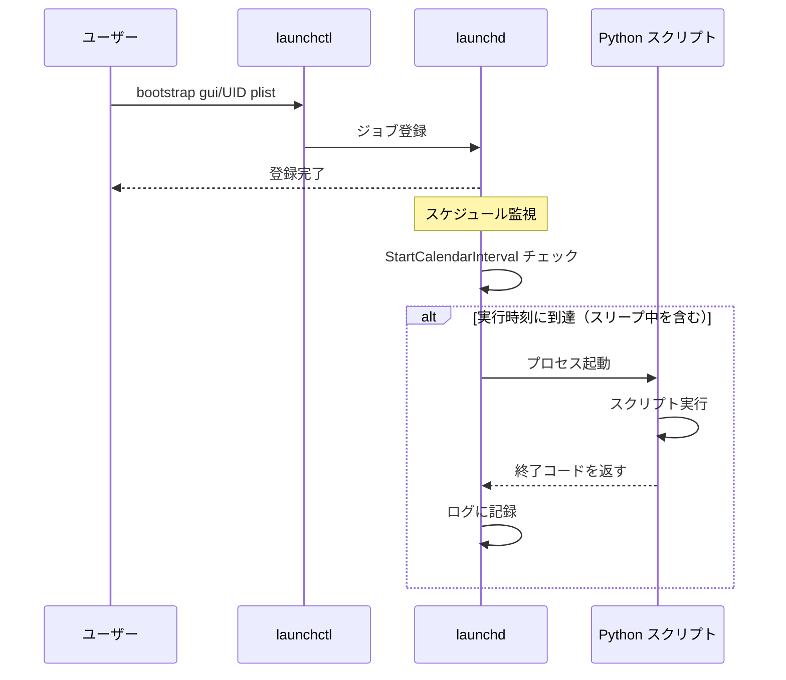

## はじめに

macOS で Python スクリプトを定期実行したいとき、多くのエンジニアがまず `crontab -e` を試みます。しかし、crontab は macOS での動作に根本的な制約があります。

最大の問題は、Mac がスリープしている間に実行時刻を通過した場合、その実行がスキップされることです。夜間バッチや定時レポート生成など、信頼性が求められる用途では致命的です。

macOS には LaunchAgent という、より適切な仕組みが用意されています。これは Linux の systemd に相当するジョブ管理の仕組みで、スリープ復帰後に逃したジョブを自動実行する機能を持ちます。

この記事では、LaunchAgent を使って Python スクリプトを定期実行する構成を、実際の plist ファイルと launchctl コマンドで解説します。

---

## LaunchAgent と LaunchDaemon の違い

macOS のジョブ管理には LaunchAgent と LaunchDaemon の 2 種類があります。用途を誤ると権限エラーや予期しない挙動の原因になるため、まず違いを整理します。

| 種別 | 実行タイミング | 権限 | 配置先 |
|------|-------------|------|--------|
| LaunchAgent（ユーザー） | ログイン後 | ログインユーザー | `~/Library/LaunchAgents/` |
| LaunchAgent（管理者） | ログイン後 | ログインユーザー | `/Library/LaunchAgents/` |
| LaunchDaemon | システム起動時 | root | `/Library/LaunchDaemons/` |

Python スクリプトの個人用定期実行には、ユーザー権限で動作する `~/Library/LaunchAgents/` への配置が適切です。ファイルシステムへのアクセス、API キーの取得、GUI 操作を伴う場合は特に LaunchAgent を選択します。

LaunchDaemon は root 権限が必要なシステム管理タスク（ログローテーション、バックアップデーモンなど）向けです。個人の Python スクリプトには不要であり、セキュリティ上も LaunchAgent を推奨します。

---

## plist ファイルの基本構造

LaunchAgent の設定は Property List（plist）形式の XML ファイルで記述します。ファイル名は reverse-DNS 形式（例: `com.yourname.jobname.plist`）が慣例です。

最小構成の plist は次のようになります。

```xml
<?xml version="1.0" encoding="UTF-8"?>
<!DOCTYPE plist PUBLIC "-//Apple//DTD PLIST 1.0//EN"
  "http://www.apple.com/DTDs/PropertyList-1.0.dtd">
<plist version="1.0">
<dict>
    <key>Label</key>
    <string>com.yourname.jobname</string>

    <key>ProgramArguments</key>
    <array>
        <string>/usr/bin/python3</string>
        <string>/path/to/script.py</string>
    </array>

    <key>StartCalendarInterval</key>
    <dict>
        <key>Hour</key>
        <integer>9</integer>
        <key>Minute</key>
        <integer>0</integer>
    </dict>
</dict>
</plist>
```

主要キーの役割は以下の通りです。

| キー | 説明 |
|------|------|
| `Label` | ジョブの一意識別子。ファイル名と合わせるのが慣例 |
| `ProgramArguments` | 実行コマンドと引数の配列 |
| `StartCalendarInterval` | 実行スケジュール（時刻指定） |
| `EnvironmentVariables` | 環境変数の設定 |
| `StandardOutPath` | 標準出力のログ保存先 |
| `StandardErrorPath` | 標準エラーのログ保存先 |
| `RunAtLoad` | ロード時に即実行するか |

---

## 実際の plist 例（Python 定期実行）

実務で使える完全版の plist を示します。毎日 9:00 に Python スクリプトを実行し、ログを保存する構成です。

```xml
<?xml version="1.0" encoding="UTF-8"?>
<!DOCTYPE plist PUBLIC "-//Apple//DTD PLIST 1.0//EN"
  "http://www.apple.com/DTDs/PropertyList-1.0.dtd">
<plist version="1.0">
<dict>
    <!-- ジョブの識別子 -->
    <key>Label</key>
    <string>com.naoya.daily-report</string>

    <!-- 実行コマンド（フルパスで指定） -->
    <key>ProgramArguments</key>
    <array>
        <string>/Users/naoya/.pyenv/versions/3.12.0/bin/python3</string>
        <string>/Users/naoya/dev/scripts/daily_report.py</string>
    </array>

    <!-- 実行スケジュール: 毎日 9:00 -->
    <key>StartCalendarInterval</key>
    <dict>
        <key>Hour</key>
        <integer>9</integer>
        <key>Minute</key>
        <integer>0</integer>
    </dict>

    <!-- 環境変数 -->
    <key>EnvironmentVariables</key>
    <dict>
        <key>PATH</key>
        <string>/Users/naoya/.pyenv/shims:/Users/naoya/.pyenv/bin:/usr/local/bin:/usr/bin:/bin</string>
        <key>HOME</key>
        <string>/Users/naoya</string>
        <key>DISCORD_WEBHOOK_URL</key>
        <string>https://discord.com/api/webhooks/XXXX/YYYY</string>
    </dict>

    <!-- 作業ディレクトリ -->
    <key>WorkingDirectory</key>
    <string>/Users/naoya/dev/scripts</string>

    <!-- ログ出力先 -->
    <key>StandardOutPath</key>
    <string>/Users/naoya/dev/logs/daily-report.log</string>

    <key>StandardErrorPath</key>
    <string>/Users/naoya/dev/logs/daily-report-error.log</string>

    <!-- ロード時に実行しない -->
    <key>RunAtLoad</key>
    <false/>
</dict>
</plist>
```

複数の時刻に実行したい場合は、`StartCalendarInterval` を配列形式にします。

```xml
<key>StartCalendarInterval</key>
<array>
    <dict>
        <key>Hour</key>
        <integer>9</integer>
        <key>Minute</key>
        <integer>0</integer>
    </dict>
    <dict>
        <key>Hour</key>
        <integer>18</integer>
        <key>Minute</key>
        <integer>0</integer>
    </dict>
</array>
```

曜日指定も可能です。`Weekday` キーに 0（日曜）〜 6（土曜）の整数を設定します。

```xml
<!-- 平日 9:00 -->
<key>StartCalendarInterval</key>
<array>
    <dict>
        <key>Weekday</key>
        <integer>1</integer>
        <key>Hour</key>
        <integer>9</integer>
        <key>Minute</key>
        <integer>0</integer>
    </dict>
    <!-- 火〜金も同様に追加 -->
</array>
```

---

## launchctl コマンド操作

plist ファイルを配置したら、`launchctl` コマンドで登録・管理します。macOS Monterey 以降では以下のコマンド体系を使用します。

### plist ファイルの配置

```bash
# LaunchAgents ディレクトリに配置
cp com.naoya.daily-report.plist ~/Library/LaunchAgents/

# パーミッションを適切に設定
chmod 644 ~/Library/LaunchAgents/com.naoya.daily-report.plist
```

### ジョブの登録と削除

```bash
# 登録（macOS 10.10 以降の新 API）
launchctl bootstrap gui/$(id -u) ~/Library/LaunchAgents/com.naoya.daily-report.plist

# 削除
launchctl bootout gui/$(id -u) ~/Library/LaunchAgents/com.naoya.daily-report.plist
```

古いドキュメントでは `launchctl load` / `launchctl unload` が使われていますが、これらは macOS 10.10 Yosemite 以降で非推奨になっています。`bootstrap` / `bootout` を使うのが現在の推奨です。

### 手動起動と停止

```bash
# 手動で即時実行（テスト時に便利）
launchctl start gui/$(id -u)/com.naoya.daily-report

# 停止
launchctl stop gui/$(id -u)/com.naoya.daily-report
```

### 登録状態の確認

```bash
# 全ジョブ一覧
launchctl list

# 特定ジョブの確認
launchctl list | grep com.naoya.daily-report
```

出力例:

```
PID   Status  Label
-     0       com.naoya.daily-report
```

`Status` が 0 は正常終了、それ以外はエラーコードです。`PID` が `-` はジョブが現在実行中でないことを示します。

---

## 起動フロー

LaunchAgent がどのように動作するかを以下のダイアグラムで確認します。



crontab との違いはスリープ中の動作にあります。Mac がスリープ中に実行時刻を過ぎた場合、crontab はその実行をスキップしますが、LaunchAgent は復帰後に逃した実行を即座に行います。

---

## 実行環境の問題と解決

LaunchAgent で最もはまりやすい問題が実行環境です。ターミナルで手動実行すると動くのに LaunchAgent 経由では動かない、というケースの多くが環境変数の問題です。

launchd はシェル（bash/zsh）の設定ファイル（`.zshrc` など）を読み込みません。pyenv、venv、Homebrew のパスが通っていない状態でスクリプトが起動します。

### 解決策 1: ProgramArguments にフルパスを指定

最も確実な方法は、Python インタープリタのフルパスを指定することです。

```bash
# pyenv 環境の Python パスを確認
pyenv which python3
# 例: /Users/naoya/.pyenv/versions/3.12.0/bin/python3
```

```xml
<key>ProgramArguments</key>
<array>
    <string>/Users/naoya/.pyenv/versions/3.12.0/bin/python3</string>
    <string>/Users/naoya/dev/scripts/daily_report.py</string>
</array>
```

### 解決策 2: EnvironmentVariables で PATH を設定

外部コマンドを呼び出す場合は `EnvironmentVariables` で PATH を明示します。

```xml
<key>EnvironmentVariables</key>
<dict>
    <key>PATH</key>
    <string>/Users/naoya/.pyenv/shims:/Users/naoya/.pyenv/bin:/opt/homebrew/bin:/usr/local/bin:/usr/bin:/bin</string>
    <key>PYENV_ROOT</key>
    <string>/Users/naoya/.pyenv</string>
</dict>
```

Apple Silicon Mac の場合、Homebrew のインストール先が `/opt/homebrew/bin` であることに注意してください。Intel Mac は `/usr/local/bin` です。

### 解決策 3: 仮想環境を使う場合

venv の Python を直接指定します。

```xml
<key>ProgramArguments</key>
<array>
    <string>/Users/naoya/dev/scripts/.venv/bin/python3</string>
    <string>/Users/naoya/dev/scripts/daily_report.py</string>
</array>
```

---

## ログ設定

ジョブの実行結果を確認できるよう、ログファイルを設定します。

```xml
<key>StandardOutPath</key>
<string>/Users/naoya/dev/logs/daily-report.log</string>

<key>StandardErrorPath</key>
<string>/Users/naoya/dev/logs/daily-report-error.log</string>
```

ログディレクトリは事前に作成しておきます。

```bash
mkdir -p ~/dev/logs
```

Python スクリプト側でもログを適切に出力することで、デバッグが楽になります。

```python
import sys
import logging
from datetime import datetime

logging.basicConfig(
    level=logging.INFO,
    format="%(asctime)s [%(levelname)s] %(message)s",
    stream=sys.stdout,
)
logger = logging.getLogger(__name__)

def main():
    logger.info("ジョブ開始")
    # 処理...
    logger.info("ジョブ完了")

if __name__ == "__main__":
    main()
```

ログが蓄積してディスクを圧迫しないよう、`logrotate` の設定や、スクリプト内での古いログの削除も検討してください。

---

## エラー通知（Discord Webhook 連携）

バックグラウンドジョブはエラーに気づきにくいという問題があります。Discord Webhook を使ったエラー通知を実装することで、異常を即座に把握できます。

### Discord Webhook の設定

Discord サーバーの「チャンネルの編集」→「連携サービス」→「ウェブフック」から Webhook URL を取得します。取得した URL は plist の `EnvironmentVariables` または `.env` ファイルで管理します。

### Python スクリプトへの通知実装

```python
import os
import sys
import logging
import requests
from datetime import datetime

logging.basicConfig(
    level=logging.INFO,
    format="%(asctime)s [%(levelname)s] %(message)s",
    stream=sys.stdout,
)
logger = logging.getLogger(__name__)

WEBHOOK_URL = os.environ.get("DISCORD_WEBHOOK_URL", "")


def notify_discord(message: str, is_error: bool = False) -> None:
    """Discord に通知を送信する"""
    if not WEBHOOK_URL:
        logger.warning("DISCORD_WEBHOOK_URL が設定されていません")
        return

    color = 0xFF0000 if is_error else 0x00FF00  # 赤 or 緑
    payload = {
        "embeds": [
            {
                "title": "エラー発生" if is_error else "ジョブ完了",
                "description": message,
                "color": color,
                "timestamp": datetime.utcnow().isoformat(),
            }
        ]
    }
    try:
        response = requests.post(WEBHOOK_URL, json=payload, timeout=10)
        response.raise_for_status()
    except requests.RequestException as e:
        logger.error(f"Discord 通知失敗: {e}")


def main():
    logger.info("ジョブ開始")
    try:
        # メイン処理
        result = run_job()
        notify_discord(f"正常完了: {result}")
    except Exception as e:
        error_msg = f"ジョブ失敗\n```\n{type(e).__name__}: {e}\n```"
        logger.exception("ジョブ中にエラーが発生しました")
        notify_discord(error_msg, is_error=True)
        sys.exit(1)


def run_job():
    # 実際の処理をここに記述
    return "処理完了"


if __name__ == "__main__":
    main()
```

このパターンにより、スクリプトが例外で終了した場合に Discord へ通知が飛び、`sys.exit(1)` によってジョブの終了コードが非ゼロになります。`launchctl list` の Status 列で異常を確認することもできます。

### シークレット管理の注意点

Webhook URL などのシークレットは plist ファイルに直接書くのは避けてください。plist ファイルは `~/Library/LaunchAgents/` に配置され、ユーザー権限で読み取り可能です。

代替案として、`~/.env` ファイルに書いてスクリプト側で `python-dotenv` を使って読み込む方法や、macOS Keychain を使った管理があります。

---

## まとめ

macOS での Python 定期実行を crontab から LaunchAgent に移行する手順を解説しました。

| 比較項目 | crontab | LaunchAgent |
|---------|---------|------------|
| スリープ後の再実行 | なし（スキップ） | あり（復帰後に実行） |
| 環境変数 | シェル設定を部分継承 | 明示的に設定が必要 |
| ログ管理 | リダイレクトで対応 | plist で指定 |
| GUI アクセス | 制限あり | ユーザーセッションで可 |
| 設定の複雑さ | 低い | 中程度 |

LaunchAgent の設定で特に注意すべき点は次の 3 つです。

1. Python インタープリタはフルパスで指定する（pyenv/venv のパスが通っていないため）
2. `StartCalendarInterval` を使えばスリープ復帰後の実行が保証される
3. `StandardOutPath` / `StandardErrorPath` で必ずログを残す

crontab と比べると設定の記述量は増えますが、信頼性と可観測性は大幅に向上します。バックグラウンドジョブが「動いているはずなのに動いていない」という状況を避けるために、macOS 環境では LaunchAgent を標準の選択肢として検討してください。
