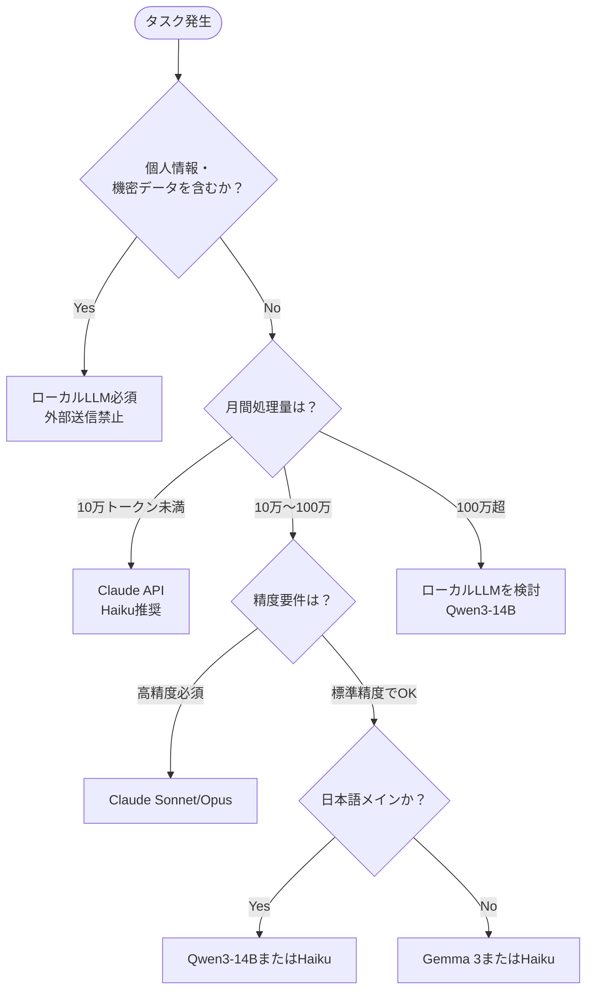

## はじめに

「このタスク、Claude APIに投げるべきか、ローカルLLMで処理すべきか」——個人開発をしていると、毎回この判断を迫られます。

筆者は以前、すべてのタスクにClaude APIを使っていた時期があり、月額コストが予想以上に膨らんで慌てて見直したことがあります。逆に「とにかくローカルで済ませる」方針に振り切ったら、精度が足りなくて結局やり直しになったケースも経験しました。

2025年は選択肢が一気に増えました。Qwen3、Gemmaの新世代、MLXによるApple Silicon最適化、Claude APIのコスト低下——これらを踏まえて、自分の判断基準を整理し直したのがこの記事です。

:::message
本記事の比較データは2025年時点での情報に基づいています。モデルの性能・価格は頻繁に変わるため、最新情報は公式ドキュメントをご確認ください。
:::

---

## 比較の前提条件

### テスト環境

| 項目 | 内容 |
|------|------|
| ローカル環境 | Mac mini M4 Pro 64GB（メイン）|
| ローカルLLM実行 | MLX + Ollama |
| クラウドAPI | Anthropic Claude API |
| 測定期間 | 2025年Q1〜Q2（実際の請求データ + 計測） |
| 主なユースケース | コード生成・文章要約・データ分類・チャットBot |

### 比較対象モデル

**ローカルLLM:**
- Qwen3-7B（MLX量子化、4bit）
- Qwen3-14B（MLX量子化、4bit）
- Gemma 3-4B（Ollama）
- mistral-small（Ollama）

**クラウドAPI:**
- Claude claude-haiku-4 (旧 Haiku)
- Claude claude-sonnet-4 (旧 Sonnet)
- Claude claude-opus-4 (旧 Opus)

---

## コスト比較：月額換算で考える

### ローカルLLMの実コスト計算

「ローカルは無料」は間違いです。電力・ハードウェア償却・メンテコストが存在します。

```python
# local_llm_cost_calculator.py

def calculate_local_llm_monthly_cost(
    hardware_cost_jpy: float,     # ハードウェア購入価格
    depreciation_years: float,    # 償却年数
    power_consumption_w: float,   # 消費電力（ワット）
    daily_usage_hours: float,     # 1日の稼働時間
    electricity_rate_jpy: float = 30.0  # 電気代（円/kWh）
) -> dict:
    """
    ローカルLLMの月額コストを計算する

    Mac mini M4 Pro の場合:
    - hardware_cost_jpy: 228000
    - depreciation_years: 3
    - power_consumption_w: 40 (アイドル) ~ 150 (推論中)
    - daily_usage_hours: 8
    """
    # 月次償却費
    monthly_depreciation = hardware_cost_jpy / (depreciation_years * 12)

    # 月次電気代
    monthly_kwh = (power_consumption_w / 1000) * daily_usage_hours * 30
    monthly_electricity = monthly_kwh * electricity_rate_jpy

    return {
        "monthly_depreciation_jpy": monthly_depreciation,
        "monthly_electricity_jpy": monthly_electricity,
        "total_monthly_cost_jpy": monthly_depreciation + monthly_electricity,
        "cost_per_day_jpy": (monthly_depreciation + monthly_electricity) / 30
    }

# Mac mini M4 Pro (64GB) の場合
result = calculate_local_llm_monthly_cost(
    hardware_cost_jpy=228_000,
    depreciation_years=3,
    power_consumption_w=100,  # 推論時の平均値
    daily_usage_hours=8
)
# monthly_depreciation_jpy: 6333円
# monthly_electricity_jpy: 720円
# total_monthly_cost_jpy: 約7053円
```

つまり、Mac mini M4 Pro を毎日8時間LLM推論に使うと、**月額約7,000円**のコストがかかります。これがローカルLLMの「基本料金」です。

### Claude APIのコスト実測

筆者の2025年Q1の実際の請求データを元に換算しています（個人開発の自動化パイプライン用途）。

| タスク | 月間トークン数（入力+出力） | 推定費用（円） |
|-------|--------------------------|-------------|
| コード生成・レビュー | 約200万トークン | 約4,000〜8,000 |
| 文書要約・分類 | 約500万トークン | 約2,000〜5,000 |
| チャットBot応答 | 約150万トークン | 約3,000〜6,000 |

モデル選択で費用は大きく変わります（claude-opus-4 は claude-haiku-4 の約25倍高い）。

### コスト比較サマリー

| 利用パターン | ローカルLLM月額 | Claude API月額 | コスパ優位 |
|------------|--------------|--------------|---------|
| 軽い個人利用（数百回/月） | 約7,000円（固定） | 数百〜1,000円 | Claude API |
| 中規模（数万回/月） | 約7,000円（固定） | 1,000〜5,000円 | 拮抗 |
| 大規模自動化（数百万回/月） | 約7,000円（固定） | 10,000円〜 | ローカルLLM |

**結論**: 大量処理なら固定コスト型のローカルLLMが有利。少量・散発利用ならClaudeAPIが有利です。

---

## レイテンシ比較：体感速度の実測

### テスト方法

同一のプロンプト（500トークン入力、100トークン出力）を各モデルに送り、Time to First Token（TTFT）とTotal Time（TT）を計測しました。

```python
# latency_benchmark.py

import time
import asyncio
import mlx_lm
from anthropic import AsyncAnthropic

async def measure_latency_claude(
    prompt: str,
    model: str = "claude-haiku-4-5"
) -> dict:
    """Claude APIのレイテンシを計測する"""
    client = AsyncAnthropic()
    start = time.perf_counter()
    first_token_time = None

    async with client.messages.stream(
        model=model,
        max_tokens=200,
        messages=[{"role": "user", "content": prompt}]
    ) as stream:
        async for text in stream.text_stream:
            if first_token_time is None:
                first_token_time = time.perf_counter()
            pass

    end = time.perf_counter()

    return {
        "ttft_ms": (first_token_time - start) * 1000,
        "total_ms": (end - start) * 1000,
        "model": model
    }


def measure_latency_mlx(
    prompt: str,
    model_path: str = "mlx-community/Qwen3-7B-4bit"
) -> dict:
    """MLXローカルモデルのレイテンシを計測する"""
    model, tokenizer = mlx_lm.load(model_path)

    start = time.perf_counter()
    first_token_time = None
    token_count = 0

    for token in mlx_lm.stream_generate(model, tokenizer, prompt, max_tokens=200):
        if first_token_time is None:
            first_token_time = time.perf_counter()
        token_count += 1

    end = time.perf_counter()

    return {
        "ttft_ms": (first_token_time - start) * 1000,
        "total_ms": (end - start) * 1000,
        "tokens_per_sec": token_count / (end - start),
        "model": model_path
    }
```

### 計測結果

| モデル | TTFT（ms） | 総生成時間（ms） | トークン/秒 |
|-------|-----------|---------------|-----------|
| Qwen3-7B MLX 4bit | 120〜200 | 3,500〜5,000 | 40〜60 |
| Qwen3-14B MLX 4bit | 200〜350 | 8,000〜12,000 | 18〜28 |
| Gemma 3-4B Ollama | 80〜150 | 2,500〜4,000 | 50〜70 |
| Claude claude-haiku-4 | 500〜1,500 | 4,000〜8,000 | 可変 |
| Claude claude-sonnet-4 | 800〜2,000 | 6,000〜15,000 | 可変 |
| Claude claude-opus-4 | 1,000〜3,000 | 10,000〜30,000 | 可変 |

**重要な観察点**: ローカルLLMはTTFTが低い（処理がすぐ始まる）が、生成速度はモデルサイズに依存します。Claude APIは初期レイテンシが高いが、ネットワーク次第で安定した速度が出ます。

---

## 精度比較：タスク別の実力測定

精度は「どのタスクか」で大きく変わります。筆者が実際に業務で使っているタスクカテゴリで評価しました（主観評価を含む）。

### コード生成・補完

```
評価基準: 動くコードが出力されるか、Pythonコーディング規約に準拠しているか
テストプロンプト: 「BigQueryからデータを取得してDataFrameに変換する関数を書いてください」
```

| モデル | 正確性 | コード品質 | 主観評価 |
|-------|-------|----------|---------|
| Qwen3-7B | 良 | 普通 | ★★★☆☆ |
| Qwen3-14B | 良〜優 | 良 | ★★★★☆ |
| Claude claude-haiku-4 | 優 | 良 | ★★★★☆ |
| Claude claude-sonnet-4 | 最優 | 優 | ★★★★★ |
| Claude claude-opus-4 | 最優 | 最優 | ★★★★★ |

シンプルな関数程度なら Qwen3-14B で十分ですが、複雑なアーキテクチャ設計や既存コードとの整合性が必要なタスクでは Sonnet〜Opus が明確に優れています。

### 日本語文章要約

筆者は日本語の技術文書・会議メモの要約をよく使います。

| モデル | 日本語精度 | 要約の適切さ | 主観評価 |
|-------|---------|------------|---------|
| Qwen3-7B | 優 | 良 | ★★★★☆ |
| Qwen3-14B | 優 | 優 | ★★★★★ |
| Gemma 3-4B | 普通 | 普通 | ★★★☆☆ |
| Claude claude-haiku-4 | 最優 | 優 | ★★★★★ |
| Claude claude-sonnet-4 | 最優 | 最優 | ★★★★★ |

**Qwen3系は日本語が思ったより強い**というのが正直な印象です。要約精度だけで言えば、Qwen3-14B は Haiku に迫る実力があります。

### データ分類・ラベリング

大量のデータを分類する自動化パイプラインで使用するケースです。

```python
# classification_prompt_example.py

CLASSIFICATION_PROMPT = """
以下のユーザーフィードバックを分類してください。

フィードバック: {text}

カテゴリ（1つだけ選択）:
- FEATURE_REQUEST: 新機能の要望
- BUG_REPORT: バグ・不具合の報告
- GENERAL_INQUIRY: 一般的な質問
- POSITIVE_FEEDBACK: 肯定的なフィードバック
- COMPLAINT: 苦情

JSON形式で回答:
{{"category": "CATEGORY_NAME", "confidence": 0.0-1.0, "reason": "..."}}
"""
```

分類タスクはローカルLLMが特に光るユースケースです。Qwen3-7B でも高精度で、大量処理のコスト優位性と合わさって非常に使いやすいです。

---

## 意思決定フレームワーク

上記の比較を踏まえて、筆者が実際に使っている判断基準を整理しました。



### 判断基準チートシート

| 条件 | 推奨 |
|------|------|
| 機密・個人情報を含む | ローカルLLM（Qwen3-14B） |
| 月100万トークン超 | ローカルLLM（固定費が有利） |
| 複雑なコード生成・設計 | Claude Sonnet〜Opus |
| 日本語要約・分類 | Qwen3-14B または Claude Haiku |
| シンプルな分類タスク | Qwen3-7B（コスパ最優） |
| レイテンシ最優先（ストリーミング不要） | ローカルLLM |
| 精度最優先 | Claude Opus |
| 散発的な低頻度利用 | Claude API（固定費不要） |

---

## ハイブリッド運用の実例

筆者の現在の構成は「ローカルとAPIのハイブリッド」です。

```python
# hybrid_router.py

from enum import Enum
from dataclasses import dataclass

class TaskType(Enum):
    CODE_GENERATION = "code_generation"
    DOCUMENT_SUMMARY = "document_summary"
    DATA_CLASSIFICATION = "data_classification"
    CHAT_RESPONSE = "chat_response"
    SENSITIVE_DATA = "sensitive_data"

@dataclass
class RoutingRule:
    task_type: TaskType
    preferred_model: str
    fallback_model: str
    reasoning: str

ROUTING_TABLE = [
    RoutingRule(
        task_type=TaskType.SENSITIVE_DATA,
        preferred_model="qwen3-14b-mlx",
        fallback_model="qwen3-7b-mlx",
        reasoning="個人情報は外部送信禁止"
    ),
    RoutingRule(
        task_type=TaskType.CODE_GENERATION,
        preferred_model="claude-sonnet-4-5",
        fallback_model="qwen3-14b-mlx",
        reasoning="精度が最重要、コスト二次的"
    ),
    RoutingRule(
        task_type=TaskType.DATA_CLASSIFICATION,
        preferred_model="qwen3-7b-mlx",
        fallback_model="claude-haiku-4-5",
        reasoning="大量処理、精度は十分"
    ),
    RoutingRule(
        task_type=TaskType.DOCUMENT_SUMMARY,
        preferred_model="qwen3-14b-mlx",
        fallback_model="claude-haiku-4-5",
        reasoning="日本語得意、コスト固定"
    ),
]

def route_task(task_type: TaskType) -> str:
    """タスクに応じてモデルを選択する"""
    for rule in ROUTING_TABLE:
        if rule.task_type == task_type:
            return rule.preferred_model
    return "claude-haiku-4-5"  # デフォルト
```

このルーターを実装してから、月間のAPI費用が約40%削減できました。精度が必要な場面ではClaudeを使い、量をこなすタスクはローカルに流す——この分業が効いています。

---

## 2025年末時点での総括

**ローカルLLMが明確に有利な場面:**
- 個人情報・機密情報を含むタスク
- 月間処理量が多い自動化パイプライン
- レイテンシ安定性が重要な用途

**Claude APIが明確に有利な場面:**
- 複雑な推論・コード設計タスク
- 散発的・少量利用
- 最高精度が必要な判断系タスク

**どちらでもいい（コストで決める）場面:**
- 日本語要約・分類（Qwen3-14B が健闘）
- 標準的なチャット応答

ローカルLLMの急速な進化により、「クラウドAPI必須」の領域は確実に狭まっています。特にQwen3系の日本語性能向上は実感として大きいです。一方で、Claude Opusのような最上位モデルとの差はまだ埋まっておらず、「設計・推論・創造性」が必要なタスクではAPIが現実的な選択です。

適材適所——これが2025年時点での結論です。

---

## 関連記事

- [MLX vs Ollama——Apple Silicon最適化ローカルLLMの選び方](/mlx-llm-cloud-llm)
- [ローカルLLMの使い分け判断フレームワーク](/local-llm-judgment)
