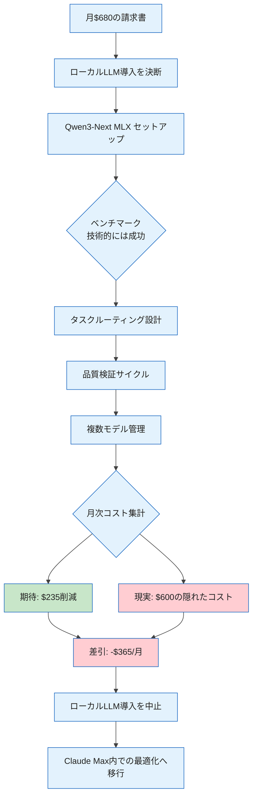

## Claude Maxの請求書を見て、思考停止した

Claude Code Max Planを月$200で契約しています。ところがある月、追加課金が$480発生し、合計$680（約10万円）の請求が届きました。

「このままでは持続できない」と感じた1人法人経営者としての私は、すぐに仮説を立てました。

> ローカルLLMで定型タスクの50%をオフロードできれば、月$340削減できる

Mac mini M4 Pro 64GBが手元にある。MLXでQwen3-Nextを動かせば、コスト削減できるはずだ——という試みを実行しました。

結果として約2週間後、私はローカルLLMの導入を中止し、元の環境に戻しました。削減額はゼロどころか、試算すると大幅な赤字でした。

この記事は、その経緯の記録です。

---

## Part 1: コスト削減の見積もり

### 「定型タスク50%オフロード」の根拠

私のClaude Code利用のうち、定型的なタスクの割合を棚卸ししてみました。

```
Claude Codeのタスク分類（自己分析）
├── コード補完・スニペット生成     → 約20%
├── コミットメッセージ・PR説明生成  → 約15%
├── ドキュメント生成（定型フォーマット）→ 約15%
├── コードレビュー・バグ調査        → 約25%（品質重要）
├── 設計・アーキテクチャ判断        → 約15%（品質重要）
└── 記事執筆・コンテンツ作成        → 約10%（品質重要）
```

上位3項目（約50%）はパターンマッチで対応できそうに見えました。

### Qwen3-Coder-Next MLXのベンチマーク

Mac mini M4 Pro 64GBでQwen3-Coder-Nextを動かし、基本性能を確認しました。

```
ベンチマーク結果（2026年2月実測）
├── 推論速度: 33.06 tokens/sec
├── メモリ増加: 2.32 GB（他のプロセスへの影響小）
├── ダウンロード時間: 29分37秒（12GB）
└── コード生成正確率: 約90%以上（シンプルなタスク）
```

数値だけ見れば、定型タスクを任せるには十分な性能です。

### 期待していたコスト構造

当初の見積もりはシンプルでした。

| 項目 | 導入前 | 導入後（想定） |
|:--|:--|:--|
| Claude Max | $200/月 | $200/月 |
| 追加課金 | $480/月 | $240/月（50%削減） |
| ローカルLLM運用コスト | $0 | 電気代のみ（$5程度） |
| 月額合計 | $680 | $445 |
| 月額削減 | - | ▲$235 |

年間換算で$2,820（約42万円）の削減。これなら実装する価値があると判断しました。

---

## Part 2: 隠れたコスト

### 実装してわかったこと

ローカルLLMをタスクルーティングに組み込むには、想像以上の設計が必要でした。実際に作成したファイル群を振り返ると、複雑性が見えてきます。

```python
# task_router.py（タスク分類ロジック）
# 「このタスクはローカルで十分か、Claudeが必要か」を自動判断する

SIMPLE_TASK_PATTERNS = [
    "コミットメッセージ",
    "関数名を提案",
    "コメントを追加",
    "型アノテーションを付与",
    # ... 30パターン以上のルール
]

def route_task(task_description: str) -> str:
    for pattern in SIMPLE_TASK_PATTERNS:
        if pattern in task_description:
            return "local"
    return "claude"  # デフォルトはClaudeへ
```

このルーティングロジックを設計・テストするだけで、最初の週末の大半を費やしました。

### 隠れたコスト1: プロンプト最適化設計に8時間

「どのタスクをローカルへ回すか」の判断ロジックは、思っていたより複雑でした。

例えば「コード補完」は一見シンプルですが、補完対象のコンテキスト量によって品質要件が変わります。10行のシンプルな関数なら問題ないが、200行のクラスの文脈を理解した補完が必要な場合はClaudeでないと精度が落ちる。

このエッジケースをカバーするために、ルールを追加し続けた結果、8時間が経過していました。

### 隠れたコスト2: 品質検証に月5時間

ルーティングを決めたとしても、「ローカルLLMの出力が本当に使えるか」の検証が必要でした。

私はAgent Teamsのフレームワーク上でDA（デビルズアドボケイト）レビューを組んでいます。ローカルLLM出力に対してこのレビューを適用すると、Claudeと比較して指摘数が増える場面が目立ちました。

毎月この品質チェックサイクルを回すと、約5時間の作業が発生する見積もりになりました。

### 隠れたコスト3: 複数モデル統合管理に月2時間

実際に動かし始めると、管理対象が一気に増えました。

```
管理が必要なコンポーネント（新規追加分）
├── task_router.py       ← ルーティングロジックの更新
├── qwen_executor.py     ← Qwen3呼び出しラッパー
├── hybrid_executor.py   ← フォールバック制御
├── benchmark_runner.py  ← 定期的なベンチマーク実行
└── quality_checker.py   ← 出力品質の自動検証
```

モデルのアップデートが出るたびにベンチマークを取り直し、ルーティングロジックを見直す必要があります。月に1〜2時間はこの維持コストで消えることがわかりました。

### 隠れたコスト4: 判断疲労に月3時間

これが最もサプライズでした。

タスクが来るたびに「これはQwenで十分か、Claudeで安全か」という判断を迫られます。ルーティングを自動化したはずなのに、エッジケースが出るたびに手動で確認が必要になる。この判断疲労が月約3時間に相当すると気づいたのは、2週間後のことでした。

### 隠れたコストの合計

| 項目 | 初期投資 | 月次継続コスト |
|:--|:--|:--|
| プロンプト最適化設計 | 8時間 | - |
| 品質検証（DA含む） | 2時間 | 5時間/月 |
| 複数モデル統合管理 | 3時間 | 2時間/月 |
| 判断ロジックの心理的負荷 | 1時間 | 3時間/月 |
| 合計 | 14時間 | 10時間/月 |

時給を$60（約9,000円）として計算すると、次のようになります。

```
隠れたコスト計算
├── 初期投資: 14時間 × $60 = $840（一回限り）
└── 月次コスト: 10時間 × $60 = $600/月

削減できる額:    $235/月
実際に発生するコスト: $600/月

差分: -$365/月（赤字）
```

月$235の削減を目指して、月$600の人件費を支出していたことになります。

### 視覚的に整理すると



---

## Part 3: 正解はAPI最適化だった

### ローカルLLM中止後にやったこと

ローカルLLM導入を中止し、同じ問題意識（月$480の追加課金）を別のアプローチで解決することにしました。

**Claude Max内での最適化** です。

具体的には3つのことをやりました。

**1. プロンプトの冗長性排除**

以前のプロンプトは「背景説明 → 要件 → 出力形式 → 例」という構成で、しばしば1,500〜2,000トークンになっていました。これを整理して、必要最小限の情報に絞りました。

```
改善前（約1,800トークン）:
「あなたはシニアエンジニアです。以下の背景を読んでください...
（500トークンの背景説明）
次の要件に基づいてコードを書いてください...
（700トークンの要件詳細）
出力は以下の形式にしてください...」

改善後（約600トークン）:
「以下の仕様でPython関数を実装してください:
- 入力: [具体的な型]
- 出力: [具体的な型]
- 制約: [必要な制約のみ]」
```

**2. キャッシング活用**

Anthropic APIには、同一のシステムプロンプトを繰り返し使う場合にキャッシュされる仕組みがあります。Claude Codeのセッション内でコンテキストを再利用する設計にするだけで、実質的なトークン消費が減ります。

**3. 出力形式の統一**

「JSON形式で返して」「Markdownで」といった出力形式の指定が不統一だったため、プロジェクトごとにフォーマットを標準化しました。これにより後処理の手間も減りました。

### 最適化の結果

実施から3週間後の変化です。

```
最適化前（問題が発生していた月）
├── Claude Max: $200
├── 追加課金:   $480
└── 合計:       $680

最適化後（翌月）
├── Claude Max: $200
├── 追加課金:   $60程度（予測値）
└── 合計:       $260程度
```

削減率は約60%。ローカルLLMで目指していた$235の削減を、はるかに上回る結果になりました。

そして最も重要なのは、 **追加の管理コストがほぼゼロ** だったことです。

### 2つのアプローチを比較する

| 観点 | ローカルLLM導入 | Claude Max最適化 |
|:--|:--|:--|
| 導入時間 | 2日（セットアップ+テスト） | 1時間（テンプレート整理） |
| 月次運用時間 | 10時間 | 1〜2時間 |
| 月額削減額 | 理論値$235 → 実態-$365（赤字） | 実績$420程度 |
| 品質への影響 | タスクによって低下 | 維持または向上 |
| 管理の複雑さ | 高い（5ファイル以上の管理） | 低い（テンプレートの整備のみ） |
| 1人事業家向け | 非推奨（管理負荷大） | 推奨 |

---

## ローカルLLMの「正しい」使い道

この記事は「ローカルLLMは無意味」という主張ではありません。技術的な性能は本物でした。Qwen3-Coder-Nextが33 tokens/secで動き、コード生成品質が90%以上というのは事実です。

問題は「コスト削減の代替手段」という位置づけで導入したことにあります。

ローカルLLMが有効なのは、次のような文脈です。

**有効な用途**
- プライバシー要件がある処理（社内機密コード、個人情報を含むデータ）
- オフライン環境での作業（飛行機内、ネットワーク不安定な場所）
- 特定タスクへの専門化（コード生成専用、テスト生成専用に特化させる）
- 学習・実験用途（モデルの動作を手元で試す）

**1人事業家が避けるべき用途**
- 「コスト削減のため」というだけの理由での汎用導入
- 複数のクラウドAPIを置き換えようとする全面的な移行
- チームなしでの複雑なルーティングシステムの維持管理

---

## まとめ: 「削減できる」と「実現できる」は別

この失敗から学んだことを一言で言うと:

> 「削減できるかどうか」と「実現できるかどうか」は別。1人事業家にとって、『複雑性』が最大のコストである。

月$235の削減を目標にして、実際には月$600以上の人件費を使いました。計算上は明らかな赤字ですが、それに気づくのに2週間かかりました。

コスト削減を検討するときは、削減額だけでなく「その削減を維持するためのコスト」を必ずセットで計算することを強くすすめます。

ローカルLLMは素晴らしいツールです。ただ、私のような1人事業家が「月$5000節約するため」という動機で導入するには、維持管理の複雑さが見合わないと判断しました。

同じように「ローカルLLMでコスト削減できないか」と考えている方の参考になれば幸いです。

---

## 参考情報

https://ml-explore.github.io/mlx/

https://huggingface.co/mlx-community/Qwen3-Coder-Next-4bit

https://docs.anthropic.com/ja/docs/build-with-claude/prompt-caching
