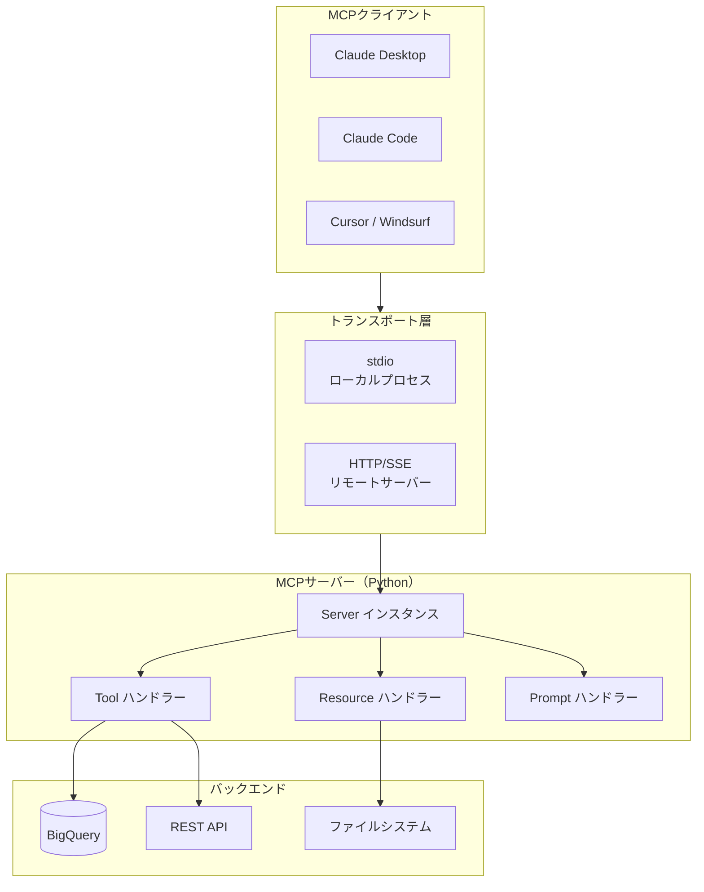
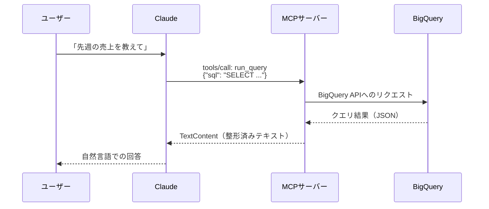

## はじめに

「Claude に自社の社内APIを叩かせたい」「BigQueryのデータをClaudeに参照させたい」──こうしたニーズに応えるのが **MCP（Model Context Protocol）** です。

MCPはAnthropicが2024年11月に発表したオープン標準プロトコルで、LLMと外部ツール・データソースを安全かつ標準的な方法で接続できます。一度MCPサーバーを実装すれば、Claude Desktop、Claude Code、Cursor、Windsurfなど複数のAIクライアントから共通して利用できます。

この記事ではPythonの `mcp` SDKを使ってMCPサーバーをゼロから実装し、Claude DesktopとClaude Codeから接続するまでを、実際に動くコードとともに解説します。

**動作環境**
- Python 3.11以上
- mcp 1.x（`pip install mcp`）
- Claude Desktop または Claude Code

---

## MCPの仕組み

### 既存のFunction Calling/Tool Useとの違い

MCPを一言で表すと「ツール接続の標準化レイヤー」です。従来のFunction CallingやTool Useとの最大の違いは **再利用性** にあります。

| 比較軸 | Function Calling（旧来） | MCP |
|--------|--------------------------|-----|
| 接続方式 | APIリクエストにスキーマ同梱 | JSON-RPC over stdio/HTTP |
| サーバー再利用 | 不可（モデルごとに実装） | 可（任意のMCPクライアントから接続） |
| ツール登録 | リクエストごとに送信 | サーバー起動時に一括登録 |
| データ共有 | コンテキストに直接埋め込み | Resourceとして構造化公開 |
| 標準化 | 各社独自仕様 | オープン標準 |

### アーキテクチャ全体像



### 3つの主要概念

MCPサーバーが公開できるインターフェースは3種類です。

| 概念 | 役割 | 副作用 |
|------|------|--------|
| Tool | LLMが呼び出せる「関数」 | あり（外部APIの実行など） |
| Resource | LLMが参照できる「データ」 | なし（読み取り専用） |
| Prompt | 再利用可能な「プロンプトテンプレート」 | なし |

### JSON-RPCプロトコル

MCPの内部通信はJSON-RPCで行われます。クライアントとサーバーはstdio（標準入出力）またはHTTP/SSEでメッセージをやり取りします。

```
クライアント → サーバー: tools/list リクエスト
クライアント ← サーバー: ツール一覧レスポンス
クライアント → サーバー: tools/call リクエスト（引数付き）
クライアント ← サーバー: ツール実行結果
```

開発者がこのプロトコルの詳細を知る必要はありません。`mcp` SDKがすべて処理してくれます。

---

## 環境セットアップ

```bash
# 仮想環境の作成（推奨）
python -m venv .venv
source .venv/bin/activate  # Windowsは .venv\Scripts\activate

# mcp SDKのインストール
pip install mcp

# バージョン確認
python -c "import mcp; print(mcp.__version__)"
```

BigQueryツールを実装する場合は追加インストールが必要です。

```bash
pip install google-cloud-bigquery
```

---

## 最小実装：Hello World MCPサーバー

まず動作する最小のMCPサーバーを実装します。

```python
# server.py
import asyncio
from mcp.server import Server
import mcp.server.stdio
import mcp.types as types

# サーバーインスタンスの生成
server = Server("hello-mcp-server")


@server.list_tools()
async def handle_list_tools() -> list[types.Tool]:
    """利用可能なツール一覧を返す"""
    return [
        types.Tool(
            name="hello",
            description="名前を受け取って挨拶するツール",
            inputSchema={
                "type": "object",
                "properties": {
                    "name": {
                        "type": "string",
                        "description": "挨拶する相手の名前"
                    }
                },
                "required": ["name"]
            }
        )
    ]


@server.call_tool()
async def handle_call_tool(
    name: str,
    arguments: dict
) -> list[types.TextContent]:
    """ツールを実行して結果を返す"""
    if name == "hello":
        target_name = arguments.get("name", "World")
        return [
            types.TextContent(
                type="text",
                text=f"こんにちは、{target_name}さん！MCPサーバーからの挨拶です。"
            )
        ]
    raise ValueError(f"未知のツール: {name}")


async def main():
    # stdioトランスポートでサーバーを起動
    async with mcp.server.stdio.stdio_server() as (read_stream, write_stream):
        await server.run(
            read_stream,
            write_stream,
            server.create_initialization_options()
        )


if __name__ == "__main__":
    asyncio.run(main())
```

このファイルを直接実行してもCLIには何も表示されません。MCPサーバーはstdio経由でクライアントと通信するため、MCPクライアント（Claude Desktop等）から起動されることを前提としています。

---

## Toolの実装と登録

### 複数ツールの登録

実務では複数のツールを登録することがほとんどです。`list_tools` で全ツールを返し、`call_tool` でツール名に応じて処理を分岐します。

```python
@server.list_tools()
async def handle_list_tools() -> list[types.Tool]:
    return [
        types.Tool(
            name="get_weather",
            description="指定した都市の現在の天気を取得する",
            inputSchema={
                "type": "object",
                "properties": {
                    "city": {
                        "type": "string",
                        "description": "都市名（例: Tokyo, Osaka）"
                    },
                    "unit": {
                        "type": "string",
                        "enum": ["celsius", "fahrenheit"],
                        "description": "温度単位（デフォルト: celsius）"
                    }
                },
                "required": ["city"]
            }
        ),
        types.Tool(
            name="search_docs",
            description="ドキュメントを全文検索する",
            inputSchema={
                "type": "object",
                "properties": {
                    "query": {
                        "type": "string",
                        "description": "検索クエリ"
                    },
                    "limit": {
                        "type": "integer",
                        "description": "最大取得件数（デフォルト: 10）",
                        "default": 10
                    }
                },
                "required": ["query"]
            }
        )
    ]


@server.call_tool()
async def handle_call_tool(
    name: str,
    arguments: dict
) -> list[types.TextContent | types.ImageContent]:
    if name == "get_weather":
        return await get_weather_impl(arguments)
    elif name == "search_docs":
        return await search_docs_impl(arguments)
    raise ValueError(f"未知のツール: {name}")
```

### inputSchemaの書き方のポイント

Tool の `inputSchema` はJSON Schema形式です。よく使うパターンを以下に示します。

```python
# 文字列の列挙（enum）
"status": {
    "type": "string",
    "enum": ["active", "inactive", "pending"],
    "description": "ステータス"
}

# 配列
"ids": {
    "type": "array",
    "items": {"type": "string"},
    "description": "IDのリスト"
}

# オブジェクト（ネスト）
"filter": {
    "type": "object",
    "properties": {
        "start_date": {"type": "string", "format": "date"},
        "end_date": {"type": "string", "format": "date"}
    }
}

# オプション引数はrequiredから除外
"required": ["city"]  # unitはオプション
```

---

## Resourceの実装

ResourceはToolと異なり、副作用のない読み取り専用データです。設定ファイル、ドキュメント、データカタログなどの参照に適しています。

```python
@server.list_resources()
async def handle_list_resources() -> list[types.Resource]:
    """利用可能なリソース一覧を返す"""
    return [
        types.Resource(
            uri="config://app/settings",
            name="アプリケーション設定",
            description="現在の設定値一覧",
            mimeType="application/json"
        ),
        types.Resource(
            uri="docs://api/reference",
            name="APIリファレンス",
            description="利用可能なAPIエンドポイントの一覧",
            mimeType="text/markdown"
        )
    ]


@server.read_resource()
async def handle_read_resource(uri: str) -> str:
    """リソースの内容を返す"""
    if uri == "config://app/settings":
        import json
        settings = {
            "version": "1.0.0",
            "environment": "production",
            "max_results": 100
        }
        return json.dumps(settings, ensure_ascii=False, indent=2)

    elif uri == "docs://api/reference":
        return """# APIリファレンス

## GET /users
ユーザー一覧を取得します。

## POST /users
新規ユーザーを作成します。
"""

    raise ValueError(f"未知のリソースURI: {uri}")
```

---

## Claude Desktopへの接続設定

### 設定ファイルの場所

| OS | パス |
|----|------|
| macOS | `~/Library/Application Support/Claude/claude_desktop_config.json` |
| Windows | `%APPDATA%\Claude\claude_desktop_config.json` |

### 基本設定

```json
{
  "mcpServers": {
    "hello-server": {
      "command": "python",
      "args": ["/path/to/server.py"]
    }
  }
}
```

**重要**: `command` に `python` を指定する場合、仮想環境のPythonを明示することを強く推奨します。システムのPythonでは `mcp` パッケージが見つからないケースが多いためです。

```json
{
  "mcpServers": {
    "hello-server": {
      "command": "/path/to/project/.venv/bin/python",
      "args": ["/path/to/project/server.py"]
    }
  }
}
```

### 環境変数の設定

APIキーなどの機密情報は `env` で設定します。設定ファイル内にハードコードしないでください。

```json
{
  "mcpServers": {
    "my-api-server": {
      "command": "/path/to/.venv/bin/python",
      "args": ["/path/to/server.py"],
      "env": {
        "API_BASE_URL": "https://api.example.com",
        "LOG_LEVEL": "INFO"
      }
    }
  }
}
```

サーバー側ではos.environで読み取ります。

```python
import os

API_BASE_URL = os.environ.get("API_BASE_URL", "https://api.example.com")
```

設定変更後はClaude Desktopを再起動してください。

---

## Claude Codeでの使用方法

Claude Codeでは `.claude/settings.json`（プロジェクトローカル）または `~/.claude/settings.json`（グローバル）にMCPサーバーを登録します。

### プロジェクトローカル設定（推奨）

```json
{
  "mcpServers": {
    "my-server": {
      "command": "/path/to/.venv/bin/python",
      "args": ["/path/to/server.py"],
      "env": {
        "PROJECT_ROOT": "/path/to/project"
      }
    }
  }
}
```

### グローバル設定

```json
{
  "mcpServers": {
    "bigquery-server": {
      "command": "/Users/yourname/.venv/bin/python",
      "args": ["/Users/yourname/tools/bq-mcp-server/server.py"],
      "env": {
        "GOOGLE_CLOUD_PROJECT": "your-project-id"
      }
    }
  }
}
```

Claude Codeでは `/mcp` コマンドでMCPサーバーの接続状態を確認できます。

---

## 実践例: BigQueryデータ参照ツール

ここからは実務で使えるBigQueryデータ参照MCPサーバーを実装します。

### ツール呼び出しフロー



### 実装コード

```python
# bq_server.py
import asyncio
import json
import os
import logging
from mcp.server import Server
import mcp.server.stdio
import mcp.types as types

# ロギング設定
logging.basicConfig(level=logging.INFO)
logger = logging.getLogger("bq-mcp-server")

server = Server("bigquery-mcp-server")

# BigQueryクライアントの初期化（遅延初期化）
_bq_client = None


def get_bq_client():
    global _bq_client
    if _bq_client is None:
        from google.cloud import bigquery
        project_id = os.environ.get("GOOGLE_CLOUD_PROJECT")
        _bq_client = bigquery.Client(project=project_id)
    return _bq_client


@server.list_tools()
async def handle_list_tools() -> list[types.Tool]:
    return [
        types.Tool(
            name="run_query",
            description=(
                "BigQueryでSQLクエリを実行して結果を返す。"
                "SELECTクエリのみ使用可能。コストを抑えるためLIMITを必ず付けること。"
            ),
            inputSchema={
                "type": "object",
                "properties": {
                    "sql": {
                        "type": "string",
                        "description": "実行するSQLクエリ（SELECT文のみ）"
                    },
                    "max_rows": {
                        "type": "integer",
                        "description": "最大取得行数（デフォルト: 100、最大: 1000）",
                        "default": 100
                    }
                },
                "required": ["sql"]
            }
        ),
        types.Tool(
            name="list_tables",
            description="指定したデータセットのテーブル一覧を取得する",
            inputSchema={
                "type": "object",
                "properties": {
                    "dataset_id": {
                        "type": "string",
                        "description": "データセットID"
                    }
                },
                "required": ["dataset_id"]
            }
        ),
        types.Tool(
            name="get_schema",
            description="テーブルのスキーマ（カラム定義）を取得する",
            inputSchema={
                "type": "object",
                "properties": {
                    "dataset_id": {
                        "type": "string",
                        "description": "データセットID"
                    },
                    "table_id": {
                        "type": "string",
                        "description": "テーブルID"
                    }
                },
                "required": ["dataset_id", "table_id"]
            }
        )
    ]


@server.call_tool()
async def handle_call_tool(
    name: str,
    arguments: dict
) -> list[types.TextContent]:
    logger.info(f"Tool called: {name}, args: {arguments}")

    try:
        if name == "run_query":
            return await run_query(arguments)
        elif name == "list_tables":
            return await list_tables(arguments)
        elif name == "get_schema":
            return await get_schema(arguments)
        else:
            raise ValueError(f"未知のツール: {name}")
    except Exception as e:
        logger.error(f"Error in {name}: {e}")
        return [types.TextContent(type="text", text=f"エラーが発生しました: {str(e)}")]


async def run_query(arguments: dict) -> list[types.TextContent]:
    sql = arguments["sql"]
    max_rows = min(arguments.get("max_rows", 100), 1000)

    # SELECTのみ許可（簡易チェック）
    sql_upper = sql.strip().upper()
    if not sql_upper.startswith("SELECT"):
        raise ValueError("SELECTクエリのみ実行可能です")

    client = get_bq_client()

    # 非同期で実行（run_in_executor でブロッキング処理をラップ）
    import asyncio
    loop = asyncio.get_event_loop()

    def _run():
        query_job = client.query(sql)
        rows = list(query_job.result(max_results=max_rows))
        return rows

    rows = await loop.run_in_executor(None, _run)

    if not rows:
        return [types.TextContent(type="text", text="クエリ結果: 0件")]

    # 結果をテキスト形式に整形
    headers = list(rows[0].keys())
    lines = [" | ".join(headers)]
    lines.append("-" * (len(lines[0])))

    for row in rows:
        line = " | ".join(str(row[h]) for h in headers)
        lines.append(line)

    result_text = f"クエリ結果: {len(rows)}件\n\n" + "\n".join(lines)
    return [types.TextContent(type="text", text=result_text)]


async def list_tables(arguments: dict) -> list[types.TextContent]:
    dataset_id = arguments["dataset_id"]
    client = get_bq_client()

    import asyncio
    loop = asyncio.get_event_loop()

    def _run():
        tables = list(client.list_tables(dataset_id))
        return tables

    tables = await loop.run_in_executor(None, _run)

    table_names = [t.table_id for t in tables]
    result = f"データセット '{dataset_id}' のテーブル一覧 ({len(table_names)}件):\n"
    result += "\n".join(f"- {name}" for name in table_names)
    return [types.TextContent(type="text", text=result)]


async def get_schema(arguments: dict) -> list[types.TextContent]:
    dataset_id = arguments["dataset_id"]
    table_id = arguments["table_id"]
    client = get_bq_client()

    import asyncio
    loop = asyncio.get_event_loop()

    def _run():
        table_ref = f"{client.project}.{dataset_id}.{table_id}"
        table = client.get_table(table_ref)
        return table.schema

    schema = await loop.run_in_executor(None, _run)

    lines = [f"テーブル: {dataset_id}.{table_id}\n"]
    lines.append("カラム名 | 型 | モード | 説明")
    lines.append("-" * 60)
    for field in schema:
        desc = field.description or ""
        lines.append(f"{field.name} | {field.field_type} | {field.mode} | {desc}")

    return [types.TextContent(type="text", text="\n".join(lines))]


async def main():
    async with mcp.server.stdio.stdio_server() as (read_stream, write_stream):
        await server.run(
            read_stream,
            write_stream,
            server.create_initialization_options()
        )


if __name__ == "__main__":
    asyncio.run(main())
```

### BigQueryサーバーのClaude Desktop設定

```json
{
  "mcpServers": {
    "bigquery": {
      "command": "/path/to/.venv/bin/python",
      "args": ["/path/to/bq_server.py"],
      "env": {
        "GOOGLE_CLOUD_PROJECT": "your-project-id"
      }
    }
  }
}
```

認証には Application Default Credentials を使用します。事前に以下のコマンドを実行してください。

```bash
gcloud auth application-default login
```

---

## 実践例: 外部REST API連携ツール

外部APIを叩くツールの実装例です。`httpx` を使った非同期HTTPリクエストを実装します。

```bash
pip install httpx
```

```python
# api_server.py
import asyncio
import httpx
import os
from mcp.server import Server
import mcp.server.stdio
import mcp.types as types

server = Server("rest-api-mcp-server")

API_BASE_URL = os.environ.get("API_BASE_URL", "https://jsonplaceholder.typicode.com")


@server.list_tools()
async def handle_list_tools() -> list[types.Tool]:
    return [
        types.Tool(
            name="get_posts",
            description="ブログ投稿の一覧を取得する",
            inputSchema={
                "type": "object",
                "properties": {
                    "user_id": {
                        "type": "integer",
                        "description": "ユーザーIDでフィルタリング（省略可）"
                    },
                    "limit": {
                        "type": "integer",
                        "description": "取得件数（デフォルト: 10）",
                        "default": 10
                    }
                },
                "required": []
            }
        ),
        types.Tool(
            name="get_post_detail",
            description="指定したIDのブログ投稿詳細を取得する",
            inputSchema={
                "type": "object",
                "properties": {
                    "post_id": {
                        "type": "integer",
                        "description": "投稿ID"
                    }
                },
                "required": ["post_id"]
            }
        )
    ]


@server.call_tool()
async def handle_call_tool(
    name: str,
    arguments: dict
) -> list[types.TextContent]:
    async with httpx.AsyncClient(base_url=API_BASE_URL, timeout=30.0) as client:
        if name == "get_posts":
            params = {}
            if "user_id" in arguments:
                params["userId"] = arguments["user_id"]

            response = await client.get("/posts", params=params)
            response.raise_for_status()
            posts = response.json()

            limit = arguments.get("limit", 10)
            posts = posts[:limit]

            lines = [f"投稿一覧 ({len(posts)}件):\n"]
            for post in posts:
                lines.append(f"ID: {post['id']} - {post['title']}")
            return [types.TextContent(type="text", text="\n".join(lines))]

        elif name == "get_post_detail":
            post_id = arguments["post_id"]
            response = await client.get(f"/posts/{post_id}")
            response.raise_for_status()
            post = response.json()

            text = f"""投稿ID: {post['id']}
タイトル: {post['title']}
ユーザーID: {post['userId']}
本文:
{post['body']}"""
            return [types.TextContent(type="text", text=text)]

        raise ValueError(f"未知のツール: {name}")


async def main():
    async with mcp.server.stdio.stdio_server() as (read_stream, write_stream):
        await server.run(
            read_stream,
            write_stream,
            server.create_initialization_options()
        )


if __name__ == "__main__":
    asyncio.run(main())
```

---

## デバッグ方法

### MCP Inspector の使用

MCP公式のデバッグツール「MCP Inspector」を使うと、ブラウザからMCPサーバーを直接操作してテストできます。

```bash
# npxで直接実行（インストール不要）
npx @modelcontextprotocol/inspector python /path/to/server.py
```

ブラウザで `http://localhost:5173` を開くと、ツール一覧の確認と手動実行が可能です。

### ログ出力の設定

```python
import logging
import sys

# stderrにログを出力（stdoutはMCP通信で使用するため使わない）
logging.basicConfig(
    level=logging.DEBUG,
    stream=sys.stderr,
    format="%(asctime)s [%(levelname)s] %(name)s: %(message)s"
)
logger = logging.getLogger("my-mcp-server")
```

Claude Desktopのログは以下で確認できます。

```bash
# macOS
tail -f ~/Library/Logs/Claude/mcp*.log
```

### よくあるエラーと対処法

**`ModuleNotFoundError: No module named 'mcp'`**

仮想環境のPythonが使われていない場合に発生します。

```json
// 修正前（システムPythonを使用）
"command": "python"

// 修正後（仮想環境のPythonを明示）
"command": "/path/to/project/.venv/bin/python"
```

**`Connection refused` または接続できない**

Claude Desktopを再起動してください。設定ファイルの変更はサーバー起動時にのみ読み込まれます。

**ツールが表示されない**

`list_tools` ハンドラーが正しく登録されているか確認します。デコレータ `@server.list_tools()` の記述漏れが多いです。

**`ValueError: Unknown tool`**

`call_tool` ハンドラーのツール名分岐に抜けがないか確認してください。`list_tools` で返すツール名と `call_tool` のif分岐が一致している必要があります。

---

## まとめ

この記事ではMCP（Model Context Protocol）カスタムサーバーをPythonで実装する方法を解説しました。

**実装のポイントを整理します。**

1. `mcp.server.Server` でサーバーインスタンスを生成し、デコレータでハンドラーを登録する
2. `@server.list_tools()` でツール定義（名前・説明・inputSchema）を返す
3. `@server.call_tool()` でツール名に応じて処理を実装し、`TextContent` で結果を返す
4. ブロッキング処理（BigQuery等）は `run_in_executor` で非同期化する
5. Claude Desktopは `claude_desktop_config.json`、Claude Codeは `.claude/settings.json` で設定する
6. APIキーは `env` 経由で渡し、コードにハードコードしない

MCPの強みは「一度実装すれば複数のAIクライアントで使い回せる」点です。BigQuery参照ツールを作れば、Claude Desktop でのデータ分析にも、Claude Code での開発支援にも同じサーバーが使えます。

まずはHello Worldサーバーを動かしてみて、徐々に自分のユースケースに合わせたツールを追加していくことをおすすめします。

---

**参考リンク**

- [MCP公式ドキュメント](https://modelcontextprotocol.io/)
- [MCP Python SDK（GitHub）](https://github.com/modelcontextprotocol/python-sdk)
- [MCP Inspector（デバッグツール）](https://github.com/modelcontextprotocol/inspector)
- [Claude Desktop設定ガイド](https://modelcontextprotocol.io/quickstart/user)
