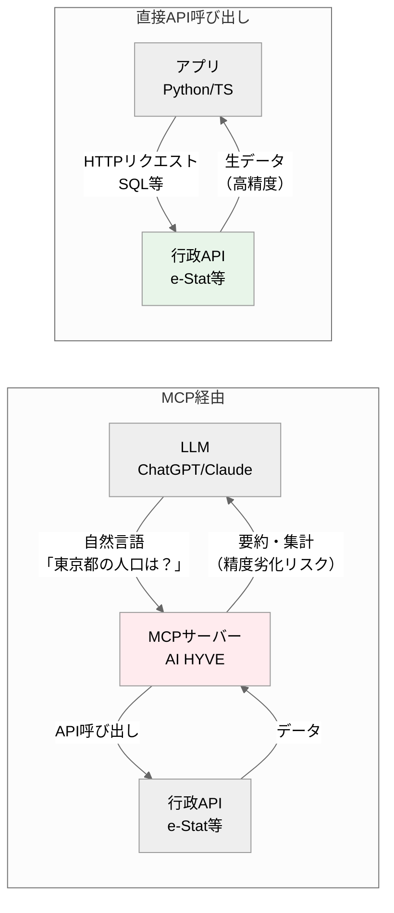
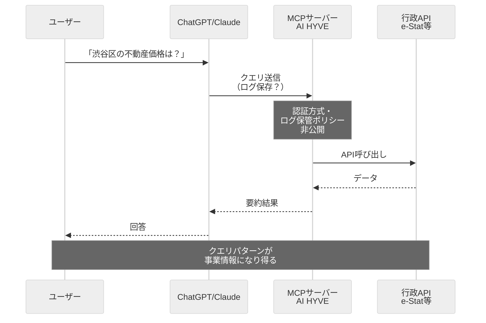

## はじめに

2026年2月12日、AI HYVEとN-3が「[行政オープンデータリモートMCPサーバー](https://prtimes.jp/main/html/rd/p/000000006.000146070.html)」を無料公開しました。ChatGPTやClaudeから自然言語で行政APIにアクセスできる便利なサービスです。

https://prtimes.jp/main/html/rd/p/000000006.000146070.html

しかし、本当にこのMCPサーバーを経由する必要があるのでしょうか？

結論から言うと、**本番運用では省庁公式APIを直接叩くべき**です。β版のMCPサーバーに依存することには、継続性・データ精度・セキュリティの3つのリスクがあります。

この記事では、行政オープンデータを例に、MCPサーバー経由と直接API呼び出しの比較を行い、それぞれが向いているケースを解説します。

## そもそもMCPサーバーとは何か

MCP（Model Context Protocol）は、AnthropicがClaude向けに策定したプロトコルで、LLMが外部ツールやデータソースにアクセスする際の標準インターフェースです。

MCPサーバーは、この仕様に従って特定のAPIを「ツール」として提供するミドルウェアです。今回リリースされた「行政オープンデータリモートMCPサーバー」は、以下3つの行政APIをラップしています:

- **e-Stat API**（総務省：政府統計）
- **不動産情報ライブラリAPI**（国土交通省：取引価格・学区・医療施設）
- **官公需情報ポータルサイトAPI**（中小企業庁：入札情報）

LLMからは「東京都の人口推移を教えて」と自然言語で問いかけるだけで、MCPサーバーが適切なAPIを呼び出してデータを取得し、LLMに返します。

一見便利ですが、ここには**APIラッパー特有のリスク**が存在します。



## β版MCPサーバーに依存する3つのリスク

### リスク1: 提供企業の継続性

今回のMCPサーバーを提供するAI HYVEは、**2024年7月設立、資本金100万円**のスタートアップです（プレスリリースより）。

さらに、プレスリリースには以下の免責事項が明記されています:

> β版として無償提供しており、**予告なく仕様変更・提供停止する可能性**があります。

これは、スタートアップのβ版サービスでは当然の条件ですが、**本番システムの前提には置けない**ということです。

#### 省庁公式APIとの信頼性比較

| 項目 | MCPサーバー（β版） | 省庁公式API |
|------|-------------------|------------|
| 提供主体 | AI HYVE（資本金100万円） | 総務省・国交省・中小企業庁 |
| SLA | なし | 政府情報システムとして運用 |
| 予告なし停止 | あり得る | 政策変更がない限り継続 |
| データ更新頻度 | 不明 | 各省庁の公表スケジュール |
| 利用実績 | リリース当日（2026-02-12） | e-Stat: 累計2,000万PV超<br>不動産ライブラリ: 3,096者利用中 |
| **コスト** | **LLMトークン消費**（Claude/ChatGPT利用料） | **API呼び出しのみ**（≈0円） |

β版MCPサーバーは「実験・検証用」として割り切るべきです。

### リスク2: データ精度の劣化

プレスリリースには、こうも書かれています:

> AIによる要約や集計結果は**必ずしも正確性を保証しない**

つまり、公式APIのデータをMCPサーバーが中間処理（要約・集計）する際に、品質が劣化する可能性があるということです。

省庁公式APIから取得したデータであっても、中間サーバーを経由することで:
- 要約処理での情報の欠落
- 集計ロジックの誤り
- レスポンス形式の変換ミス

などのリスクが生じます。

重要な意思決定やレポート作成には、**ソースAPIを直接叩く**ことが信頼性の担保になります。

### リスク3: セキュリティリスク

MCPサーバーを経由すると、**クエリ内容が中間サーバーに送信**されます。これはMCPアーキテクチャの構造上、避けられません。



トレンドマイクロの調査（2025年）によると、認証なしで公開されているMCPサーバーが492件発見されました。また、GMO Flatt Securityの解説では、**MCP一般のセキュリティリスク**として以下のような攻撃手法が指摘されています:

- **ツール汚染攻撃**（Tool Poisoning）: 悪意のあるサーバーがツール説明に不正な指示を埋め込む
- **ラグプル攻撃**: ユーザーがツールを承認した後、サーバー側が説明文を変更して有害なコードを追加

今回のAI HYVE MCPサーバーは、認証方式・ログ保存ポリシーが公開されていないため、クエリ内容がどう扱われるかは不明です。

行政データ自体は公開情報ですが、「どの企業がどの地域の不動産データを調べているか」といったクエリパターンは、事業情報になり得ます。

**重要**: これらは一般的なMCPサーバーのリスクであり、AI HYVE固有の問題ではありません。しかし、中間サーバーを経由する以上、リスクはゼロではないことを理解すべきです。

## 省庁公式APIは無料で利用できる（審査・利用規約あり）

実は、今回MCPサーバーがラップしている3つのAPIは、**利用申請・審査を経て無料で直接利用できます**。

### e-Stat API（政府統計総合窓口）

- **提供**: 総務省統計局
- **データ**: 40,000テーブル以上（国勢調査、経済センサス、労働力調査等）
- **利用方法**: [公式サイト](https://www.e-stat.go.jp/api/)で無料ユーザー登録 → アプリケーションID取得
- **商用利用**: 利用規約を確認（一般的には可能）
- **API形式**: REST API（JSON/XML/CSV）

```python
import requests

APP_ID = "your_app_id"
url = f"https://api.e-stat.go.jp/rest/3.0/app/json/getStatsList?appId={APP_ID}"

try:
    response = requests.get(url, timeout=30)
    response.raise_for_status()
    data = response.json()

    # 統計表一覧を取得
    for stat in data['GET_STATS_LIST']['DATALIST_INF']['TABLE_INF']:
        print(f"{stat['TITLE']}: {stat['@id']}")

except requests.exceptions.Timeout:
    print("API接続がタイムアウトしました")
except requests.exceptions.HTTPError as e:
    print(f"HTTPエラー: {e.response.status_code}")
except KeyError as e:
    print(f"レスポンス構造が想定と異なります: {e}")
```

### 不動産情報ライブラリAPI（国土交通省）

- **提供**: 国土交通省
- **データ**: 不動産取引価格、学区、医療施設、福祉施設
- **利用方法**: [利用申請ページ](https://www.reinfolib.mlit.go.jp/api/request/)から申請 → 審査後5営業日以内にAPIキー発行
- **利用実績**: 3,096者（2025年6月時点）
- **商用利用**: 利用規約を確認（申請時に利用目的の記載が必要）
- **API形式**: GeoJSON/JSON

### 官公需情報ポータルサイトAPI（中小企業庁）

- **提供**: 中小企業庁
- **データ**: 国・地方自治体の入札情報（年間22兆円規模）
- **利用方法**: [APIガイドPDF](https://www.kkj.go.jp/doc/ja/api_guide.pdf)を参照して直接呼び出し
- **商用利用**: 利用規約を確認
- **API形式**: REST API（XML）

> **注意**: 各APIの商用利用可否・利用制限は、利用規約を必ず確認してください。不動産情報ライブラリAPIは申請に審査があり、利用目的によっては却下される可能性があります。

## 実装コスト比較

### MCPサーバー経由

**メリット**:
- **非エンジニアがノーコードでデータ取得できる**: プロンプトだけで統計分析が完結
- LLMから自然言語で呼び出せる（「東京都の人口推移を教えて」だけで完結）
- APIキー管理が不要（MCPサーバー側で管理）
- 複数のAPIを統一的なインターフェースで扱える

**デメリット**:
- β版サービスへの依存
- データ精度が保証されない
- セキュリティリスク（中間サーバー経由）
- MCPクライアント（Claude、ChatGPT等）が必須

### 直接API叩き

**メリット**:
- SLA・信頼性・永続性が高い
- データ精度が保証される（ソースAPIから直接取得）
- セキュリティリスクが低い（省庁API→自システムの2点間通信）
- 任意のプログラミング言語・ツールで利用可能

**デメリット**:
- API仕様の学習が必要
- APIキー管理を自前で行う必要がある
- 複数APIを使う場合、個別に実装が必要

### 実装例：e-Stat APIから人口統計を取得

```python
import requests
from typing import Optional

class EStatAPI:
    """e-Stat API クライアント"""
    BASE_URL = "https://api.e-stat.go.jp/rest/3.0/app/json"

    def __init__(self, app_id: str):
        self.app_id = app_id

    def get_stats_list(self, search_word: Optional[str] = None) -> dict:
        """統計表一覧を取得

        Args:
            search_word: 検索キーワード

        Returns:
            統計表一覧のJSON

        Raises:
            RuntimeError: API接続エラー、認証エラー等
        """
        url = f"{self.BASE_URL}/getStatsList"
        params = {"appId": self.app_id}
        if search_word:
            params["searchWord"] = search_word

        try:
            response = requests.get(url, params=params, timeout=30)
            response.raise_for_status()
            data = response.json()

            # レスポンス構造の検証
            if 'GET_STATS_LIST' not in data:
                raise KeyError("レスポンスに GET_STATS_LIST が含まれていません")

            return data

        except requests.exceptions.Timeout:
            raise RuntimeError("e-Stat APIへの接続がタイムアウトしました")
        except requests.exceptions.HTTPError as e:
            if e.response.status_code == 401:
                raise RuntimeError("アプリケーションIDが無効です")
            elif e.response.status_code == 404:
                raise RuntimeError("指定された統計が見つかりません")
            else:
                raise RuntimeError(f"HTTPエラー: {e.response.status_code}")
        except KeyError as e:
            raise RuntimeError(f"レスポンス構造が想定と異なります: {e}")

    def get_stats_data(self, stats_data_id: str) -> dict:
        """統計データを取得"""
        url = f"{self.BASE_URL}/getStatsData"
        params = {
            "appId": self.app_id,
            "statsDataId": stats_data_id
        }

        try:
            response = requests.get(url, params=params, timeout=30)
            response.raise_for_status()
            return response.json()
        except requests.exceptions.Timeout:
            raise RuntimeError("e-Stat APIへの接続がタイムアウトしました")
        except requests.exceptions.HTTPError as e:
            raise RuntimeError(f"HTTPエラー: {e.response.status_code}")

# 使用例
try:
    api = EStatAPI(app_id="your_app_id")

    # 「人口」に関連する統計を検索
    stats_list = api.get_stats_list(search_word="人口")

    # 最初の統計データを取得
    first_stat_id = stats_list['GET_STATS_LIST']['DATALIST_INF']['TABLE_INF'][0]['@id']
    stats_data = api.get_stats_data(first_stat_id)
    print("統計データの取得に成功しました")

except RuntimeError as e:
    print(f"エラー: {e}")
```

エラーハンドリングを含めても、この程度の実装で省庁公式APIを直接叩けます。

## どちらを選ぶべきか

判断基準を明確にするため、**本番運用**を以下のように定義します:

> **本番運用** = エンドユーザーに提供するサービス、または1年以上の継続利用を想定するシステム（社内ツール・個人プロジェクト含む）

### MCPサーバーが向いているケース

- **プロトタイプ・PoC段階**: アイデア検証が目的で、長期運用を前提としない
- **データ精度が重要でない用途**: おおよその傾向を掴む程度の分析
- **短期間の実験**: 数週間〜数ヶ月の期間限定プロジェクト
- **LLMとの会話UIが必須**: ユーザーが自然言語で問い合わせるインターフェース
- **非エンジニア向けツール**: ノーコードでデータ取得できることが最優先

### 直接API叩きが向いているケース

- **本番サービス**: エンドユーザーに提供するプロダクト
- **データ精度・信頼性が重要**: レポート作成、意思決定支援、ダッシュボード
- **長期運用**: 1年以上の継続利用を想定
- **セキュリティ要件が厳しい**: クエリパターンを外部サーバーに送信できない
- **コスト最適化**: LLMトークン消費を避けたい

## まとめ

AI HYVEとN-3が公開した「行政オープンデータリモートMCPサーバー」は、行政APIをLLMから手軽に使えるようにする興味深い取り組みです。

しかし、以下の3つの理由から、**本番運用では省庁公式APIを直接叩くべき**です:

1. **継続性リスク**: β版サービスは予告なく停止する可能性がある
2. **データ精度リスク**: 中間処理による品質劣化の懸念
3. **セキュリティリスク**: クエリパターンが中間サーバーに送信される

e-Stat、不動産情報ライブラリ、官公需情報ポータルの3つのAPIは、**利用申請・審査を経て無料で直接利用できます**。APIキーの取得も数営業日で完了します。

β版MCPサーバーは「使い捨て実験」として割り切り、本番では省庁API直接呼び出しを選びましょう。

「コスト0」は金銭的コストのみです。**時間コスト・リスクコストを忘れてはいけません**:

- **MCPサーバー停止時の移行コスト**: 代替手段への切り替えに数日〜数週間
- **省庁API仕様の学習コスト**: 基本的なHTTPリクエストの知識があれば1-2時間で習得可能

MCPサーバーを選ぶことは「将来の移行コスト」を先送りしているに過ぎません。最初から省庁APIを直接使えば、この移行コストは発生しません。

## 参考リソース

### 公式ドキュメント
- [e-Stat API](https://www.e-stat.go.jp/api/)
- [不動産情報ライブラリAPI](https://www.reinfolib.mlit.go.jp/)
- [官公需情報ポータルサイトAPI](https://www.kkj.go.jp/)
- [AI HYVE プレスリリース](https://prtimes.jp/main/html/rd/p/000000006.000146070.html)

### セキュリティ関連
- [トレンドマイクロ: 公開状態のMCPサーバーが機密データのバックドアとして悪用されるリスク](https://www.trendmicro.com/ja_jp/research/25/h/mcp-security-network.html)
- [GMO Flatt Security: MCPにおけるセキュリティ考慮事項と実装における観点](https://blog.flatt.tech/entry/mcp_security_first)

### 実装例
- [Qiita: Pythonでe-Stat APIを使う](https://qiita.com/faux/items/efc4c8981510b78dd560)
- [note: 不動産情報ライブラリの公開APIを利用する](https://note.com/fudosan_cloud/n/nfb891acf96ae)
- [LIFULL Creators Blog: 国土交通省不動産情報ライブラリAPI x 生成AI](https://www.lifull.blog/entry/2024/04/05/205430)

### 関連記事（予定）
- 無料で使える行政データAPI 15選 — 利用方法・APIキー取得手順付き
- 官公庁オープンデータで社会課題を可視化する — ISVDでの実践
