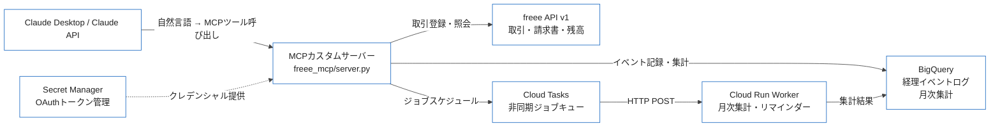

## 「毎月3時間、これに使っている」という自覚から始まった

合同会社を1人で運営し始めたころ、経理作業は月に1回のまとまった作業でした。freeeを開いて取引を入力し、スプレッドシートに売上を転記し、BigQueryのダッシュボードを更新するために手動でCSVを貼り付ける。1つ1つの作業は大したことがないのですが、それぞれ別のサービスを行き来しながら「今月の経費合計いくらだっけ」と逐一確認する手間が積み重なると、月末のたびに2〜3時間が消えていました。

解決策として思い浮かんだのが、 **MCP（Model Context Protocol）カスタムサーバー ** による統合です。freee API・BigQuery・Cloud Tasksという3つのサービスを1つのMCPサーバーにまとめ、Claudeに対して「今月の売上を教えて」「来月1日に月次レポートを生成して」と自然言語で指示できる環境を構築しました。

この記事では、その実装の全体像と、実際に運用してわかった設計上のポイントを共有します。

## 全体アーキテクチャ

まず完成形のイメージを示します。



ポイントは **MCPサーバーがすべてのAPIコールの入口を一元化している ** ことです。Claudeはどのサービスに何をリクエストすればよいかを意識せず、ツール名と引数を渡すだけで済みます。

## 1. なぜMCPで経理を自動化するのか

### 1-1. 「コンテキスト断片化」問題の正体

個人事業主の経理作業が非効率になる原因は、情報が複数のサービスに分散していることです。

- **freee**: 実際の取引・請求書データ
- ** 銀行アプリ **: 実残高（freeeと自動連携していても確認は別）
- ** スプレッドシート **: 売上予測・KPI管理
- **BigQuery**: 過去データの傾向分析

「今月の粗利はいくらか」を答えるだけでも、複数サービスを行き来してデータを突き合わせる必要があります。

### 1-2. MCPが解決すること

MCP（Model Context Protocol）は、Anthropicが2024年11月に公開したオープン仕様です。LLMに外部ツールを接続するインターフェースを標準化するもので、Function Callingとの主な違いは以下の通りです。

| 観点 | Function Calling | MCP |
|:--|:--|:--|
| 標準化 | プロバイダーごとに仕様が異なる | 統一仕様（クライアント非依存） |
| サーバー分離 | LLMプロバイダーに依存 | 独立したプロセスとして動作 |
| 再利用性 | モデル乗り換えで実装し直し | Claude / Cursor 等から共通利用可 |
| デバッグ | ログが散在しがち | MCP Inspectorで一元確認 |

MCPカスタムサーバーを1つ作れば、Claude DesktopでもClaude APIのツール呼び出しでも同じロジックを使い回せます。

### 1-3. 技術選定の理由

| サービス | 選定理由 | 代替案との比較 |
|:--|:--|:--|
| freee API | 個人事業主向けの機能が充実。APIスコープが細かく最小権限を取りやすい | Money Forwardは法人向けが中心 |
| BigQuery | 無料枠（10GB/月 + クエリ1TB/月）で個人規模なら実質無料。Looker Studioと直結できる | PostgreSQLはスケールアップコストが読めない |
| Cloud Tasks | Cloud Runと相性がよく、デッドレターキュー・リトライポリシーが設定しやすい | Pub/Subはオーバースペック感あり |

月額コストはSecret Manager（$0.06/シークレット）＋Cloud Run（無料枠内）＋Cloud Tasks（約$0.40/100万タスク）で、個人規模では ** ほぼ無料 ** に抑えられます。

## 2. MCPカスタムサーバーの骨格

### 2-1. 開発環境のセットアップ

```bash
# Python 3.10以上が必要
python --version  # 3.12.0

pip install mcp google-cloud-bigquery google-cloud-tasks \
    google-cloud-secret-manager requests
```

プロジェクト構成は以下の通りです。

```
freee_mcp/
├── server.py              # MCPサーバーエントリーポイント
├── tools/
│   ├── freee.py           # freee APIツール群
│   ├── bigquery.py        # BigQueryツール群
│   └── cloudtasks.py      # Cloud Tasksツール群
├── auth/
│   └── freee_oauth.py     # OAuthトークン管理
└── config.py              # 設定値・定数
```

### 2-2. MCPサーバーの骨格

```python
# server.py
import asyncio
from mcp.server import Server
from mcp.server.stdio import stdio_server
from mcp.types import Tool, TextContent

from tools.freee import FreeeTools
from tools.bigquery import BigQueryTools
from tools.cloudtasks import CloudTasksTools

app = Server("freee-accounting-mcp")

freee_tools = FreeeTools()
bq_tools = BigQueryTools()
ct_tools = CloudTasksTools()

ALL_TOOLS: list[Tool] = (
    freee_tools.definitions()
    + bq_tools.definitions()
    + ct_tools.definitions()
)

@app.list_tools()
async def list_tools() -> list[Tool]:
    return ALL_TOOLS

@app.call_tool()
async def call_tool(name: str, arguments: dict) -> list[TextContent]:
    try:
        if name.startswith("freee_"):
            result = await freee_tools.call(name, arguments)
        elif name.startswith("bq_"):
            result = await bq_tools.call(name, arguments)
        elif name.startswith("ct_"):
            result = await ct_tools.call(name, arguments)
        else:
            raise ValueError(f"Unknown tool: {name}")

        return [TextContent(type="text", text=str(result))]

    except Exception as e:
        # エラーもTextContentとして返す（MCPの慣習）
        return [TextContent(type="text", text=f"Error: {e!s}")]

async def main():
    async with stdio_server() as (read_stream, write_stream):
        await app.run(read_stream, write_stream, app.create_initialization_options())

if __name__ == "__main__":
    asyncio.run(main())
```

### 2-3. ツール定義のベストプラクティス

ツール名・説明文はLLMが読んで判断するテキストです。「何をするか」だけでなく「いつ使うか」を明示するとモデルが適切なツールを選択しやすくなります。

```python
# tools/freee.py（ツール定義の例）
from mcp.types import Tool
import json

def definitions(self) -> list[Tool]:
    return [
        Tool(
            name="freee_get_recent_deals",
            description=(
                "直近の取引一覧をfreeeから取得します。"
                "「今月の売上は？」「最近の経費を見せて」といった質問に使用してください。"
                "期間はdays_agoパラメータで指定します（デフォルト30日）。"
            ),
            inputSchema={
                "type": "object",
                "properties": {
                    "days_ago": {
                        "type": "integer",
                        "description": "何日前から取得するか（デフォルト: 30）",
                        "default": 30,
                    },
                    "deal_type": {
                        "type": "string",
                        "enum": ["income", "expense", "all"],
                        "description": "取得する取引種別",
                        "default": "all",
                    },
                },
                "required": [],
            },
        ),
        # 他のツール定義...
    ]
```

** 重要なポイント **: `description`に「どういう質問のときに使うか」の例文を入れておくと、モデルのツール選択精度が上がります。

## 3. freee API統合

### 3-1. OAuth 2.0認証の実装

freeeのOAuth認証で最も注意が必要なのは、 ** リフレッシュトークンが使い捨て ** という仕様です。トークンをリフレッシュするたびに新しいリフレッシュトークンが発行され、古いものは即座に無効化されます。

Secret Managerを使ってトークンを永続化します。

```python
# auth/freee_oauth.py
import os
import json
import time
import requests
from google.cloud import secretmanager

FREEE_TOKEN_URL = "https://accounts.secure.freee.co.jp/public_api/token"
SECRET_NAME = "projects/{project_id}/secrets/freee-refresh-token/versions/latest"

class FreeeAuthManager:
    def __init__(self):
        self.client_id = os.environ["FREEE_CLIENT_ID"]
        self.client_secret = os.environ["FREEE_CLIENT_SECRET"]
        self.project_id = os.environ["GOOGLE_CLOUD_PROJECT"]
        self._sm_client = secretmanager.SecretManagerServiceClient()
        self._access_token: str | None = None
        self._token_expires_at: float = 0

    def get_access_token(self) -> str:
        """アクセストークンを返す。期限切れの場合は自動リフレッシュ。"""
        if self._access_token and time.time() < self._token_expires_at - 300:
            return self._access_token

        refresh_token = self._load_refresh_token()
        new_tokens = self._refresh(refresh_token)

        # 新しいリフレッシュトークンを保存（必須: 古いトークンが無効化される）
        self._save_refresh_token(new_tokens["refresh_token"])

        self._access_token = new_tokens["access_token"]
        self._token_expires_at = time.time() + new_tokens["expires_in"]
        return self._access_token

    def _refresh(self, refresh_token: str) -> dict:
        resp = requests.post(
            FREEE_TOKEN_URL,
            data={
                "grant_type": "refresh_token",
                "client_id": self.client_id,
                "client_secret": self.client_secret,
                "refresh_token": refresh_token,
            },
            timeout=10,
        )
        resp.raise_for_status()
        return resp.json()

    def _load_refresh_token(self) -> str:
        name = SECRET_NAME.format(project_id=self.project_id)
        response = self._sm_client.access_secret_version(request={"name": name})
        return response.payload.data.decode("UTF-8")

    def _save_refresh_token(self, token: str) -> None:
        parent = f"projects/{self.project_id}/secrets/freee-refresh-token"
        self._sm_client.add_secret_version(
            request={
                "parent": parent,
                "payload": {"data": token.encode("UTF-8")},
            }
        )
```

### 3-2. MCPツールとして公開するfreee操作

```python
# tools/freee.py（実装の抜粋）
import asyncio
import requests
from datetime import datetime, timedelta
from auth.freee_oauth import FreeeAuthManager

FREEE_API_BASE = "https://api.freee.co.jp/api/1"

class FreeeTools:
    def __init__(self):
        self.auth = FreeeAuthManager()

    def _headers(self) -> dict:
        return {
            "Authorization": f"Bearer {self.auth.get_access_token()}",
            "Content-Type": "application/json",
        }

    def _company_id(self) -> int:
        import os
        return int(os.environ["FREEE_COMPANY_ID"])

    async def call(self, name: str, arguments: dict):
        # 同期的なHTTPコールをスレッドで実行
        return await asyncio.get_event_loop().run_in_executor(
            None, self._call_sync, name, arguments
        )

    def _call_sync(self, name: str, arguments: dict):
        if name == "freee_get_recent_deals":
            return self._get_recent_deals(**arguments)
        elif name == "freee_get_account_balance":
            return self._get_account_balance()
        elif name == "freee_list_unpaid_invoices":
            return self._list_unpaid_invoices()
        else:
            raise ValueError(f"Unknown freee tool: {name}")

    def _get_recent_deals(self, days_ago: int = 30, deal_type: str = "all") -> list[dict]:
        start_date = (datetime.now() - timedelta(days=days_ago)).strftime("%Y-%m-%d")
        params = {
            "company_id": self._company_id(),
            "start_issue_date": start_date,
            "limit": 100,
        }
        if deal_type != "all":
            params["type"] = deal_type

        deals = []
        offset = 0
        while True:
            params["offset"] = offset
            resp = requests.get(
                f"{FREEE_API_BASE}/deals",
                headers=self._headers(),
                params=params,
                timeout=10,
            )
            resp.raise_for_status()
            data = resp.json()
            deals.extend(data["deals"])
            if len(deals) >= data["meta"]["total_count"]:
                break
            offset += 100

        return deals

    def _get_account_balance(self) -> list[dict]:
        resp = requests.get(
            f"{FREEE_API_BASE}/wallets",
            headers=self._headers(),
            params={"company_id": self._company_id()},
            timeout=10,
        )
        resp.raise_for_status()
        return resp.json()["wallets"]

    def _list_unpaid_invoices(self) -> list[dict]:
        resp = requests.get(
            f"{FREEE_API_BASE}/invoices",
            headers=self._headers(),
            params={
                "company_id": self._company_id(),
                "invoice_status": "issued",
                "payment_status": "unsettled",
            },
            timeout=10,
        )
        resp.raise_for_status()
        return resp.json()["invoices"]
```

### 3-3. レート制限対策

freeeのレートリミットは300リクエスト/5分です。ページネーションがある操作では想定より多くリクエストを消費するため、Exponential Backoffを実装しておきます。

```python
import time
import functools

def with_retry(max_attempts: int = 3, base_delay: float = 1.0):
    """HTTPリクエストのリトライデコレーター（429と5xxのみリトライ）"""
    def decorator(func):
        @functools.wraps(func)
        def wrapper(*args, **kwargs):
            for attempt in range(max_attempts):
                try:
                    return func(*args, **kwargs)
                except requests.HTTPError as e:
                    if e.response.status_code in (429, 500, 502, 503):
                        if attempt < max_attempts - 1:
                            delay = base_delay * (2 ** attempt)
                            time.sleep(delay)
                            continue
                    raise  # リトライ不可能なエラーは即座に再raise
        return wrapper
    return decorator
```

## 4. BigQuery統合

### 4-1. スキーマ設計

freeeの取引データをそのまま格納するのではなく、 ** 経理イベントテーブル ** として抽象化して設計します。将来的に他の会計サービスに移行した場合も、分析クエリを変更せずに済みます。

```sql
-- BigQueryスキーマ定義
CREATE TABLE IF NOT EXISTS accounting.events (
  event_id      STRING    NOT NULL,
  event_type    STRING    NOT NULL,   -- 'deal_created', 'invoice_sent', 'payment_received'
  source        STRING    NOT NULL,   -- 'freee', 'manual', 'bank_sync'
  occurred_at   TIMESTAMP NOT NULL,
  amount        INT64,                -- 金額（円）
  tax_amount    INT64,                -- 消費税額
  category      STRING,              -- 勘定科目
  partner_name  STRING,              -- 取引先名
  payload       JSON,                -- 元データ（freee APIレスポンスそのまま）
  inserted_at   TIMESTAMP NOT NULL DEFAULT CURRENT_TIMESTAMP()
)
PARTITION BY DATE(occurred_at)
CLUSTER BY event_type, category;
```

`PARTITION BY DATE(occurred_at)`にしておくと、月次集計クエリのスキャン量を大幅に削減できます。

### 4-2. MCPツールとして公開するBigQuery操作

```python
# tools/bigquery.py
from google.cloud import bigquery
import os

class BigQueryTools:
    def __init__(self):
        self.client = bigquery.Client()
        self.dataset = os.environ.get("BQ_DATASET", "accounting")
        self.project = os.environ["GOOGLE_CLOUD_PROJECT"]

    def definitions(self) -> list:
        from mcp.types import Tool
        return [
            Tool(
                name="bq_query_monthly_summary",
                description=(
                    "指定した年月の売上・経費・粗利をBigQueryから集計します。"
                    "「今月の売上は？」「先月の経費内訳を見せて」という質問に使用してください。"
                ),
                inputSchema={
                    "type": "object",
                    "properties": {
                        "year": {"type": "integer", "description": "年（例: 2025）"},
                        "month": {"type": "integer", "description": "月（1〜12）"},
                    },
                    "required": ["year", "month"],
                },
            ),
            Tool(
                name="bq_get_expense_by_category",
                description="カテゴリ別の経費集計を返します。月を指定してください。",
                inputSchema={
                    "type": "object",
                    "properties": {
                        "year": {"type": "integer"},
                        "month": {"type": "integer"},
                        "top_n": {"type": "integer", "default": 10},
                    },
                    "required": ["year", "month"],
                },
            ),
        ]

    async def call(self, name: str, arguments: dict):
        import asyncio
        return await asyncio.get_event_loop().run_in_executor(
            None, self._call_sync, name, arguments
        )

    def _call_sync(self, name: str, arguments: dict):
        if name == "bq_query_monthly_summary":
            return self._monthly_summary(**arguments)
        elif name == "bq_get_expense_by_category":
            return self._expense_by_category(**arguments)
        raise ValueError(f"Unknown BQ tool: {name}")

    def _monthly_summary(self, year: int, month: int) -> dict:
        query = """
        SELECT
          SUM(CASE WHEN event_type = 'deal_created' AND amount > 0 THEN amount ELSE 0 END) AS income,
          SUM(CASE WHEN event_type = 'deal_created' AND amount < 0 THEN ABS(amount) ELSE 0 END) AS expense,
          COUNT(*) AS transaction_count
        FROM `{project}.{dataset}.events`
        WHERE DATE(occurred_at) BETWEEN DATE(@year, @month, 1)
          AND LAST_DAY(DATE(@year, @month, 1))
        """.format(project=self.project, dataset=self.dataset)

        job_config = bigquery.QueryJobConfig(
            query_parameters=[
                bigquery.ScalarQueryParameter("year", "INT64", year),
                bigquery.ScalarQueryParameter("month", "INT64", month),
            ]
        )
        rows = list(self.client.query(query, job_config=job_config).result())
        row = rows[0]
        return {
            "year": year,
            "month": month,
            "income": row.income or 0,
            "expense": row.expense or 0,
            "gross_profit": (row.income or 0) - (row.expense or 0),
            "transaction_count": row.transaction_count,
        }
```

:::message
**SQLインジェクション対策 **: BigQueryのクエリパラメータ（`@param`形式）を使い、ユーザー入力を直接クエリ文字列に埋め込まないでください。LLMが生成した引数も信頼せず、型チェックを必ず行います。
:::

### 4-3. freeeイベントをBigQueryに記録する

freeeから取得した取引データをリアルタイムでBigQueryに書き込む場合、Streaming Insertを使います。

```python
def insert_events(self, events: list[dict]) -> None:
    table_id = f"{self.project}.{self.dataset}.events"
    errors = self.client.insert_rows_json(table_id, events)
    if errors:
        raise RuntimeError(f"BigQuery insert errors: {errors}")
```

** 注意 **: Streaming Insertはコストが発生します（$0.01/200MB）。個人規模では無視できるレベルですが、1日に数百件以上の取引がある場合は夜間バッチロードへの切り替えを検討してください。

## 5. Cloud Tasks統合

### 5-1. キューのセットアップ

```bash
gcloud tasks queues create freee-accounting-queue \
  --location=asia-northeast1 \
  --max-attempts=3 \
  --min-backoff=10s \
  --max-backoff=300s \
  --max-doublings=3
```

デッドレターキューも設定しておくと、失敗したタスクの原因調査が楽になります。

```bash
gcloud tasks queues update freee-accounting-queue \
  --location=asia-northeast1 \
  --log-sampling-ratio=1.0
```

### 5-2. 非同期処理のユースケース

| ユースケース | トリガー | 処理内容 |
|:--|:--|:--|
| 月次サマリー生成 | 毎月1日 | BigQuery集計 → Slack通知 |
| 請求書リマインダー | 支払期日3日前 | 未払い請求書 → メール送信 |
| 経費自動カテゴリ分類 | 新規取引登録時 | 取引名 → カテゴリ推定 → freee更新 |

### 5-3. MCPツールとして公開するCloud Tasks操作

```python
# tools/cloudtasks.py
import json
import os
from datetime import datetime
from google.cloud import tasks_v2
from google.protobuf import timestamp_pb2

class CloudTasksTools:
    def __init__(self):
        self.client = tasks_v2.CloudTasksClient()
        self.project = os.environ["GOOGLE_CLOUD_PROJECT"]
        self.location = os.environ.get("CLOUD_TASKS_LOCATION", "asia-northeast1")
        self.queue = os.environ.get("CLOUD_TASKS_QUEUE", "freee-accounting-queue")
        self.worker_url = os.environ["CLOUD_RUN_WORKER_URL"]

    def _queue_path(self) -> str:
        return self.client.queue_path(self.project, self.location, self.queue)

    def schedule_task(self, endpoint: str, payload: dict, schedule_time: datetime | None = None) -> str:
        task = {
            "http_request": {
                "http_method": tasks_v2.HttpMethod.POST,
                "url": f"{self.worker_url}/{endpoint}",
                "headers": {"Content-Type": "application/json"},
                "body": json.dumps(payload).encode(),
                "oidc_token": {
                    "service_account_email": os.environ["WORKER_SERVICE_ACCOUNT"],
                },
            }
        }

        if schedule_time:
            ts = timestamp_pb2.Timestamp()
            ts.FromDatetime(schedule_time)
            task["schedule_time"] = ts

        response = self.client.create_task(
            request={"parent": self._queue_path(), "task": task}
        )
        return response.name

    def get_queue_status(self) -> dict:
        queue = self.client.get_queue(request={"name": self._queue_path()})
        return {
            "name": queue.name,
            "state": queue.state.name,
            "rate_limits": {
                "max_dispatches_per_second": queue.rate_limits.max_dispatches_per_second,
                "max_concurrent_dispatches": queue.rate_limits.max_concurrent_dispatches,
            },
        }
```

### 5-4. Cloud Runワーカーの実装

```python
# worker/main.py（Cloud Runで動作するHTTPワーカー）
import os
from flask import Flask, request, jsonify
from google.cloud import bigquery

app = Flask(__name__)

@app.route("/tasks/monthly-summary", methods=["POST"])
def handle_monthly_summary():
    data = request.get_json()
    year = data.get("year")
    month = data.get("month")

    # BigQueryで集計
    bq = bigquery.Client()
    query = """
    SELECT
      SUM(CASE WHEN amount > 0 THEN amount ELSE 0 END) AS income,
      SUM(CASE WHEN amount < 0 THEN ABS(amount) ELSE 0 END) AS expense
    FROM `{project}.accounting.events`
    WHERE DATE(occurred_at) BETWEEN DATE(@year, @month, 1)
      AND LAST_DAY(DATE(@year, @month, 1))
    """.format(project=os.environ["GOOGLE_CLOUD_PROJECT"])

    job_config = bigquery.QueryJobConfig(
        query_parameters=[
            bigquery.ScalarQueryParameter("year", "INT64", year),
            bigquery.ScalarQueryParameter("month", "INT64", month),
        ]
    )
    rows = list(bq.query(query, job_config=job_config).result())
    result = dict(rows[0])

    # Slack通知など後続処理...
    _notify_slack(year, month, result)

    return jsonify({"status": "ok", "result": result})

def _notify_slack(year: int, month: int, summary: dict) -> None:
    webhook_url = os.environ.get("SLACK_WEBHOOK_URL")
    if not webhook_url:
        return
    import requests
    requests.post(webhook_url, json={
        "text": (
            f"{year}年{month}月の月次サマリー\n"
            f"売上: ¥{summary['income']:,}\n"
            f"経費: ¥{summary['expense']:,}\n"
            f"粗利: ¥{summary['income'] - summary['expense']:,}"
        )
    }, timeout=5)

if __name__ == "__main__":
    app.run(host="0.0.0.0", port=int(os.environ.get("PORT", 8080)))
```

## 6. Claude Desktopへの登録と動作確認

### 6-1. 設定ファイルの記述

```json
// ~/Library/Application Support/Claude/claude_desktop_config.json
{
  "mcpServers": {
    "freee-accounting": {
      "command": "python",
      "args": ["/path/to/freee_mcp/server.py"],
      "env": {
        "FREEE_CLIENT_ID": "your_client_id",
        "FREEE_CLIENT_SECRET": "your_client_secret",
        "FREEE_COMPANY_ID": "your_company_id",
        "GOOGLE_CLOUD_PROJECT": "your_project_id",
        "GOOGLE_APPLICATION_CREDENTIALS": "/path/to/service-account.json",
        "CLOUD_RUN_WORKER_URL": "https://your-worker-xxxx-an.a.run.app",
        "WORKER_SERVICE_ACCOUNT": "worker@your-project.iam.gserviceaccount.com"
      }
    }
  }
}
```

:::message alert
`FREEE_CLIENT_SECRET`などのシークレット値を設定ファイルに直書きすることは避けてください。本番環境では`GOOGLE_APPLICATION_CREDENTIALS`を経由してSecret Managerから取得する構成に切り替えることを推奨します。
:::

### 6-2. 実際の会話例

MCPサーバーを登録すると、Claudeからこのような自然言語での操作が可能になります。

** 売上照会の例 **

```
ユーザー: 今月（2025年3月）の売上と経費を教えて

Claude: BigQueryで集計しました。

2025年3月の財務サマリー:
- 売上: ¥1,250,000
- 経費: ¥320,500
- 粗利: ¥929,500（粗利率 74.4%）
- 取引件数: 23件

先月（2月）の粗利¥870,000と比較すると、+¥59,500（+6.8%）の増加です。
```

** 非同期ジョブのスケジュール **

```
ユーザー: 4月1日の朝9時に月次レポートを自動生成して

Claude: Cloud Tasksにスケジュールしました。
- タスクID: projects/xxx/locations/asia-northeast1/queues/freee-accounting-queue/tasks/yyy
- 実行予定: 2025-04-01 09:00:00 JST
- エンドポイント: /tasks/monthly-summary
```

## 7. 本番運用のための設計パターン

### 7-1. セキュリティ設計

| 対策 | 実装方法 |
|:--|:--|
| クレデンシャル管理 | Secret Managerに格納し、環境変数で参照 |
| MCPサーバーの認証 | stdioトランスポートはローカル実行のため通信は暗号化不要。ただし`GOOGLE_APPLICATION_CREDENTIALS`のファイルは`chmod 600`で保護 |
| Cloud Runワーカー | OIDC認証（`oidc_token`）を必ず設定し、直接のHTTPアクセスを拒否 |
| BigQueryアクセス | サービスアカウントのロールは`BigQuery Data Editor`のみ。`BigQuery Admin`は付与しない |

### 7-2. エラーハンドリングの設計方針

MCPツールの実装で意識しているのは、エラーを ** リトライ可能なもの ** と ** 不可能なもの ** に分類することです。

```python
class FreeeAPIError(Exception):
    """リトライ不可能なAPIエラー（4xx）"""
    pass

class FreeeRateLimitError(Exception):
    """リトライ可能なレートリミットエラー（429）"""
    pass

def classify_http_error(e: requests.HTTPError) -> Exception:
    status = e.response.status_code
    if status == 429:
        return FreeeRateLimitError(str(e))
    elif 400 <= status < 500:
        return FreeeAPIError(f"Client error {status}: {e.response.text}")
    else:
        return e  # 5xx: 元の例外を再発生させてリトライ
```

### 7-3. 運用ログとモニタリング

Cloud Loggingに構造化ログを出力しておくと、Cloud Monitoringでアラートを設定できます。

```python
import logging
import json

class StructuredLogger:
    def __init__(self, name: str):
        self.logger = logging.getLogger(name)

    def info(self, message: str, **kwargs):
        self.logger.info(json.dumps({"message": message, "severity": "INFO", **kwargs}))

    def error(self, message: str, **kwargs):
        self.logger.error(json.dumps({"message": message, "severity": "ERROR", **kwargs}))

# 使用例
logger = StructuredLogger("freee-mcp")
logger.info("tool_called", tool="freee_get_recent_deals", days_ago=30)
```

## まとめ

MCPカスタムサーバーでfreee・BigQuery・Cloud Tasksを統合することで、以下の変化がありました。

| 作業 | 統合前 | 統合後 |
|:--|:--|:--|
| 月次売上確認 | freee + BigQueryを手動で開いて集計（15分） | Claudeに1文で質問（数秒） |
| 未払い請求書の確認 | freee管理画面を開いてフィルタ（5分） | ツール呼び出しで即答 |
| 月次レポート生成 | スクリプトを手動実行（10分） | 自然言語でスケジュール |

技術的なポイントとしては、以下の3点が特に重要でした。

1. **freeeのリフレッシュトークンは使い捨て **: Secret Managerへの保存を怠ると、翌日から認証が失敗します
2. **BigQueryのパーティションとクラスター設計 **: 月次集計クエリのコストが10分の1以下になります
3. **Cloud Tasksのデッドレターキュー設定 **: 失敗タスクの原因調査に不可欠です

MCPエコシステムはまだ発展途上ですが、 ** 「LLMに渡すツールを1か所で管理できる」 ** という価値は明確です。Claude以外のクライアント（Cursor等）への展開も同じサーバーで対応できるため、今後の拡張性も期待しています。

## 参考リンク

- [Model Context Protocol 公式仕様](https://spec.modelcontextprotocol.io/)
- [freee API リファレンス](https://developer.freee.co.jp/reference/accounting/reference)
- [Cloud Tasks ドキュメント](https://cloud.google.com/tasks/docs)
- [BigQuery Partitioned Tables](https://cloud.google.com/bigquery/docs/partitioned-tables)
