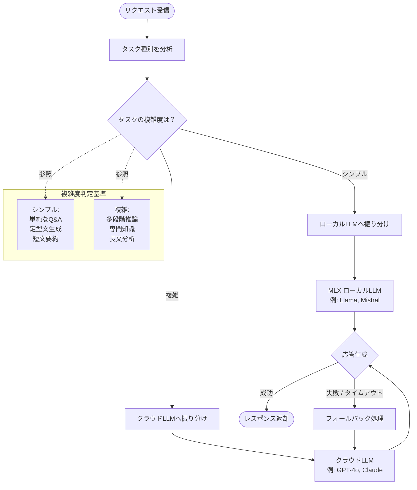
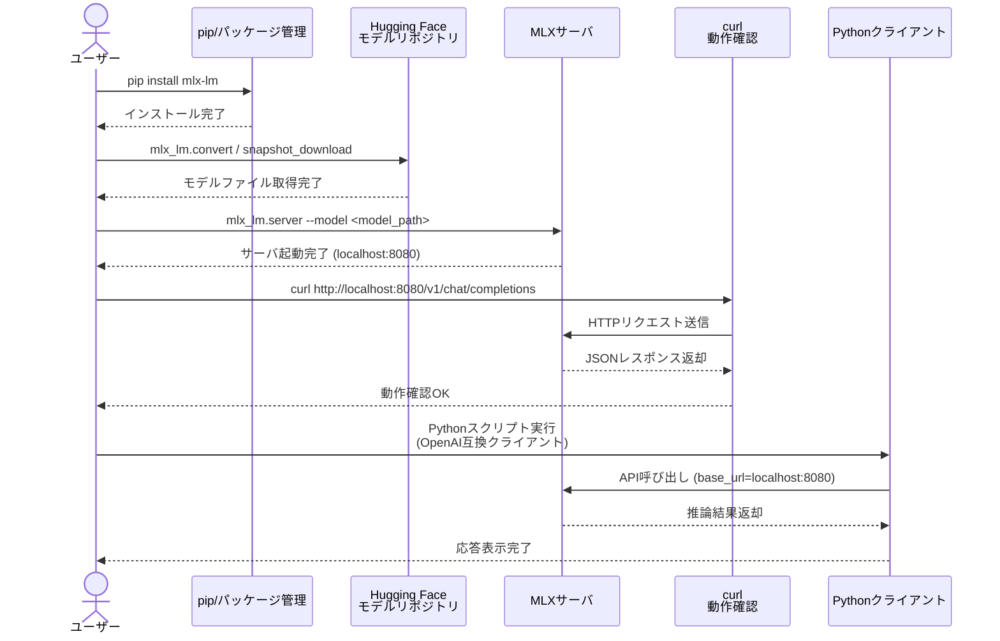
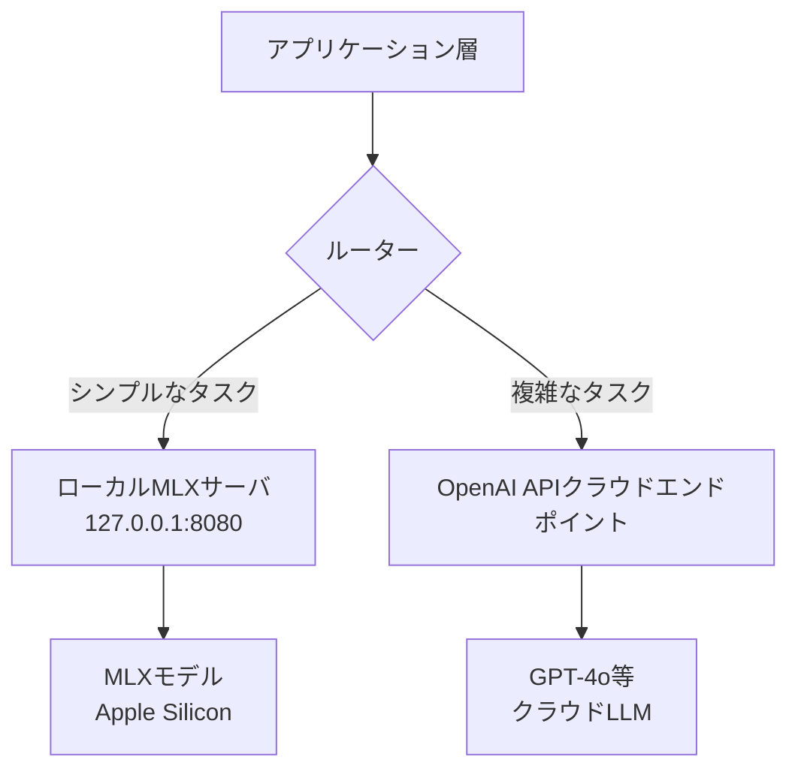
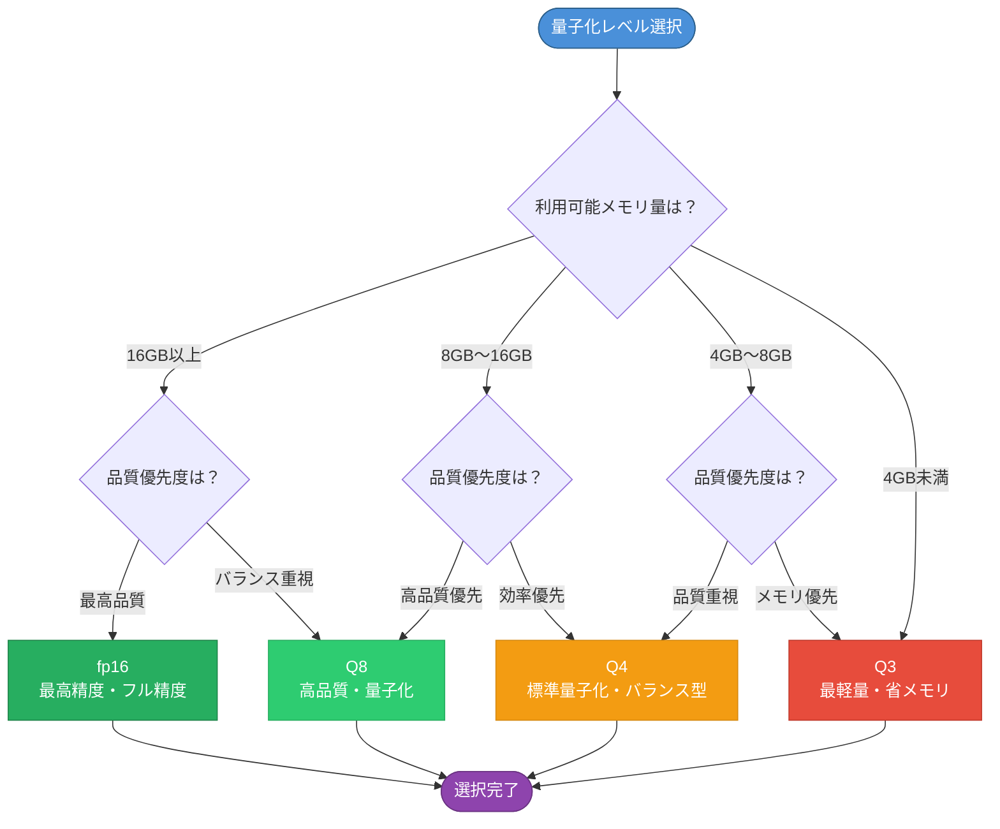

> **価格情報に関する注意**
> 本記事のAPI価格情報は2024年12月時点のものです。LLM APIの価格は頻繁に改定されます。最新価格は[OpenAI公式サイト](https://openai.com/pricing)をご確認ください。

:::message
**この記事で学べること**
- MLX環境のセットアップ（所要時間: 約15分）
- タスク複雑度に基づくルーティング設計
- プロダクション運用のベストプラクティス

**前提知識**: Python中級、OpenAI SDK使用経験
**動作環境**: Apple Silicon Mac（M1以降）、Python 3.10+
:::

## なぜハイブリッド戦略なのか — 単一依存の限界

### クラウドLLMオンリー戦略の落とし穴

「とりあえずOpenAI APIを使えばいい」——LLMアプリ開発の初期段階では、この判断は合理的です。しかし、アプリケーションのトラフィックが増えるにつれて、クラウドLLM依存には無視できないコストが発生します。

コスト爆発の実例を見てみましょう。GPT-4oは入力1Mトークンあたり$5.00、出力1Mトークンあたり$15.00（2024年12月時点）の料金体系です。仮にチャットボットが1日1,000リクエストを受け、平均入力500トークン・出力300トークンとすると：

```text
日次コスト = (500,000 × $5 / 1,000,000) + (300,000 × $15 / 1,000,000)
           = $2.50 + $4.50 = $7.00/日
月次コスト ≒ $210/月
```

リクエスト数が10倍（1日10,000件）になれば月$2,100。さらにRAGやエージェント構成でプロンプトが長くなると、数千ドル規模に膨らむことも珍しくありません。

ネットワーク依存によるレイテンシ問題も深刻です。GPT-4oのTime to First Token（TTFT）は条件によって500ms〜2秒以上かかることがあります。リアルタイム性が求められるアプリケーションでは、このレイテンシが体験品質に直結します。

さらにデータプライバシーの観点も見逃せません。ユーザーの個人情報・社内機密データを含むプロンプトをクラウドに送信することは、GDPRや社内コンプライアンスポリシーと衝突するリスクがあります。

### ローカルLLMオンリー戦略の限界

一方、「すべてローカルで動かせばコストゼロ」という発想も現実には壁があります。

モデルサイズとMacメモリの現実を整理しましょう：

| モデルサイズ | 必要メモリ目安（fp16） | 必要メモリ目安（Q4量子化） | 推奨Mac構成 |
|---|---|---|---|
| 7B〜8B | 約14GB | 約5GB | 8GB〜16GB RAM |
| 13B | 約26GB※ | 約9GB | 16GB〜24GB RAM |
| 22B〜34B | 約44〜68GB | 約14〜23GB | 32GB〜 RAM |
| 70B | 約140GB | 約45GB | 64GB〜 RAM |

※ fp16のメモリ目安はモデルの重みのみの理論値です。推論時にはKVキャッシュ・アクティベーション等の追加メモリが必要なため、実際には記載値より多く（13Bの場合30GB以上）必要になるケースがあります。Q4量子化済みモデルであれば13Bは16GBのMacでも動作します。

M2 MacBook Pro 16GBモデルであれば8Bクラスのモデルは十分動作しますが、70Bクラスのモデルをまともに動かすには64GB以上のユニファイドメモリが必要です。

複雑タスクにおける品質ギャップも現実的な課題です。多段階推論（数学的証明、複雑なビジネスロジックの分析）、長文コード生成（1,000行を超える実装）、高度な創作タスクなどでは、8BクラスのローカルモデルとGPT-4oやClaude 3.5 Sonnetの間には依然として大きな品質差があります。

### ハイブリッドで得られる「いいとこ取り」



ハイブリッド戦略の本質は、タスクの性質に応じて最適なモデルを使い分けることです。

コスト削減の具体的な試算を示します。仮にリクエストの70%がシンプルな要約・翻訳・フォーマット変換タスクで、30%が複雑な推論・コード生成タスクだとします：

```text
クラウドオンリー（GPT-4o）: $210/月
↓
ハイブリッド戦略（理想的なケースでの試算）:
  シンプルタスク(70%) → ローカルLLM: $0（電気代のみ）
  複雑タスク(30%)    → GPT-4o: 〜$63〜$105/月
合計: ≒ $63〜$105/月（約50〜70%削減）
```

> 上記は「タスク件数の比率」に基づく試算です。実際には複雑タスクはプロンプトが長い傾向があるため、トークン消費量の比率はリクエスト件数の比率より高くなります。削減効果は40〜70%の幅で見込んでおくことを推奨します。

以下の比較マトリクスで3つの戦略の特性を整理します：

| 評価軸 | クラウドオンリー | ローカルオンリー | ハイブリッド |
|---|---|---|---|
| **コスト** | 高（変動費） | 低（固定費のみ） | 中〜低 |
| **品質（複雑タスク）** | 高 | 低 | 高 |
| **レイテンシ** | 中（ネットワーク依存） | 低（ローカル） | タスク別最適 |
| **プライバシー** | リスクあり | 完全ローカル | 機微データはローカル処理可 |
| **可用性** | APIダウンリスク | ローカルサーバ管理 | フォールバック実装時 |
| **導入コスト** | 低 | 中 | 中〜高 |

※ ハイブリッドの「可用性」欄はクラウドへのフォールバックを実装した場合の評価です。フォールバック未実装の場合はローカルオンリーと同等になります。

## MLXでローカルLLMサーバを立てる



### MLX & mlx-lm のセットアップ

MLXはAppleが開発したML研究者向けフレームワークで、Apple Silicon（M1/M2/M3/M4）のユニファイドメモリアーキテクチャとMetal GPUを最大限に活用します。NumPy互換のAPIを持ち、PyTorchやJAXに慣れたエンジニアであればすぐに使いこなせます。

```bash
# 前提: Python 3.9以上、Apple Silicon Mac
pip install mlx-lm
```

Hugging Faceの`mlx-community`オーガニゼーションに、量子化済みの多数のモデルが公開されています。モデルのダウンロードと推論テストは以下の通りです：

```bash
# Llama-3.1-8B-Instructの推論テスト
python -m mlx_lm.generate \
  --model mlx-community/Meta-Llama-3.1-8B-Instruct-4bit \
  --prompt "Pythonでフィボナッチ数列を生成する関数を書いてください" \
  --max-tokens 512
```

メモリ要件別モデル選択ガイド：

| Macのユニファイドメモリ | 推奨モデル | 量子化 | 期待トークン速度 |
|---|---|---|---|
| 8GB | Phi-3-mini-4k-instruct | 4bit | 30〜50 tok/s |
| 16GB | Llama-3.1-8B-Instruct | 4bit | 50〜80 tok/s |
| 32GB | Mistral-22B | 4bit | 30〜60 tok/s |
| 64GB以上 | Llama-3.1-70B / Mixtral-8x7B | 4bit | 20〜40 tok/s |

### OpenAI互換APIサーバとして起動する



`mlx-lm`が提供するOpenAI互換サーバ機能を使うと、既存のOpenAI SDKコードをほぼ変更なくローカルLLMに切り替えられます。

```bash
# OpenAI互換サーバを起動
# --port はバージョンによりデフォルト値が異なる場合があるため明示的に指定することを推奨
python -m mlx_lm.server \
  --model mlx-community/Meta-Llama-3.1-8B-Instruct-4bit \
  --port 8080 \
  --host 127.0.0.1
```

起動後、動作確認をします：

```bash
# curlでのテスト
curl http://127.0.0.1:8080/v1/chat/completions \
  -H "Content-Type: application/json" \
  -d '{
    "model": "mlx-community/Meta-Llama-3.1-8B-Instruct-4bit",
    "messages": [{"role": "user", "content": "こんにちは！"}],
    "max_tokens": 100
  }'
```

Pythonクライアントからは、`base_url`を差し替えるだけでアクセスできます：

```python
from openai import OpenAI

# ローカルサーバへのクライアント
local_client = OpenAI(
    base_url="http://127.0.0.1:8080/v1",
    api_key="dummy",  # ローカルサーバはキー不要だが必須パラメータ
)

response = local_client.chat.completions.create(
    model="mlx-community/Meta-Llama-3.1-8B-Instruct-4bit",
    messages=[{"role": "user", "content": "Pythonのリスト内包表記を説明してください"}],
    max_tokens=256,
)
print(response.choices[0].message.content)
```

### 量子化モデルの選択戦略



量子化レベルの選択は、品質・速度・メモリのトレードオフです。以下にM2 MacBook Pro 16GBでの実測値を示します（Llama-3.1-8B-Instructベース）：

| 量子化 | モデルサイズ | 推論速度 | 品質（MT-Bench相対）※ | 推奨シーン |
|---|---|---|---|---|
| fp16 | 15.0GB | 25 tok/s | ベースライン(100%) | 品質最優先・高メモリ環境 |
| Q8 | 8.0GB | 45 tok/s | ≈97% | バランス重視 |
| Q4 | 4.5GB | 65 tok/s | ≈92% | 速度・メモリ優先 |
| Q3 | 3.5GB | 75 tok/s | ≈85% | 非推奨（品質劣化が顕著） |

※ MT-Bench相対スコアは著者によるMLX環境での実測値です。量子化方法・モデルアーキテクチャ・測定するMT-Benchカテゴリによってスコアは大きく異なります。あくまで参考値としてご参照ください。

実用的な推奨モデル：

- 汎用チャット・RAG: `mlx-community/Meta-Llama-3.1-8B-Instruct-4bit`
- 日本語特化: `mlx-community/Llama-3-ELYZA-JP-8B-4bit`（Meta Llama 3 Community Licenseが適用されます。商用利用時はライセンスをご確認ください）
- 日本語対応（多言語モデル）: `mlx-community/Qwen2.5-7B-Instruct-4bit`（日本語性能が高く汎用性に優れます）
- 日本語対応（Google製）: `mlx-community/gemma-2-9b-it-4bit`
- 軽量・高速（8GB Mac向け）: `mlx-community/Phi-3-mini-4k-instruct-4bit`
- コード生成: `mlx-community/Codestral-22B-v0.1-4bit`（32GB以上推奨）
