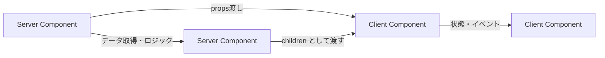
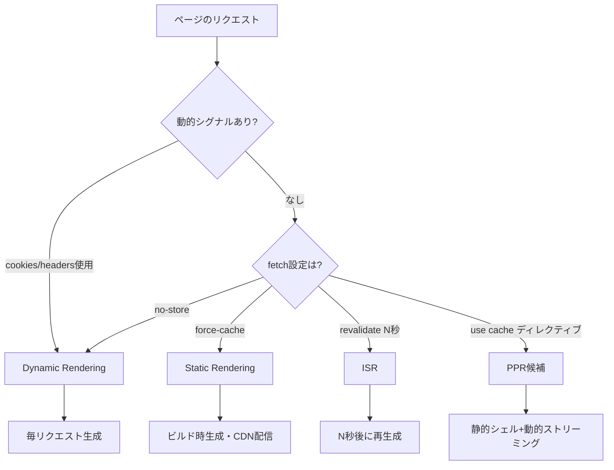

## 1. はじめに — App Router が変えた Next.js の世界

Next.js 13 で App Router が導入され、14・15 と進化を重ねた現在、フロントエンド開発の設計思想は大きく変わりました。Pages Router 時代の `getServerSideProps` / `getStaticProps` という「ページ単位のデータ取得」から、React Server Components (RSC) を核とした「コンポーネント単位のデータ取得」へとパラダイムシフトが起きています。

この変化が意味するのは単なる API 差し替えではありません。「どこでデータを取得し、どこで状態を持ち、どこで JavaScript を実行するか」という設計の根本を問い直すことになります。

本記事では Next.js 14/15 の App Router を使いこなすために必要な実践パターンを網羅します。RSC とクライアントコンポーネントの境界設計から始まり、Server Actions によるミューテーション、キャッシュ戦略の選択、Streaming と Suspense、Parallel / Intercepting Routes、そして middleware まで、実際のコードとともに解説します。

## 2. RSC とクライアントコンポーネントの境界設計

### サーバーとクライアントの分類

App Router では、すべてのコンポーネントはデフォルトで Server Component です。クライアントコンポーネントにするには、ファイルの先頭に `"use client"` ディレクティブを宣言します。

```
graph LR
    A[Server Component] -->|データ取得・ロジック| B[Server Component]
    A -->|props渡し| C[Client Component]
    C -->|状態・イベント| D[Client Component]
    B -->|children として渡す| C
```



重要なのは「`"use client"` を宣言したファイルはそのすべての import もクライアントバンドルに含まれる」という点です。境界を間違えると、サーバー専用のライブラリ（DB クライアントなど）がクライアントバンドルに混入し、ビルドエラーや情報漏洩を招きます。

### クライアントコンポーネントにすべき条件

| 条件 | 例 |
|------|-----|
| `useState` / `useReducer` を使う | フォーム、トグル、カウンター |
| `useEffect` を使う | タイマー、外部 SDK 初期化 |
| ブラウザ API を使う | `window`, `localStorage`, Geolocation |
| イベントハンドラーを持つ | onClick, onChange |
| React Context の Provider | テーマ、認証状態 |

### 境界設計の黄金律：コンポーネントツリーの末端に push する

クライアントコンポーネントはできるだけツリーの末端（葉ノード）に置きます。親をクライアントコンポーネントにすると、子もすべてクライアントバンドルに含まれてしまうからです。

```tsx
// app/products/page.tsx (Server Component)
import { db } from "@/lib/db";
import { AddToCartButton } from "@/components/AddToCartButton"; // Client Component

export default async function ProductsPage() {
  // サーバー側で DB から直接取得 — fetch 不要
  const products = await db.product.findMany({ orderBy: { createdAt: "desc" } });

  return (
    <ul>
      {products.map((product) => (
        <li key={product.id}>
          <h2>{product.name}</h2>
          <p>{product.price.toLocaleString("ja-JP")}円</p>
          {/* クライアントコンポーネントはツリーの末端に */}
          <AddToCartButton productId={product.id} />
        </li>
      ))}
    </ul>
  );
}
```

```tsx
// components/AddToCartButton.tsx (Client Component)
"use client";

import { useState } from "react";

interface Props {
  productId: string;
}

export function AddToCartButton({ productId }: Props) {
  const [added, setAdded] = useState(false);

  return (
    <button
      onClick={() => setAdded(true)}
      disabled={added}
      className="btn-primary"
    >
      {added ? "カートに追加済み" : "カートに追加"}
    </button>
  );
}
```

### Server Component を children として渡すパターン

クライアントコンポーネントの中にサーバーコンポーネントのコンテンツを配置したい場合、props として渡すことができます。

```tsx
// components/Modal.tsx (Client Component)
"use client";

import { useState } from "react";

interface Props {
  children: React.ReactNode;
  trigger: React.ReactNode;
}

export function Modal({ children, trigger }: Props) {
  const [open, setOpen] = useState(false);

  return (
    <>
      <div onClick={() => setOpen(true)}>{trigger}</div>
      {open && (
        <div className="modal-overlay" onClick={() => setOpen(false)}>
          <div className="modal-content" onClick={(e) => e.stopPropagation()}>
            {/* children はサーバーコンポーネントでよい */}
            {children}
          </div>
        </div>
      )}
    </>
  );
}
```

```tsx
// app/page.tsx (Server Component)
import { Modal } from "@/components/Modal";
import { ProductDetail } from "@/components/ProductDetail"; // Server Component

export default function Page() {
  return (
    <Modal trigger={<button>詳細を見る</button>}>
      {/* Server Component を children として渡す */}
      <ProductDetail />
    </Modal>
  );
}
```

## 3. データフェッチパターン

### fetch を使う場合

App Router の `fetch` は Web 標準 Fetch API を拡張しており、キャッシュ制御オプションが追加されています。

```tsx
// app/posts/page.tsx
export default async function PostsPage() {
  // デフォルト: Next.js 15 では force-no-store（動的レンダリング）
  const posts = await fetch("https://api.example.com/posts").then((r) =>
    r.json()
  );

  // 60秒間キャッシュ（ISR相当）
  const cachedPosts = await fetch("https://api.example.com/posts", {
    next: { revalidate: 60, tags: ["posts"] },
  }).then((r) => r.json());

  // 強制キャッシュ（Static相当）
  const staticData = await fetch("https://api.example.com/config", {
    cache: "force-cache",
  }).then((r) => r.json());

  return <div>{/* ... */}</div>;
}
```

### ORM・DB 直接呼び出しと `cache()` によるデデュープ

`fetch` を使わない DB/ORM 呼び出しは自動でキャッシュされません。`React.cache()` でラップすることで、同一リクエスト内での重複呼び出しを防げます。

```tsx
// lib/queries/user.ts
import { cache } from "react";
import { db } from "@/lib/db";

// cache() でラップすることで同一レンダリングツリー内での重複 DB クエリを防ぐ
export const getUser = cache(async (id: string) => {
  return db.user.findUnique({ where: { id } });
});

export const getUserPosts = cache(async (userId: string) => {
  return db.post.findMany({
    where: { authorId: userId },
    orderBy: { createdAt: "desc" },
  });
});
```

```tsx
// app/users/[id]/page.tsx
import { getUser, getUserPosts } from "@/lib/queries/user";

export default async function UserPage({ params }: { params: { id: string } }) {
  // 同じ id で呼ばれても DB クエリは1回だけ実行される
  const user = await getUser(params.id);
  const posts = await getUserPosts(params.id);

  if (!user) return notFound();

  return (
    <div>
      <h1>{user.name}</h1>
      <PostList posts={posts} />
    </div>
  );
}
```

### 並列データフェッチで待ち時間を最小化

複数の非同期処理を直列に書くと、それぞれの完了を待ってしまいます。`Promise.all` で並列化します。

```tsx
// app/dashboard/page.tsx
import { getUser, getOrders, getStats } from "@/lib/queries";

export default async function DashboardPage() {
  // 並列フェッチで合計待機時間を短縮
  const [user, orders, stats] = await Promise.all([
    getUser(),
    getOrders(),
    getStats(),
  ]);

  return (
    <div>
      <UserProfile user={user} />
      <OrderList orders={orders} />
      <StatsPanel stats={stats} />
    </div>
  );
}
```

## 4. Server Actions の実装

### 基本的なフォーム処理

Server Actions は `"use server"` ディレクティブで定義された非同期関数です。フォームの `action` 属性に渡すことで、JavaScript が読み込まれる前でも動作するプログレッシブエンハンスメントが実現します。

```tsx
// app/contact/page.tsx
import { redirect } from "next/navigation";
import { revalidatePath } from "next/cache";
import { z } from "zod";

const contactSchema = z.object({
  name: z.string().min(1, "名前は必須です"),
  email: z.string().email("正しいメールアドレスを入力してください"),
  message: z.string().min(10, "メッセージは10文字以上入力してください"),
});

async function submitContact(formData: FormData) {
  "use server";

  const raw = {
    name: formData.get("name"),
    email: formData.get("email"),
    message: formData.get("message"),
  };

  const result = contactSchema.safeParse(raw);
  if (!result.success) {
    // エラーを返す（useActionState と組み合わせる場合）
    return { errors: result.error.flatten().fieldErrors };
  }

  await db.contact.create({ data: result.data });

  revalidatePath("/admin/contacts");
  redirect("/contact/thanks");
}

export default function ContactPage() {
  return (
    <form action={submitContact}>
      <input name="name" type="text" required />
      <input name="email" type="email" required />
      <textarea name="message" required />
      <button type="submit">送信する</button>
    </form>
  );
}
```

### useActionState によるバリデーションフィードバック

React 19 から導入された `useActionState`（旧 `useFormState`）を使うと、Server Action の戻り値をコンポーネントの状態として扱えます。

```tsx
// components/ContactForm.tsx
"use client";

import { useActionState } from "react";
import { useFormStatus } from "react-dom";
import { submitContact } from "@/app/actions/contact";

function SubmitButton() {
  const { pending } = useFormStatus();
  return (
    <button type="submit" disabled={pending}>
      {pending ? "送信中..." : "送信する"}
    </button>
  );
}

export function ContactForm() {
  const [state, action] = useActionState(submitContact, null);

  return (
    <form action={action}>
      <div>
        <input name="name" type="text" />
        {state?.errors?.name && (
          <p className="text-red-500">{state.errors.name[0]}</p>
        )}
      </div>
      <div>
        <input name="email" type="email" />
        {state?.errors?.email && (
          <p className="text-red-500">{state.errors.email[0]}</p>
        )}
      </div>
      <div>
        <textarea name="message" />
        {state?.errors?.message && (
          <p className="text-red-500">{state.errors.message[0]}</p>
        )}
      </div>
      <SubmitButton />
    </form>
  );
}
```

### useOptimistic による楽観的更新

ネットワーク往復を待たずに UI を即時更新する「楽観的更新」は、React 19 の `useOptimistic` で実装できます。

```tsx
// components/TodoList.tsx
"use client";

import { useOptimistic, useTransition } from "react";
import { toggleTodo } from "@/app/actions/todo";

interface Todo {
  id: string;
  text: string;
  completed: boolean;
}

interface Props {
  initialTodos: Todo[];
}

export function TodoList({ initialTodos }: Props) {
  const [isPending, startTransition] = useTransition();
  const [optimisticTodos, addOptimisticTodo] = useOptimistic(
    initialTodos,
    (state: Todo[], updatedId: string) =>
      state.map((todo) =>
        todo.id === updatedId ? { ...todo, completed: !todo.completed } : todo
      )
  );

  const handleToggle = (id: string) => {
    startTransition(async () => {
      // まず UI を即時更新（楽観的更新）
      addOptimisticTodo(id);
      // その後サーバーに反映
      await toggleTodo(id);
    });
  };

  return (
    <ul>
      {optimisticTodos.map((todo) => (
        <li
          key={todo.id}
          onClick={() => handleToggle(todo.id)}
          style={{ textDecoration: todo.completed ? "line-through" : "none" }}
        >
          {todo.text}
        </li>
      ))}
    </ul>
  );
}
```

## 5. キャッシュ戦略 — Static / Dynamic / ISR / PPR

### Next.js 15 のキャッシュの考え方

Next.js 15 ではキャッシュのデフォルト挙動が変更されました。14 以前では `fetch` はデフォルトでキャッシュされましたが、15 では `no-store`（動的）がデフォルトになっています。意図的にキャッシュするコードを書く方向に変わりました。



### ルートセグメント設定でレンダリングを制御

```tsx
// app/admin/page.tsx — 常に動的レンダリング
export const dynamic = "force-dynamic";
export const revalidate = 0;

export default async function AdminPage() {
  // 毎リクエスト最新データを取得
  const data = await getLatestData();
  return <AdminDashboard data={data} />;
}
```

```tsx
// app/blog/[slug]/page.tsx — ISR（60秒ごとに再生成）
export const revalidate = 60;

export async function generateStaticParams() {
  const posts = await getAllPostSlugs();
  return posts.map((slug) => ({ slug }));
}

export default async function BlogPost({ params }: { params: { slug: string } }) {
  const post = await getPost(params.slug);
  return <Article post={post} />;
}
```

### `use cache` ディレクティブ（Next.js 15 新機能）

Next.js 15 では `unstable_cache` に代わる `use cache` ディレクティブが導入されています（実験的機能）。関数やコンポーネント単位でキャッシュを定義できます。

```tsx
// lib/queries/posts.ts
import { cacheTag, cacheLife } from "next/cache";

export async function getCachedPosts() {
  "use cache";
  cacheTag("posts");
  cacheLife("hours"); // 1時間キャッシュ

  return db.post.findMany({ orderBy: { publishedAt: "desc" } });
}
```

```tsx
// Server Action でのキャッシュ無効化
"use server";

import { revalidateTag } from "next/cache";

export async function publishPost(id: string) {
  await db.post.update({ where: { id }, data: { published: true } });
  // "posts" タグのキャッシュをすべて無効化
  revalidateTag("posts");
}
```

### PPR（Partial Pre-rendering）

PPR は静的なシェルを先に配信し、動的な部分を後からストリーミングするアーキテクチャです。`next.config.ts` で有効化します。

```tsx
// next.config.ts
import type { NextConfig } from "next";

const nextConfig: NextConfig = {
  experimental: {
    ppr: true,
  },
};

export default nextConfig;
```

```tsx
// app/product/[id]/page.tsx
import { Suspense } from "react";
import { ProductInfo } from "@/components/ProductInfo"; // 静的
import { RecommendedProducts } from "@/components/RecommendedProducts"; // 動的

export default function ProductPage({ params }: { params: { id: string } }) {
  return (
    <div>
      {/* 静的部分はビルド時に生成されてすぐ配信される */}
      <ProductInfo productId={params.id} />
      {/* 動的部分は Suspense でラップしてストリーミング */}
      <Suspense fallback={<div>おすすめ商品を読み込み中...</div>}>
        <RecommendedProducts productId={params.id} />
      </Suspense>
    </div>
  );
}
```

## 6. Streaming と Suspense で体験を向上させる

### loading.tsx によるルートレベルの Streaming

`loading.tsx` ファイルを作成するだけで、そのルートセグメントのコンテンツが読み込まれる間、スケルトン UI などのフォールバックを表示できます。

```tsx
// app/dashboard/loading.tsx
export default function DashboardLoading() {
  return (
    <div className="animate-pulse">
      <div className="h-8 bg-gray-200 rounded w-1/3 mb-4" />
      <div className="grid grid-cols-3 gap-4">
        {[...Array(3)].map((_, i) => (
          <div key={i} className="h-32 bg-gray-200 rounded" />
        ))}
      </div>
    </div>
  );
}
```

### コンポーネントレベルの Suspense で細粒度の制御

ページ全体ではなく、特定のコンポーネントだけを遅延表示したい場合は `<Suspense>` を直接使います。

```tsx
// app/dashboard/page.tsx
import { Suspense } from "react";
import { UserStats } from "@/components/UserStats";
import { RecentActivity } from "@/components/RecentActivity";
import { Notifications } from "@/components/Notifications";

export default function DashboardPage() {
  return (
    <div className="grid grid-cols-2 gap-6">
      {/* 各カードが独立して読み込まれる */}
      <Suspense fallback={<StatsSkeleton />}>
        <UserStats />
      </Suspense>

      <Suspense fallback={<ActivitySkeleton />}>
        <RecentActivity />
      </Suspense>

      <Suspense fallback={<NotificationSkeleton />}>
        <Notifications />
      </Suspense>
    </div>
  );
}
```

### React の `use()` API でプロミスをストリーミング

React 19 の `use()` API を使うと、サーバーコンポーネントで開始したフェッチをクライアントコンポーネントで受け取り、ストリーミングできます。

```tsx
// app/page.tsx (Server Component)
import { Suspense } from "react";
import { PostList } from "@/components/PostList";
import { getPosts } from "@/lib/queries";

export default function Page() {
  // Promise を作成するが await しない
  const postsPromise = getPosts();

  return (
    <Suspense fallback={<div>投稿を読み込み中...</div>}>
      {/* Promise を props として渡す */}
      <PostList postsPromise={postsPromise} />
    </Suspense>
  );
}
```

```tsx
// components/PostList.tsx (Client Component)
"use client";

import { use } from "react";
import type { Post } from "@/types";

interface Props {
  postsPromise: Promise<Post[]>;
}

export function PostList({ postsPromise }: Props) {
  // use() で Promise を解決 — Suspense が fallback を表示している間にフェッチが進む
  const posts = use(postsPromise);

  return (
    <ul>
      {posts.map((post) => (
        <li key={post.id}>{post.title}</li>
      ))}
    </ul>
  );
}
```

## 7. Parallel Routes でモーダル・タブを実装

### Parallel Routes の基本

Parallel Routes（並列ルート）は、同一レイアウト内に複数のページコンテンツを同時にレンダリングする仕組みです。`@slot` 記法で定義します。

```
app/
  layout.tsx          ← @dashboard と @analytics を受け取る
  page.tsx
  @dashboard/
    page.tsx
    loading.tsx
    error.tsx
  @analytics/
    page.tsx
    loading.tsx
```

```tsx
// app/layout.tsx
interface Props {
  children: React.ReactNode;
  dashboard: React.ReactNode;
  analytics: React.ReactNode;
}

export default function Layout({ children, dashboard, analytics }: Props) {
  return (
    <div>
      <div className="grid grid-cols-2 gap-4">
        {/* 各スロットが独立して読み込み・エラー処理を持てる */}
        <section>{dashboard}</section>
        <section>{analytics}</section>
      </div>
      {children}
    </div>
  );
}
```

### モーダルパターン（Intercepting Routes との組み合わせ）

Parallel Routes の最も強力なユースケースはモーダルです。Intercepting Routes と組み合わせることで、URL を持つ本格的なモーダルを実装できます。詳細は次のセクションで説明します。

```
app/
  layout.tsx
  @modal/
    (.)photo/[id]/
      page.tsx       ← モーダルとしてのフォト詳細
    default.tsx      ← モーダルなし状態（null を返す）
  feed/
    page.tsx
  photo/
    [id]/
      page.tsx       ← 直接アクセス時のフォト詳細
```

```tsx
// app/@modal/default.tsx
export default function Default() {
  // デフォルト状態ではモーダルを表示しない
  return null;
}
```

## 8. Intercepting Routes の活用

### Intercepting Routes とは

Intercepting Routes は、あるルートへのナビゲーションを「インターセプト」して、別のコンテキスト（例：現在のページの上にオーバーレイ）で表示する仕組みです。`(.)`, `(..)`, `(..)(..)`, `(...)` の記法で相対的な深さを指定します。

| 記法 | 意味 |
|------|------|
| `(.)segment` | 同じ階層のセグメントをインターセプト |
| `(..)segment` | 1 階層上のセグメントをインターセプト |
| `(..)(..)segment` | 2 階層上のセグメントをインターセプト |
| `(...)segment` | ルート（`app`）からのセグメントをインターセプト |

### 写真ギャラリーのモーダル実装

ギャラリーの写真をクリックするとモーダルで詳細表示し、URL は `/photo/1` に変わる。直接 `/photo/1` にアクセスすると専用ページが表示される、という UX を実装します。

```tsx
// app/@modal/(.)photo/[id]/page.tsx — モーダルとして表示
"use client";

import { useRouter } from "next/navigation";
import { getPhoto } from "@/lib/queries";

export default async function PhotoModal({
  params,
}: {
  params: { id: string };
}) {
  const photo = await getPhoto(params.id);
  const router = useRouter();

  return (
    <div
      className="fixed inset-0 bg-black/50 flex items-center justify-center z-50"
      onClick={() => router.back()}
    >
      <div
        className="bg-white rounded-lg p-6 max-w-2xl w-full"
        onClick={(e) => e.stopPropagation()}
      >
        
        <h2 className="text-xl font-bold mt-4">{photo.title}</h2>
        <p className="text-gray-600">{photo.description}</p>
      </div>
    </div>
  );
}
```

```tsx
// app/photo/[id]/page.tsx — 直接アクセス時の専用ページ
import { getPhoto } from "@/lib/queries";

export default async function PhotoPage({
  params,
}: {
  params: { id: string };
}) {
  const photo = await getPhoto(params.id);

  return (
    <article className="max-w-2xl mx-auto py-8">
      
      <h1 className="text-3xl font-bold mt-6">{photo.title}</h1>
      <p className="text-gray-700 mt-4">{photo.description}</p>
    </article>
  );
}
```

```tsx
// app/feed/page.tsx — ギャラリー一覧
import Link from "next/link";
import { getPhotos } from "@/lib/queries";

export default async function FeedPage() {
  const photos = await getPhotos();

  return (
    <div className="grid grid-cols-3 gap-4">
      {photos.map((photo) => (
        // クライアントナビゲーションでは Intercepting Route が発動
        <Link key={photo.id} href={`/photo/${photo.id}`}>
          
        </Link>
      ))}
    </div>
  );
}
```

## 9. エラーバウンダリと not-found の設計

### error.tsx によるエラーバウンダリ

`error.tsx` ファイルは React Error Boundary を自動的に生成します。このファイルはクライアントコンポーネントである必要があります。

```tsx
// app/dashboard/error.tsx
"use client";

import { useEffect } from "react";

interface Props {
  error: Error & { digest?: string };
  reset: () => void;
}

export default function DashboardError({ error, reset }: Props) {
  useEffect(() => {
    // エラーをロギングサービスに送信
    console.error("Dashboard error:", error);
  }, [error]);

  return (
    <div className="flex flex-col items-center py-10">
      <h2 className="text-xl font-bold text-red-600">
        ダッシュボードの読み込みに失敗しました
      </h2>
      <p className="text-gray-500 mt-2">{error.message}</p>
      <button
        onClick={reset}
        className="mt-4 px-4 py-2 bg-blue-600 text-white rounded"
      >
        再試行する
      </button>
    </div>
  );
}
```

### not-found.tsx と notFound() 関数

```tsx
// app/blog/[slug]/page.tsx
import { notFound } from "next/navigation";
import { getPost } from "@/lib/queries";

export default async function BlogPost({
  params,
}: {
  params: { slug: string };
}) {
  const post = await getPost(params.slug);

  if (!post) {
    // not-found.tsx を表示して 404 を返す
    notFound();
  }

  return <article>{post.content}</article>;
}
```

```tsx
// app/blog/[slug]/not-found.tsx
import Link from "next/link";

export default function PostNotFound() {
  return (
    <div className="text-center py-20">
      <h1 className="text-4xl font-bold text-gray-800">記事が見つかりません</h1>
      <p className="text-gray-500 mt-4">
        お探しの記事は存在しないか、削除された可能性があります。
      </p>
      <Link href="/blog" className="mt-6 inline-block text-blue-600 underline">
        ブログ一覧に戻る
      </Link>
    </div>
  );
}
```

### グローバルエラーハンドリング

`app/global-error.tsx` はルートレイアウト自体がエラーになった場合のフォールバックです。これは `<html>` タグを含める必要があります。

```tsx
// app/global-error.tsx
"use client";

export default function GlobalError({
  error,
  reset,
}: {
  error: Error & { digest?: string };
  reset: () => void;
}) {
  return (
    <html lang="ja">
      <body>
        <div className="min-h-screen flex items-center justify-center">
          <div className="text-center">
            <h1 className="text-2xl font-bold">予期しないエラーが発生しました</h1>
            <button onClick={reset} className="mt-4 btn-primary">
              ページを再読み込みする
            </button>
          </div>
        </div>
      </body>
    </html>
  );
}
```

## 10. middleware.ts と Edge Functions の組み合わせ

### middleware.ts の基本

`middleware.ts` はリクエストが処理される前に実行されます。認証チェック、リダイレクト、A/B テスト、ヘッダー付加など、ルート横断的な処理を行います。

```tsx
// middleware.ts
import { NextResponse } from "next/server";
import type { NextRequest } from "next/server";

export function middleware(request: NextRequest) {
  const { pathname } = request.nextUrl;

  // 認証が必要なパスのチェック
  if (pathname.startsWith("/admin")) {
    const token = request.cookies.get("session-token")?.value;

    if (!token) {
      // ログインページにリダイレクト（元の URL を next パラメーターで保持）
      const loginUrl = new URL("/login", request.url);
      loginUrl.searchParams.set("next", pathname);
      return NextResponse.redirect(loginUrl);
    }
  }

  // レスポンスヘッダーの付加
  const response = NextResponse.next();
  response.headers.set("X-Custom-Header", "my-value");

  return response;
}

// middleware を適用するパスを指定
export const config = {
  matcher: [
    // 静的ファイルと Next.js 内部パスを除外
    "/((?!_next/static|_next/image|favicon.ico).*)",
  ],
};
```

### セキュリティ上の注意：多層防御の原則

2025 年 3 月に CVE-2025-29927 として開示された脆弱性により、`x-middleware-subrequest` ヘッダーを操作することで middleware のチェックを完全にバイパスできる問題が発覚しました。

middleware の認証だけに頼るのは危険です。データアクセス層でも認証チェックを行う多層防御を実装します。

```tsx
// lib/auth/session.ts
import { cookies } from "next/headers";
import { verifyJWT } from "@/lib/jwt";

export async function getSession() {
  const cookieStore = await cookies();
  const token = cookieStore.get("session-token")?.value;

  if (!token) return null;

  try {
    return await verifyJWT(token);
  } catch {
    return null;
  }
}

// Server Component / Server Action での認証チェック
export async function requireSession() {
  const session = await getSession();
  if (!session) {
    // middleware とは独立してリダイレクト
    redirect("/login");
  }
  return session;
}
```

```tsx
// app/admin/page.tsx
import { requireSession } from "@/lib/auth/session";

export default async function AdminPage() {
  // middleware に依存せず、Server Component でも認証チェック
  const session = await requireSession();

  const data = await getAdminData(session.userId);

  return <AdminDashboard data={data} />;
}
```

### 国際化（i18n）ルーティング

middleware は i18n のルーティング制御にも使われます。

```tsx
// middleware.ts（i18n 対応版）
import { NextResponse } from "next/server";
import type { NextRequest } from "next/server";
import { match } from "@formatjs/intl-localematcher";
import Negotiator from "negotiator";

const locales = ["ja", "en", "zh"];
const defaultLocale = "ja";

function getLocale(request: NextRequest): string {
  const headers: Record<string, string> = {};
  request.headers.forEach((value, key) => {
    headers[key] = value;
  });

  const languages = new Negotiator({ headers }).languages();

  try {
    return match(languages, locales, defaultLocale);
  } catch {
    return defaultLocale;
  }
}

export function middleware(request: NextRequest) {
  const { pathname } = request.nextUrl;

  // パスにロケールが含まれているかチェック
  const hasLocale = locales.some(
    (locale) => pathname.startsWith(`/${locale}/`) || pathname === `/${locale}`
  );

  if (!hasLocale) {
    const locale = getLocale(request);
    return NextResponse.redirect(new URL(`/${locale}${pathname}`, request.url));
  }
}

export const config = {
  matcher: ["/((?!_next|api|favicon.ico).*)"],
};
```

## 11. まとめ

Next.js App Router の実践パターンをひと通り見てきました。要点を整理します。

| テーマ | ポイント |
|--------|---------|
| RSC の境界 | クライアントコンポーネントはツリーの末端に置き、Server Component を children として渡す |
| データフェッチ | DB 直接呼び出しは `React.cache()` でデデュープ、`Promise.all` で並列化 |
| Server Actions | `useActionState` でバリデーション状態を管理、`useOptimistic` で楽観的更新 |
| キャッシュ戦略 | Next.js 15 はデフォルトが動的、`use cache` + `cacheTag` で細粒度に制御 |
| Streaming | `loading.tsx` でルートレベル、`<Suspense>` でコンポーネントレベル |
| Parallel Routes | スロット記法でモーダルやタブを URL ベースで実装 |
| Intercepting Routes | `(.)` 記法でナビゲーションをインターセプト、Parallel Routes と組み合わせてモーダルを実現 |
| エラー設計 | `error.tsx` でセグメント単位の Error Boundary、`notFound()` で 404 制御 |
| middleware | Edge Runtime で動作、多層防御で認証チェックは Server Component 側でも行う |

App Router は「何をサーバーで、何をクライアントで行うか」を常に意識する必要があります。最初は考えることが多く感じますが、この設計が固まると、パフォーマンスと開発体験の両立が実感できます。

ぜひ実際のプロジェクトで手を動かしながら、各パターンを試してみてください。

---

参考資料:

- [Next.js 公式ドキュメント — App Router](https://nextjs.org/docs/app)
- [Next.js 15 リリースノート](https://nextjs.org/blog/next-15)
- [Getting Started: Server and Client Components](https://nextjs.org/docs/app/getting-started/server-and-client-components)
- [Getting Started: Caching and Revalidating](https://nextjs.org/docs/app/getting-started/caching-and-revalidating)
- [Directives: use cache](https://nextjs.org/docs/app/api-reference/directives/use-cache)
- [File-system conventions: Parallel Routes](https://nextjs.org/docs/app/api-reference/file-conventions/parallel-routes)
- [File-system conventions: Intercepting Routes](https://nextjs.org/docs/app/api-reference/file-conventions/intercepting-routes)
