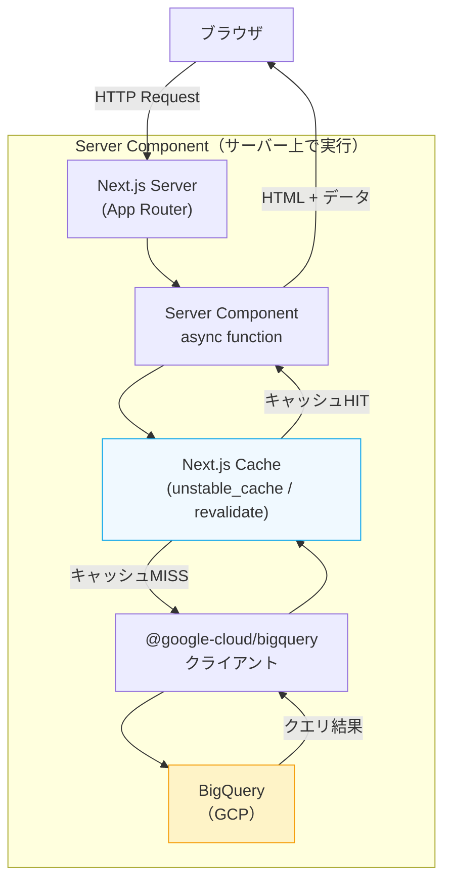
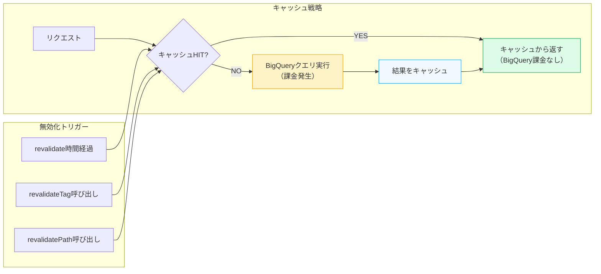

## はじめに

Next.js App Router の登場で、データ取得の設計が大きく変わりました。従来は「フロントエンド → REST API → DB」という三層構成が一般的でしたが、React Server Components（RSC）を使えばサーバーコンポーネント内で直接データソースにアクセスできます。

BigQuery もその恩恵を受けられるデータソースの一つです。本記事では、 **Next.js 15 の App Router から `@google-cloud/bigquery` を使って直接クエリを実行するパターン** を解説します。

### 従来の REST API 経由パターンとの比較

```
【従来】
Browser → Next.js → REST API (Cloud Run) → BigQuery

【RSCパターン】
Browser → Next.js Server Component → BigQuery
```

RSC パターンの主なメリットは以下のとおりです。

- **APIレイヤーが不要**: Cloud Run や Lambda で別途 API サーバーを立てる必要がない
- **ネットワークホップの削減**: ブラウザ → API → DB の二段階ではなく、サーバー上で直接クエリを実行
- **型安全**: TypeScript の型定義をフロントとバックエンドで共有する必要がない
- **コスト削減**: API サーバーの維持コストがなくなる（BigQuery のクエリコストは別途かかる）

ただし、BigQuery はスキャン量に応じて課金されるため、 **キャッシュ戦略が非常に重要** になります。本記事ではその点も詳しく解説します。

---

## データフロー図



---

## セットアップ

### パッケージインストール

```bash
npm install @google-cloud/bigquery
# または
pnpm add @google-cloud/bigquery
```

TypeScript の型定義はパッケージに同梱されているため、`@types/` パッケージは不要です。

### ディレクトリ構成

```
app/
├── dashboard/
│   ├── page.tsx          ← Server Component（直接BigQueryを呼ぶ）
│   ├── loading.tsx       ← Suspense fallback
│   └── error.tsx         ← エラーUI
lib/
├── bigquery.ts           ← BigQueryクライアント初期化（シングルトン）
├── queries/
│   ├── sales.ts          ← 売上クエリ
│   └── users.ts          ← ユーザークエリ
types/
└── bigquery.ts           ← BigQuery レスポンス型定義
```

### BigQuery クライアントの初期化（シングルトン）

`lib/bigquery.ts` にクライアントを初期化します。Next.js の開発環境では HMR（Hot Module Replacement）でモジュールが再読み込みされるため、シングルトンパターンでインスタンスを保持することが重要です。

```typescript
// lib/bigquery.ts
import { BigQuery } from "@google-cloud/bigquery";

const globalForBigQuery = globalThis as unknown as {
  bigquery: BigQuery | undefined;
};

function createBigQueryClient(): BigQuery {
  // 環境変数でプロジェクトIDを指定
  const projectId = process.env.GCP_PROJECT_ID;

  if (!projectId) {
    throw new Error("GCP_PROJECT_ID environment variable is not set");
  }

  // ローカル開発: GOOGLE_APPLICATION_CREDENTIALS 環境変数でサービスアカウントキーを指定
  // 本番(Cloud Run等): Workload Identity / メタデータサーバー経由で自動認証
  return new BigQuery({ projectId });
}

export const bigquery =
  globalForBigQuery.bigquery ?? createBigQueryClient();

if (process.env.NODE_ENV !== "production") {
  globalForBigQuery.bigquery = bigquery;
}
```

---

## 認証設定

BigQuery の認証には、環境に応じて以下の方法を使い分けます。

### ローカル開発: Application Default Credentials (ADC)

最もシンプルな方法は `gcloud` CLI で認証することです。

```bash
# ADC を設定（ブラウザでGoogleアカウントにログイン）
gcloud auth application-default login

# プロジェクトを設定
gcloud config set project YOUR_PROJECT_ID
```

`.env.local` にプロジェクトIDを設定します。

```bash
# .env.local
GCP_PROJECT_ID=your-gcp-project-id
BIGQUERY_DATASET=your_dataset
```

### ローカル開発: サービスアカウントキーを使う場合

CI/CD 環境やチーム開発では、サービスアカウントキーをダウンロードして環境変数で指定します。

```bash
# .env.local（Gitに含めないこと）
GCP_PROJECT_ID=your-gcp-project-id
BIGQUERY_DATASET=your_dataset
GOOGLE_APPLICATION_CREDENTIALS=/path/to/service-account-key.json
```

`@google-cloud/bigquery` は `GOOGLE_APPLICATION_CREDENTIALS` 環境変数を自動で読み込みます。

### 本番環境: Workload Identity Federation（推奨）

Cloud Run などの GCP 環境では、 **Workload Identity Federation** を使うことでサービスアカウントキーのファイルを持つ必要がありません。GCP のメタデータサーバーから自動的に認証情報を取得します。

```bash
# Cloud Run のサービスアカウントに BigQuery 権限を付与
gcloud projects add-iam-policy-binding YOUR_PROJECT_ID \
  --member="serviceAccount:YOUR_SERVICE_ACCOUNT@YOUR_PROJECT_ID.iam.gserviceaccount.com" \
  --role="roles/bigquery.dataViewer"

gcloud projects add-iam-policy-binding YOUR_PROJECT_ID \
  --member="serviceAccount:YOUR_SERVICE_ACCOUNT@YOUR_PROJECT_ID.iam.gserviceaccount.com" \
  --role="roles/bigquery.jobUser"
```

Cloud Run 上では認証設定が一切不要で、`new BigQuery({ projectId })` だけで動作します。

### Vercel にデプロイする場合

Vercel 上では GCP メタデータサーバーが使えないため、サービスアカウントキーを環境変数で渡す必要があります。

```typescript
// lib/bigquery.ts（Vercel対応版）
function createBigQueryClient(): BigQuery {
  const projectId = process.env.GCP_PROJECT_ID;
  if (!projectId) throw new Error("GCP_PROJECT_ID is not set");

  // Vercel環境ではキーをJSONで環境変数に設定
  const credentialsJson = process.env.GCP_SERVICE_ACCOUNT_KEY;

  if (credentialsJson) {
    const credentials = JSON.parse(credentialsJson);
    return new BigQuery({ projectId, credentials });
  }

  // ADC（ローカルまたはCloud Run）
  return new BigQuery({ projectId });
}
```

Vercel の環境変数 `GCP_SERVICE_ACCOUNT_KEY` に、サービスアカウントキーの JSON を1行にして設定します。

---

## 基本パターン: Server Component でのクエリ実行

### 型定義

まず BigQuery のレスポンスに対応する TypeScript 型を定義します。

```typescript
// types/bigquery.ts
import type { BigQueryDate, BigQueryTimestamp } from "@google-cloud/bigquery";

// BigQuery の DATE 型は BigQueryDate オブジェクトになる
// BigQuery の TIMESTAMP 型は BigQueryTimestamp オブジェクトになる

export interface SalesRow {
  date: BigQueryDate;
  product_name: string;
  amount: number;
  quantity: number;
  customer_id: string;
}

// コンポーネントで使いやすいように変換後の型も定義する
export interface Sale {
  date: string; // "YYYY-MM-DD" 形式に変換
  productName: string;
  amount: number;
  quantity: number;
  customerId: string;
}
```

### クエリ関数の定義

```typescript
// lib/queries/sales.ts
import { bigquery } from "@/lib/bigquery";
import type { SalesRow, Sale } from "@/types/bigquery";

const DATASET = process.env.BIGQUERY_DATASET ?? "your_dataset";

// BigQueryDate を文字列に変換するユーティリティ
function formatBigQueryDate(date: { value: string } | string): string {
  if (typeof date === "string") return date;
  return date.value;
}

export async function getSales(limit = 100): Promise<Sale[]> {
  // パラメータ化クエリを使う（SQLインジェクション防止）
  const query = `
    SELECT
      date,
      product_name,
      amount,
      quantity,
      customer_id
    FROM \`${DATASET}.sales\`
    WHERE date >= DATE_SUB(CURRENT_DATE(), INTERVAL 30 DAY)
    ORDER BY date DESC
    LIMIT @limit
  `;

  const options = {
    query,
    params: { limit },
    // ジョブのタイムアウトを設定（デフォルトは無制限）
    jobTimeoutMs: 30_000,
  };

  const [rows] = await bigquery.query(options) as [SalesRow[], unknown, unknown];

  return rows.map((row) => ({
    date: formatBigQueryDate(row.date),
    productName: row.product_name,
    amount: row.amount,
    quantity: row.quantity,
    customerId: row.customer_id,
  }));
}

export async function getSalesTotals(): Promise<{
  totalAmount: number;
  totalQuantity: number;
}> {
  const query = `
    SELECT
      SUM(amount) AS total_amount,
      SUM(quantity) AS total_quantity
    FROM \`${DATASET}.sales\`
    WHERE date >= DATE_SUB(CURRENT_DATE(), INTERVAL 30 DAY)
  `;

  const [rows] = await bigquery.query({ query });
  const row = rows[0] as { total_amount: number; total_quantity: number };

  return {
    totalAmount: row.total_amount ?? 0,
    totalQuantity: row.total_quantity ?? 0,
  };
}
```

### Server Component での使用

```typescript
// app/dashboard/page.tsx
import { getSales, getSalesTotals } from "@/lib/queries/sales";

export default async function DashboardPage() {
  // 並列でクエリを実行する（直列ではなく Promise.all を使う）
  const [sales, totals] = await Promise.all([
    getSales(50),
    getSalesTotals(),
  ]);

  return (
    <main>
      <h1>ダッシュボード</h1>

      <div className="stats">
        <div>
          <span>合計売上</span>
          <strong>¥{totals.totalAmount.toLocaleString()}</strong>
        </div>
        <div>
          <span>販売数量</span>
          <strong>{totals.totalQuantity.toLocaleString()}</strong>
        </div>
      </div>

      <table>
        <thead>
          <tr>
            <th>日付</th>
            <th>商品名</th>
            <th>金額</th>
            <th>数量</th>
          </tr>
        </thead>
        <tbody>
          {sales.map((sale, i) => (
            <tr key={i}>
              <td>{sale.date}</td>
              <td>{sale.productName}</td>
              <td>¥{sale.amount.toLocaleString()}</td>
              <td>{sale.quantity}</td>
            </tr>
          ))}
        </tbody>
      </table>
    </main>
  );
}
```

---

## キャッシュ戦略

BigQuery はスキャン量に応じて課金されます（1TB あたり $5 程度）。毎リクエストでクエリを実行すると、コストが急増する可能性があります。Next.js のキャッシュ機能を適切に使い、スキャン量を最小化しましょう。

### キャッシュ戦略の全体像



### 方法1: `unstable_cache` によるクエリ単位のキャッシュ

`unstable_cache` を使うと、関数レベルでキャッシュを設定できます。複数のページで同じクエリ関数を呼ぶ場合に特に有効です。

```typescript
// lib/queries/sales.ts
import { unstable_cache } from "next/cache";
import { bigquery } from "@/lib/bigquery";
import type { Sale } from "@/types/bigquery";

async function _getSales(limit: number): Promise<Sale[]> {
  const query = `
    SELECT date, product_name, amount, quantity, customer_id
    FROM \`${process.env.BIGQUERY_DATASET}.sales\`
    WHERE date >= DATE_SUB(CURRENT_DATE(), INTERVAL 30 DAY)
    ORDER BY date DESC
    LIMIT @limit
  `;

  const [rows] = await bigquery.query({ query, params: { limit } });
  return rows.map((row: Record<string, unknown>) => ({
    date: (row.date as { value: string }).value,
    productName: row.product_name as string,
    amount: row.amount as number,
    quantity: row.quantity as number,
    customerId: row.customer_id as string,
  }));
}

// キャッシュ付きエクスポート
// - "sales-list" タグで無効化できる
// - 3600秒（1時間）でリバリデート
export const getSales = unstable_cache(
  _getSales,
  ["sales-list"],
  {
    tags: ["sales"],
    revalidate: 3600, // 1時間
  }
);
```

### 方法2: Segment Config での静的データキャッシュ

ページ全体のキャッシュ時間を設定する場合は、Segment Config `revalidate` を使います。

```typescript
// app/dashboard/page.tsx
import { getSales } from "@/lib/queries/sales";

// このページは1時間ごとにリバリデートする（ISR相当）
export const revalidate = 3600;

export default async function DashboardPage() {
  const sales = await getSales(50);
  return <SalesTable data={sales} />;
}
```

### 方法3: On-demand Revalidation（Server Action / Route Handler）

データが更新されたタイミングで手動でキャッシュを無効化する場合は、`revalidateTag` または `revalidatePath` を使います。

```typescript
// app/actions/revalidate.ts
"use server";

import { revalidateTag, revalidatePath } from "next/cache";

// タグ単位での無効化（複数ページに影響）
export async function invalidateSalesCache() {
  revalidateTag("sales");
}

// パス単位での無効化（特定ページのみ）
export async function invalidateDashboard() {
  revalidatePath("/dashboard");
}
```

Webhook や Cron で呼び出す Route Handler としての実装例も示します。

```typescript
// app/api/revalidate/route.ts
import { revalidateTag } from "next/cache";
import { NextRequest, NextResponse } from "next/server";

export async function POST(request: NextRequest) {
  // シークレットで保護する
  const secret = request.headers.get("x-revalidate-secret");
  if (secret !== process.env.REVALIDATE_SECRET) {
    return NextResponse.json({ error: "Unauthorized" }, { status: 401 });
  }

  const { tag } = await request.json() as { tag: string };

  if (tag === "sales") {
    revalidateTag("sales");
    return NextResponse.json({ revalidated: true, tag });
  }

  return NextResponse.json({ error: "Unknown tag" }, { status: 400 });
}
```

---

## 型安全パターン

BigQuery のレスポンスは `any[]` として返ってくるため、型アサーションを使う必要があります。より安全にするには Zod でバリデーションを組み合わせる方法もあります。

### Zod を使った型バリデーション（推奨）

```typescript
// lib/queries/sales.ts
import { z } from "zod";
import { unstable_cache } from "next/cache";
import { bigquery } from "@/lib/bigquery";

// BigQueryのレスポンス行に対するスキーマ
const SaleRowSchema = z.object({
  date: z.object({ value: z.string() }).or(z.string()),
  product_name: z.string(),
  amount: z.number(),
  quantity: z.number(),
  customer_id: z.string(),
});

// 変換後の型スキーマ
const SaleSchema = z.object({
  date: z.string(),
  productName: z.string(),
  amount: z.number(),
  quantity: z.number(),
  customerId: z.string(),
});

export type Sale = z.infer<typeof SaleSchema>;

async function _getSales(): Promise<Sale[]> {
  const query = `
    SELECT date, product_name, amount, quantity, customer_id
    FROM \`${process.env.BIGQUERY_DATASET}.sales\`
    WHERE date >= DATE_SUB(CURRENT_DATE(), INTERVAL 30 DAY)
    ORDER BY date DESC
    LIMIT 100
  `;

  const [rows] = await bigquery.query({ query });

  // Zod でバリデーションと変換を行う
  return rows.map((row) => {
    const parsed = SaleRowSchema.parse(row);
    const dateStr = typeof parsed.date === "string"
      ? parsed.date
      : parsed.date.value;

    return SaleSchema.parse({
      date: dateStr,
      productName: parsed.product_name,
      amount: parsed.amount,
      quantity: parsed.quantity,
      customerId: parsed.customer_id,
    });
  });
}

export const getSales = unstable_cache(_getSales, ["sales"], {
  tags: ["sales"],
  revalidate: 3600,
});
```

### BigQuery 特有の型変換

BigQuery の DATE、TIMESTAMP、NUMERIC 型はそのまま JavaScript の型にマップされません。

```typescript
import type {
  BigQueryDate,
  BigQueryTimestamp,
} from "@google-cloud/bigquery";

// 変換ユーティリティ
export function bqDateToString(date: BigQueryDate | string): string {
  if (typeof date === "string") return date;
  return date.value; // "YYYY-MM-DD" 形式
}

export function bqTimestampToDate(ts: BigQueryTimestamp | string): Date {
  if (typeof ts === "string") return new Date(ts);
  return new Date(ts.value); // ISO 8601 文字列 → Date オブジェクト
}

// 使用例
interface EventRow {
  event_at: BigQueryTimestamp;
  event_date: BigQueryDate;
  label: string;
  value: number; // NUMERIC 型は JavaScript の number にマップされる
}

function transformEventRow(row: EventRow) {
  return {
    eventAt: bqTimestampToDate(row.event_at),
    eventDate: bqDateToString(row.event_date),
    label: row.label,
    value: row.value,
  };
}
```

---

## Suspense + Streaming による段階的ローディング

複数の BigQuery クエリがある場合、Suspense を使って段階的にデータをストリーミングすることで、ユーザー体験を向上させられます。

```typescript
// app/dashboard/page.tsx
import { Suspense } from "react";
import { SalesStats } from "./sales-stats";
import { SalesTable } from "./sales-table";
import { TopProducts } from "./top-products";

export default function DashboardPage() {
  // Suspense で囲むことで各コンポーネントが独立してストリーミングされる
  // 一つのクエリが遅くても他のUIは先に表示される
  return (
    <main>
      <h1>ダッシュボード</h1>

      {/* 集計値: 素早く表示したい */}
      <Suspense fallback={<StatsSkeleton />}>
        <SalesStats />
      </Suspense>

      {/* テーブルとトップ商品を並列でストリーミング */}
      <div className="grid grid-cols-2 gap-4">
        <Suspense fallback={<TableSkeleton />}>
          <SalesTable />
        </Suspense>

        <Suspense fallback={<ProductSkeleton />}>
          <TopProducts />
        </Suspense>
      </div>
    </main>
  );
}

function StatsSkeleton() {
  return <div className="h-20 bg-gray-100 animate-pulse rounded" />;
}

function TableSkeleton() {
  return <div className="h-96 bg-gray-100 animate-pulse rounded" />;
}

function ProductSkeleton() {
  return <div className="h-96 bg-gray-100 animate-pulse rounded" />;
}
```

各コンポーネントは独立した async Server Component として実装します。

```typescript
// app/dashboard/sales-stats.tsx
import { getSalesTotals } from "@/lib/queries/sales";

// このコンポーネントは独立してデータを取得する
export async function SalesStats() {
  const totals = await getSalesTotals();

  return (
    <div className="stats-grid">
      <div className="stat">
        <span className="label">合計売上（直近30日）</span>
        <strong className="value">¥{totals.totalAmount.toLocaleString()}</strong>
      </div>
      <div className="stat">
        <span className="label">販売数量</span>
        <strong className="value">{totals.totalQuantity.toLocaleString()}</strong>
      </div>
    </div>
  );
}
```

```typescript
// app/dashboard/sales-table.tsx
import { getSales } from "@/lib/queries/sales";

export async function SalesTable() {
  const sales = await getSales(50);

  return (
    <table className="w-full">
      <thead>
        <tr>
          <th>日付</th>
          <th>商品名</th>
          <th>金額</th>
        </tr>
      </thead>
      <tbody>
        {sales.map((sale, i) => (
          <tr key={i}>
            <td>{sale.date}</td>
            <td>{sale.productName}</td>
            <td>¥{sale.amount.toLocaleString()}</td>
          </tr>
        ))}
      </tbody>
    </table>
  );
}
```

---

## エラーハンドリング

### `error.tsx` でのエラーUI

```typescript
// app/dashboard/error.tsx
"use client"; // error.tsx は Client Component である必要がある

import { useEffect } from "react";

interface ErrorProps {
  error: Error & { digest?: string };
  reset: () => void;
}

export default function DashboardError({ error, reset }: ErrorProps) {
  useEffect(() => {
    // エラーをログサービスに送信する場合はここで
    console.error("Dashboard error:", error);
  }, [error]);

  return (
    <div className="error-container">
      <h2>データの取得に失敗しました</h2>
      <p className="text-sm text-gray-600">{error.message}</p>
      <button onClick={reset} className="btn">
        再試行
      </button>
    </div>
  );
}
```

### クエリ関数でのエラー分類

BigQuery のエラーにはいくつか種類があります。エラーメッセージを見てユーザーに適切なフィードバックを返しましょう。

```typescript
// lib/queries/errors.ts
export class BigQueryTimeoutError extends Error {
  constructor(message = "BigQuery query timed out") {
    super(message);
    this.name = "BigQueryTimeoutError";
  }
}

export class BigQueryPermissionError extends Error {
  constructor(message = "Permission denied to access BigQuery") {
    super(message);
    this.name = "BigQueryPermissionError";
  }
}

// クエリ実行のラッパー
export async function runQuery<T>(
  query: string,
  params?: Record<string, unknown>
): Promise<T[]> {
  try {
    const { bigquery } = await import("@/lib/bigquery");
    const [rows] = await bigquery.query({
      query,
      params,
      jobTimeoutMs: 30_000,
    });
    return rows as T[];
  } catch (err) {
    if (err instanceof Error) {
      // 認証エラー
      if (err.message.includes("PERMISSION_DENIED")) {
        throw new BigQueryPermissionError(
          "BigQuery へのアクセス権限がありません。サービスアカウントの設定を確認してください。"
        );
      }
      // タイムアウト
      if (err.message.includes("jobTimeoutMs") || err.message.includes("Timeout")) {
        throw new BigQueryTimeoutError(
          "クエリがタイムアウトしました。クエリを最適化するか、時間をおいて再試行してください。"
        );
      }
      // テーブル・カラムが見つからない
      if (err.message.includes("Not found")) {
        throw new Error(
          `テーブルまたはカラムが見つかりません: ${err.message}`
        );
      }
    }
    throw err;
  }
}
```

クエリ関数でこのラッパーを使う例です。

```typescript
// lib/queries/sales.ts（エラーハンドリング統合版）
import { unstable_cache } from "next/cache";
import { runQuery } from "@/lib/queries/errors";
import type { Sale } from "@/types/bigquery";

async function _getSales(): Promise<Sale[]> {
  const rows = await runQuery<{
    date: { value: string };
    product_name: string;
    amount: number;
    quantity: number;
    customer_id: string;
  }>(`
    SELECT date, product_name, amount, quantity, customer_id
    FROM \`${process.env.BIGQUERY_DATASET}.sales\`
    WHERE date >= DATE_SUB(CURRENT_DATE(), INTERVAL 30 DAY)
    ORDER BY date DESC
    LIMIT 100
  `);

  return rows.map((row) => ({
    date: row.date.value,
    productName: row.product_name,
    amount: row.amount,
    quantity: row.quantity,
    customerId: row.customer_id,
  }));
}

export const getSales = unstable_cache(_getSales, ["sales"], {
  tags: ["sales"],
  revalidate: 3600,
});
```

---

## まとめ

本記事では、Next.js 15 App Router × BigQuery のパターンを以下の観点で解説しました。

| 項目 | 推奨アプローチ |
|------|-------------|
| クライアント初期化 | グローバルシングルトン（HMR対策） |
| 認証（本番） | Workload Identity Federation（Cloud Run）/ サービスアカウントキー（Vercel） |
| 認証（ローカル） | `gcloud auth application-default login` |
| キャッシュ | `unstable_cache` + `revalidate` の組み合わせ |
| 型安全 | Zod でレスポンスをバリデーション |
| ローディング | Suspense + Streaming で並列表示 |
| エラー | `error.tsx` + エラー分類ラッパー |

### 特に重要なポイント

**コスト管理**: BigQuery はスキャン量課金です。`unstable_cache` で適切にキャッシュしないと、アクセス増加とともにコストが線形で増えます。1時間キャッシュするだけで、60回のクエリが1回に削減されます。

**認証の分離**: ローカル開発は ADC（`gcloud auth application-default login`）、本番は Workload Identity と使い分けることで、サービスアカウントキーをリポジトリに含めるリスクを最小化できます。

**型変換**: BigQuery の DATE 型は `BigQueryDate` オブジェクト（`.value` プロパティが文字列）として返ってくるため、素直に `string` として扱えません。変換ユーティリティを用意しておくと安全です。

RSC × BigQuery のパターンは、特に **データ分析・ダッシュボード系のアプリケーション** で威力を発揮します。API レイヤーを省略することでアーキテクチャがシンプルになり、Next.js のキャッシュ機能と組み合わせることで BigQuery のコストも抑えられます。ぜひ試してみてください。
