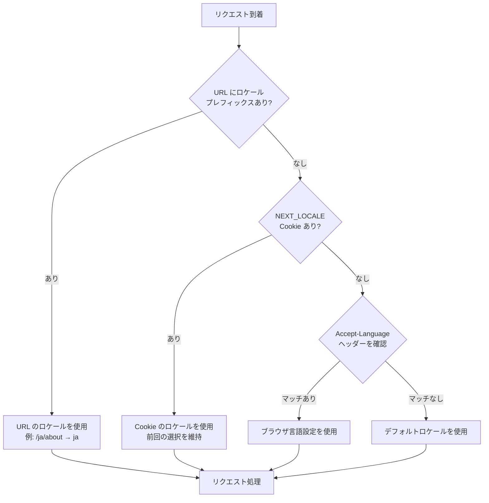
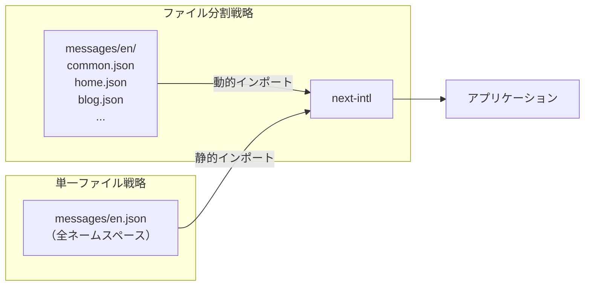

## はじめに

Next.js の App Router が登場したとき、国際化（i18n）対応は一度リセットされました。Pages Router 時代に広く使われていた `next-i18next` は App Router に非対応となり、Next.js 自体が内蔵していた i18n ルーティング機能も App Router では提供されなくなりました。

「App Router で i18n をやりたいが、何を使えばいいか分からない」という声は今でも多く聞かれます。本記事では、2025 年現在のデファクトスタンダードである `next-intl` を使い、Multi-Locale 対応サイトをゼロから構築する方法を体系的に解説します。

対象読者は Next.js の基礎を理解しており、App Router での開発経験がある方です。TypeScript を前提としています。

:::message
本記事で使用するバージョン: Next.js 15.x、next-intl 3.22+、TypeScript 5.x
:::

## next-intl vs next-i18next 比較

App Router での i18n 実装を検討するとき、まずライブラリ選定から始める必要があります。代表的な選択肢を比較します。

| 項目 | next-intl | next-i18next | 組み込み機能なし |
|------|-----------|-------------|----------------|
| App Router 対応 | ★★★ 完全対応 | ★ 非推奨 | — |
| Server Components | ★★★ 最適化済み | ★ 未対応 | — |
| TypeScript | ★★★ 型安全 | ★★ 部分的 | — |
| バンドルサイズ | 軽量 | やや重め | 最小 |
| 週次 DL 数 | 93 万+ | 減少傾向 | — |
| 学習コスト | 低〜中 | 中 | 高 |

`next-i18next` はもともと Pages Router 向けに設計されており、App Router と組み合わせると「古いものを新しいアーキテクチャに無理やり押し込む」状態になります。Server Components での動作も保証されていないため、2025 年時点での新規採用は推奨できません。

`next-intl` は App Router 専用に設計されており、Server Components と Client Components の両方で適切に動作します。GitHub の 3,700+ スターと週次 93 万ダウンロードが示すように、コミュニティの信頼も厚い選択肢です。

本記事では `next-intl` に絞って解説します。

## next-intl のセットアップ

### インストール

```bash
npm install next-intl
```

### ディレクトリ構成

next-intl を使った App Router プロジェクトの基本構成は以下のとおりです。

```
src/
├── app/
│   └── [locale]/
│       ├── layout.tsx
│       ├── page.tsx
│       └── about/
│           └── page.tsx
├── i18n/
│   ├── routing.ts        ← ルーティング設定（中心ファイル）
│   ├── navigation.ts     ← ナビゲーション API のラッパー
│   └── request.ts        ← リクエスト設定（翻訳ファイル読み込み）
├── messages/
│   ├── en.json           ← 英語翻訳ファイル
│   └── ja.json           ← 日本語翻訳ファイル
└── middleware.ts          ← ロケール検出・リダイレクト
```

`[locale]` というダイナミックセグメントがポイントです。これにより `/en/about`、`/ja/about` のようなロケールプレフィックス付き URL が生成されます。

### next.config.ts の設定

```typescript
// next.config.ts
import type { NextConfig } from "next";
import createNextIntlPlugin from "next-intl/plugin";

const withNextIntl = createNextIntlPlugin();

const nextConfig: NextConfig = {
  // その他の設定
};

export default withNextIntl(nextConfig);
```

### 翻訳ファイルの準備

```json
// messages/en.json
{
  "Navigation": {
    "home": "Home",
    "about": "About",
    "blog": "Blog"
  },
  "HomePage": {
    "title": "Welcome to our site",
    "description": "This is a multilingual Next.js application."
  },
  "Common": {
    "readMore": "Read more",
    "backToHome": "Back to home"
  }
}
```

```json
// messages/ja.json
{
  "Navigation": {
    "home": "ホーム",
    "about": "サービスについて",
    "blog": "ブログ"
  },
  "HomePage": {
    "title": "サイトへようこそ",
    "description": "多言語対応の Next.js アプリケーションです。"
  },
  "Common": {
    "readMore": "続きを読む",
    "backToHome": "ホームに戻る"
  }
}
```

## ロケールルーティング（/en/about, /ja/about）

### routing.ts の作成

ルーティング設定は `src/i18n/routing.ts` に集約します。このファイルがプロジェクト全体の i18n の中心となります。

```typescript
// src/i18n/routing.ts
import { defineRouting } from "next-intl/routing";

export const routing = defineRouting({
  // サポートするロケールのリスト
  locales: ["en", "ja", "zh"],

  // デフォルトロケール（URL プレフィックスなしでアクセスされたとき）
  defaultLocale: "en",

  // ロケールプレフィックスの制御
  // "always"    → /en/about, /ja/about（全ロケールにプレフィックス）
  // "as-needed" → /about（デフォルト）, /ja/about（非デフォルト）
  localePrefix: "as-needed",
});

// ロケールの型エクスポート（TypeScript の型推論に使用）
export type Locale = (typeof routing.locales)[number];
```

### navigation.ts の作成

next-intl が提供するロケール対応ナビゲーション API をラップします。

```typescript
// src/i18n/navigation.ts
import { createNavigation } from "next-intl/navigation";
import { routing } from "./routing";

export const { Link, redirect, usePathname, useRouter, getPathname } =
  createNavigation(routing);
```

これにより、インポートする `Link` や `useRouter` が自動的にロケールを考慮した挙動になります。

### request.ts の作成

```typescript
// src/i18n/request.ts
import { getRequestConfig } from "next-intl/server";
import { routing } from "./routing";

export default getRequestConfig(async ({ requestLocale }) => {
  // リクエストからロケールを取得
  let locale = await requestLocale;

  // バリデーション：無効なロケールはデフォルトにフォールバック
  if (!locale || !routing.locales.includes(locale as any)) {
    locale = routing.defaultLocale;
  }

  return {
    locale,
    messages: (await import(`../../messages/${locale}.json`)).default,
  };
});
```

### app/[locale]/layout.tsx の設定

```typescript
// src/app/[locale]/layout.tsx
import { NextIntlClientProvider } from "next-intl";
import { getMessages } from "next-intl/server";
import { notFound } from "next/navigation";
import { routing } from "@/i18n/routing";

interface Props {
  children: React.ReactNode;
  params: Promise<{ locale: string }>;
}

export default async function LocaleLayout({ children, params }: Props) {
  const { locale } = await params;

  // 無効なロケールは 404
  if (!routing.locales.includes(locale as any)) {
    notFound();
  }

  // サーバーで翻訳メッセージを取得
  const messages = await getMessages();

  return (
    <html lang={locale}>
      <body>
        {/* Client Components で翻訳を使えるようにプロバイダで包む */}
        <NextIntlClientProvider messages={messages}>
          {children}
        </NextIntlClientProvider>
      </body>
    </html>
  );
}

// 静的レンダリングのためにサポートするロケールを事前定義
export function generateStaticParams() {
  return routing.locales.map((locale) => ({ locale }));
}
```

## Middleware でのロケール検出・リダイレクト

Middleware はリクエストが届いたとき、最初に実行される処理です。next-intl の Middleware がロケールを検出し、適切な URL にリダイレクトします。

```typescript
// src/middleware.ts
import createMiddleware from "next-intl/middleware";
import { routing } from "./i18n/routing";

export default createMiddleware(routing);

export const config = {
  // Middleware を適用するパスのパターン
  // 静的ファイルや API ルートには適用しない
  matcher: [
    // 内部パス（_next）と静的ファイルを除外
    "/((?!_next|[^?]*\\.(?:html?|css|js(?!on)|jpe?g|webp|png|gif|svg|ttf|woff2?|ico|csv|docx?|xlsx?|zip|webmanifest)).*)",
    // API ルートには常に適用
    "/(api|trpc)(.*)",
  ],
};
```

### ロケール検出の優先順位

next-intl の Middleware は以下の順序でロケールを決定します。



### ロケール検出の無効化

URL のみでロケールを決定したい場合（ユーザーの言語設定を無視する場合）は、`localeDetection` を `false` に設定します。

```typescript
// src/i18n/routing.ts
export const routing = defineRouting({
  locales: ["en", "ja"],
  defaultLocale: "en",
  localeDetection: false, // Accept-Language ヘッダーと Cookie を無視
});
```

## Server Components での翻訳

Server Components での翻訳には、コンポーネントが同期か非同期かによって使い分けが必要です。

### 非同期 Server Components：getTranslations を使用

```typescript
// src/app/[locale]/page.tsx
import { getTranslations, setRequestLocale } from "next-intl/server";

interface Props {
  params: Promise<{ locale: string }>;
}

export default async function HomePage({ params }: Props) {
  const { locale } = await params;

  // 静的レンダリングを有効にするための設定
  setRequestLocale(locale);

  // 非同期で翻訳関数を取得
  const t = await getTranslations("HomePage");

  return (
    <main>
      <h1>{t("title")}</h1>
      <p>{t("description")}</p>
    </main>
  );
}

// 動的メタデータの生成（後述の SEO セクションで詳しく説明）
export async function generateMetadata({ params }: Props) {
  const { locale } = await params;
  const t = await getTranslations({ locale, namespace: "HomePage" });

  return {
    title: t("title"),
  };
}
```

### 同期 Server Components：useTranslations を使用

```typescript
// src/components/Navigation.tsx（同期 Server Component）
import { useTranslations } from "next-intl";
import { Link } from "@/i18n/navigation";

export default function Navigation() {
  // 同期コンポーネントでは useTranslations（フック）を使用
  const t = useTranslations("Navigation");

  return (
    <nav>
      <Link href="/">{t("home")}</Link>
      <Link href="/about">{t("about")}</Link>
      <Link href="/blog">{t("blog")}</Link>
    </nav>
  );
}
```

### 使い分けのポイント

| コンポーネント種別 | 翻訳 API | 備考 |
|----------------|---------|------|
| 非同期 Server Component | `await getTranslations()` | `next-intl/server` からインポート |
| 同期 Server Component | `useTranslations()` | フック形式、`next-intl` からインポート |
| Client Component | `useTranslations()` | フック形式、クライアント側で実行 |

:::message
`useTranslations` は React のフックなので `async` コンポーネントでは使えません。非同期 Server Component（`async function` で宣言したコンポーネント）では必ず `getTranslations` を使います。
:::

## Client Components での翻訳

### useTranslations フックの使用

```typescript
// src/components/SearchForm.tsx
"use client";

import { useTranslations } from "next-intl";
import { useState } from "react";

export default function SearchForm() {
  const t = useTranslations("SearchForm");
  const [query, setQuery] = useState("");

  const handleSubmit = (e: React.FormEvent) => {
    e.preventDefault();
    // 検索処理
  };

  return (
    <form onSubmit={handleSubmit}>
      <input
        type="text"
        value={query}
        onChange={(e) => setQuery(e.target.value)}
        placeholder={t("placeholder")}
        aria-label={t("inputLabel")}
      />
      <button type="submit">{t("submit")}</button>
    </form>
  );
}
```

対応する翻訳ファイルのエントリーを追加します。

```json
// messages/ja.json（抜粋）
{
  "SearchForm": {
    "placeholder": "キーワードを入力...",
    "inputLabel": "検索キーワード",
    "submit": "検索"
  }
}
```

### パターン：Server Component でラップする

`NextIntlClientProvider` を使うことで、翻訳データをクライアントに渡せます。しかし、大量のメッセージを渡すとバンドルサイズが増加します。必要なメッセージのみ渡すパターンが推奨されます。

```typescript
// src/components/SearchSection.tsx（Server Component）
import { getMessages } from "next-intl/server";
import { NextIntlClientProvider } from "next-intl";
import SearchForm from "./SearchForm";
import pick from "lodash/pick";

export default async function SearchSection() {
  const messages = await getMessages();

  return (
    // SearchForm に必要なメッセージのみ渡す
    <NextIntlClientProvider messages={pick(messages, "SearchForm")}>
      <SearchForm />
    </NextIntlClientProvider>
  );
}
```

## 動的ルートの i18n 対応

ブログ記事のような動的ルート（`/en/blog/[slug]`）でも i18n を適切に処理する必要があります。

### generateStaticParams でロケールを組み合わせる

```typescript
// src/app/[locale]/blog/[slug]/page.tsx
import { setRequestLocale } from "next-intl/server";
import { routing } from "@/i18n/routing";
import { getPostBySlug, getAllPostSlugs } from "@/lib/posts";

interface Props {
  params: Promise<{
    locale: string;
    slug: string;
  }>;
}

export default async function BlogPost({ params }: Props) {
  const { locale, slug } = await params;

  // 静的レンダリング有効化
  setRequestLocale(locale);

  const post = await getPostBySlug(slug, locale);

  return (
    <article>
      <h1>{post.title}</h1>
      <div dangerouslySetInnerHTML={{ __html: post.content }} />
    </article>
  );
}

// ロケールとスラッグの全組み合わせを事前生成
export async function generateStaticParams() {
  const slugs = await getAllPostSlugs();

  return routing.locales.flatMap((locale) =>
    slugs.map((slug) => ({
      locale,
      slug,
    }))
  );
}
```

### ロケール別 URL パス（Localized Pathnames）

英語は `/about`、日本語は `/ja/tentang`（会社概要）のようにロケールごとにパス自体を変えたい場合は、`defineRouting` でパスマッピングを定義します。

```typescript
// src/i18n/routing.ts
export const routing = defineRouting({
  locales: ["en", "ja"],
  defaultLocale: "en",
  pathnames: {
    "/": "/",
    "/about": {
      en: "/about",
      ja: "/gaisha-gaiyo", // 会社概要
    },
    "/blog/[slug]": {
      en: "/blog/[slug]",
      ja: "/burogu/[slug]",
    },
  },
});
```

## 日付・数値・複数形のローカライズ

翻訳テキストだけでなく、数値・日付・複数形もロケールによって形式が変わります。next-intl はこれらも一貫して扱えます。

### useFormatter フックの使用

```typescript
// src/components/ProductCard.tsx
"use client";

import { useFormatter, useTranslations } from "next-intl";

interface Product {
  name: string;
  price: number;
  stock: number;
  releaseDate: Date;
}

export default function ProductCard({ product }: { product: Product }) {
  const t = useTranslations("ProductCard");
  const format = useFormatter();

  return (
    <div>
      <h2>{product.name}</h2>

      {/* 通貨フォーマット：ロケールに合わせて自動調整 */}
      <p>
        {format.number(product.price, {
          style: "currency",
          currency: "JPY",
        })}
      </p>

      {/* 日付フォーマット */}
      <p>
        {format.dateTime(product.releaseDate, {
          year: "numeric",
          month: "long",
          day: "numeric",
        })}
      </p>

      {/* 相対時間 */}
      <p>{format.relativeTime(product.releaseDate)}</p>
    </div>
  );
}
```

### 複数形の処理（ICU Message Syntax）

英語では "1 item" と "2 items" で単数・複数形が変わります。日本語では変わりませんが、翻訳ファイルで ICU Message Syntax を使えば、このような言語差を吸収できます。

```json
// messages/en.json（抜粋）
{
  "Cart": {
    "itemCount": "{count, plural, =0 {No items in cart} =1 {1 item in cart} other {# items in cart}}",
    "followerCount": "{count, plural, =0 {No followers yet} =1 {One follower} other {# followers}}"
  }
}
```

```json
// messages/ja.json（抜粋）
{
  "Cart": {
    "itemCount": "カートに {count} 件の商品があります",
    "followerCount": "{count} 人のフォロワー"
  }
}
```

```typescript
// 使用例
const t = useTranslations("Cart");

// en: "3 items in cart" / ja: "カートに 3 件の商品があります"
const cartText = t("itemCount", { count: 3 });
```

### グローバルフォーマット設定

プロジェクト全体で使うフォーマット定義は `request.ts` で一元管理できます。

```typescript
// src/i18n/request.ts
import { getRequestConfig } from "next-intl/server";
import { routing } from "./routing";

export default getRequestConfig(async ({ requestLocale }) => {
  let locale = await requestLocale;
  if (!locale || !routing.locales.includes(locale as any)) {
    locale = routing.defaultLocale;
  }

  return {
    locale,
    messages: (await import(`../../messages/${locale}.json`)).default,
    // グローバルフォーマット設定
    formats: {
      dateTime: {
        short: {
          day: "numeric",
          month: "short",
          year: "numeric",
        },
        long: {
          day: "numeric",
          month: "long",
          year: "numeric",
          weekday: "long",
        },
      },
      number: {
        precise: {
          maximumFractionDigits: 5,
        },
      },
    },
  };
});
```

## 言語切り替えコンポーネント

### シンプルな言語切り替えコンポーネント

```typescript
// src/components/LocaleSwitcher.tsx
"use client";

import { useLocale, useTranslations } from "next-intl";
import { usePathname, useRouter } from "@/i18n/navigation";
import { routing } from "@/i18n/routing";
import { useTransition } from "react";

const localeLabels: Record<string, string> = {
  en: "English",
  ja: "日本語",
  zh: "中文",
};

export default function LocaleSwitcher() {
  const t = useTranslations("LocaleSwitcher");
  const locale = useLocale();
  const router = useRouter();
  const pathname = usePathname();
  const [isPending, startTransition] = useTransition();

  const handleLocaleChange = (newLocale: string) => {
    startTransition(() => {
      router.replace(pathname, { locale: newLocale });
    });
  };

  return (
    <div aria-label={t("label")}>
      <select
        value={locale}
        onChange={(e) => handleLocaleChange(e.target.value)}
        disabled={isPending}
      >
        {routing.locales.map((loc) => (
          <option key={loc} value={loc}>
            {localeLabels[loc] ?? loc}
          </option>
        ))}
      </select>
    </div>
  );
}
```

### Link を使った切り替えリンク

```typescript
// src/components/LocaleSwitcherLinks.tsx
"use client";

import { useLocale } from "next-intl";
import { Link, usePathname } from "@/i18n/navigation";
import { routing } from "@/i18n/routing";

const localeLabels: Record<string, string> = {
  en: "EN",
  ja: "JA",
};

export default function LocaleSwitcherLinks() {
  const locale = useLocale();
  const pathname = usePathname();

  return (
    <ul>
      {routing.locales.map((loc) => (
        <li key={loc}>
          <Link
            href={pathname}
            locale={loc}
            aria-current={loc === locale ? "true" : undefined}
          >
            {localeLabels[loc] ?? loc}
          </Link>
        </li>
      ))}
    </ul>
  );
}
```

## SEO 対応（hreflang、alternate）

多言語サイトでの SEO 対応において、`hreflang` タグは検索エンジンに「このページには他言語版がある」と伝えるための重要な仕組みです。

### next-intl の自動 hreflang 生成

next-intl の Middleware は、レスポンスヘッダーに自動で `Link` ヘッダーを追加します。

```
link: <https://example.com/en>; rel="alternate"; hreflang="en",
      <https://example.com/ja>; rel="alternate"; hreflang="ja",
      <https://example.com/>; rel="alternate"; hreflang="x-default"
```

ただし、`<head>` タグ内に `<link rel="alternate">` を追加する形式が一般的です。`generateMetadata` を使って実装します。

### generateMetadata での hreflang 実装

```typescript
// src/app/[locale]/page.tsx
import { getTranslations } from "next-intl/server";
import { routing } from "@/i18n/routing";
import { getPathname } from "@/i18n/navigation";

interface Props {
  params: Promise<{ locale: string }>;
}

export async function generateMetadata({ params }: Props) {
  const { locale } = await params;
  const t = await getTranslations({ locale, namespace: "HomePage" });

  // hreflang 用の alternates オブジェクトを生成
  const languages: Record<string, string> = {};
  for (const loc of routing.locales) {
    const url = getPathname({ locale: loc, href: "/" });
    languages[loc] = `https://example.com${url}`;
  }

  return {
    title: t("title"),
    description: t("description"),
    alternates: {
      canonical: `https://example.com/${locale}`,
      languages: {
        ...languages,
        // x-default はデフォルトロケールの URL を設定
        "x-default": `https://example.com/${routing.defaultLocale}`,
      },
    },
  };
}
```

### 動的ページの hreflang

ブログ記事のような動的ページでは、スラッグも含めた URL を生成します。

```typescript
// src/app/[locale]/blog/[slug]/page.tsx
export async function generateMetadata({ params }: Props) {
  const { locale, slug } = await params;
  const t = await getTranslations({ locale, namespace: "Blog" });
  const post = await getPostBySlug(slug, locale);

  const languages: Record<string, string> = {};
  for (const loc of routing.locales) {
    // ロケールごとにスラッグが異なる場合は getLocalizedSlug で変換
    const localizedSlug = await getLocalizedSlug(slug, locale, loc);
    languages[loc] = `https://example.com/${loc}/blog/${localizedSlug}`;
  }

  return {
    title: post.title,
    alternates: {
      canonical: `https://example.com/${locale}/blog/${slug}`,
      languages,
    },
  };
}
```

### sitemap.xml の多言語対応

```typescript
// src/app/sitemap.ts
import { MetadataRoute } from "next";
import { routing } from "@/i18n/routing";
import { getAllPostSlugs } from "@/lib/posts";

export default async function sitemap(): Promise<MetadataRoute.Sitemap> {
  const baseUrl = "https://example.com";
  const slugs = await getAllPostSlugs();

  // トップページのエントリー（全ロケール分）
  const homeEntries = routing.locales.map((locale) => ({
    url: `${baseUrl}/${locale}`,
    lastModified: new Date(),
    alternates: {
      languages: Object.fromEntries(
        routing.locales.map((loc) => [loc, `${baseUrl}/${loc}`])
      ),
    },
  }));

  // ブログ記事のエントリー
  const blogEntries = slugs.flatMap((slug) =>
    routing.locales.map((locale) => ({
      url: `${baseUrl}/${locale}/blog/${slug}`,
      lastModified: new Date(),
      alternates: {
        languages: Object.fromEntries(
          routing.locales.map((loc) => [loc, `${baseUrl}/${loc}/blog/${slug}`])
        ),
      },
    }))
  );

  return [...homeEntries, ...blogEntries];
}
```

## 翻訳ファイルの管理と DeepL 連携

### 翻訳ファイルの構造設計

翻訳ファイルはページ・コンポーネント単位でネームスペースを切るのが基本です。しかし、大規模プロジェクトでは単一の JSON ファイルが巨大になりがちです。



ページ数が少ない場合は単一ファイルが管理しやすいです。ページ数が多い場合はファイルを分割し、`request.ts` で動的にインポートする構成が向いています。

### DeepL API を使った自動翻訳スクリプト

英語（ベース言語）の翻訳ファイルが更新されたとき、DeepL API で他言語を自動生成するスクリプトです。

```typescript
// scripts/translate-messages.ts
import Anthropic from "@anthropic-ai/sdk"; // 型定義のために使用
import * as fs from "fs/promises";
import * as path from "path";

const DEEPL_API_KEY = process.env.DEEPL_API_KEY!;
const MESSAGES_DIR = path.join(process.cwd(), "messages");

const LOCALE_MAP: Record<string, string> = {
  ja: "JA",
  zh: "ZH",
  ko: "KO",
  de: "DE",
  fr: "FR",
};

async function translateValue(
  text: string,
  targetLang: string
): Promise<string> {
  // DeepL の free API エンドポイント
  const response = await fetch("https://api-free.deepl.com/v2/translate", {
    method: "POST",
    headers: {
      Authorization: `DeepL-Auth-Key ${DEEPL_API_KEY}`,
      "Content-Type": "application/json",
    },
    body: JSON.stringify({
      text: [text],
      target_lang: targetLang,
      source_lang: "EN",
    }),
  });

  const data = await response.json();
  return data.translations[0].text;
}

// JSON オブジェクトを再帰的に翻訳
async function translateObject(
  obj: Record<string, unknown>,
  targetLang: string
): Promise<Record<string, unknown>> {
  const result: Record<string, unknown> = {};

  for (const [key, value] of Object.entries(obj)) {
    if (typeof value === "string") {
      // ICU Message Syntax のプレースホルダー（{count} など）を保持しながら翻訳
      result[key] = await translateValue(value, targetLang);
    } else if (typeof value === "object" && value !== null) {
      result[key] = await translateObject(
        value as Record<string, unknown>,
        targetLang
      );
    } else {
      result[key] = value;
    }
  }

  return result;
}

async function main() {
  const baseMessages = JSON.parse(
    await fs.readFile(path.join(MESSAGES_DIR, "en.json"), "utf-8")
  );

  for (const [locale, deeplLang] of Object.entries(LOCALE_MAP)) {
    console.log(`Translating to ${locale}...`);
    const translated = await translateObject(baseMessages, deeplLang);
    await fs.writeFile(
      path.join(MESSAGES_DIR, `${locale}.json`),
      JSON.stringify(translated, null, 2),
      "utf-8"
    );
    console.log(`Done: messages/${locale}.json`);
  }
}

main().catch(console.error);
```

実行方法：

```bash
DEEPL_API_KEY=your_key npx ts-node scripts/translate-messages.ts
```

### 翻訳キー管理のベストプラクティス

TypeScript の型安全性を活用することで、翻訳キーの打ち間違いをコンパイル時に検出できます。

```typescript
// src/types/messages.ts
// en.json の型定義（自動生成も可能）
type Messages = typeof import("../../messages/en.json");

// next-intl の型拡張
declare global {
  interface IntlMessages extends Messages {}
}
```

この設定により、`t("存在しないキー")` とタイプすると TypeScript エラーになります。

## まとめ

App Router での i18n 実装を `next-intl` を中心に解説しました。要点を整理します。

まず、ライブラリ選定では `next-intl` が 2025 年時点のデファクトスタンダードです。`next-i18next` は App Router に対応しておらず、新規採用は避けてください。

実装の核となるのは `[locale]` ダイナミックセグメントと `routing.ts` です。この2つが i18n の全体像を決定します。Middleware はロケール検出とリダイレクトを担い、Accept-Language ヘッダー、Cookie、URL プレフィックスの優先順位でロケールを決定します。

翻訳 API の使い分けは明確です。非同期 Server Components では `getTranslations`、同期 Server Components と Client Components では `useTranslations` を使います。日付・数値・複数形は `useFormatter` と ICU Message Syntax で統一的に扱えます。

SEO 対応では `generateMetadata` の `alternates.languages` を使って hreflang タグを生成します。sitemap.xml にもロケール別 URL を含めることで、検索エンジンへの多言語サイトの伝達が完成します。

翻訳ファイルの管理は、プロジェクト規模が小さいうちは単一 JSON ファイルで十分です。DeepL API を使った自動翻訳スクリプトを用意しておくと、ベース言語（英語）の更新を他言語に素早く展開できます。

i18n は「後から追加するのが大変な機能」の代表格です。Multi-Locale の可能性が少しでもあるなら、最初から `[locale]` セグメントを組み込んだ設計にしておくことを強くお勧めします。

---

関連記事として、TypeScript の型安全性を活用した開発手法や、Next.js App Router のパフォーマンス最適化についても公開予定です。Publication をフォローしていただくと通知が届きます。

Sources:
- [next-intl 公式ドキュメント](https://next-intl.dev/docs/getting-started/app-router)
- [next-intl vs next-i18next 比較（Intlayer Blog）](https://intlayer.org/blog/next-i18next-vs-next-intl-vs-intlayer)
- [Next.js 公式 i18n ガイド](https://nextjs.org/docs/app/guides/internationalization)
- [next-intl Middleware ドキュメント](https://next-intl.dev/docs/routing/middleware)
