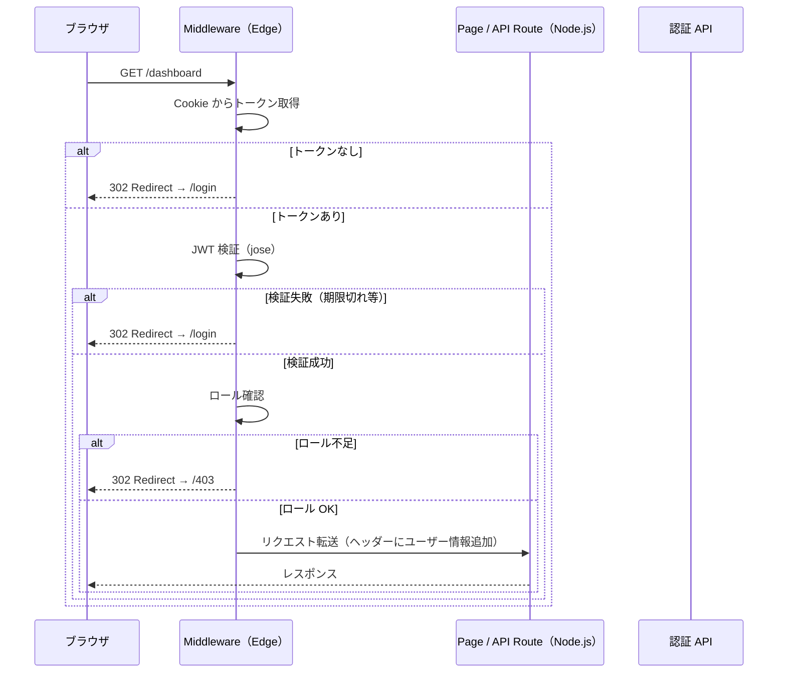

## はじめに

Next.js でアプリケーションを構築する際、認証の実装方法は大きく分けて「ライブラリに委ねる」と「自前で実装する」の2種類があります。`next-auth`（Auth.js）は強力な選択肢ですが、既存の認証サービスとの統合や細かい制御が必要な場面では、Middleware を使ったカスタム認証が有効です。

本記事では Next.js 14 以降の App Router を前提に、Middleware を使った JWT 認証の実装パターンを解説します。

### Middleware 認証の利点

- リクエストがページやAPIに到達する前に認証チェックが走る
- 認証ロジックを1ファイルに集約でき、各ページでの記述が不要
- ルートグループ単位の保護設定がシンプルに書ける

### Edge Runtime の制約

重要な前提として、Next.js Middleware は Edge Runtime で動作します。これは Node.js とは異なる軽量な JavaScript 実行環境です。

Edge Runtime では以下が使用できません。

| 使用不可 | 代替手段 |
|---------|---------|
| Node.js `crypto` モジュール | Web Crypto API（`crypto.subtle`） |
| `fs` モジュール | 使用しない設計にする |
| Prisma 等の多くの ORM | API Route（Node.js Runtime）に分離 |
| `Buffer`（一部） | `Uint8Array` や `TextEncoder` を使用 |

この制約を踏まえた上で、JWT 検証には Edge Runtime 対応の `jose` ライブラリを使用します。

---

## Middleware の実行タイミングと処理フロー

Middleware はリクエストが Next.js のルーティングに到達する前に実行されます。



Middleware の判定結果は 3 種類です。

1. `NextResponse.next()` ─ リクエストをそのまま通過させる
2. `NextResponse.redirect(url)` ─ 別 URL にリダイレクトする
3. `NextResponse.rewrite(url)` ─ URL を書き換えてルーティングする

---

## 基本的な JWT 検証の実装

### 準備: jose のインストール

```bash
npm install jose
```

### JWT 検証ユーティリティ

```typescript
// lib/auth/jwt.ts
import { jwtVerify, type JWTPayload } from 'jose'

export interface AppJWTPayload extends JWTPayload {
  sub: string
  role: 'admin' | 'user' | 'viewer'
  email: string
}

const secret = new TextEncoder().encode(
  process.env.JWT_SECRET
)

export async function verifyToken(token: string): Promise<AppJWTPayload | null> {
  try {
    const { payload } = await jwtVerify(token, secret, {
      algorithms: ['HS256'],
    })
    return payload as AppJWTPayload
  } catch {
    return null
  }
}
```

`JWT_SECRET` は環境変数から取得し、コードへの直接記述は禁止です。`.env.local` に設定してください。

```bash
# .env.local
JWT_SECRET=your-secret-key-min-32-characters-long
```

### Middleware 本体の実装

```typescript
// middleware.ts
import { NextResponse } from 'next/server'
import type { NextRequest } from 'next/server'
import { verifyToken } from '@/lib/auth/jwt'

// 認証不要のパブリックルート（allowlist 方式）
const PUBLIC_ROUTES = [
  '/login',
  '/signup',
  '/forgot-password',
  '/api/auth',
]

function isPublicRoute(pathname: string): boolean {
  return PUBLIC_ROUTES.some(
    (route) => pathname === route || pathname.startsWith(route + '/')
  )
}

export async function middleware(request: NextRequest) {
  const { pathname } = request.nextUrl

  // パブリックルートはそのまま通過
  if (isPublicRoute(pathname)) {
    return NextResponse.next()
  }

  // Cookie からトークン取得
  const token = request.cookies.get('access_token')?.value

  if (!token) {
    const loginUrl = new URL('/login', request.url)
    loginUrl.searchParams.set('redirect', pathname)
    return NextResponse.redirect(loginUrl)
  }

  // JWT 検証
  const payload = await verifyToken(token)

  if (!payload) {
    const loginUrl = new URL('/login', request.url)
    loginUrl.searchParams.set('redirect', pathname)
    const response = NextResponse.redirect(loginUrl)
    // 無効なトークンを削除
    response.cookies.delete('access_token')
    return response
  }

  // 検証成功: ユーザー情報をヘッダーに追加して転送
  const requestHeaders = new Headers(request.headers)
  requestHeaders.set('x-user-id', payload.sub)
  requestHeaders.set('x-user-role', payload.role)
  requestHeaders.set('x-user-email', payload.email)

  return NextResponse.next({
    request: { headers: requestHeaders },
  })
}

export const config = {
  matcher: [
    '/((?!_next/static|_next/image|favicon.ico|.*\\.(?:svg|png|jpg|jpeg|gif|webp)$).*)',
  ],
}
```

---

## matcher config でのルート設定

`matcher` は Middleware を実行するルートのフィルタリングに使います。設定を誤ると静的アセットにも Middleware が走り、パフォーマンスが低下します。

### 静的ファイルを除外するパターン（推奨）

```typescript
export const config = {
  matcher: [
    '/((?!_next/static|_next/image|favicon.ico|.*\\.(?:svg|png|jpg|jpeg|gif|webp)$).*)',
  ],
}
```

### 特定ルートのみを保護するパターン

```typescript
export const config = {
  matcher: [
    '/dashboard/:path*',
    '/admin/:path*',
    '/api/protected/:path*',
  ],
}
```

特定ルートのみを保護するパターンは設定が明示的ですが、新しいルートを追加するたびに `matcher` の更新が必要になります。全体を保護して一部を除外する allowlist 方式の方が、設定漏れを防ぎやすいです。

---

## 認証必須ルートの保護パターン

### ページコンポーネントでのユーザー情報取得

Middleware でヘッダーに追加したユーザー情報は、Server Component で取得できます。

```typescript
// app/dashboard/page.tsx
import { headers } from 'next/headers'

export default async function DashboardPage() {
  const headersList = await headers()
  const userId = headersList.get('x-user-id')
  const userRole = headersList.get('x-user-role')
  const userEmail = headersList.get('x-user-email')

  return (
    <div>
      <h1>ダッシュボード</h1>
      <p>ユーザー ID: {userId}</p>
      <p>ロール: {userRole}</p>
    </div>
  )
}
```

### API Route での認証情報取得

```typescript
// app/api/profile/route.ts
import { NextRequest, NextResponse } from 'next/server'

export async function GET(request: NextRequest) {
  const userId = request.headers.get('x-user-id')
  const userRole = request.headers.get('x-user-role')

  if (!userId) {
    return NextResponse.json(
      { error: 'Unauthorized' },
      { status: 401 }
    )
  }

  // DB からユーザー情報を取得するなど
  return NextResponse.json({ userId, userRole })
}
```

---

## ロールベースアクセス制御（RBAC）の実装

特定のルートをロールに応じて制限するパターンです。

```typescript
// lib/auth/rbac.ts

export type Role = 'admin' | 'user' | 'viewer'

interface RoutePermission {
  pattern: RegExp
  allowedRoles: Role[]
}

const ROUTE_PERMISSIONS: RoutePermission[] = [
  {
    pattern: /^\/admin(\/.*)?$/,
    allowedRoles: ['admin'],
  },
  {
    pattern: /^\/dashboard(\/.*)?$/,
    allowedRoles: ['admin', 'user'],
  },
  {
    pattern: /^\/reports(\/.*)?$/,
    allowedRoles: ['admin', 'user', 'viewer'],
  },
]

export function hasPermission(pathname: string, role: Role): boolean {
  const permission = ROUTE_PERMISSIONS.find((p) =>
    p.pattern.test(pathname)
  )

  // 対象ルートの定義がなければアクセス許可
  if (!permission) return true

  return permission.allowedRoles.includes(role)
}
```

Middleware に RBAC チェックを組み込みます。

```typescript
// middleware.ts（RBAC 追加版）
import { NextResponse } from 'next/server'
import type { NextRequest } from 'next/server'
import { verifyToken } from '@/lib/auth/jwt'
import { hasPermission, type Role } from '@/lib/auth/rbac'

const PUBLIC_ROUTES = ['/login', '/signup', '/api/auth']

function isPublicRoute(pathname: string): boolean {
  return PUBLIC_ROUTES.some(
    (route) => pathname === route || pathname.startsWith(route + '/')
  )
}

export async function middleware(request: NextRequest) {
  const { pathname } = request.nextUrl

  if (isPublicRoute(pathname)) {
    return NextResponse.next()
  }

  const token = request.cookies.get('access_token')?.value

  if (!token) {
    const loginUrl = new URL('/login', request.url)
    loginUrl.searchParams.set('redirect', pathname)
    return NextResponse.redirect(loginUrl)
  }

  const payload = await verifyToken(token)

  if (!payload) {
    const loginUrl = new URL('/login', request.url)
    loginUrl.searchParams.set('redirect', pathname)
    const response = NextResponse.redirect(loginUrl)
    response.cookies.delete('access_token')
    return response
  }

  // ロールチェック
  const role = payload.role as Role
  if (!hasPermission(pathname, role)) {
    return NextResponse.redirect(new URL('/403', request.url))
  }

  // ヘッダーにユーザー情報を付与
  const requestHeaders = new Headers(request.headers)
  requestHeaders.set('x-user-id', payload.sub)
  requestHeaders.set('x-user-role', role)
  requestHeaders.set('x-user-email', payload.email)

  return NextResponse.next({
    request: { headers: requestHeaders },
  })
}

export const config = {
  matcher: [
    '/((?!_next/static|_next/image|favicon.ico|.*\\.(?:svg|png|jpg|jpeg|gif|webp)$).*)',
  ],
}
```

---

## トークンリフレッシュの処理

Edge Runtime ではデータベースへの直接アクセスが難しいため、トークンリフレッシュは API Route（Node.js Runtime）で行います。

### アクセストークンの有効期限チェック

Middleware でトークンの有効期限が迫っていた場合、レスポンスヘッダーでクライアントに通知する方法が実用的です。

```typescript
// middleware.ts（リフレッシュ通知追加版）
export async function middleware(request: NextRequest) {
  // ...（前述の実装）...

  const payload = await verifyToken(token)
  if (!payload) { /* ... */ }

  const now = Math.floor(Date.now() / 1000)
  const expiresAt = payload.exp ?? 0
  const REFRESH_THRESHOLD = 5 * 60 // 5分前にリフレッシュ推奨

  const requestHeaders = new Headers(request.headers)
  requestHeaders.set('x-user-id', payload.sub)
  requestHeaders.set('x-user-role', payload.role)

  const response = NextResponse.next({
    request: { headers: requestHeaders },
  })

  // 有効期限が近い場合、レスポンスヘッダーで通知
  if (expiresAt - now < REFRESH_THRESHOLD) {
    response.headers.set('x-token-refresh-required', 'true')
  }

  return response
}
```

### リフレッシュ API Route

```typescript
// app/api/auth/refresh/route.ts
import { NextRequest, NextResponse } from 'next/server'
import { SignJWT } from 'jose'

const secret = new TextEncoder().encode(process.env.JWT_SECRET)

export async function POST(request: NextRequest) {
  const refreshToken = request.cookies.get('refresh_token')?.value

  if (!refreshToken) {
    return NextResponse.json({ error: 'No refresh token' }, { status: 401 })
  }

  // リフレッシュトークンの検証（DB 確認など Node.js Runtime で実施）
  const user = await validateRefreshToken(refreshToken)

  if (!user) {
    return NextResponse.json({ error: 'Invalid refresh token' }, { status: 401 })
  }

  // 新しいアクセストークンを発行
  const accessToken = await new SignJWT({
    sub: user.id,
    role: user.role,
    email: user.email,
  })
    .setProtectedHeader({ alg: 'HS256' })
    .setExpirationTime('1h')
    .sign(secret)

  const response = NextResponse.json({ ok: true })
  response.cookies.set('access_token', accessToken, {
    httpOnly: true,
    secure: process.env.NODE_ENV === 'production',
    sameSite: 'lax',
    maxAge: 60 * 60, // 1時間
  })

  return response
}

async function validateRefreshToken(token: string) {
  // 実際の実装: DB でリフレッシュトークンを検証
  // ここでは省略
  return null
}
```

---

## エラーハンドリングとリダイレクト

### リダイレクト先の設計

認証失敗時のリダイレクト先は、ユーザー体験を考慮して設計します。

```typescript
// lib/auth/redirect.ts

export function buildLoginUrl(
  baseUrl: string,
  redirectPath: string
): URL {
  const loginUrl = new URL('/login', baseUrl)
  // /login や /signup など認証関連ページへのリダイレクトは設定しない
  if (!redirectPath.startsWith('/login') && !redirectPath.startsWith('/signup')) {
    loginUrl.searchParams.set('redirect', redirectPath)
  }
  return loginUrl
}
```

### Cookie のセキュリティ設定

```typescript
// app/api/auth/login/route.ts（ログイン API Route の例）
import { NextRequest, NextResponse } from 'next/server'
import { SignJWT } from 'jose'

const secret = new TextEncoder().encode(process.env.JWT_SECRET)

export async function POST(request: NextRequest) {
  const { email, password } = await request.json()

  // 認証処理（省略）
  const user = await authenticate(email, password)
  if (!user) {
    return NextResponse.json(
      { error: 'Invalid credentials' },
      { status: 401 }
    )
  }

  const accessToken = await new SignJWT({
    sub: user.id,
    role: user.role,
    email: user.email,
  })
    .setProtectedHeader({ alg: 'HS256' })
    .setIssuedAt()
    .setExpirationTime('1h')
    .sign(secret)

  const response = NextResponse.json({ ok: true })

  // Cookie のセキュリティ設定
  response.cookies.set('access_token', accessToken, {
    httpOnly: true,        // JavaScript からアクセス不可
    secure: process.env.NODE_ENV === 'production',  // HTTPS のみ
    sameSite: 'lax',       // CSRF 対策
    maxAge: 60 * 60,       // 1時間
    path: '/',
  })

  return response
}

async function authenticate(email: string, password: string) {
  // 実際の実装: DB でユーザー認証
  return null
}
```

---

## テスト方法

### 単体テスト（Jest + jest-environment-edge）

Edge Runtime の制約があるため、`jose` を使った JWT 検証のユニットテストは通常の Node.js 環境で問題なく動作します。

```typescript
// lib/auth/__tests__/jwt.test.ts
import { SignJWT } from 'jose'
import { verifyToken } from '../jwt'

const secret = new TextEncoder().encode('test-secret-key-min-32-characters-long')

describe('verifyToken', () => {
  beforeEach(() => {
    process.env.JWT_SECRET = 'test-secret-key-min-32-characters-long'
  })

  it('有効なトークンを正しく検証できる', async () => {
    const token = await new SignJWT({
      sub: 'user-123',
      role: 'user',
      email: 'test@example.com',
    })
      .setProtectedHeader({ alg: 'HS256' })
      .setExpirationTime('1h')
      .sign(secret)

    const payload = await verifyToken(token)

    expect(payload).not.toBeNull()
    expect(payload?.sub).toBe('user-123')
    expect(payload?.role).toBe('user')
  })

  it('期限切れトークンは null を返す', async () => {
    const token = await new SignJWT({ sub: 'user-123', role: 'user', email: 'test@example.com' })
      .setProtectedHeader({ alg: 'HS256' })
      .setExpirationTime('-1h') // 過去に設定
      .sign(secret)

    const payload = await verifyToken(token)
    expect(payload).toBeNull()
  })

  it('無効なシークレットのトークンは null を返す', async () => {
    const wrongSecret = new TextEncoder().encode('wrong-secret-key-min-32-characters-long')
    const token = await new SignJWT({ sub: 'user-123', role: 'user', email: 'test@example.com' })
      .setProtectedHeader({ alg: 'HS256' })
      .setExpirationTime('1h')
      .sign(wrongSecret)

    const payload = await verifyToken(token)
    expect(payload).toBeNull()
  })
})
```

### E2E テスト（Playwright）

```typescript
// e2e/auth.spec.ts
import { test, expect } from '@playwright/test'

test.describe('認証フロー', () => {
  test('未認証でダッシュボードにアクセスするとログインページにリダイレクトされる', async ({ page }) => {
    await page.goto('/dashboard')
    await expect(page).toHaveURL(/\/login/)
    await expect(page.locator('h1')).toContainText('ログイン')
  })

  test('ログイン後にダッシュボードにアクセスできる', async ({ page }) => {
    await page.goto('/login')
    await page.fill('input[name="email"]', 'test@example.com')
    await page.fill('input[name="password"]', 'password123')
    await page.click('button[type="submit"]')

    await expect(page).toHaveURL('/dashboard')
  })

  test('権限不足のルートには 403 ページが表示される', async ({ page, context }) => {
    // user ロールのクッキーを設定
    await context.addCookies([
      {
        name: 'access_token',
        value: 'user-role-token', // テスト用トークン
        domain: 'localhost',
        path: '/',
      },
    ])

    await page.goto('/admin')
    await expect(page).toHaveURL('/403')
  })
})
```

---

## まとめ

本記事では Next.js Middleware を使った JWT 認証の実装パターンを解説しました。

| 実装内容 | ポイント |
|---------|---------|
| JWT 検証 | `jose` ライブラリを使用（Edge Runtime 対応） |
| ルートマッチャー | 静的アセットを除外した allowlist 方式が推奨 |
| RBAC | JWTペイロードのロールクレームで制御 |
| トークンリフレッシュ | API Route（Node.js Runtime）に分離 |
| Cookie 設定 | `httpOnly + secure + sameSite` でセキュリティを確保 |

Middleware 認証は設定を集中管理できる利点がありますが、Edge Runtime の制約を理解した設計が重要です。データベースアクセスが必要な処理は API Route に分離し、Middleware は軽量な JWT 検証に徹する設計が長期的に安定します。

関連する実装として、Next.js App Router での Server Actions を使ったフォーム処理と組み合わせると、より堅牢な認証フローを構築できます。

---

関連記事: [Next.js Server Actions でフォーム処理 ─ バリデーション・エラーハンドリング・楽観的 UI](https://zenn.dev/correlate_dev/articles/nextjs-server-actions)
