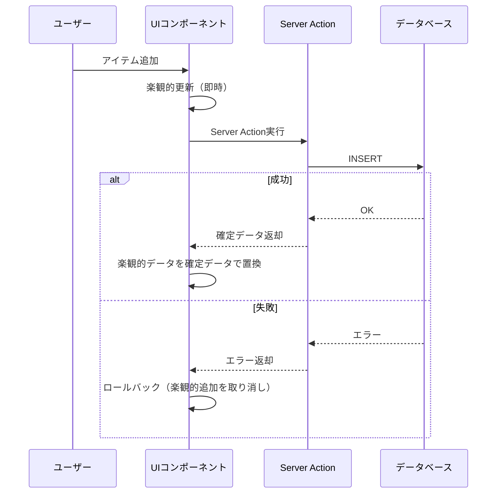
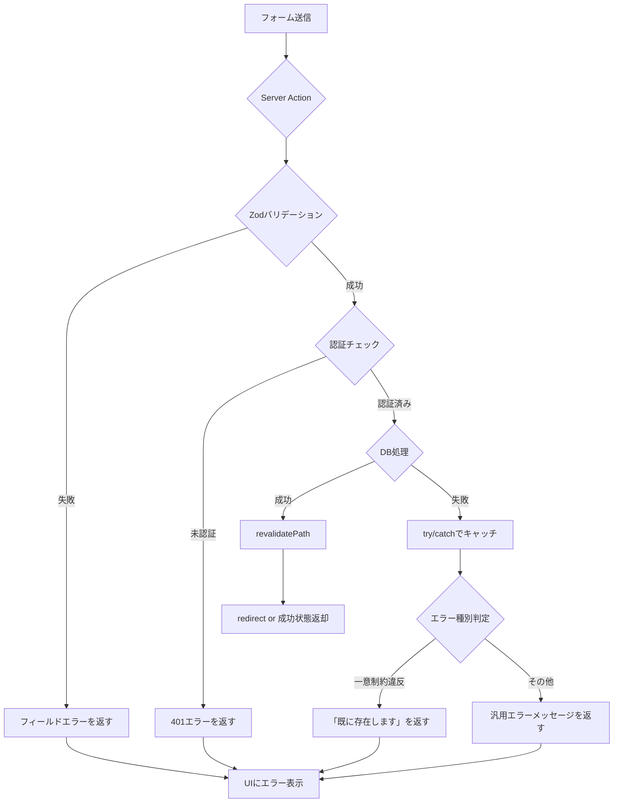

## はじめに

Next.js App Routerには、フォーム処理を劇的にシンプルにする「Server Actions」という機能があります。従来はフォームの送信処理にAPIルート（`/api/xxx`）を用意し、クライアント側から `fetch` で呼び出す構成が一般的でした。Server Actionsを使うと、そのAPIルートが不要になります。

Server Actionsとは、サーバー側で実行される非同期関数を、クライアントのフォームから直接呼び出せる仕組みです。`'use server'` ディレクティブを宣言するだけで、Next.jsが安全なRPC（Remote Procedure Call）を自動生成します。

Next.js 14でStableとなり、Next.js 15ではさらに改善が加えられました。また、React 19では `useFormState` の後継となる `useActionState` が導入されています。

本記事では、基本的な使い方から始め、Zodバリデーション・楽観的UI更新・エラーハンドリング・セキュリティまで、実務で使える実践パターンを網羅します。

---

## 1. Server Actionsの基本

### 宣言方法

Server Actionsは2通りの方法で宣言できます。

ファイルの先頭に `'use server'` を置く方法（ファイル全体をServer Actionsとして扱う）と、関数の先頭に置く方法（Server Componentのファイル内にインラインで定義する）です。

```typescript
// app/actions/contact.ts
'use server'

export async function submitContact(formData: FormData) {
  const name = formData.get('name') as string
  const email = formData.get('email') as string
  const message = formData.get('message') as string

  // サーバー側の処理（DB保存、メール送信など）
  await saveContact({ name, email, message })
}
```

### フォームからの呼び出し

定義したServer Actionはフォームの `action` 属性に渡すだけで動作します。

```typescript
// app/contact/page.tsx
import { submitContact } from '@/app/actions/contact'

export default function ContactPage() {
  return (
    <form action={submitContact}>
      <input name="name" type="text" placeholder="お名前" required />
      <input name="email" type="email" placeholder="メールアドレス" required />
      <textarea name="message" placeholder="お問い合わせ内容" required />
      <button type="submit">送信</button>
    </form>
  )
}
```

JavaScriptが無効な環境でも動作するのがServer Actionsの大きな特徴です。`fetch` を書く必要がなく、ネットワーク層の実装がほぼゼロになります。

---

## 2. useFormStatus でローディング状態を管理する

フォーム送信中にボタンを無効化するには `useFormStatus` を使います。このフックは `react-dom` からimportします。

`useFormStatus` は必ず送信対象フォームの子コンポーネント内で使う必要があります。フォームと同じコンポーネントに書いても機能しないため、SubmitButtonを別コンポーネントとして切り出すのが定石です。

```typescript
// components/submit-button.tsx
'use client'

import { useFormStatus } from 'react-dom'

export function SubmitButton({ label = '送信' }: { label?: string }) {
  const { pending } = useFormStatus()

  return (
    <button
      type="submit"
      disabled={pending}
      aria-disabled={pending}
    >
      {pending ? '送信中...' : label}
    </button>
  )
}
```

```typescript
// app/contact/page.tsx
import { submitContact } from '@/app/actions/contact'
import { SubmitButton } from '@/components/submit-button'

export default function ContactPage() {
  return (
    <form action={submitContact}>
      <input name="name" type="text" placeholder="お名前" required />
      <input name="email" type="email" placeholder="メールアドレス" required />
      <SubmitButton label="お問い合わせを送信" />
    </form>
  )
}
```

---

## 3. useActionState でフォームの状態を管理する

### React 18 vs React 19の違い

フォームの送信結果（成功・エラーメッセージ）をUIに反映するには状態管理が必要です。

| バージョン | フック名 | importパス |
|---|---|---|
| React 18 / Next.js 14 | `useFormState` | `react-dom` |
| React 19 / Next.js 15 | `useActionState` | `react` |

React 19では `useActionState` が推奨APIになります。本記事では `useActionState` を使いますが、Next.js 14環境では `useFormState` に読み替えてください。

### 実装例

まず、Server Actionの返却型を定義します。

```typescript
// types/form.ts
export type FormState = {
  status: 'idle' | 'success' | 'error'
  message: string
  errors?: Record<string, string[]>
}
```

次に、Server Actionを `FormState` を返すように修正します。

```typescript
// app/actions/contact.ts
'use server'

import { FormState } from '@/types/form'

export async function submitContact(
  prevState: FormState,
  formData: FormData
): Promise<FormState> {
  const name = formData.get('name') as string
  const email = formData.get('email') as string

  if (!name || !email) {
    return {
      status: 'error',
      message: '必須項目を入力してください',
    }
  }

  try {
    await saveContact({ name, email })
    return {
      status: 'success',
      message: 'お問い合わせを受け付けました',
    }
  } catch {
    return {
      status: 'error',
      message: 'サーバーエラーが発生しました。しばらくしてから再試行してください',
    }
  }
}
```

クライアントコンポーネントで `useActionState` を使います。

```typescript
// app/contact/page.tsx
'use client'

import { useActionState } from 'react'
import { submitContact } from '@/app/actions/contact'
import { SubmitButton } from '@/components/submit-button'
import { FormState } from '@/types/form'

const initialState: FormState = {
  status: 'idle',
  message: '',
}

export default function ContactPage() {
  const [state, action] = useActionState(submitContact, initialState)

  return (
    <div>
      {state.status === 'success' && (
        <p role="status">{state.message}</p>
      )}
      {state.status === 'error' && (
        <p role="alert">{state.message}</p>
      )}

      <form action={action}>
        <input name="name" type="text" placeholder="お名前" required />
        <input name="email" type="email" placeholder="メールアドレス" required />
        <SubmitButton />
      </form>
    </div>
  )
}
```

---

## 4. Zodによるサーバーサイドバリデーション

クライアント側のバリデーションは簡単に回避できます。データの信頼性を確保するためには、サーバー側でのバリデーションが必須です。Zodを使うと型安全なバリデーションを簡潔に実装できます。

### スキーマ定義

```typescript
// lib/schemas/contact.ts
import { z } from 'zod'

export const ContactSchema = z.object({
  name: z
    .string()
    .min(1, '名前を入力してください')
    .max(50, '名前は50文字以内で入力してください'),
  email: z
    .string()
    .email('正しいメールアドレスを入力してください'),
  message: z
    .string()
    .min(10, 'お問い合わせ内容は10文字以上入力してください')
    .max(1000, 'お問い合わせ内容は1000文字以内で入力してください'),
})

export type ContactInput = z.infer<typeof ContactSchema>
```

### Server ActionでZodを使う

```typescript
// app/actions/contact.ts
'use server'

import { ContactSchema } from '@/lib/schemas/contact'
import { FormState } from '@/types/form'

export async function submitContact(
  prevState: FormState,
  formData: FormData
): Promise<FormState> {
  // FormDataをプレーンオブジェクトに変換
  const rawData = Object.fromEntries(formData)

  // Zodでバリデーション
  const result = ContactSchema.safeParse(rawData)

  if (!result.success) {
    // フィールドごとのエラーをフラット化して返す
    const fieldErrors = result.error.flatten().fieldErrors

    return {
      status: 'error',
      message: '入力内容にエラーがあります',
      errors: {
        name: fieldErrors.name ?? [],
        email: fieldErrors.email ?? [],
        message: fieldErrors.message ?? [],
      },
    }
  }

  // バリデーション通過後のデータは型安全
  const { name, email, message } = result.data

  try {
    await saveContact({ name, email, message })
    return {
      status: 'success',
      message: 'お問い合わせを受け付けました',
    }
  } catch {
    return {
      status: 'error',
      message: 'サーバーエラーが発生しました',
    }
  }
}
```

### フィールドエラーの表示

```typescript
// app/contact/page.tsx（抜粋）
<form action={action}>
  <div>
    <input name="name" type="text" placeholder="お名前" />
    {state.errors?.name?.map((err) => (
      <p key={err} role="alert">{err}</p>
    ))}
  </div>
  <div>
    <input name="email" type="email" placeholder="メールアドレス" />
    {state.errors?.email?.map((err) => (
      <p key={err} role="alert">{err}</p>
    ))}
  </div>
  <div>
    <textarea name="message" placeholder="お問い合わせ内容" />
    {state.errors?.message?.map((err) => (
      <p key={err} role="alert">{err}</p>
    ))}
  </div>
  <SubmitButton />
</form>
```

---

## 5. 楽観的UI更新（useOptimistic）

楽観的UI更新とは、サーバーの応答を待たずに先にUIを更新し、エラーが発生した場合にロールバックするパターンです。リストへの追加操作などで体感速度を大きく改善できます。



### 実装例（TODOリスト）

```typescript
// app/actions/todo.ts
'use server'

import { revalidatePath } from 'next/cache'

export type Todo = {
  id: string
  text: string
  completed: boolean
  createdAt: Date
}

export async function addTodo(text: string): Promise<Todo> {
  const todo = await db.todo.create({
    data: { text, completed: false },
  })
  revalidatePath('/todos')
  return todo
}
```

```typescript
// app/todos/todo-list.tsx
'use client'

import { useOptimistic, useTransition } from 'react'
import { addTodo, Todo } from '@/app/actions/todo'

type OptimisticTodo = Todo & { pending?: boolean }

export function TodoList({ initialTodos }: { initialTodos: Todo[] }) {
  const [optimisticTodos, addOptimisticTodo] = useOptimistic<
    OptimisticTodo[],
    string
  >(
    initialTodos,
    (state, newText) => [
      ...state,
      {
        id: crypto.randomUUID(),
        text: newText,
        completed: false,
        createdAt: new Date(),
        pending: true,  // 保留中フラグ
      },
    ]
  )

  const [, startTransition] = useTransition()

  async function handleSubmit(formData: FormData) {
    const text = formData.get('text') as string
    if (!text.trim()) return

    startTransition(async () => {
      addOptimisticTodo(text)
      await addTodo(text)
    })
  }

  return (
    <div>
      <form action={handleSubmit}>
        <input name="text" type="text" placeholder="新しいタスク" />
        <button type="submit">追加</button>
      </form>

      <ul>
        {optimisticTodos.map((todo) => (
          <li
            key={todo.id}
            style={{ opacity: todo.pending ? 0.5 : 1 }}
          >
            {todo.text}
            {todo.pending && <span>（保存中...）</span>}
          </li>
        ))}
      </ul>
    </div>
  )
}
```

---

## 6. エラーハンドリングパターン

### データフローとエラーハンドリング全体像



### try/catch と redirect の注意点

Server Action内で `redirect()` を使う場合、`try/catch` ブロックの外に置く必要があります。`redirect()` は内部的に例外をthrowするため、`try` ブロック内に書くと `catch` に捕まってしまいます。

```typescript
// app/actions/post.ts
'use server'

import { redirect } from 'next/navigation'
import { revalidatePath } from 'next/cache'

export async function createPost(
  prevState: FormState,
  formData: FormData
): Promise<FormState> {
  const result = PostSchema.safeParse(Object.fromEntries(formData))

  if (!result.success) {
    return {
      status: 'error',
      message: '入力内容を確認してください',
      errors: result.error.flatten().fieldErrors,
    }
  }

  let newPostId: string

  try {
    const post = await db.post.create({ data: result.data })
    newPostId = post.id
    revalidatePath('/posts')
  } catch (error) {
    // DBエラーの種別に応じてメッセージを分ける
    if (error instanceof DatabaseError && error.code === 'P2002') {
      return {
        status: 'error',
        message: 'このタイトルの投稿は既に存在します',
      }
    }
    console.error('Post creation failed:', error)
    return {
      status: 'error',
      message: 'サーバーエラーが発生しました',
    }
  }

  // try/catch の外でredirect（例外がcatchされないように）
  redirect(`/posts/${newPostId}`)
}
```

---

## 7. セキュリティ

### CSRF対策

Next.jsはServer ActionsのCSRF対策を自動的に行います。具体的には以下の2点を検証します。

- `Origin` ヘッダーがサイトと一致すること
- `Content-Type` が適切であること

独自のCSRFトークンを実装する必要はありません。ただし、Server Actionをカスタムの `fetch` で外部から呼び出すことはできない設計になっています。

### 認証チェック

最も重要なのは、全てのServer Action内で認証状態を確認することです。クライアント側のUI制御だけでは不十分であり、サーバー側で必ず検証する必要があります。

```typescript
// app/actions/post.ts
'use server'

import { auth } from '@/lib/auth'  // NextAuthやClerk等
import { redirect } from 'next/navigation'

export async function deletePost(postId: string): Promise<FormState> {
  // 必ず認証チェックを先頭で行う
  const session = await auth()
  if (!session?.user) {
    redirect('/login')
  }

  // 認可チェック（自分の投稿か確認）
  const post = await db.post.findUnique({ where: { id: postId } })
  if (!post || post.authorId !== session.user.id) {
    return {
      status: 'error',
      message: 'この操作を行う権限がありません',
    }
  }

  try {
    await db.post.delete({ where: { id: postId } })
    revalidatePath('/posts')
    return { status: 'success', message: '投稿を削除しました' }
  } catch {
    return { status: 'error', message: 'サーバーエラーが発生しました' }
  }
}
```

### 入力サニタイズ

Zodによるバリデーションが入力サニタイズを兼ねます。`string().max()` で長さを制限し、XSSの原因となる文字列が意図せずDBに保存されることを防げます。HTMLを受け付ける場合は `dompurify` などの専用ライブラリを組み合わせてください。

---

## 8. BigQuery連携パターン

Server ActionはNode.js環境で実行されるため、Google Cloud SDKを直接使えます。Cloud RunやVercel上にデプロイしたNext.jsアプリから、BigQueryへのINSERTをServer Actionで実装する例です。

```typescript
// app/actions/analytics.ts
'use server'

import { BigQuery } from '@google-cloud/bigquery'
import { z } from 'zod'

const bigquery = new BigQuery({
  projectId: process.env.GCP_PROJECT_ID,
  // Cloud Run / Vercel環境ではApplication Default Credentialsが自動適用
  // ローカル開発時は GOOGLE_APPLICATION_CREDENTIALS 環境変数を設定
})

const EventSchema = z.object({
  eventName: z.string().min(1).max(100),
  userId: z.string().uuid().optional(),
  properties: z.record(z.string()).optional(),
})

export async function trackEvent(
  prevState: FormState,
  formData: FormData
): Promise<FormState> {
  const session = await auth()

  const result = EventSchema.safeParse({
    eventName: formData.get('eventName'),
    userId: session?.user?.id,
    properties: {
      page: formData.get('page') as string,
    },
  })

  if (!result.success) {
    return { status: 'error', message: 'データ形式が不正です' }
  }

  try {
    const dataset = bigquery.dataset(process.env.BQ_DATASET!)
    const table = dataset.table(process.env.BQ_EVENTS_TABLE!)

    await table.insert([
      {
        event_name: result.data.eventName,
        user_id: result.data.userId ?? null,
        properties: JSON.stringify(result.data.properties ?? {}),
        occurred_at: BigQuery.timestamp(new Date()),
      },
    ])

    return { status: 'success', message: 'イベントを記録しました' }
  } catch (error) {
    console.error('BigQuery insert failed:', error)
    return { status: 'error', message: 'データの記録に失敗しました' }
  }
}
```

Cloud Run環境では Workload Identity Federation を設定することで、サービスアカウントキーファイルなしで認証できます。ローカル開発時は `gcloud auth application-default login` を実行してください。

---

## まとめ

本記事では、Next.js 15 Server Actionsの実践パターンを網羅しました。

- `'use server'` で定義したServer Actionはフォームの `action` 属性に直接渡せる
- `useFormStatus` でローディング状態を管理し、`useActionState`（React 19）で返却値を受け取る
- Zodの `safeParse` でサーバーサイドバリデーションを型安全に実装できる
- `useOptimistic` を使うと、サーバー応答待ちなしにUIを先行更新できる
- `redirect()` は `try/catch` の外に置く（内部的に例外をthrowするため）
- 全てのServer Action内で認証チェックを行う（クライアント制御だけでは不十分）
- BigQueryなどのサーバーリソースに直接アクセスできるのがServer Actionsの強み

Server Actionsを使いこなすと、API設計の複雑さが大きく減り、型安全なフルスタック開発が実現できます。特にフォーム処理が多いアプリケーションでは、開発速度と安全性の両面で大きなメリットがあります。
