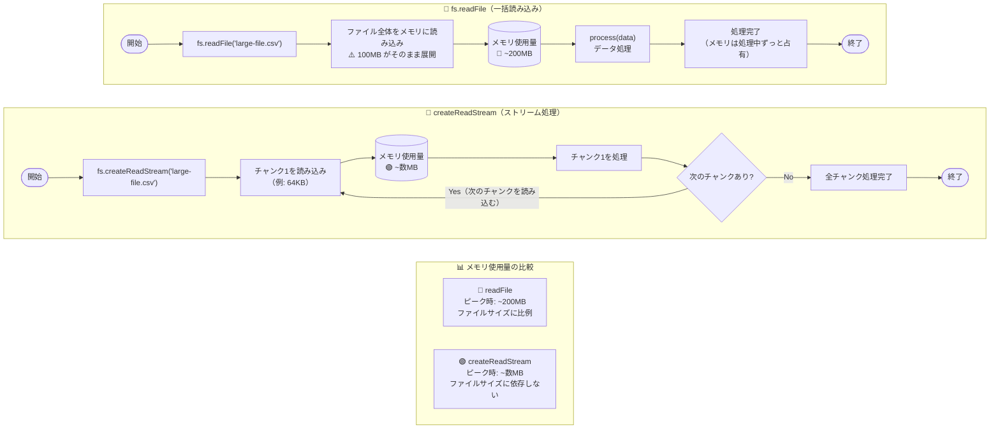
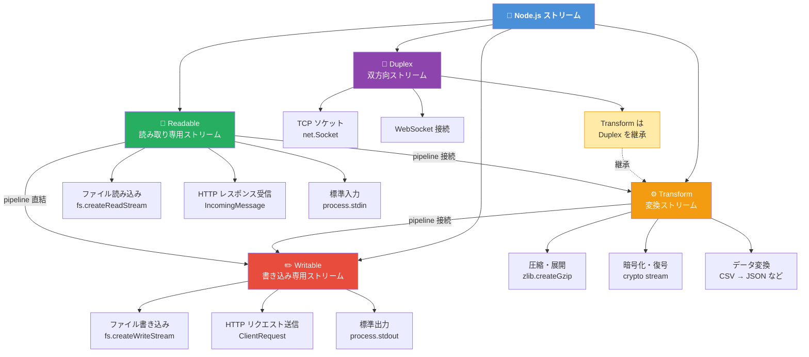
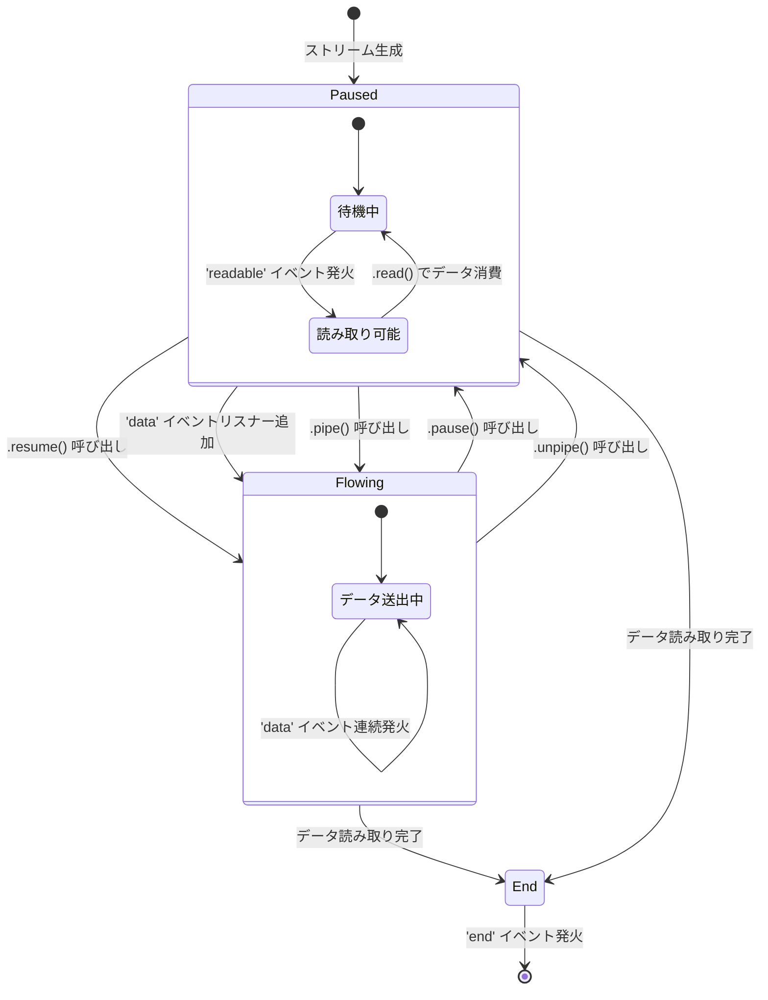
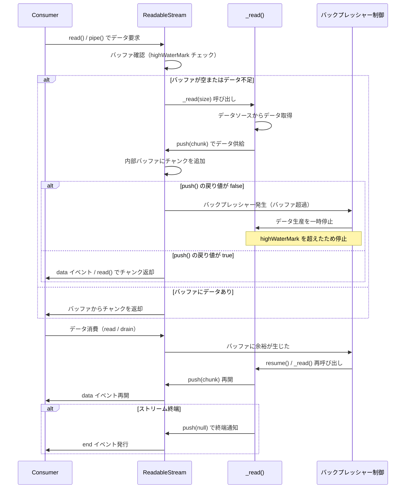

> **本記事のコードはすべて ESM（`"type": "module"` 設定済み）、Node.js v18+ を前提とします。**
> `node:` プレフィックスは Node.js v14.18+ / v16+ 以降でのみ有効です。また、本記事では現代的な `pipeline()` を中心に扱います。`pipe()` との比較については「[`pipeline()` vs `pipe()`](#pipeline-vs-pipe)」セクションを参照してください。

---

## はじめに ─ なぜストリームが必要か



Node.js でバックエンドを開発していると、いつかは「大きなファイルを処理したら OOM（Out of Memory）が発生した」という経験をすることがあります。その原因のほとんどは、`fs.readFile` に代表される「一括読み込み」アプローチにあります。

ストリームは、そうした問題に対する Node.js の根本的な解決策です。しかし「知っている」と「使いこなせる」の間には大きなギャップがあります。本記事は、そのギャップを埋めるための実装中心のリファレンスです。

### 問題提起：readFile vs createReadStream のメモリ比較

100MB のファイルを処理する 2 つのアプローチを比較してみます。

**`fs.readFile` を使った場合**

```js
// ❌ 一括読み込み ─ メモリを圧迫するアプローチ
import fs from 'node:fs/promises';

const data = await fs.readFile('large-file.csv'); // 100MB がそのままメモリに乗る
process(data);
```

このアプローチでは、ファイル全体がメモリ上に展開されます。RSS（Resident Set Size）の変化を模式的に示すと、次のようになります。

```
[readFile アプローチ]

RSS (MB)
  200 │                    ████████████
  150 │               █████████████████
  100 │          ██████████████████████
   50 │     ████████████████████████████
    0 └─────────────────────────────────▶ 時間
         ↑
         readFile() 呼び出しと同時にピークへ到達
         100MB ファイルに加え、処理用のバッファも消費
```

**`createReadStream` を使った場合**

```js
// ✅ ストリーム処理 ─ 一定のメモリで処理するアプローチ
import fs from 'node:fs';
import { pipeline } from 'node:stream/promises';

await pipeline(
  fs.createReadStream('large-file.csv'),
  processStream,       // 変換処理ストリーム
  outputStream         // 出力先ストリーム
);
```

```
[createReadStream アプローチ]

RSS (MB)
  200 │
  150 │
  100 │
   50 │  ██  ██  ██  ██  ██  ██  ██  ██
    0 └─────────────────────────────────▶ 時間
         ↑
         チャンク単位で処理。RSS はほぼ一定
         highWaterMark オプションで変更可能（デフォルト: 16 * 1024 bytes）
         ※ fs.createReadStream のデフォルトは 65536 bytes（64KB）
         ※ objectMode の場合は 16 オブジェクト
```

同じ 100MB のファイルを処理するにもかかわらず、メモリ使用量のプロファイルはまったく異なります。ストリームを使えば、ファイルサイズに関係なくほぼ一定のメモリで処理が完了します。

### ストリームが解決する 3 つの課題

#### 1. メモリ効率

上記の比較が示すとおり、ストリームはデータをチャンク（小さな断片）単位で処理します。ファイルサイズが 1GB になっても 10GB になっても、プログラムが同時に保持するデータは常にチャンクサイズ分だけです。OOM の根本原因を排除できます。

#### 2. 時間効率（TTFB の改善）

一括処理の場合、クライアントはすべてのデータが揃うまでレスポンスを受け取れません。ストリーミングでは、最初のチャンクが処理され次第、即座にクライアントへ送信できます。

```
[一括処理の TTFB]
サーバー:  ──────────── 全処理完了 ──────────── 送信開始
クライアント: ────────────────────────────────── 受信開始

[ストリーミングの TTFB]
サーバー:  ─ 処理開始 ─ 送信開始 ─ 処理継続 ─ 処理継続 ...
クライアント: ── 受信開始 ──────────────────────────────
              ↑ TTFB が劇的に短縮
```

データベースのクエリ結果を HTTP レスポンスとしてストリーミングする場合、最初の行が取得でき次第すぐにクライアントへ流せます。ユーザー体験の向上に直結します。

#### 3. 合成可能性（Composability）

ストリームは Unix のパイプ哲学を継承しています。個々のストリームは単一の責務を持ち、それらをチェーン状に接続することで複雑な処理を構築できます。

```
[ストリームの合成例]

ファイル読み取り ──▶ gzip 圧縮 ──▶ 暗号化 ──▶ HTTP レスポンス

各ステップは独立してテスト可能
各ステップは再利用可能
全体のメモリ効率は維持される
```

この合成可能性こそが、ストリームを「単なるメモリ節約の仕組み」以上の価値あるツールにしています。

---

## Node.js Stream の基礎 ─ 4 種類のストリームを理解する



Node.js の Stream モジュールは、4 種類の基本クラスを提供しています。それぞれの役割を正確に理解することが、適切な実装の出発点になります。

```
┌─────────────────────────────────────────────────────┐
│                Node.js Stream の分類                  │
├───────────────┬─────────────────────────────────────┤
│  Readable     │  データの生産者（読み取り可能）          │
│  Writable     │  データの消費者（書き込み可能）          │
│  Transform    │  データの変換者（読み書き両対応）        │
│  Duplex       │  双方向通信（読み書きが独立）           │
└───────────────┴─────────────────────────────────────┘
```

### Readable Stream

`Readable` ストリームはデータの生産者です。ファイル、HTTP リクエスト、データベースのクエリ結果など、「読み取れるもの」はすべて `Readable` として表現できます。

#### paused mode と flowing mode の切り替えメカニズム



`Readable` ストリームには 2 つの動作モードがあります。

**paused mode（一時停止モード）**

初期状態のモードです。データはバッファに蓄積され、明示的に `read()` を呼び出すまで消費されません。

```js
const readable = fs.createReadStream('data.txt');

// paused mode: 明示的に読み取る
readable.on('readable', () => {
  let chunk;
  while ((chunk = readable.read()) !== null) {
    console.log(`受信: ${chunk.length} bytes`);
  }
});
```

**flowing mode（フローモード）**

`data` イベントリスナーを登録するか、`resume()` を呼び出すと切り替わります。データが届き次第、自動的にイベントとして発火されます。

```js
const readable = fs.createReadStream('data.txt');

// flowing mode: data イベントで受け取る
readable.on('data', (chunk) => {
  console.log(`受信: ${chunk.length} bytes`);
});

readable.on('end', () => {
  console.log('読み取り完了');
});
```

モード切り替えの関係を整理すると次のとおりです。

```
paused mode ──▶ flowing mode
  ・data イベントリスナーを追加
  ・pipe() を呼び出す
  ・resume() を呼び出す

flowing mode ──▶ paused mode
  ・pause() を呼び出す
  ・pipe() の接続先を unpipe() で解除
```

#### data イベント vs for await...of の使い分け

現代的な Node.js では、`for await...of` を使った非同期イテレーションが推奨されます。

```js
import fs from 'node:fs';

// ✅ 推奨: for await...of による非同期イテレーション
async function processFile(filePath) {
  const readable = fs.createReadStream(filePath, { encoding: 'utf8' });

  for await (const chunk of readable) {
    // chunk ごとに処理
    await processChunk(chunk);
  }

  console.log('処理完了');
}
```

`data` イベントとの使い分けの基準は次のとおりです。

| 状況 | 推奨アプローチ |
|------|--------------|
| `async/await` ベースの新規コード | `for await...of` |
| イベント駆動の既存コードとの統合 | `data` イベント |
| 細かいフロー制御が必要な場合 | `readable` イベント + `read()` |
| `pipeline()` で接続する場合 | どちらでも不要（自動処理）|

#### カスタム Readable の実装（_read フック）



独自のデータソースから `Readable` ストリームを作る場合、`_read()` メソッドをオーバーライドします。

```js
import { Readable } from 'node:stream';

class CounterReadable extends Readable {
  constructor(limit) {
    super({ objectMode: true }); // オブジェクトをそのまま流す場合は objectMode: true
    this.count = 0;
    this.limit = limit;
  }

  _read() {
    if (this.count < this.limit) {
      // push() でデータをバッファに追加
      // 同期データソースの場合、push() が false を返しても
      // Node.js 内部が _read() の再呼び出しを管理するため、
      // 追加の制御は不要。
      // 非同期データソースの場合は DatabaseCursorReadable のパターンを参照。
      this.push(this.count++);
    } else {
      // null を push() することで EOF（ストリーム終端）を通知
      this.push(null);
    }
  }
}

// 使用例
const counter = new CounterReadable(10);

for await (const num of counter) {
  console.log(num); // 0, 1, 2, ..., 9
}
```

`_read()` は Consumer がデータを要求したときに呼ばれます。`push()` の戻り値（`false` の場合はバックプレッシャー発生）を確認することで、非同期データソースでのフロー制御が可能です（詳細は「[バックプレッシャー](#バックプレッシャー)」セクションを参照）。

非同期データソースからの実装例も示します。

```js
import { Readable } from 'node:stream';

class DatabaseCursorReadable extends Readable {
  constructor(cursor) {
    super({ objectMode: true });
    this.cursor = cursor;
    this.reading = false;
  }

  // 注意: _read() を async にすると Node.js 内部が Promise の rejection を
  // 捕捉できず、未処理エラーになるケースがある（特に Node.js v18 以前）。
  // そのため、Promise チェーンで記述することを推奨する。
  _read() {
    if (this.reading) return;
    this.reading = true;

    this.cursor.fetchOne()
      .then((row) => {
        this.reading = false;
        if (row === null) {
          this.push(null); // データなし → EOF
        } else {
          // push() が false を返した場合、Consumer の準備ができたときに
          // Node.js 内部から _read() が再度呼ばれる
          this.push(row);
        }
      })
      .catch((err) => this.destroy(err)); // エラーをストリームに伝播
  }
}
```

### Writable Stream

`Writable` ストリームはデータの消費者です。ファイルへの書き込み、HTTP レスポンス、データベースへの挿入など、「書き込める場所」はすべて `Writable` として表現できます。

#### _write() vs _writev() の選択基準

カスタム `Writable` を実装する際、2 つの書き込みフックを選択できます。

```js
import { Writable } from 'node:stream';

// _write(): 1 チャンクずつ処理する基本実装
class LogWritable extends Writable {
  constructor(options) {
    super(options);
    this.logBuffer = [];
  }

  _write(chunk, encoding, callback) {
    // chunk: 書き込まれたデータ
    // encoding: 文字列の場合のエンコーディング
    // callback: 処理完了を通知するコールバック（エラーがあれば引数に渡す）

    this.logBuffer.push(chunk.toString());

    // 非同期処理が完了したら callback を呼ぶ
    callback();
  }
}
```
