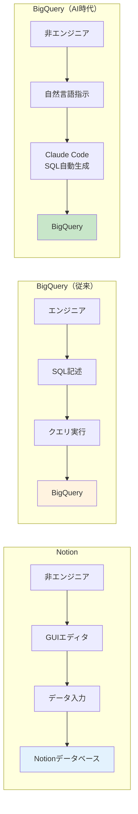
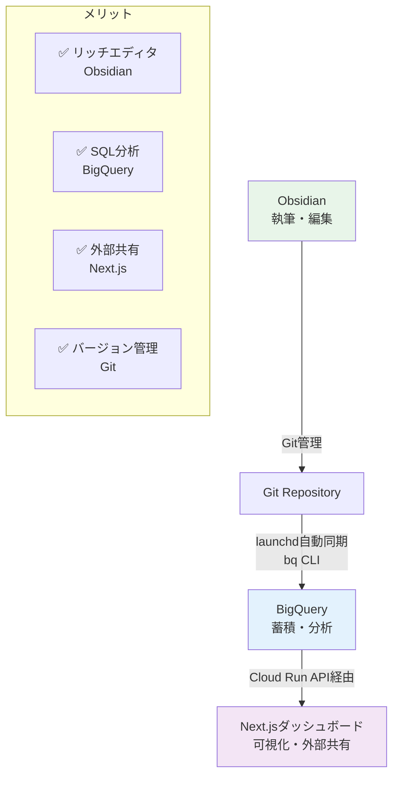

## はじめに

> この記事では、Claude CodeやCursorなどのAIエージェントを日常的に使うエンジニアを想定しています。

小規模事業者やフリーランスエンジニアがナレッジ管理を始めるとき、多くの人がNotionを選びます。理由は明快です。無料で始められて、見た目が美しく、テンプレートが豊富。チーム共有も簡単で、非エンジニアでも使える。

しかし私は、自社（合同会社コラレイトデザイン）のナレッジ管理にBigQueryを選びました。

「SQLが必要なBigQueryをナレッジ管理に？」と疑問に思うかもしれません。でも、AIエージェント時代の今、この選択は十分に合理的です。

この記事では、Notion vs BigQueryを6つの観点で比較し、BigQueryが成立する条件を明示します。実装例も含めて、具体的に解説します。

---

## なぜNotionではないのか

まず、Notionが悪いわけではありません。実際、私もクライアント向けのタスクボードにはNotionを使っています。

ただ、自社のナレッジ管理には向かないと判断しました。理由は3つです。

### 1. SQLによる分析ができない

Notionのデータベースビューは便利ですが、複雑な集計には限界があります。

例えば「過去6ヶ月でどのカテゴリの知見が増えたか」「セッション記録とエラー記録の相関」といった分析は、手動でビューを作り込む必要があります。

BigQueryなら、以下のようなクエリで実現できます。

```sql
SELECT
  category,
  COUNT(*) as count,
  AVG(CHAR_LENGTH(content)) as avg_length
FROM learnings
WHERE created_at >= DATE_SUB(CURRENT_DATE(), INTERVAL 6 MONTH)
GROUP BY category
ORDER BY count DESC;
```

### 2. AIエージェントとの親和性

Claude CodeやCursorといったAIエージェントにとって、NotionのブロックAPIは煩雑です。

```python
# Notionはブロック構造の操作が複雑
notion.blocks.children.append(
    block_id=parent_id,
    children=[{
        "type": "paragraph",
        "paragraph": {"rich_text": [...]}
    }]
)
```

一方、BigQueryはSQL一発。

```python
# BigQueryはシンプル
client.query("""
  INSERT INTO learnings (content, category, source)
  VALUES (@content, @category, @source)
""", job_config=job_config)
```

Claude Codeは後者を得意とします。プロンプトで「BigQueryにこのデータを保存して」と指示すれば、自動的にSQLを書いて実行してくれます。

### 3. コスト構造

| ツール | 月額コスト | 備考 |
|--------|-----------|------|
| Notion Plus | $10/月 | エクスポートがHTML/Markdown混在 |
| BigQuery | ほぼ無料 | クエリ1TB/月・ストレージ10GB/月無料 |
| Obsidian | 無料 | Git管理、プレーンテキスト |

私のナレッジDB（27セッション・204学び・37ナレッジ・36コンテンツ候補）はBigQueryで約500MB。月間クエリ量は1GB未満。完全に無料枠（クエリ1TB/月、ストレージ10GB/月）に収まります。

---

## Notion vs BigQuery: 6つの観点で比較

### 1. 操作インターフェース

**Notion**: GUI中心で、非エンジニアでも使えます
**BigQuery**: SQL必須で、エンジニア向けです

ここが最大の分岐点です。

ただし、Claude Code時代では「SQL操作が人間の作業」とは限りません。AIエージェントにSQLを書かせれば、インターフェースの差は縮まります。



### 2. データ構造と柔軟性

**Notion**: リッチコンテンツ（画像・動画・埋め込み）が得意です
**BigQuery**: テキストデータ特化で、分析クエリが強力です

デザインモックアップや動画を扱うならNotion一択です。

しかし、知見やセッション記録といったテキスト主体のナレッジなら、BigQueryの構造化データとして扱う方が後々の活用範囲が広がります。

### 3. 自動化・連携

**Notion**: API制約があります（平均3リクエスト/秒、500KB/リクエスト - 2026年2月時点、[公式ドキュメント](https://developers.notion.com/reference/request-limits)より）
**BigQuery**: bq CLI、Python SDK、launchd連携が可能です

Notionは大量データの自動投入には向きません。レート制限に引っかかります。

BigQueryは`bq` CLIで冪等性を担保したバッチ投入が簡単です。私の環境では、launchdで毎日09:30にObsidian → BigQuery自動同期を回しています。

### 4. バージョン管理

**Notion**: Notionのページ履歴があります（有料プランで無制限）
**BigQuery**: GitでMarkdownを管理し、BigQueryに同期する形です

私の運用では、Obsidian（Markdown）→ Git管理 → BigQueryに自動同期、という構成です。

履歴はGitで管理されるので、いつでも過去の知見に戻れます。BigQueryは「現在の状態」を保持するだけ。

### 5. 外部共有

**Notion**: URLで即共有でき、権限管理が容易です
**BigQuery**: IAM設定が煩雑で、共有には不向きです

ここはNotionの圧勝です。

ただし、BigQueryのデータをNext.jsダッシュボードで可視化すれば、外部共有可能なURLが作れます。私の環境では、FIRE KPIダッシュボードをNext.js + BigQueryで構築しています。

---

## Correlate環境の実装例

### Obsidian → BigQuery 自動同期

スクリプト: `~/dev/scripts/obsidian-to-bq.py`

```python
import subprocess
import json
from pathlib import Path

def sync_to_bq(table_name, data_file):
    # bq CLI経由で冪等INSERT
    # セキュリティのため shell=False でリスト形式を推奨
    subprocess.run([
        "bq", "load",
        "--source_format=NEWLINE_DELIMITED_JSON",
        f"workspace.{table_name}",
        data_file
    ], check=True)

# セッション記録をJSON化してBQに投入
session_dir = Path.home() / "dev/Obsidian/06_sessions"
for f in session_dir.glob("**/*.md"):
    # ... frontmatter解析、JSON変換
    sync_to_bq("session_records", "/tmp/sessions.ndjson")
```

launchd設定（毎日09:30 JST自動実行）:

```xml
<plist version="1.0">
<dict>
    <key>Label</key>
    <string>com.correlate.obsidian-sync</string>
    <key>ProgramArguments</key>
    <array>
        <string>/usr/local/bin/python3</string>
        <!-- 環境に合わせてパスを変更してください -->
        <string>/Users/YOUR_USERNAME/dev/scripts/obsidian-to-bq.py</string>
    </array>
    <key>StartCalendarInterval</key>
    <dict>
        <key>Hour</key><integer>9</integer>
        <key>Minute</key><integer>30</integer>
    </dict>
</dict>
</plist>
```

### BigQueryテーブル設計

GCPプロジェクト: `correlate-workspace`
データセット: `workspace`

| テーブル | 説明 | 件数（2026-02-13時点） |
|---------|------|----------------------|
| session_records | セッション記録 | 27件 |
| learnings | 学び・知見 | 204件 |
| knowledge_items | ナレッジカタログ | 37件 |
| content_candidates | コンテンツ候補 | 36件 |
| error_records | エラー記録 | 1件 |
| decision_records | 意思決定記録 | 3件 |

### ダッシュボード可視化

Next.js + BigQuery API で、外部共有可能なダッシュボードを構築。

```typescript
import { BigQuery } from '@google-cloud/bigquery';

export async function getKnowledgeStats() {
  const bigquery = new BigQuery();
  const query = `
    SELECT category, COUNT(*) as count
    FROM workspace.learnings
    GROUP BY category
    ORDER BY count DESC
  `;
  const [rows] = await bigquery.query({ query });
  return rows;
}
```

このデータをNext.jsで可視化し、Vercelにデプロイすれば、URLで誰でもアクセス可能になります。

---

## BigQueryが成立する条件

### ✅ 向いている事業者

- エンジニアが主担当（SQL書ける、またはAIに書かせられる）
- AIエージェント活用前提（Claude Code / Cursor / Copilot）
- Git運用が日常（Markdown管理に抵抗なし）
- 分析重視（「何件登録したか」より「傾向分析」が重要）
- GCP既利用（BigQuery無料枠内で収まる）

### ❌ 向かない事業者

- 非エンジニアチーム（SQL教育コストが高い）
- リアルタイム共同編集が必須（BigQueryは読み取り専用UI）
- 外部共有が頻繁（BigQueryのIAM設定は煩雑）
- 画像・動画が主体（BigQueryはテキスト特化）

---

## 推奨構成: Obsidian + BigQuery + Next.js

他社がこの構成を真似する場合、以下のフローをおすすめします。



これなら：
- ✅ Notionのリッチエディタと同等の体験（Obsidian）
- ✅ SQLによる高度な分析（BigQuery）
- ✅ 外部共有可能なダッシュボード（Next.js）
- ✅ バージョン管理・バックアップ（Git）

月額コストは、GCP + Vercel合わせて5ドル以下です。

---

## まとめ

Notionが悪いわけではありません。UI/UX、チーム共有、非エンジニア向けという観点では、Notionが圧倒的に優れています。

しかし、以下の条件を満たすなら、BigQueryは十分に選択肢に入ります。

1. エンジニアが主担当（またはAIエージェントが操作）
2. テキスト主体のナレッジ管理
3. SQL分析を活用したい
4. GCPを既に使っている
5. コストを最小限に抑えたい

AIエージェント時代の今、「SQLが必要」というハードルは以前ほど高くありません。Claude Codeに「このデータをBigQueryに保存して」と指示すれば、自動的に実行してくれます。

Notion一択だった小規模事業者のナレッジ管理に、新しい選択肢が加わった。そう考えています。

---

## 参考リンク

- [BigQuery pricing](https://cloud.google.com/bigquery/pricing)
- [Understanding Notion API Rate Limits](https://www.oreateai.com/blog/understanding-notion-api-rate-limits-what-you-need-to-know/d5474b4a8ddb92fad2a0eb67b16611de)
- [Supercharge Your Workflow: Mastering Templates and Automation in Obsidian](https://dzhg.dev/posts/obsidian-templates-automation/)

---

## 関連記事

- [Obsidian × Claude Codeで作業ログを自動蓄積する仕組み](https://zenn.dev/correlate_dev/articles/obsidian-claude-code)
- [1人法人のGCP業務基盤を月額5ドル以下で構築した話](https://zenn.dev/correlate_dev/articles/solo-corp-gcp)
