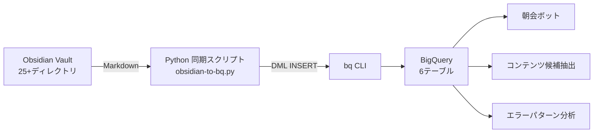

## はじめに --- なぜObsidianのデータを「外に出す」のか

Obsidianで開発ログを蓄積していると、あるとき壁にぶつかります。

「先月のセッションで学んだことTOP5は？」「最近よく遭遇するエラーのパターンは？」「記事のネタ候補、いま何件あるっけ？」

Vault内の全文検索は優秀。でも「集計」ができない。Dataviewプラグインで簡易的なクエリは書けるものの、テーブル間の結合や時系列集計、外部サービスとの連携になると途端に限界が見える。2025年5月にEarly AccessとしてリリースされたObsidian Basesコアプラグインも、プロパティベースのフィルタ・ソートには便利だが、SQLで自在にクエリを書くような分析には向いていない。

私は合同会社コラレイトデザインを1人で運営しているエンジニア。日々の開発セッション、得られた知見、意思決定、エラー対処――これらすべてをObsidianに記録。しかし「蓄積」はできても「分析・活用」が追いつかない状態がしばらく続いていた。

解決策として構築したのが、ObsidianのMarkdownファイルをパースしてBigQueryに構造化同期するパイプライン。Pythonスクリプトがセッション記録やナレッジを読み取り、bq CLI経由でBigQueryにINSERT。launchdで毎朝自動実行することで、「第二の脳」がSQLでクエリ可能なデータベースに変わりました。

:::message
本記事では、実際に稼働中のシステムをベースに実装の要点を解説。現時点でセッション27件、学び204件、ナレッジ37件、コンテンツ候補36件がBigQueryに同期中。
:::

## アーキテクチャ概要

### 全体像



### 6テーブル構成

パイプラインが同期するのは以下の6テーブル。Obsidianのディレクトリ構造と1対1で対応する設計にしています。

| テーブル | ソース | 主な用途 |
|:--|:--|:--|
| `session_records` | `06_sessions/` | セッション履歴の時系列分析 |
| `learnings` | セッション記録から抽出 | 学びの蓄積・重複チェック |
| `knowledge_items` | `03_knowledge/` | ナレッジベースの棚卸し |
| `error_records` | `05_errors/` | エラーパターン分析 |
| `decision_records` | `04_decisions/` | 意思決定の追跡 |
| `content_candidates` | `#content-candidate` タグ | 記事候補の管理 |

### なぜBigQueryか

1人法人のDWHとしてBigQueryを選んだ理由は3つ。

1. コスト — 10GBまでストレージ無料、月1TBまでクエリ無料。ナレッジ同期の規模なら月額ほぼ0円
2. 標準SQL — 特殊な構文を覚える必要がなく、SQLの知識がそのまま活きる
3. GCPエコシステム — Cloud Run、Cloud Scheduler、GASとの連携が容易。朝会ボットやレポート自動化の基盤になります

## Obsidian側の設計 --- パース可能なMarkdownテンプレート

BigQueryに同期するためには、Markdownファイルが「パース可能な構造」を持っている必要がある。これがこのパイプラインの設計上もっとも重要なポイント。

### セクション分割の規約

すべてのテンプレートは `## 見出し` でセクションを分割する規約。パーサーは `## ` で始まる行をキーとして辞書に変換するため、見出し名がそのままフィールド名になります。

```markdown
# Session: Mac mini M4 Pro 初期セットアップ

- **Date**: 2026-02-07
- **Project**: correlate-workspace

## Goal
Mac mini M4 Proの開発環境を完全構築する

## Actions（詳細ログ）
### [09:30] Homebrewインストール
- pyenv, node, pnpm, git をインストール
...

## Learnings
- Google Driveで~/devを同期すると fileproviderd が暴走する
- npmのグローバルインストールで権限問題 → pnpmを使うべき

## Handoff（次回への引き継ぎ）
### 完了状態
- 基本環境構築は完了
```

### YAML Front Matterではなく本文パース方式を選んだ理由

ObsidianにはYAML Front Matterの仕組みがあり、メタデータ管理の正攻法。しかし本パイプラインでは、Front Matterではなく本文のMarkdown構造を直接パースする方式を採用しました。

理由は実用的なもの。

- セッション記録は「書きながら育てる」もの。Front Matterに都度メタデータを追記するのは運用負荷が高い
- `## Learnings` のように本文セクションから学びを抽出する処理は、Front Matterでは実現できない
- Claude Codeがセッション記録を書くとき、`## 見出し` ベースのテンプレートに沿うだけで自然に構造化データになる

### ファイルパスベースのID生成

冪等性を担保するために、各レコードのIDはファイルパスから生成している。

```python
def file_id(filepath: Path, prefix: str = '') -> str:
    return f'{prefix}{filepath.stem}'
```

セッション記録なら `SESSION-2026-02-07-mac-mini-setup`、ナレッジなら `KNOWLEDGE-patterns-content-pipeline-workflow` のようなID。同じファイルを何度同期しても同じIDが生成されるため、重複INSERTを防げます。

学びの項目については、テキスト内容のSHA256ハッシュ先頭16文字をID化。

```python
lid = hashlib.sha256(item.encode()).hexdigest()[:16]
learnings.append({
    'id': f'LEARNING-{lid}',
    'source_session': session['id'],
    ...
})
```

## Python同期スクリプトの実装

### 全体構造

同期スクリプト `obsidian-to-bq.py` は約500行で、大きく3つの層に分かれている。

1. bq CLIラッパー — `bq query` コマンドの実行、結果のJSON解析、SQLエスケープ
2. Markdownパーサー — 6種類のパーサー（session, knowledge, decision, error, learnings, candidates）
3. 同期エンジン — 冪等INSERT + UPDATE のロジック

### なぜbq CLIを使うのか

BigQueryのPython Client Library（`google-cloud-bigquery`）を使うのが普通の選択肢。しかし、本パイプラインではあえて `bq` CLIをsubprocessで呼び出す方式を採用しました。

理由はADC（Application Default Credentials）の問題。

Python Client Libraryを使うと、サービスアカウントキーの管理やADCの設定が必要になります。一方、`bq` CLIなら `gcloud auth login` さえ済んでいれば、追加の認証設定なしで動作します。1人法人の開発マシンで日次実行するスクリプトとして、この「設定の簡潔さ」は大きなメリットでした。

```python
def bq_query(sql: str, expect_json=True) -> list[dict] | bool:
    cmd = ['bq', 'query', '--use_legacy_sql=false']
    if expect_json:
        cmd.extend(['--format=json', '--max_rows=100000'])
    result = subprocess.run(
        cmd, input=sql, capture_output=True, text=True, timeout=120,
    )
    if result.returncode != 0:
        # エラーハンドリング...
        return False if not expect_json else []
    output = result.stdout.strip()
    if not output or output == '[]':
        return []
    return json.loads(output)
```

:::message alert
bq CLIをsubprocessで呼び出す方式は、SQLインジェクションのリスクがあります。本パイプラインでは自分のObsidian Vaultのみを処理するため許容していますが、外部入力を扱う場合はパラメータ化クエリを使用してください。
:::

### Markdownパーサーの実装

パースの基本は `## 見出し` による辞書変換。

```python
def parse_sections(content: str) -> dict[str, str]:
    """## 見出しでセクションを分割して辞書化"""
    sections = {}
    current_key = '_preamble'
    current_lines = []
    for line in content.split('\n'):
        m = re.match(r'^##\s+(.+)', line)
        if m:
            sections[current_key] = '\n'.join(current_lines).strip()
            current_key = m.group(1).strip()
            current_lines = []
        else:
            current_lines.append(line)
    sections[current_key] = '\n'.join(current_lines).strip()
    return sections
```

この関数をベースに、各パーサーがテーブルに必要なフィールドを抽出。セッション記録パーサーの場合、日付をファイル名から取得し、プロジェクト名を `**Project**: ` パターンから正規表現で抽出し、学び項目の数をカウントする、といった処理を行います。

テンプレートファイル（`{{date}}` のようなプレースホルダーを含むファイル）は自動的にスキップ。

```python
if '{{title}}' in content or '{{date}}' in content:
    return None  # テンプレートファイルはスキップ
```

### SQLエスケープ

地味だが重要な処理がSQLエスケープ。Obsidianの記録にはMarkdownの記法、コードブロック、改行が大量に含まれるため、エスケープ処理を正確に行わないとINSERTが失敗します。

```python
def escape_sql(value: str) -> str:
    if value is None:
        return ''
    return (str(value)
            .replace('\\', '\\\\')
            .replace("'", "\\'")
            .replace('\n', '\\n')
            .replace('\r', '\\r')
            .replace('\t', '\\t'))
```

### 冪等同期エンジン

同期エンジンの核となるのが `sync_table()` 関数。テーブルの既存IDを取得し、新規行はINSERT、既存行はUPDATEする冪等処理。

```python
def sync_table(table_name, rows, update_fields=None):
    existing = bq_get_existing_ids(table_name)  # 既存IDを取得
    new_rows = [r for r in rows if r['id'] not in existing]

    if new_rows:
        bq_insert_rows(table_name, new_rows)  # 新規のみINSERT

    if update_fields:
        for r in rows:
            if r['id'] in existing:
                # 更新対象フィールドのみUPDATE
                updates = {f: r[f] for f in update_fields if f in r}
                bq_update_row(table_name, r['id'], updates)
```

セッション記録のように「書きながら育てる」データは、`outcomes` や `learnings` フィールドが後から追記される。`update_fields` にこれらを指定しておくことで、再同期時に最新の内容で更新。

バッチサイズは5件。セッション記録はテキスト量が多く、1回のDML INSERTに含められるデータ量に上限があるため、少なめのバッチサイズで安定稼働させています。

## launchdによる日次自動実行

macOSでの定期実行には `launchd` を使用。`cron` ではなく `launchd` を選んだ理由は、macOSネイティブのジョブスケジューラであること、スリープからの復帰後にも実行されることです。

### plist設定

```xml
<?xml version="1.0" encoding="UTF-8"?>
<!DOCTYPE plist PUBLIC "-//Apple//DTD PLIST 1.0//EN"
  "http://www.apple.com/DTDs/PropertyList-1.0.dtd">
<plist version="1.0">
<dict>
    <key>Label</key>
    <string>com.correlate.obsidian-sync</string>

    <key>ProgramArguments</key>
    <array>
        <string>/Users/naoyayokota/.pyenv/shims/python3</string>
        <string>/Users/naoyayokota/dev/scripts/obsidian-to-bq.py</string>
    </array>

    <key>StartCalendarInterval</key>
    <dict>
        <key>Hour</key>
        <integer>9</integer>
        <key>Minute</key>
        <integer>30</integer>
    </dict>

    <key>StandardOutPath</key>
    <string>/Users/naoyayokota/dev/logs/obsidian-sync-stdout.log</string>
    <key>StandardErrorPath</key>
    <string>/Users/naoyayokota/dev/logs/obsidian-sync-stderr.log</string>

    <key>EnvironmentVariables</key>
    <dict>
        <key>PATH</key>
        <string>/usr/local/bin:/usr/bin:/bin:/opt/homebrew/bin:/Users/naoyayokota/.pyenv/shims:/Users/naoyayokota/.local/bin</string>
        <key>HOME</key>
        <string>/Users/naoyayokota</string>
    </dict>
</dict>
</plist>
```

### ハマりポイント: PATHの問題

launchdはログインシェルの環境変数を引き継がない。最初にこのスクリプトをlaunchdで実行したとき、`bq` コマンドが見つからないエラーに遭遇。

原因は `PATH` にpyenvのshimsやHomebrew のパスが含まれていなかったこと。plist内で `EnvironmentVariables` を明示的に設定することで解決している。特に `HOME` 環境変数も設定が必要。設定を忘れると、Pythonスクリプト内の `Path.home()` が期待通りに動作しません。

### 管理コマンド

```bash
# plistの読み込み（初回 or 変更後）
launchctl load ~/Library/LaunchAgents/com.correlate.obsidian-sync.plist

# 即時実行（テスト用）
launchctl start com.correlate.obsidian-sync

# 停止
launchctl unload ~/Library/LaunchAgents/com.correlate.obsidian-sync.plist

# ログ確認
tail -f ~/dev/logs/obsidian-sync-stdout.log
```

## BigQuery側のスキーマ設計

### テーブル定義

代表的なテーブルとして `session_records` のスキーマを示す。

```sql
CREATE TABLE IF NOT EXISTS `correlate-workspace.workspace.session_records` (
  id STRING NOT NULL,
  title STRING,
  date DATE,
  start_time STRING,
  project STRING,
  goal STRING,
  outcomes STRING,
  learnings STRING,
  handoff STRING,
  errors_encountered STRING,
  decisions_made STRING,
  file_path STRING,
  word_count INT64,
  action_count INT64,
  created_at TIMESTAMP,
  updated_at TIMESTAMP
);
```

### 設計上のポイント

#### ID設計

ファイルパスのstemをプレフィックス付きで使用。`SESSION-2026-02-07-mac-mini-setup` のように、人間が読んでも意味がわかるID。

#### 日付型の扱い

ファイル名やメタデータから日付を抽出する際、パース失敗の可能性がある。`SAFE.PARSE_DATE` を使うことで、パース失敗時にエラーではなくNULLが入ります。

```python
# INSERT文の中で
vals.append(f"SAFE.PARSE_DATE('%Y-%m-%d', '{escape_sql(v)}')")
```

#### テキスト長の制限

セッション記録の `outcomes` や `learnings` は数千文字になることがある。bq CLIのDML INSERTにはリクエストサイズの上限があるため、各フィールドに文字数制限を設けています（title: 500文字、content系: 2,000〜5,000文字）。

## 活用事例 --- BQに入れたデータをどう使うか

データを構造化してBigQueryに入れることがゴールではない。「入れた後に何ができるか」がこのパイプラインの本当の価値。

### 前日のセッション要約

```sql
SELECT
  title,
  goal,
  outcomes,
  action_count
FROM `correlate-workspace.workspace.session_records`
WHERE date = DATE_SUB(CURRENT_DATE('Asia/Tokyo'), INTERVAL 1 DAY)
ORDER BY start_time;
```

朝会ボットがこのクエリを実行し、前日の作業概要をDiscordに通知する仕組みを構築している。1人法人では「昨日の自分」が「今日の自分」に引き継ぎをする必要があるため、この自動要約は実務的に役立っています。

### 今週の学びTOP5

```sql
SELECT
  title,
  source_session,
  discovered_at
FROM `correlate-workspace.workspace.learnings`
WHERE discovered_at >= DATE_SUB(CURRENT_DATE('Asia/Tokyo'), INTERVAL 7 DAY)
ORDER BY discovered_at DESC
LIMIT 5;
```

### コンテンツ候補の一覧

```sql
SELECT
  title_suggestion,
  source_file,
  discovery_date
FROM `correlate-workspace.workspace.content_candidates`
WHERE status = 'candidate'
ORDER BY discovery_date DESC;
```

このクエリで記事候補を引き出し、リサーチ→ドラフト→レビューのコンテンツパイプラインに流し込んでいる。実はこの記事自体も、`content_candidates` テーブルから抽出された候補の1つです。

### Obsidian単体 vs BigQuery連携

既存のアプローチとの比較を整理。

| 観点 | Obsidian Dataview | Obsidian Bases | BigQuery連携 |
|:--|:--|:--|:--|
| クエリ言語 | DQL（独自） | GUIフィルタ | 標準SQL |
| 集計関数 | 限定的 | 限定的 | 全SQL関数 |
| テーブル結合 | 不可 | 不可 | JOIN自由 |
| 外部連携 | なし | なし | GCPエコシステム全体 |
| リアルタイム性 | 即時 | 即時 | 日次バッチ |
| セットアップ | プラグイン追加のみ | コア機能 | Python + GCP |

リアルタイム性ではObsidian内ツールが圧倒的に有利。一方、「先月の学びをカテゴリ別に集計」「エラーの再発頻度を時系列で追跡」「コンテンツ候補をステータス別に管理」といった分析業務は、BigQueryの方が格段にやりやすい。用途に応じた使い分けが重要。

## ハマりポイントと対処法

実装中に遭遇した問題を共有。

### 1. 改行を含むテキストのSQLエスケープ

Obsidianの記録にはMarkdownの改行が大量に含まれる。改行をそのままSQL文字列リテラルに入れると構文エラー。`\n` → `\\n` のエスケープを忘れるとINSERTが黙って失敗するため、早期に気づきにくい問題。

### 2. bq CLIの空結果のハンドリング

`bq query --format=json` の出力が空のときの挙動が微妙。結果が0行の場合、空文字列または `[]` が返る。JSONパースする前にこのケースを明示的にハンドリングしておかないと、`json.JSONDecodeError` が発生。

```python
output = result.stdout.strip()
if not output or output == '[]':
    return []
return json.loads(output)
```

### 3. テンプレートファイルの誤パース

Obsidianのテンプレートには `{{date}}` や `{{title}}` のようなプレースホルダーが含まれる。これをそのままパースすると、日付がNULLのセッション記録がBigQueryに入ってしまう。ファイル先頭200文字に `{{` が含まれるファイルはスキップする処理を入れています。

### 4. DML INSERT vs ストリーミングINSERT

BigQueryにはストリーミングINSERT APIがあるが、本パイプラインではDML INSERT（`INSERT INTO` 文）を使用。ストリーミングINSERTではコピー・エクスポート操作で最大90分のディレイが生じるため、日次バッチ同期ならDML INSERTの方がシンプルで確実です。

## まとめ --- 「第二の脳」をデータベース化する意味

Obsidianは「考える場所」。思考を整理し、知見を蓄積し、次のアクションを計画する場。一方でBigQueryは「分析する場所」です。蓄積されたデータを横断的にクエリし、パターンを発見し、次の施策に活かす。

この2つをパイプラインで接続することで、PKMは「閉じた記録システム」から「開いたデータ基盤」に変わる。

1人法人にとって、自分の知的資産は最大の競争優位。「何を学んだか」「どんな判断をしたか」「どこでつまずいたか」を構造化して検索可能にすることは、自分自身のナレッジマネジメントそのもの。

本記事で紹介したパイプラインはまだ発展途上。今後は以下の展開を予定しています。

- 朝会ボット — BigQueryの日次サマリーをDiscordに自動配信し、「今日やるべきこと」を提案
- コンテンツ自動生成 — `content_candidates` テーブルから記事候補を抽出し、リサーチ→ドラフト→レビューの半自動パイプラインを構築
- エラーパターン分析 — `error_records` の再発頻度を分析し、予防策の優先順位を決定

「ObsidianとBigQueryをつなぐ」というニッチな組み合わせだが、PKMの蓄積に課題を感じている方の参考になれば幸いです。

## 参考資料

- [bq command-line tool reference（Google Cloud）](https://docs.cloud.google.com/bigquery/docs/reference/bq-cli-reference)
- [Creating Launch Daemons and Agents（Apple Developer）](https://developer.apple.com/library/archive/documentation/MacOSX/Conceptual/BPSystemStartup/Chapters/CreatingLaunchdJobs.html)
- [Obsidian YAML Front Matter](https://help.obsidian.md/Advanced+topics/YAML+front+matter)
- Tiago Forte『Building a Second Brain』--- 「第二の脳」概念の原典
