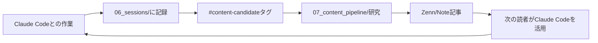

## はじめに — AIの作業ログはどこに消えるのか

Claude Codeで何時間もかけてデバッグした。複雑なアーキテクチャの設計判断を下した。難解なエラーの原因をようやく突き止めた。

翌朝、それらはすべて「過去のセッション」として消える。

Claude Codeはセッションをまたいだ記憶を持たない。「あのときなんて解決したっけ」と思っても、チャット履歴をスクロールするしかない状況が続いていました。

私はObsidian歴3年、Claude Code歴約6ヶ月の1人法人エンジニア。試行錯誤の末に行き着いたのが、 **MCP不要・プラグイン不要 ** でClaude Codeの作業ログをObsidianに自動蓄積する仕組みです。

本記事では、その全貌を実際のVault構造・テンプレート・CLAUDE.mdの中身まで含めて公開します。

:::message
現在のVaultには87,716ファイル・10.3GiBのデータが蓄積。セッション記録だけでも200件を超え、実際に稼働している仕組みとして紹介します。
:::

## なぜMCPを使わないのか

Obsidian × Claude Codeの連携を検索すると、MCP（Model Context Protocol）を使った記事が多く出てきます。MCPのObsidianプラグインを使えば、ノートの読み書きをよりシームレスに行える — それは事実です。

ただし、MCPには現実的な課題があります。

- プラグインのセットアップと維持コストが発生する
- プラグインのバージョンアップでClaude Codeとの互換性が壊れることがある
- セッション中にMCPサーバーが落ちると作業が止まる

Claude Codeはデフォルトで ** ファイルシステムへの読み書き権限 ** を持っています。つまり、ObsidianのVault（ただのディレクトリ）に対して、Claude Codeが直接Markdownファイルを読み書きできる。この当たり前の事実に気づいたとき、MCPは必要ないと判断しました。

```bash
# ObsidianのVaultはただのディレクトリ
ls ~/dev/Obsidian/
# → 06_sessions/  03_knowledge/  05_errors/ ...
```

---

## Vault構造の全体像

Vaultを10層のディレクトリで構成しています。Claude Codeが読み書きする主要ディレクトリに絞って紹介します。

```
~/dev/Obsidian/
├── 00_inbox/          ← 未整理メモ（Claudeがアイデアを投げる場所）
├── 01_dashboard/      ← Weekly/Monthlyレビュー
├── 02_projects/       ← プロジェクト別ノート
├── 03_knowledge/      ← ナレッジベース（How-toと概念の整理）
├── 04_decisions/      ← 意思決定記録（Three Options Ruleの結果）
├── 05_errors/         ← エラー記録・再発防止策
├── 06_sessions/       ★ セッション記録（最重要）
│   └── 2026/
│       └── 04/
│           └── 2026-04-07-bigquery-schema-redesign.md
├── 07_content_pipeline/  ← 記事リサーチ・執筆中
│   ├── research/      ← リサーチノート（本記事のソース）
│   └── drafts/        ← 執筆中の原稿
├── 08_references/     ← 参考文献・ブックマーク
└── 09_templates/      ← テンプレート集
```

ポイントは`06_sessions/`です。Claude Codeとの作業は ** 必ずここに記録 ** されます。

---

## セッションテンプレートの設計

`09_templates/session-template.md`を用意しておき、作業開始時にClaude Codeがコピーして使います。

```markdown
---
date: {{date}}
project: {{project}}
status: in-progress
model: claude-sonnet-4-6
duration_min: 0
---

# {{date}} — {{title}}

## 目的
- 

## 作業ログ（逐次更新）
<!-- Claude Codeがここに随時追記する -->

### {{time}} 開始

## 得られた知見
- 

## エラー・詰まった点
| エラー | 原因 | 解決策 |
|--------|------|--------|
|        |      |        |

## 意思決定
| 選択肢 | 選んだ理由 |
|--------|------------|
|        |            |

## 次回タスク
- [ ] 

## コンテンツ候補
#content-candidate
- 
```

このテンプレートのポイントは「 ** 作業ログ（逐次更新） ** 」セクションです。

---

## 逐次書き込み戦略 — 最も重要な設計判断

Claude Codeのセッションは突然終わることがあります。コンテキスト上限、ネットワーク切断、macOSのスリープ。まとめ書きを採用していると、記録を残す前に全データが消えます。

そこで採用しているのが ** 逐次書き込み ** です。

### CLAUDE.mdへの記載

`~/.claude/CLAUDE.md`に以下を記載することで、Claude Codeが自律的に記録を維持するようになります。

```markdown
## セッション記録ルール

1. 作業開始時にセッションファイルを作成する
   - パス: ~/dev/Obsidian/06_sessions/YYYY/MM/YYYY-MM-DD-{slug}.md
   - テンプレート: ~/dev/Obsidian/09_templates/session-template.md

2. 重要な作業・判断・エラーが発生するたびに随時追記する
   - git commit前、エラー解決時、設計判断時は必ず書く

3. セッション終了時にステータスをcompletedに更新する
```

この3行のルールを`CLAUDE.md`に書くだけで、Claude Codeはセッションファイルへの逐次書き込みを実行するようになります。

### 実際の逐次書き込みの様子

作業中のセッションファイルはリアルタイムで更新されます。

```markdown
## 作業ログ（逐次更新）

### 10:32 開始
BigQueryのスキーマ再設計に着手。

### 10:48 調査完了
既存テーブルの確認。`sessions`テーブルに`model`カラムが欠落していることを確認。
ALTER TABLE構文ではBigQueryでは列追加のみ可能、削除不可。

### 11:05 設計決定
新テーブル`sessions_v2`を作り、旧テーブルのデータをMERGEで移行する方針に。
→ 意思決定記録: 04_decisions/2026-04-07-bq-schema-v2.md

### 11:23 エラー発生
```
DML statements cannot modify data produced by streaming inserts...
```
ストリーミングINSERTされたデータへのMERGEが制約に引っかかる。

### 11:41 解決
MERGE前に`_PARTITIONDATE`フィルタを追加することで回避。
→ エラー記録: 05_errors/bq-streaming-merge-error.md
```

このレベルの粒度で記録が残ります。

---

## エラー記録テンプレート

エラーが発生したとき、`05_errors/`に専用ファイルを作成します。

```markdown
---
date: 2026-04-07
status: resolved
tags: [bigquery, streaming, dml]
project: obsidian-bq-sync
---

# BigQuery: ストリーミングINSERTデータへのMERGE制約

## エラーメッセージ
```
DML statements cannot modify data produced by streaming inserts within
the last 90 minutes in the destination table.
```

## 発生条件
- テーブルにストリーミングINSERTで書き込んだ直後にMERGEを実行
- BigQueryのストリーミングバッファがフラッシュされるまでの90分間が対象

## 解決策
```sql
MERGE dataset.target_table T
USING source_query S
ON T.id = S.id
  AND T._PARTITIONDATE < CURRENT_DATE()  -- ← ここを追加
WHEN MATCHED THEN UPDATE ...
```

## 予防策
- バッチINSERT（bq CLI経由）を使用する場合はこの制約は発生しない
- ストリーミングを使う場合は90分のウォームアップ時間を設ける

## 参考
- [BigQuery DML制約](https://cloud.google.com/bigquery/docs/reference/standard-sql/dml-syntax)
```

このファイルが`05_errors/`に蓄積されると、次に同じエラーが起きたとき、Claude Codeが`CLAUDE.md`の指示に従ってここを参照し、即座に解決策を提示できます。

---

## CLAUDE.mdとの連携 — フィードバックループの核

エラー記録がClaude Codeの行動を変えるためには、`CLAUDE.md`への反映が必要です。

```markdown
## エラー対処時の参照先

エラーが発生した場合、まず以下を確認する:
1. ~/dev/Obsidian/05_errors/ を検索する
2. 同様のエラーが記録されていれば解決策を適用する
3. 新規エラーの場合は解決後に記録を作成する
```

これで「エラー発生 → 記録 → 次回はClaude Codeが自動参照 → 予防」のループが完成します。


---

## コンテンツパイプライン — 知識が自然に記事になる

セッション記録の末尾に`#content-candidate`タグをつける習慣があります。

```markdown
## コンテンツ候補
#content-candidate
- BigQueryのストリーミング制約とDML回避策（今日ハマった内容）
- ObsidianのVault構造をClaude Codeと設計した話
```

セッション終了後に私が実行するスキルが、このタグを検索してリサーチノートの候補リストに追加します。そのリサーチノートから、本記事のような技術記事が生まれる仕組みです。

ループとしてまとめると以下のようになります。



作業することが自動的にコンテンツ候補になる。この仕組みが「記事ネタがない」問題を解消しました。

---

## Claude Codeへの具体的な指示の渡し方

「セッション記録を残して」と毎回言うのは非効率です。`CLAUDE.md`に書いておくことで、Claude Codeが自律的に動くようになります。

### 実際のCLAUDE.md構成（抜粋）

```markdown
# ナレッジ管理ルール

## 作業開始時（必須）
1. 本日のセッションファイルが存在するか確認する
   - パス: ~/dev/Obsidian/06_sessions/{YYYY}/{MM}/{YYYY-MM-DD-slug}.md
2. 存在しない場合はテンプレートをコピーして作成する
3. 目的セクションに今回の作業内容を記載する

## 作業中（随時）
- 重要な発見・設計判断・エラー解決があれば即座にセッションファイルへ追記する
- "まとめて後で書く"は禁止。突然の終了でも記録が残る状態を維持する

## エラー発生時
1. まず ~/dev/Obsidian/05_errors/ を検索する（同様の記録があれば適用）
2. 新規エラーを解決した後は05_errors/にファイルを作成する
3. セッションファイルのエラーセクションにも記録する

## 作業終了時
1. セッションファイルの「得られた知見」「次回タスク」を更新する
2. コンテンツ候補があれば末尾に#content-candidateタグで記録する
3. statusをcompletedに変更する

## ナレッジベース参照
以下のディレクトリを作業開始時に必要に応じて参照する:
- ~/dev/Obsidian/03_knowledge/ : 技術的なHow-toと概念
- ~/dev/Obsidian/04_decisions/ : 過去の意思決定
```

この内容があることで、Claude Codeは「次に何をすべきか」を自律的に判断します。私がいちいち「記録して」と言わなくても済む状態です。

---

## 実際のセッション記録（例）

参考として、本記事のリサーチセッションのファイル冒頭を示します。

```markdown
---
date: 2026-02-07
project: mac-mini-setup
status: completed
model: claude-sonnet-4-6
duration_min: 180
---

# 2026-02-07 — Mac mini M4 Pro環境構築

## 目的
- Mac mini M4 Proの開発環境を一から構築する
- Obsidian × Claude Codeのワークフローを確立する

## 作業ログ（逐次更新）

### 09:15 開始
...（省略）

## 得られた知見
- CLAUDE.mdに書いたルールは次回セッションから即座に反映される
- 逐次書き込みはコンテキスト上限対策として非常に有効
- 05_errors/の蓄積がClaude Codeを賢くしていく実感がある

## コンテンツ候補
#content-candidate
- ObsidianとClaude Codeの連携ワークフロー（本記事の原型）
```

このノートが本記事の起点になっています。

---

## 導入手順まとめ

実際に試したい場合の手順です。

### Step 1: Vaultディレクトリを整備する

```bash
mkdir -p ~/obsidian-vault/{00_inbox,03_knowledge,04_decisions,05_errors,06_sessions,07_content_pipeline,09_templates}
mkdir -p ~/obsidian-vault/06_sessions/2026/04
```

### Step 2: テンプレートを配置する

`09_templates/session-template.md`に前述のテンプレートを配置します。

### Step 3: CLAUDE.mdに記録ルールを追加する

`~/.claude/CLAUDE.md`（グローバル設定）またはプロジェクトルートの`CLAUDE.md`（プロジェクト設定）に「ナレッジ管理ルール」セクションを追加します。

プロジェクト単位で設定したい場合はリポジトリルートに`CLAUDE.md`を置くと、そのディレクトリ内でClaude Codeを起動したときに自動的に読み込まれます。

### Step 4: 最初のセッションを作業してみる

```bash
cd ~/your-project
claude  # Claude Codeを起動
```

「今日からObsidianにセッション記録を残すようにしてください。パスは~/obsidian-vault/06_sessions/」と一度伝えれば、CLAUDE.mdに記録ルールを追記してくれます。

---

## よくある疑問

**Q: Obsidianを開いたまま作業してもファイル競合は起きないか？ **

起きません。ObsidianはMarkdownファイルをリアルタイムで読み取るため、Claude Codeが書き込んだ内容が即座にObsidianの画面に反映されます。双方向の同時書き込みをしない限り問題なし。

**Q: Syncthing/iCloud同期との相性は？ **

問題なく動作しています。Syncthingで2台のMac間を同期していますが、セッション記録がリアルタイムで別マシンに反映されるのは便利です。ただし同時編集は競合の原因になるため、作業中は1台への絞り込みが必要になる。

**Q: GPT-4oやGeminiでも同じことはできるか？ **

ファイルシステム操作権限があればどのAIでも原理的には同じことができます。ただし`CLAUDE.md`のようなメモリファイルはClaude Code固有の機能です。他のAIを使う場合は、システムプロンプトによる代替が現実的な手段になる。

---

## まとめ

MCP不要・プラグイン不要で実現できるObsidian × Claude Code連携の核心は、以下の3点です。

| 要素 | 役割 |
|------|------|
| `CLAUDE.md` | Claude Codeの行動ルールを定義する |
| `06_sessions/` テンプレート | 記録の構造を統一する |
| 逐次書き込みルール | データロストを防ぐ |

この仕組みを導入してから、「あのときの解決策はなんだったか」という問いへの答えが、常にObsidianにある状態になりました。Claude Codeとの作業が積み重なるほど、次の作業が効率的になる正のフィードバックループが機能しています。

セッション記録はそのまま記事のリサーチノートになり、本記事もその連鎖から生まれています。

---

## 参考リソース

- [Claude Code Memory管理 — 公式ドキュメント](https://docs.anthropic.com/en/docs/claude-code/memory)
- [GitHub: ballred/obsidian-claude-pkm](https://github.com/ballred/obsidian-claude-pkm) — スターターキット
- [GitHub: thedotmack/claude-mem](https://github.com/thedotmack/claude-mem) — セッションメモリ管理ツール
