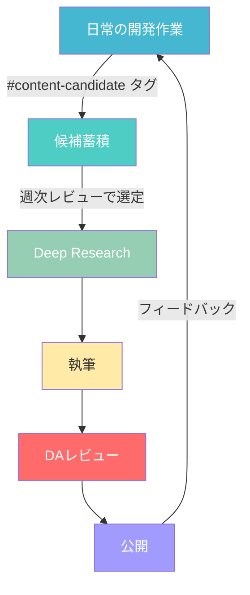

## はじめに

Claude Codeで開発セッションを重ねていると、あるとき気づく。「先週のセッションで何をやったか、思い出せない」。

AIとの対話は高速で進む。環境構築、バグ修正、設計判断、テンプレート作成――1回のセッションで数十のアクションが実行されることも珍しくありません。しかし、その記録がセッション終了とともに揮発してしまうなら、同じ失敗を繰り返すリスクが残り続ける。

:::message
本記事で紹介するのは、**MCPプラグインを使わない**連携方法です。Claude Codeのネイティブ機能（ファイル読み書き + CLAUDE.md参照）だけで、Obsidian Vaultへの自動蓄積を実現する。プラグイン設定のハードルなし、すぐに始められるアプローチ。
:::

ここでいう「自動蓄積」とは、CLAUDE.mdにルールを書いておくだけで、以降のセッションではClaude Codeが自律的にログを記録してくれる仕組みのこと。完全な無設定ではないけれど、一度ルールを整えれば毎回の手動指示は不要になる。

私が構築したのは、Obsidianの構造化されたVaultとClaude Codeの逐次書き込みを組み合わせた「知識の自動蓄積システム」。セッション記録、エラー対処、意思決定、そこから生まれる知見がVaultに流れ込み、次のセッションで参照される循環型の仕組みです。

本記事では、実際に運用しているVault構造、テンプレート、Claude Codeとの連携方法をすべて公開します。

## Obsidian Vault設計

### 全体構造

まず、Vault全体の構造から。番号付きの主要10ディレクトリに加え、補助ディレクトリを含む全13ディレクトリで構成されています。

```
~/dev/Obsidian/
├── 00_inbox/            ← 未分類の一時置き場
├── 01_daily/            ← 日次記録（日報・メモ）
├── 02_projects/         ← プロジェクト管理
├── 03_knowledge/        ← 知見・パターン・技術ノート
├── 04_decisions/        ← 意思決定記録
├── 05_errors/           ← エラー記録
├── 06_sessions/         ← AIセッション記録
├── 07_content_pipeline/ ← コンテンツ生成パイプライン
├── 07_references/       ← 外部参考資料
├── 08_strategy/         ← 戦略ドキュメント
├── 09_clients/          ← クライアント情報
├── 10_logs/             ← 各種ログ
└── _attachments/        ← 画像・添付ファイル
```

番号付きの命名には意味がある。Obsidianのサイドバーで自然にソートされ、情報の流れが上から下へ一目で把握できる構造。

### 5つの中核レイヤー

このうち、Claude Codeとの連携で特に重要なのが以下の5つ。


*5つの中核レイヤーとCLAUDE.mdを結ぶフィードバックループ*

| レイヤー | 役割 | 更新頻度 |
|----------|------|---------|
| `01_daily` | その日の計画・完了タスク・メモ | 毎日 |
| `06_sessions` | AIセッションの詳細ログ | セッションごと |
| `05_errors` | エラーの根本原因・再発防止策 | エラー発生時 |
| `03_knowledge` | パターン・技術ノート・アンチパターン | 知見獲得時 |
| `CLAUDE.md` | AIへの永続的な指示・ルール | ルール変更時 |

データの流れは一方通行ではありません。セッション記録からエラーや知見が抽出され、知見はCLAUDE.mdに反映され、次のセッションでClaude Codeが自動参照する。**フィードバックループが回る構造**、これがポイントです。

## テンプレート設計

各ディレクトリにはテンプレートを配置している。Claude Codeにテンプレートの場所を教えておくだけで、新しいファイルを作る際に自動的にテンプレートに沿った構造で記録してくれるようになります。

### セッション記録テンプレート

最も使用頻度が高く、設計にこだわったテンプレートがこれ。

:::details セッション記録テンプレート全文（クリックで展開）
```markdown
# Session: {{title}}

- **Date**: {{date}}
- **Duration**:
- **Agent**: Claude Code
- **Project**:
- **Previous Session**: [[前回セッションへのリンク]]

## Context（前回からの引き継ぎ）
前回セッションのHandoffから引き継いだ情報。
- 前回の完了状態
- 未解決の課題
- 今回の開始条件

## Goal
このセッションで達成する目標

## Actions（詳細ログ）
### [HH:MM] アクション名
- **背景**: なぜこの作業が必要か
- **判断**: 何を選択し、なぜその選択をしたか
- **実施**: 具体的に何をしたか
- **結果**: どうなったか
- **関連ファイル**: 変更・作成したファイル

## Outcomes
- 完了した成果物一覧

## Errors & Failures
### [エラー名]
- **症状**:
- **原因**:
- **対処**:
- **再発防止**: → [[03_knowledge/errors/error-YYYY-MM-DD-slug]]
- **学び**:

## Decisions Made
| 判断 | 選択肢 | 理由 | 記録 |
|------|--------|------|------|
| | | | [[04_decisions/...]] |

## Learnings
- 新しく学んだこと、気づき

## Handoff（次回への引き継ぎ）
### 完了状態
- 何が完了し、何が未完了か
### 未解決の課題
- 残っている問題とその状態
### 次回の最初にやるべきこと
1.
2.
### 環境の状態
- 特記事項（インストール途中、設定変更中等）
```
:::

特筆すべき設計判断が3つ。

**1. Handoffセクション**

セッションの引き継ぎ情報を構造化して残す仕組み。「完了状態」「未解決の課題」「次回最初にやること」「環境の状態」を明記する。次回セッション開始時、Claude CodeがこのHandoffを読むことで、文脈を失わずに作業を再開できます。

**2. Errors & Failuresセクション**

エラーが発生したらセッション記録内に即座に記録し、同時に `05_errors/` に独立したエラーファイルを作成する。Obsidianのリンク `[[03_knowledge/errors/...]]` で双方向参照を実現。

**3. Decisions Madeテーブル**

「何を、なぜ選んだか」をテーブル形式で記録。後から「あの判断の根拠は何だったか」を検索できる。判断記録は `04_decisions/` にも独立ファイルとして保存されます。

### エラー記録テンプレート

:::details エラー記録テンプレート全文
```markdown
# Error: {{title}}

- **Date**: {{date}}
- **Session**: [[06_sessions/...]]
- **Project**: [[02_projects/...]]
- **Severity**: Critical / High / Medium / Low

## 症状
何が起きたか（エラーメッセージ含む）

## 根本原因
なぜ起きたか

## 対処内容
どう解決したか

## 再発防止策
同じ問題を防ぐために何をすべきか

## チェックリスト
- [ ] 再発防止策を実施済み
- [ ] CLAUDE.mdまたはclaude.mdに反映済み
- [ ] 関連ドキュメントを更新済み
```
:::

ここで重要なのは**チェックリスト**。「CLAUDE.mdに反映済み」の項目がある。エラーの教訓をCLAUDE.mdに書き込むことで、次のセッション以降、Claude Codeが同じ失敗を予防してくれるようになるわけです。

### Daily記録テンプレート

```markdown
# {{date}}

## Today's Plan
- [ ]

## Sessions
<!-- AIセッションが自動追記 -->

## Completed
<!-- 完了タスク -->

## Notes
<!-- メモ -->

## Links
<!-- 作成・更新したファイルへのリンク -->
```

シンプルな構造ですが、`## Sessions` セクションにClaude Codeがセッションリンクを自動追記してくれる設計。一日のうちに複数セッションを行った場合でも、日次記録からすべて辿れる。

## Claude Codeとの連携方法

### 逐次書き込み戦略

Claude Codeとの連携で最も重要な設計判断が**逐次書き込み**。

:::message alert
Claude Codeのセッションは突然終了することがあります。トークン上限到達、ネットワーク切断、マシンのスリープ――理由はさまざま。セッション終了後にまとめて書き込む方式では、**未保存の作業ログがすべて失われる**リスクがある。
:::

そこで採用したのが「アクションを実行するたびに即座にObsidianファイルへ書き込む」方式。CLAUDE.mdに以下のルールを記載しています。

```markdown
## セッション記録ルール

- セッション開始時に 06_sessions/ にファイルを作成する
- 作業を実行するたびに Actions セクションに逐次追記する
- エラーが発生したら即座に Errors & Failures セクションに記録する
- セッション終了時に Handoff セクションを記述する
- **まとめて書かない。1アクションごとに書く。**
```

これにより、セッションが途中で落ちても直前のアクションまでの記録が残る。実際に6時間の長時間セッションでこの方式を運用し、途中でのデータロストはゼロでした。

### CLAUDE.mdによる自動参照

Claude Codeは起動時にプロジェクトルートの `CLAUDE.md` とホームディレクトリの `~/.claude/CLAUDE.md` を自動的に読み込みます[^1]。ここにObsidian Vaultの構造とルールを書いておけば、毎回指示しなくてもClaude Codeが適切なディレクトリに適切なフォーマットで記録してくれる。

[^1]: 正確には、Claude Codeはcwd（カレントワーキングディレクトリ）からルートディレクトリの直前まで再帰的に上方向を探索し、見つかったCLAUDE.mdとCLAUDE.local.mdをすべて読み込みます。子ディレクトリのCLAUDE.mdはオンデマンド読み込み。`~/.claude/CLAUDE.md`はUser memoryとして全プロジェクト共通で適用される仕組み。

私のCLAUDE.mdには以下のようなセクションがあります。

```markdown
## ナレッジ管理の使い分け

| 保管場所 | 用途 | 例 |
|----------|------|-----|
| Obsidian/ | 作業ログ・セッション記録・日々の知見 | セッション記録、日報、意思決定記録 |
| knowledge_base/ | 自作の体系化されたフレームワーク | AIワークフロー、技術ナレッジ |
| reference_knowledge/ | 外部から収集した参考資料 | 記事、論文、仕様書 |
```

Claude Codeはこのテーブルを参照し、「この情報はObsidianに書くべきか、knowledge_baseに書くべきか」を自律的に判断してくれる。手動での振り分け指示が不要になるわけです。

### auto memoryとの棲み分け

Claude Codeには `auto memory` という自動記憶機能があり、プロジェクトのパターンやコマンド、ユーザーの好みを `~/.claude/projects/<project>/memory/` に自動保存してくれます[^2]。

[^2]: auto memoryはClaude Codeが作業中に発見した情報（プロジェクトパターン、デバッグの知見、アーキテクチャのメモなど）を自動的にメモとして保存する仕組み。MEMORY.mdの先頭200行がセッション開始時にシステムプロンプトに読み込まれ、詳細なトピックファイルはオンデマンドで参照される。

ではObsidian記録との棲み分けはどうするか。

| 記録方式 | 何を記録するか | 永続性 |
|----------|---------------|--------|
| auto memory | プロジェクト固有のパターン・コマンド・好み | プロジェクト単位 |
| Obsidian Session記録 | セッションの詳細アクションログ・判断・エラー | 永久 |
| Obsidian Knowledge | 汎用的な知見・再利用可能なパターン | 永久 |
| CLAUDE.md | AIへの明示的なルール・指示 | 手動更新 |

auto memoryは便利だけれど、「何がどう記録されたか」が不透明なところがある。Obsidianへの構造化された記録は、人間が後から検索・参照する前提で設計されているもの。両者は補完関係にあります。

## フィードバックループ

この仕組みの真価は、**情報が一方通行にならず循環する**こと。


*エラー→Knowledge→CLAUDE.md→次セッション予防の循環*

具体例で説明しましょう。

実際に起きたケースとして、Google Drive File Streamで `~/dev/` を同期しようとしたところ、`fileproviderd` が167GBの書き込みを発生させてマシンが不安定になった事件がありました。

1. **セッション記録**: `06_sessions/` にエラー発生時の状況を逐次記録
2. **エラー記録**: `05_errors/` に根本原因と対処を構造化して保存
3. **知見化**: `03_knowledge/` に「Google Driveで開発フォルダを同期するのは絶対禁止」というパターンを記録
4. **CLAUDE.md反映**: 「`~/dev/` はGoogle Driveから除外済み」というルールをCLAUDE.mdに追記
5. **次回セッション**: Claude Codeが起動時にこのルールを読み込み、Google Drive同期を提案しなくなる

エラーが発生するたびにこのループが回ることで、**Vaultが「組織の記憶」として成長していく**。同じ失敗を二度としない仕組みがテンプレートレベルで組み込まれているわけです。

## 実践例: セッション記録の実際

ここで、実際のセッション記録から一部を抜粋して紹介します。Mac mini M4 Proの環境構築を行った6時間のセッション記録。

### メタ情報

```markdown
# Session: Mac mini M4 Pro 環境構築

- **Date**: 2026-02-07
- **Duration**: 約6時間
- **Agent**: Claude Code
- **Project**: mac-mini-setup
- **Previous Session**: なし（初回セッション）
```

### Actionsセクション（抜粋）

セッション中に逐次追記された内容の一部。

```markdown
## Actions（詳細ログ）
- Syncthing設定（除外、バージョン管理30日）
- Python 3.12.0（pyenv）インストール
- pnpm / TypeScript / ts-node インストール
- claude.md作成・マージ（15セクション）
- ~/.claude/CLAUDE.md（グローバルルール）作成
- Obsidianフォルダ構成初期化（25ディレクトリ、5テンプレート）
- Agent Teams動作テスト
- セキュリティP0対応: .env権限修正（16ファイル→600）
```

1回のセッションで30以上のアクションが記録されている。これがすべて逐次書き込みで蓄積されたもの。

### Errors & Failuresセクション（抜粋）

```markdown
## Errors & Failures
### Google Drive cp -R大量エラー
- **症状**: Google Drive File Streamでのcp -Rが大量エラー
- **原因**: fileproviderd が167GB書き込む問題
- **対処**: rsync + node_modules除外で対応
- **再発防止**: → [[03_knowledge/errors/error-2026-02-07-google-drive-dev-sync]]
- **学び**: Google Driveで開発フォルダを同期するのは絶対禁止
```

エラーが発生した時点でセッション記録に書き込み、同時に `03_knowledge/errors/` に独立ファイルを作成。Obsidianのリンクで双方向に辿れる仕組み。

### Handoffセクション（抜粋）

```markdown
## Handoff（次回への引き継ぎ）
### 完了状態
- 環境構築: 完了（全ツール動作確認済み）
- Obsidian Vault: 完了（25ディレクトリ、5テンプレート）
- Syncthing同期: 完了（87,716ファイル）

### 未解決の課題
- ChromaDB移行: MBP側操作が必要

### 次回の最初にやるべきこと
1. gh auth loginの手動実行
2. Obsidian記録構造の強化
```

次のセッション開始時、Claude Codeはこの Handoff を読んで「前回は環境構築が完了し、ChromaDB移行が未解決」という文脈を即座に把握してくれる。まるで引き継ぎメモ付きのペアプログラミングですよね。

## コンテンツパイプライン: 作業ログから記事を生成する

実は、本記事自体がこの仕組みから生まれたもの。

Obsidian Vaultには `07_content_pipeline/` というディレクトリがあり、日常の開発作業から自然にコンテンツ（記事）を生み出すエンドレスループを実現しています。



セッション記録の末尾に `#content-candidate` タグを付けるだけで候補が蓄積され、リサーチ→執筆→レビュー→公開のパイプラインに乗る仕組み。作業ログが自然と記事のネタになっていくというわけです。

実際のディレクトリ構成は以下の通り。

```
07_content_pipeline/
├── candidates/     ← 候補リスト管理
├── research/       ← リサーチノート（類似記事分析・SEO調査）
├── drafts/         ← 記事ドラフト（Zenn frontmatter形式）
├── published/      ← 公開済みメタデータ
└── templates/      ← リサーチ・ドラフトのテンプレート
```

この仕組みのおかげで、現時点で8本の記事候補がストックされている。セッション中に「これは記事になりそうだ」と思った瞬間にタグを打つだけ。後から「何を書こうか」と悩む必要がなくなりました。

## まとめ

- **Obsidian Vaultは番号付き10層構造で設計する**。サイドバーでの視認性と情報の流れを両立できる
- **テンプレートにHandoff・エラー・判断記録のセクションを組み込む**。構造化された記録が自動蓄積の鍵になる
- **逐次書き込み戦略を採用する**。セッション途中の突然終了でもデータが失われない
- **CLAUDE.mdにVault構造とルールを記載する**。Claude Codeが起動時に自動参照し、毎回指示しなくても適切に記録してくれる
- **フィードバックループを回す**。エラー→Knowledge→CLAUDE.md→次セッション予防の循環が、Vaultを「成長する記憶」に変える

> MCPプラグインや特別なツールは不要。Claude Codeのファイル読み書き機能とCLAUDE.md、そして構造化されたObsidian Vaultがあれば、AIとの作業ログは自動的に蓄積されていく。

## 参考資料

- [Claude Code Memory管理 公式ドキュメント](https://code.claude.com/docs/en/memory) -- CLAUDE.md、auto memory、session memoryの仕組み（階層的メモリシステムの全体像）
- [ballred/obsidian-claude-pkm（GitHub）](https://github.com/ballred/obsidian-claude-pkm) -- Obsidian + Claude Code PKMスターターキット
- [Agentic Knowledge Management: The Next Evolution of PKM](https://www.dsebastien.net/agentic-knowledge-management-the-next-evolution-of-pkm/) -- PKMの次の進化としてのAIエージェント連携
- [thedotmack/claude-mem（GitHub）](https://github.com/thedotmack/claude-mem) -- Claude Codeの自動セッション記録プラグイン
