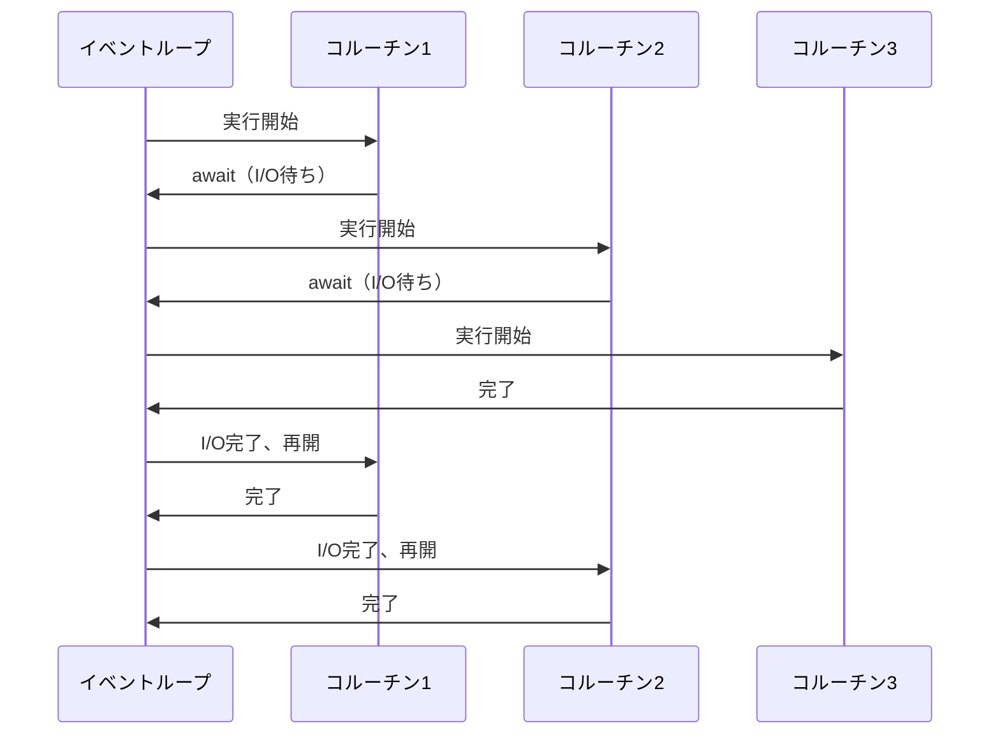
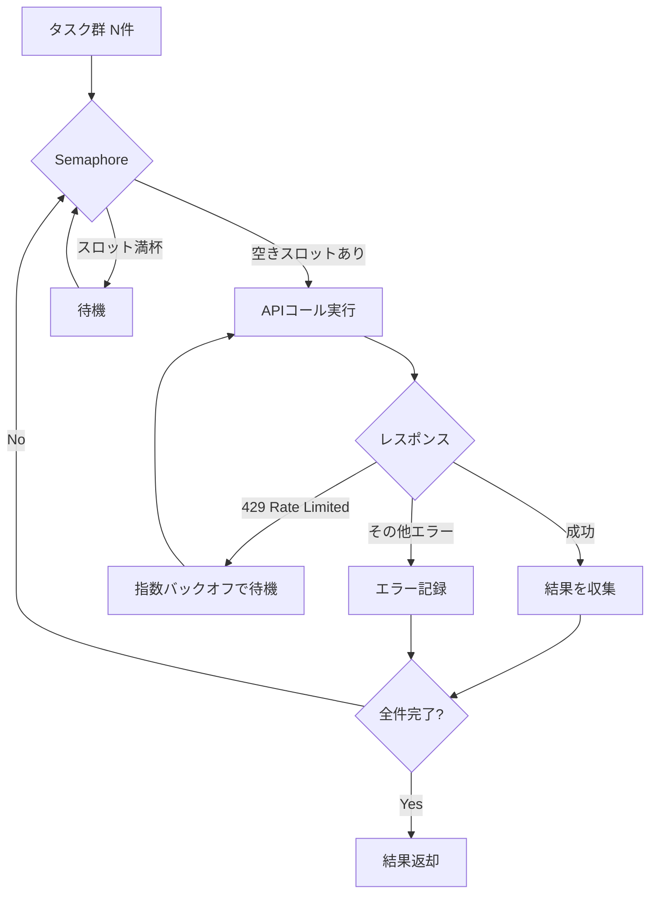

## はじめに

PythonでAPIを順番に呼び出していると、処理時間がボトルネックになる場面に必ず直面します。たとえば、100件のテキストをLLM APIで処理する場合、1件あたり2秒かかるとすると同期処理では合計200秒（約3.3分）かかります。しかしasyncioを使って並列化すれば、理論上は最遅リクエストの時間に近い2〜5秒程度で完了します。

```python
# 同期処理: 100件 × 2秒 = 200秒
for text in texts:
    result = call_api(text)  # ブロッキング

# asyncio並列: ほぼ最遅リクエストの時間で完了
results = await asyncio.gather(*[call_api(text) for text in texts])
```

この記事では、Pythonのasyncioを使った複数API並列呼び出しを体系的に解説します。基礎から始めて、`asyncio.gather()`、`asyncio.TaskGroup`（Python 3.11+）、`asyncio.Semaphore` によるレートリミット制御、そしてAnthropic APIなどのLLM APIの実践的な並列呼び出しパターンまでカバーします。

**対象読者**: Pythonでの同期的なAPI呼び出しに慣れており、並列化で処理速度を改善したいエンジニア

**動作環境**: Python 3.11以上

---

## asyncioの基礎

### async/await とコルーチン

asyncioでは、`async def` で定義した関数を**コルーチン**と呼びます。コルーチンはI/O待ち（ネットワーク通信など）の間に制御をイベントループに返し、他のコルーチンを実行させます。

```python
import asyncio

async def fetch_data(url: str) -> str:
    """非同期でデータを取得するコルーチン"""
    # awaitでI/O待ちの間、他のコルーチンが実行される
    await asyncio.sleep(1)  # ネットワーク通信のシミュレーション
    return f"data from {url}"

async def main() -> None:
    result = await fetch_data("https://example.com")
    print(result)

# イベントループを起動してコルーチンを実行
asyncio.run(main())
```

### イベントループの仕組み

asyncioはシングルスレッドで動作します。イベントループが複数のコルーチンを管理し、I/O待ちが発生したコルーチンを一時停止して別のコルーチンを実行します。



スレッドと異なり、コンテキストスイッチのオーバーヘッドがなく、競合状態（Race Condition）も起きにくいため、I/Oバウンドな処理に非常に適しています。

---

## asyncio.gather() でN個のAPIを並列呼び出し

### 基本的な使い方

`asyncio.gather()` は複数のコルーチンを同時に実行し、すべての結果をリストで返します。

```python
import asyncio
import time
from typing import Any

async def call_api(item_id: int, delay: float = 1.0) -> dict[str, Any]:
    """APIコール（シミュレーション）"""
    await asyncio.sleep(delay)
    return {"id": item_id, "result": f"processed_{item_id}"}

async def main() -> None:
    item_ids = list(range(10))

    # 同期処理（比較用）
    start = time.perf_counter()
    sequential_results = []
    for item_id in item_ids:
        result = await call_api(item_id)
        sequential_results.append(result)
    sequential_time = time.perf_counter() - start
    print(f"同期処理: {sequential_time:.2f}秒")  # 約10秒

    # asyncio.gather() で並列処理
    start = time.perf_counter()
    parallel_results = await asyncio.gather(
        *[call_api(item_id) for item_id in item_ids]
    )
    parallel_time = time.perf_counter() - start
    print(f"並列処理: {parallel_time:.2f}秒")  # 約1秒

asyncio.run(main())
```

### return_exceptions=True で個別エラー処理

デフォルトでは、1つのコルーチンが例外を発生させると `gather()` 全体が失敗します。`return_exceptions=True` を指定すると、例外をキャッチして結果リストに含めます。

```python
import asyncio

async def risky_api_call(item_id: int) -> dict[str, str]:
    """失敗する可能性があるAPIコール"""
    await asyncio.sleep(0.1)
    if item_id % 3 == 0:
        raise ValueError(f"API error for item {item_id}")
    return {"id": str(item_id), "status": "ok"}

async def main() -> None:
    item_ids = list(range(10))

    results = await asyncio.gather(
        *[risky_api_call(item_id) for item_id in item_ids],
        return_exceptions=True,  # 例外を結果として扱う
    )

    successes = []
    errors = []

    for item_id, result in zip(item_ids, results):
        if isinstance(result, Exception):
            errors.append({"id": item_id, "error": str(result)})
        else:
            successes.append(result)

    print(f"成功: {len(successes)}件, 失敗: {len(errors)}件")
    for error in errors:
        print(f"  エラー - ID:{error['id']}: {error['error']}")

asyncio.run(main())
```

---

## asyncio.TaskGroup（Python 3.11+）でエラーを適切に処理

### TaskGroupとは

Python 3.11で導入された `asyncio.TaskGroup` は、構造化並行性（Structured Concurrency）の考え方に基づいたタスク管理の仕組みです。`gather()` と異なり、コンテキストマネージャーとして使い、エラーが発生すると他のタスクを自動的にキャンセルします。

```python
import asyncio

async def process_item(item_id: int) -> dict[str, str]:
    """アイテムを処理するコルーチン"""
    await asyncio.sleep(0.5)
    return {"id": str(item_id), "status": "processed"}

async def main() -> None:
    results: list[dict[str, str]] = []

    async with asyncio.TaskGroup() as tg:
        tasks = [
            tg.create_task(process_item(item_id))
            for item_id in range(5)
        ]

    # TaskGroupを抜けた時点ですべてのタスクが完了
    results = [task.result() for task in tasks]
    print(f"処理完了: {len(results)}件")

asyncio.run(main())
```

### except* でエラーグループを処理

`TaskGroup` 内でエラーが発生すると `ExceptionGroup` として伝播します。Python 3.11+ の `except*` 構文で種類別に処理できます。

```python
import asyncio

async def flaky_task(task_id: int) -> str:
    """不安定なタスク"""
    await asyncio.sleep(0.1)
    if task_id == 2:
        raise ValueError(f"ValueError in task {task_id}")
    if task_id == 4:
        raise ConnectionError(f"ConnectionError in task {task_id}")
    return f"success_{task_id}"

async def main() -> None:
    try:
        async with asyncio.TaskGroup() as tg:
            tasks = [tg.create_task(flaky_task(i)) for i in range(6)]
    except* ValueError as eg:
        print(f"ValueError群: {eg.exceptions}")
    except* ConnectionError as eg:
        print(f"ConnectionError群: {eg.exceptions}")

asyncio.run(main())
```

### gather() vs TaskGroup の使い分け

| 観点 | asyncio.gather() | asyncio.TaskGroup |
|------|-----------------|-------------------|
| Pythonバージョン | 3.4+ | 3.11+ |
| エラー処理 | return_exceptions=True | except* 構文 |
| エラー時の動作 | 他タスクは継続（デフォルト） | 他タスクをキャンセル |
| 結果の取得 | 戻り値のリスト | task.result() |
| 推奨用途 | 部分失敗を許容する場合 | 全成功を前提とする場合 |

---

## asyncio.Semaphore でレートリミット制御

### Semaphoreの基本

`asyncio.Semaphore` は同時実行数を制限するための仕組みです。LLM APIのようにレートリミットがあるサービスへの並列リクエスト数を制御するのに最適です。

```python
import asyncio
import time

async def call_with_semaphore(
    semaphore: asyncio.Semaphore,
    item_id: int,
) -> dict[str, str]:
    """セマフォで同時実行数を制限したAPIコール"""
    async with semaphore:  # セマフォを取得（最大N個まで同時実行）
        await asyncio.sleep(0.3)  # APIコールのシミュレーション
        return {"id": str(item_id), "status": "ok"}

async def main() -> None:
    # 同時に5件まで並列実行
    semaphore = asyncio.Semaphore(5)
    item_ids = list(range(20))

    start = time.perf_counter()
    results = await asyncio.gather(
        *[call_with_semaphore(semaphore, item_id) for item_id in item_ids]
    )
    elapsed = time.perf_counter() - start

    # 20件を5並列で処理: 約4回の波 × 0.3秒 = 約1.2秒
    print(f"処理完了: {len(results)}件, 経過時間: {elapsed:.2f}秒")

asyncio.run(main())
```

### レートリミット制御フロー



### RPMベースのレートリミッター

より精密なレートリミット制御として、単位時間あたりのリクエスト数（RPM）を制限するパターンも紹介します。

```python
import asyncio
import time
from collections import deque

class RateLimiter:
    """RPM（Requests Per Minute）ベースのレートリミッター"""

    def __init__(self, rpm: int) -> None:
        self.rpm = rpm
        self.interval = 60.0 / rpm  # リクエスト間の最小間隔（秒）
        self._lock = asyncio.Lock()
        self._last_request_time: float = 0.0

    async def acquire(self) -> None:
        async with self._lock:
            now = time.monotonic()
            elapsed = now - self._last_request_time
            if elapsed < self.interval:
                await asyncio.sleep(self.interval - elapsed)
            self._last_request_time = time.monotonic()

async def call_api_with_rate_limit(
    limiter: RateLimiter,
    item_id: int,
) -> dict[str, str]:
    await limiter.acquire()
    await asyncio.sleep(0.1)  # 実際のAPIコール
    return {"id": str(item_id), "status": "ok"}

async def main() -> None:
    # 1分間に30リクエストまで
    limiter = RateLimiter(rpm=30)
    results = await asyncio.gather(
        *[call_api_with_rate_limit(limiter, i) for i in range(10)]
    )
    print(f"処理完了: {len(results)}件")

asyncio.run(main())
```

---

## httpx.AsyncClient で HTTP並列リクエスト

### httpx の基本

`httpx` は `requests` と互換性のあるHTTPクライアントで、非同期モードをサポートしています。`AsyncClient` をセッションとして再利用することでコネクションプーリングが効き、効率的なHTTP通信が可能です。

```python
import asyncio
import httpx

async def fetch_url(
    client: httpx.AsyncClient,
    url: str,
) -> dict[str, str | int]:
    """非同期HTTPリクエスト"""
    response = await client.get(url)
    response.raise_for_status()
    return {
        "url": url,
        "status": response.status_code,
        "content_length": len(response.text),
    }

async def main() -> None:
    urls = [
        "https://httpbin.org/delay/1",
        "https://httpbin.org/delay/1",
        "https://httpbin.org/delay/1",
    ]

    # AsyncClientをコンテキストマネージャーで使い、セッションを共有
    async with httpx.AsyncClient(
        timeout=httpx.Timeout(10.0),  # 全体タイムアウト10秒
    ) as client:
        results = await asyncio.gather(
            *[fetch_url(client, url) for url in urls]
        )

    for result in results:
        print(f"URL: {result['url']}, Status: {result['status']}")

asyncio.run(main())
```

### タイムアウトの細かい設定

```python
import asyncio
import httpx

# タイムアウトの詳細設定
timeout = httpx.Timeout(
    connect=5.0,   # 接続確立のタイムアウト
    read=30.0,     # レスポンス受信のタイムアウト
    write=10.0,    # リクエスト送信のタイムアウト
    pool=5.0,      # コネクションプールからの取得タイムアウト
)

async def fetch_with_timeout(url: str) -> str:
    async with httpx.AsyncClient(timeout=timeout) as client:
        try:
            response = await client.get(url)
            return response.text
        except httpx.TimeoutException as e:
            return f"タイムアウト: {e}"
        except httpx.HTTPStatusError as e:
            return f"HTTPエラー {e.response.status_code}: {e}"

asyncio.run(fetch_with_timeout("https://example.com"))
```

---

## Anthropic API / LLM API の並列呼び出し実装

### Anthropic APIの非同期クライアント

`anthropic` パッケージは `AsyncAnthropic` クライアントを提供しています。これを使うと、複数のテキストを並列でLLMに送信できます。

```python
import asyncio
import os
import anthropic

async def classify_text(
    client: anthropic.AsyncAnthropic,
    semaphore: asyncio.Semaphore,
    text: str,
    index: int,
) -> dict[str, str | int]:
    """テキストを非同期でLLMに分類させる"""
    async with semaphore:
        message = await client.messages.create(
            model="claude-opus-4-6",
            max_tokens=256,
            messages=[
                {
                    "role": "user",
                    "content": f"以下のテキストのセンチメントを「positive」「negative」「neutral」のいずれかで回答してください。テキスト:\n{text}",
                }
            ],
        )
        return {
            "index": index,
            "text": text[:50],
            "sentiment": message.content[0].text.strip(),
        }

async def batch_classify(texts: list[str]) -> list[dict[str, str | int]]:
    """複数テキストを並列でLLMに分類させる"""
    # APIキーは環境変数から取得
    api_key = os.environ.get("ANTHROPIC_API_KEY")
    if not api_key:
        raise ValueError("ANTHROPIC_API_KEY が設定されていません")

    # Tier 1: RPM=50を考慮して同時実行数を5に制限
    semaphore = asyncio.Semaphore(5)

    async with anthropic.AsyncAnthropic(api_key=api_key) as client:
        results = await asyncio.gather(
            *[
                classify_text(client, semaphore, text, i)
                for i, text in enumerate(texts)
            ],
            return_exceptions=True,
        )

    # エラーを除いた結果を返す
    return [r for r in results if not isinstance(r, Exception)]

async def main() -> None:
    sample_texts = [
        "この製品は素晴らしい！とても満足しています。",
        "サービスの対応が最悪でした。二度と使いません。",
        "普通の商品です。特に問題はありません。",
        "配送が早くて助かりました。ありがとうございます。",
        "品質に疑問があります。改善を期待します。",
    ]

    results = await batch_classify(sample_texts)
    for result in results:
        print(f"[{result['index']}] {result['text']}... → {result['sentiment']}")

asyncio.run(main())
```

### バッチ処理パターン（N件ずつ処理）

大量のリクエストを処理する場合、全件を一度にgatherするとメモリを圧迫することがあります。N件ずつバッチで処理するパターンが有効です。

```python
import asyncio
import os
import anthropic

async def summarize(
    client: anthropic.AsyncAnthropic,
    text: str,
) -> str:
    """テキストを要約する"""
    message = await client.messages.create(
        model="claude-opus-4-6",
        max_tokens=512,
        messages=[
            {
                "role": "user",
                "content": f"以下のテキストを2〜3文で要約してください:\n{text}",
            }
        ],
    )
    return message.content[0].text.strip()

async def process_in_batches(
    client: anthropic.AsyncAnthropic,
    items: list[str],
    batch_size: int,
) -> list[str | BaseException]:
    """N件ずつバッチで並列処理する関数"""
    all_results: list[str | BaseException] = []
    for i in range(0, len(items), batch_size):
        batch = items[i : i + batch_size]
        batch_results = await asyncio.gather(
            *[summarize(client, item) for item in batch],
            return_exceptions=True,
        )
        all_results.extend(batch_results)
        # バッチ間にインターバルを入れてレートリミットを回避
        if i + batch_size < len(items):
            await asyncio.sleep(1.0)
    return all_results

async def main() -> None:
    api_key = os.environ.get("ANTHROPIC_API_KEY")
    if not api_key:
        raise ValueError("ANTHROPIC_API_KEY が設定されていません")

    texts = [f"サンプルテキスト {i}" for i in range(20)]

    async with anthropic.AsyncAnthropic(api_key=api_key) as client:
        # 5件ずつバッチ処理
        results = await process_in_batches(client, texts, batch_size=5)

    print(f"要約完了: {len([r for r in results if not isinstance(r, Exception)])}件")

asyncio.run(main())
```

---

## タイムアウト設定とリトライロジック

### asyncio.timeout() でタイムアウト設定

Python 3.11では `asyncio.timeout()` コンテキストマネージャーが追加され、より直感的にタイムアウトを設定できます。

```python
import asyncio

async def slow_api_call(item_id: int) -> dict[str, str]:
    """時間のかかるAPIコール"""
    await asyncio.sleep(5)  # 意図的に遅くする
    return {"id": str(item_id), "status": "ok"}

async def call_with_timeout(item_id: int, timeout_sec: float = 3.0) -> dict[str, str]:
    """タイムアウト付きAPIコール（Python 3.11+）"""
    try:
        async with asyncio.timeout(timeout_sec):
            return await slow_api_call(item_id)
    except TimeoutError:
        print(f"タイムアウト: item_id={item_id}")
        return {"id": str(item_id), "status": "timeout"}

# Python 3.10以前の場合は asyncio.wait_for() を使う
async def call_with_wait_for(item_id: int, timeout_sec: float = 3.0) -> dict[str, str]:
    """タイムアウト付きAPIコール（3.10以前互換）"""
    try:
        return await asyncio.wait_for(slow_api_call(item_id), timeout=timeout_sec)
    except asyncio.TimeoutError:
        return {"id": str(item_id), "status": "timeout"}

asyncio.run(call_with_timeout(1))
```

### 指数バックオフ付きリトライ

```python
import asyncio
import random
import httpx

async def fetch_with_retry(
    client: httpx.AsyncClient,
    url: str,
    max_retries: int = 3,
    base_delay: float = 1.0,
) -> str:
    """指数バックオフ付きリトライロジック"""
    last_exception: Exception | None = None

    for attempt in range(max_retries + 1):
        try:
            response = await client.get(url)
            response.raise_for_status()
            return response.text

        except httpx.HTTPStatusError as e:
            if e.response.status_code == 429:
                # レートリミット: Retry-After ヘッダーを尊重
                retry_after = float(e.response.headers.get("retry-after", base_delay))
                wait_time = retry_after + random.uniform(0, 1)
                print(f"レートリミット (attempt {attempt + 1}): {wait_time:.2f}秒待機")
                await asyncio.sleep(wait_time)
                last_exception = e
            elif e.response.status_code >= 500:
                # サーバーエラー: 指数バックオフ
                wait_time = base_delay * (2 ** attempt) + random.uniform(0, 1)
                print(f"サーバーエラー {e.response.status_code} (attempt {attempt + 1}): {wait_time:.2f}秒待機")
                await asyncio.sleep(wait_time)
                last_exception = e
            else:
                # クライアントエラー: リトライしない
                raise

        except (httpx.ConnectError, httpx.TimeoutException) as e:
            wait_time = base_delay * (2 ** attempt) + random.uniform(0, 1)
            print(f"接続エラー (attempt {attempt + 1}): {wait_time:.2f}秒待機")
            await asyncio.sleep(wait_time)
            last_exception = e

    raise RuntimeError(f"最大リトライ回数超過: {last_exception}")

async def main() -> None:
    async with httpx.AsyncClient(timeout=httpx.Timeout(10.0)) as client:
        try:
            content = await fetch_with_retry(client, "https://httpbin.org/status/200")
            print(f"取得成功: {len(content)}バイト")
        except RuntimeError as e:
            print(f"失敗: {e}")

asyncio.run(main())
```

---

## よくある落とし穴と対処法

### 1. Jupyter環境でのasyncio.run()エラー

Jupyter NotebookやJupyterLabではすでにイベントループが動いているため、`asyncio.run()` を呼ぶと `RuntimeError: This event loop is already running` が発生します。

```python
# NG: Jupyter内でasyncio.run()は使えない
# asyncio.run(main())

# OK: Jupyterではawaitを直接使う
# await main()

# OK: nest_asyncioで既存ループを再利用（開発時のみ推奨）
# import nest_asyncio
# nest_asyncio.apply()
# asyncio.run(main())
```

### 2. ブロッキング関数の混入

`time.sleep()` や `requests.get()` などのブロッキング関数をasyncコルーチン内で呼ぶと、イベントループ全体がブロックされます。

```python
import asyncio
import time
import httpx

# NG: ブロッキング関数をasyncコルーチン内で使う
async def bad_function() -> None:
    time.sleep(1)          # イベントループ全体をブロック！
    # requests.get(url)    # 同様にブロック！

# OK: asyncioのスリープとhttpxを使う
async def good_function() -> None:
    await asyncio.sleep(1)  # 他のコルーチンに制御を返す
    async with httpx.AsyncClient() as client:
        await client.get("https://example.com")

# OK: CPUバウンドな処理はrun_in_executorでスレッドプールに委譲
async def cpu_bound_task() -> int:
    loop = asyncio.get_event_loop()
    # Pillowでの画像処理など
    result = await loop.run_in_executor(None, lambda: sum(range(10**7)))
    return result
```

### 3. return_exceptions=Trueの落とし穴

`return_exceptions=True` を使うと、例外がキャッチされず静かに失敗する場合があります。必ず結果のチェックを行いましょう。

```python
import asyncio

async def might_fail(item_id: int) -> dict[str, str]:
    if item_id % 2 == 0:
        raise ValueError(f"Even ID failed: {item_id}")
    return {"id": str(item_id)}

async def main() -> None:
    results = await asyncio.gather(
        *[might_fail(i) for i in range(5)],
        return_exceptions=True,
    )

    # 必ず例外チェックを行う
    failed = [r for r in results if isinstance(r, Exception)]
    succeeded = [r for r in results if not isinstance(r, Exception)]

    if failed:
        print(f"警告: {len(failed)}件失敗しました")
        for err in failed:
            print(f"  - {err}")

    print(f"成功: {len(succeeded)}件")

asyncio.run(main())
```

### 4. セマフォの解放漏れ

`asyncio.Semaphore` は必ず `async with` 構文で使いましょう。手動で `acquire()/release()` を使うと、例外発生時にリリース漏れが起きてデッドロックになります。

```python
import asyncio

semaphore = asyncio.Semaphore(5)

# NG: 手動acquire/release（例外でrelease漏れのリスク）
async def bad_pattern() -> None:
    await semaphore.acquire()
    # ここで例外が発生するとreleaseされない！
    await asyncio.sleep(1)
    semaphore.release()

# OK: async withで確実にリリース
async def good_pattern() -> None:
    async with semaphore:
        await asyncio.sleep(1)  # 例外が発生してもリリースされる
```

### 5. AsyncClientの毎回生成

`httpx.AsyncClient` を毎回生成するとコネクションプーリングの恩恵を受けられません。セッションを共有しましょう。

```python
import asyncio
import httpx

# NG: 毎回クライアントを生成（コネクションプーリングなし）
async def bad_fetch(url: str) -> str:
    async with httpx.AsyncClient() as client:  # 毎回新規接続
        response = await client.get(url)
        return response.text

# OK: クライアントを共有（コネクションプーリング有効）
async def main() -> None:
    urls = ["https://example.com"] * 10
    async with httpx.AsyncClient() as client:  # セッションを1つ作って共有
        results = await asyncio.gather(
            *[client.get(url) for url in urls]
        )

asyncio.run(main())
```

---

## まとめ

この記事では、Python asyncio を使った複数API並列呼び出しを体系的に解説しました。

| 手法 | 用途 | Pythonバージョン |
|------|------|-----------------|
| `asyncio.gather()` | 複数コルーチンの並列実行 | 3.4+ |
| `asyncio.TaskGroup` | 構造化並行性、エラー伝播 | 3.11+ |
| `asyncio.Semaphore` | 同時実行数の制限 | 3.4+ |
| `asyncio.timeout()` | タイムアウト設定 | 3.11+ |
| `httpx.AsyncClient` | 非同期HTTPリクエスト | - |
| `anthropic.AsyncAnthropic` | Anthropic API非同期クライアント | - |

### 実装時のチェックリスト

- `async def` コルーチン内でブロッキング関数（`time.sleep`, `requests.get`）を使っていないか
- `asyncio.Semaphore` は `async with` で使っているか
- `return_exceptions=True` を使った後に例外チェックを行っているか
- `httpx.AsyncClient` はセッションとして共有しているか
- APIキーは環境変数から取得しているか（ハードコード禁止）
- レートリミット対応として適切なSemaphore値またはRateLimiterを設定しているか

### 次のステップ

asyncioの並列化をマスターしたら、以下のトピックも検討してみてください。

- **tenacity ライブラリ**: より高機能なリトライロジック（デコレーターベース）
- **asyncio.Queue**: プロデューサー・コンシューマーパターンでのタスク管理
- **aiofiles**: ファイルI/Oの非同期化
- **Anthropic Batches API**: 大量バッチ処理向けの専用API（コスト50%削減）

I/Oバウンドな処理であれば、asyncioによる並列化でほぼ確実にスループットを向上させられます。ぜひ既存のAPIクライアントコードに適用してみてください。
