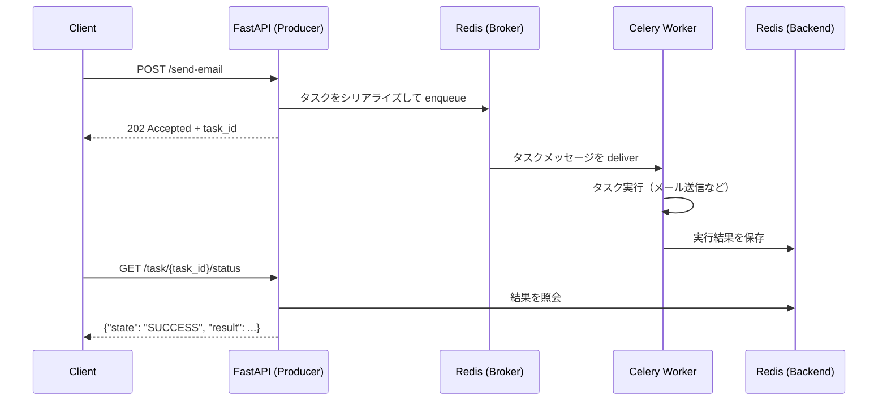
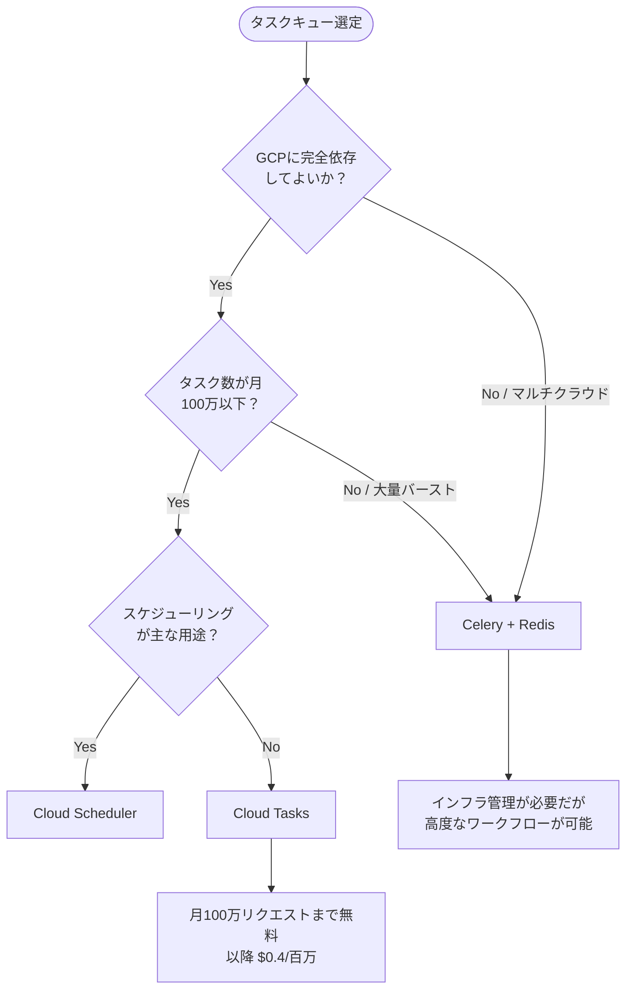

## はじめに

Webアプリケーションを本番運用していると、「レスポンスを返す前に重い処理が走る」という問題に必ず直面します。メール送信・PDF生成・外部API呼び出し・機械学習推論など、数秒〜数十秒かかる処理をリクエストスレッドで同期実行すると、ユーザー体験の悪化だけでなく、タイムアウトやサーバーリソースの枯渇につながります。

解決策が非同期タスクキューです。リクエストは即座にレスポンスを返し、重い処理はバックグラウンドで別プロセスが担う設計にします。

Python エコシステムでこの役割を担う代表格が Celery です。2009年に登場した Celery は2025年現在も活発に開発が続いており、バージョン5.5系では安定性・パフォーマンスともに高い水準を維持しています。本記事では Celery と Redis を組み合わせた実装を、セットアップから本番運用まで体系的に解説します。

## アーキテクチャ概要

Celery が扱う概念は4つです。

| コンポーネント | 役割 | 典型的な実装 |
|---|---|---|
| Producer | タスクを生成してキューに積む | FastAPI / Django |
| Broker | タスクメッセージを一時保存・配送する | Redis / RabbitMQ |
| Worker | キューからタスクを取り出して実行する | Celery Worker プロセス |
| Backend | タスクの実行結果を保存する | Redis / PostgreSQL |

処理の流れを図示します。



Broker と Backend の違いは混同しやすいポイントです。Broker はタスクの「配送」に特化した一方通行のメッセージキューです。Backend は「結果の永続化」を担い、Producer がポーリングで結果を取得するために使います。どちらも Redis を使うことはできますが、用途が異なるため概念上は分離して考えます。

## Celery vs Cloud Tasks — 使い分けの基準

フルマネージドなタスクキューとして Google Cloud Tasks も選択肢になります。判断基準を整理します。



| 観点 | Celery + Redis | Cloud Tasks |
|---|---|---|
| インフラ管理 | Redis・Worker の運用が必要 | フルマネージド |
| コスト（小規模） | Redis インスタンス費用が固定でかかる | 月100万リクエストまで無料 |
| ワークフロー | chain・group・chord で複雑な依存関係を組める | 単純な非同期実行のみ |
| スケジューリング | Celery Beat | Cloud Scheduler で代替 |
| ローカル開発 | Docker Compose で完結 | エミュレータが必要 |
| 適合シーン | 複雑なパイプライン・マルチクラウド・既存 Redis 活用 | GCP オールイン・シンプルな遅延実行 |

複雑なタスク依存関係や既存の Redis インフラがある場合は Celery が優位です。GCP で小規模なシンプル非同期処理であれば Cloud Tasks の方がコストと運用負荷の面で有利です。

## セットアップ

### インストール

```bash
pip install celery[redis] redis fastapi uvicorn
# モニタリング用
pip install flower
# スケジューリング用（django以外でも動作）
pip install celery[beat]
```

### プロジェクト構成

```
myapp/
├── celery_app.py      # Celery インスタンスと設定
├── tasks/
│   ├── __init__.py
│   ├── email_tasks.py
│   └── report_tasks.py
├── main.py            # FastAPI アプリ
└── docker-compose.yml
```

### Celery インスタンスの初期化

```python
# celery_app.py
from celery import Celery
import os

REDIS_URL = os.getenv("REDIS_URL", "redis://localhost:6379/0")

app = Celery(
    "myapp",
    broker=REDIS_URL,
    backend=REDIS_URL,
    include=["tasks.email_tasks", "tasks.report_tasks"],
)

app.conf.update(
    # シリアライザ設定
    task_serializer="json",
    accept_content=["json"],
    result_serializer="json",
    timezone="Asia/Tokyo",
    enable_utc=True,
    # 結果の保持期間（1日）
    result_expires=86400,
    # タスクが重複実行された場合の警告を抑制しない
    task_track_started=True,
    # ワーカーが一度に取得するタスク数（負荷分散の調整用）
    worker_prefetch_multiplier=1,
    # タスクが ACK されるタイミング（実行完了後を推奨）
    task_acks_late=True,
)
```

`task_acks_late=True` はワーカーがクラッシュした際のタスクロストを防ぐ重要な設定です。デフォルトでは Broker からタスクを受け取った時点で ACK されますが、このオプションを有効にすると実行完了後に ACK されるため、未完了タスクが再キューイングされます。

### Redis 接続の SSL 対応

本番環境では Redis が SSL 対応していることが多いです。

```python
import ssl

app.conf.update(
    broker_url="rediss://:password@your-redis-host:6380/0",
    result_backend="rediss://:password@your-redis-host:6380/0",
    broker_use_ssl={
        "ssl_cert_reqs": ssl.CERT_REQUIRED,
        "ssl_ca_certs": "/path/to/ca-cert.pem",
    },
    redis_backend_use_ssl={
        "ssl_cert_reqs": ssl.CERT_REQUIRED,
        "ssl_ca_certs": "/path/to/ca-cert.pem",
    },
)
```

スキームを `redis://` から `rediss://` に変えるだけで TLS が有効になります。

## タスクの定義と実行

### 基本的なタスク定義

```python
# tasks/email_tasks.py
from celery_app import app
import time


@app.task(name="tasks.send_welcome_email")
def send_welcome_email(user_id: int, email: str) -> dict:
    """ウェルカムメールを送信するタスク"""
    # 実際のメール送信処理（ここでは仮実装）
    time.sleep(2)  # 外部 SMTP への通信を模擬
    return {
        "status": "sent",
        "user_id": user_id,
        "email": email,
    }


@app.task(
    name="tasks.generate_report",
    bind=True,           # self（タスクインスタンス）を第1引数で受け取る
    max_retries=3,
    default_retry_delay=60,
)
def generate_report(self, report_id: int) -> dict:
    """レポート生成タスク（リトライ設定付き）"""
    try:
        # 重い処理
        time.sleep(5)
        return {"report_id": report_id, "url": f"/reports/{report_id}.pdf"}
    except Exception as exc:
        raise self.retry(exc=exc, countdown=2 ** self.request.retries * 10)
```

### タスクの実行方法

```python
# .delay() — 最もシンプルな非同期実行
result = send_welcome_email.delay(user_id=1, email="user@example.com")
print(result.id)  # "3e4a5b6c-..."（タスク ID）

# .apply_async() — 詳細オプションを指定する場合
result = send_welcome_email.apply_async(
    args=[1, "user@example.com"],
    countdown=30,          # 30秒後に実行
    expires=3600,          # 1時間以内に実行されなければ破棄
    queue="high_priority", # 特定のキューに送信
)

# 同期実行（テスト・デバッグ用）
result = send_welcome_email.apply(args=[1, "user@example.com"])
print(result.result)
```

### 結果の取得

```python
from celery.result import AsyncResult
from celery_app import app


def get_task_status(task_id: str) -> dict:
    result = AsyncResult(task_id, app=app)

    response = {"task_id": task_id, "state": result.state}

    if result.state == "PENDING":
        response["info"] = "タスクはキュー待ち、または存在しません"
    elif result.state == "STARTED":
        response["info"] = "実行中"
    elif result.state == "SUCCESS":
        response["result"] = result.result
    elif result.state == "FAILURE":
        response["error"] = str(result.info)
    elif result.state == "RETRY":
        response["info"] = "リトライ待ち"

    return response
```

## FastAPI との統合

FastAPI との統合では、タスクの投入エンドポイントと結果確認エンドポイントを分離するのが基本パターンです。

```python
# main.py
from fastapi import FastAPI, HTTPException
from pydantic import BaseModel
from celery.result import AsyncResult
from tasks.email_tasks import send_welcome_email, generate_report
from celery_app import app as celery_app

api = FastAPI()


class EmailRequest(BaseModel):
    user_id: int
    email: str


class TaskResponse(BaseModel):
    task_id: str
    status: str


@api.post("/users/{user_id}/welcome-email", response_model=TaskResponse, status_code=202)
async def enqueue_welcome_email(user_id: int, body: EmailRequest):
    """メール送信タスクをキューに積む（即座に 202 を返す）"""
    task = send_welcome_email.apply_async(
        args=[user_id, body.email],
        queue="email",
    )
    return TaskResponse(task_id=task.id, status="queued")


@api.get("/tasks/{task_id}", response_model=dict)
async def get_task_result(task_id: str):
    """タスクの状態と結果を返す"""
    result = AsyncResult(task_id, app=celery_app)

    if result.state == "PENDING":
        return {"task_id": task_id, "state": "PENDING"}
    elif result.state == "SUCCESS":
        return {"task_id": task_id, "state": "SUCCESS", "result": result.result}
    elif result.state == "FAILURE":
        raise HTTPException(
            status_code=500,
            detail={"task_id": task_id, "state": "FAILURE", "error": str(result.info)},
        )
    else:
        return {"task_id": task_id, "state": result.state}


@api.post("/reports", response_model=TaskResponse, status_code=202)
async def enqueue_report(report_id: int):
    task = generate_report.apply_async(args=[report_id], queue="reports")
    return TaskResponse(task_id=task.id, status="queued")
```

FastAPI の `BackgroundTasks` との違いに注意が必要です。`BackgroundTasks` はプロセス内で実行されるため、サーバーが落ちるとタスクが消えます。Celery は別プロセス（別コンテナ）で動作するため、耐障害性が高く、スケールアウトも容易です。

## タスクチェーン・グループ・コード

Celery Canvas を使うと複数タスクの依存関係を宣言的に記述できます。

### chain — 順次実行

```python
from celery import chain
from tasks.report_tasks import fetch_data, process_data, generate_pdf, notify_user

# 前のタスクの戻り値が次のタスクの第1引数に渡される
pipeline = chain(
    fetch_data.s(dataset_id=42),
    process_data.s(),
    generate_pdf.s(),
    notify_user.s(email="admin@example.com"),
)
result = pipeline.apply_async()
```

### group — 並列実行

```python
from celery import group

# 複数のタスクを同時に実行し、全結果をリストで返す
parallel_tasks = group(
    send_welcome_email.s(user_id=1, email="a@example.com"),
    send_welcome_email.s(user_id=2, email="b@example.com"),
    send_welcome_email.s(user_id=3, email="c@example.com"),
)
result = parallel_tasks.apply_async()
print(result.get())  # [{"status": "sent", ...}, ...]
```

### chord — 並列実行 + コールバック

```python
from celery import chord
from tasks.report_tasks import process_chunk, merge_results

# グループ全体が完了した後にコールバックを実行
workflow = chord(
    group(
        process_chunk.s(chunk_id=i)
        for i in range(10)
    ),
    merge_results.s(),  # 10タスクの結果リストを受け取る
)
result = workflow.apply_async()
```

chord でグループ内のいずれか1タスクが失敗するとコールバックは実行されません。後処理の `on_chord_error` を設定するか、個々のタスクにリトライを設定することで対処します。

## Celery Beat でのスケジューリング

Celery Beat はバッチ処理や定期レポート送信などのスケジューラーです。Beat プロセス自体はタスクを実行せず、スケジュールに従ってタスクをキューに積む役割だけを担います。

### スケジュール設定

```python
# celery_app.py に追記
from celery.schedules import crontab
from datetime import timedelta

app.conf.beat_schedule = {
    # 30秒ごとにヘルスチェック
    "health-check-every-30s": {
        "task": "tasks.health_check",
        "schedule": timedelta(seconds=30),
    },
    # 毎朝9時にデイリーレポートを生成（日本時間）
    "daily-report-at-9am": {
        "task": "tasks.generate_daily_report",
        "schedule": crontab(hour=9, minute=0),
        "args": ("daily",),
    },
    # 毎週月曜0時に週次集計
    "weekly-summary-monday": {
        "task": "tasks.generate_weekly_summary",
        "schedule": crontab(hour=0, minute=0, day_of_week="monday"),
    },
    # 毎月1日8時に請求書を生成
    "monthly-invoice-1st": {
        "task": "tasks.generate_invoices",
        "schedule": crontab(hour=8, minute=0, day_of_month="1"),
    },
}
```

### crontab のよく使うパターン

| 記述 | 実行タイミング |
|---|---|
| `crontab()` | 毎分 |
| `crontab(minute=0)` | 毎時0分 |
| `crontab(hour=8, minute=30)` | 毎日8:30 |
| `crontab(day_of_week="mon-fri", hour=9)` | 平日毎朝9時 |
| `crontab(day_of_month="1", hour=0)` | 毎月1日0時 |
| `crontab(month_of_year="1,7", day_of_month="1")` | 1月・7月1日 |

### Beat の起動

```bash
# Beat プロセスを起動（スケジューラー専用）
celery -A celery_app beat --loglevel=info

# Worker と Beat を同一プロセスで起動（開発・小規模用）
celery -A celery_app worker --beat --loglevel=info
```

本番環境では Beat と Worker は必ず別プロセスで動かします。Beat を複数インスタンス起動するとスケジュールが二重実行されるため、Beat は常に1インスタンスのみです。

## エラーハンドリングとリトライ

### autoretry_for による自動リトライ

```python
from celery_app import app
import requests
from requests.exceptions import ConnectionError, Timeout


@app.task(
    bind=True,
    autoretry_for=(ConnectionError, Timeout),  # これらの例外で自動リトライ
    retry_backoff=True,          # 指数バックオフを有効化
    retry_backoff_max=600,       # バックオフの上限（秒）
    retry_jitter=True,           # サンダリングハード防止のランダム揺らぎ
    max_retries=5,
    name="tasks.call_external_api",
)
def call_external_api(self, endpoint: str, payload: dict) -> dict:
    response = requests.post(endpoint, json=payload, timeout=30)
    response.raise_for_status()
    return response.json()
```

`retry_backoff=True` を設定すると、1回目のリトライは1秒後、2回目は2秒後、3回目は4秒後…と指数的に間隔が伸びます。`retry_jitter=True` はランダムな揺らぎを加えて、同時に失敗した大量タスクが一斉にリトライする「サンダリングハード」を防ぎます。

### 手動リトライと段階的バックオフ

```python
@app.task(bind=True, max_retries=3, name="tasks.process_payment")
def process_payment(self, order_id: int, amount: float) -> dict:
    try:
        result = payment_gateway.charge(order_id, amount)
        return {"order_id": order_id, "charge_id": result.id}
    except payment_gateway.RateLimitError as exc:
        # リトライ回数に応じてバックオフ時間を増やす
        delay = 2 ** self.request.retries * 10  # 10s, 20s, 40s
        raise self.retry(exc=exc, countdown=delay)
    except payment_gateway.CardDeclinedError:
        # リトライしても意味がないエラーは即座に失敗
        raise
```

### タスクのライフサイクルフック

```python
@app.task(
    bind=True,
    name="tasks.import_csv",
    on_failure=on_task_failure,  # 失敗時のフック
)
def import_csv(self, file_path: str) -> dict:
    ...


def on_task_failure(self, exc, task_id, args, kwargs, einfo):
    """タスク失敗時に Slack 通知を送る例"""
    slack_client.post_message(
        channel="#alerts",
        text=f"タスク失敗: {task_id}\n例外: {exc}\n引数: {args}",
    )
```

## Flower でのモニタリング

Flower は Celery のリアルタイム監視ダッシュボードです。Worker の状態・タスクのスループット・キューの深さを Web UI で確認できます。

### 起動方法

```bash
# 基本起動（:5555 でアクセス）
celery -A celery_app flower --port=5555

# 認証付き起動（本番環境では必須）
celery -A celery_app flower \
    --port=5555 \
    --basic_auth=admin:secretpassword \
    --url_prefix=flower  # リバースプロキシ配下の場合
```

### Flower API を使った自動化

Flower は REST API も提供しており、監視システムや CI パイプラインと連携できます。

```python
import httpx


async def get_celery_stats() -> dict:
    """Flower API からワーカー統計を取得"""
    async with httpx.AsyncClient() as client:
        resp = await client.get(
            "http://flower:5555/api/workers",
            auth=("admin", "secretpassword"),
        )
        return resp.json()


async def revoke_task(task_id: str) -> bool:
    """実行中・待機中のタスクをキャンセル"""
    async with httpx.AsyncClient() as client:
        resp = await client.post(
            f"http://flower:5555/api/task/revoke/{task_id}",
            json={"terminate": True},
            auth=("admin", "secretpassword"),
        )
        return resp.status_code == 200
```

### Cloud Run へのデプロイ

Flower を Cloud Run にデプロイする場合、認証は IAP（Identity-Aware Proxy）または Cloud Run の組み込み認証に任せ、`--basic_auth` は省略できます。

```dockerfile
# Dockerfile.flower
FROM python:3.12-slim
RUN pip install celery[redis] flower
CMD ["celery", "-A", "celery_app", "flower", "--port=8080", "--address=0.0.0.0"]
```

```yaml
# Cloud Run Service（gcloud run deploy コマンドの代わりに YAML で管理）
# gcloud run services replace flower-service.yaml
apiVersion: serving.knative.dev/v1
kind: Service
metadata:
  name: celery-flower
spec:
  template:
    spec:
      containers:
        - image: gcr.io/PROJECT_ID/celery-flower
          ports:
            - containerPort: 8080
          env:
            - name: REDIS_URL
              valueFrom:
                secretKeyRef:
                  name: redis-url
                  key: latest
```

## Docker Compose 構成

ローカル開発と CI で使える完全な Docker Compose 構成です。

```yaml
# docker-compose.yml
version: "3.9"

services:
  redis:
    image: redis:7-alpine
    ports:
      - "6379:6379"
    healthcheck:
      test: ["CMD", "redis-cli", "ping"]
      interval: 5s
      timeout: 3s
      retries: 5

  api:
    build: .
    command: uvicorn main:api --host 0.0.0.0 --port 8000 --reload
    ports:
      - "8000:8000"
    volumes:
      - .:/app
    environment:
      REDIS_URL: redis://redis:6379/0
    depends_on:
      redis:
        condition: service_healthy

  worker:
    build: .
    command: celery -A celery_app worker --loglevel=info --concurrency=4 -Q default,email,reports
    volumes:
      - .:/app
    environment:
      REDIS_URL: redis://redis:6379/0
    depends_on:
      redis:
        condition: service_healthy
    deploy:
      replicas: 2  # ワーカーを2台起動

  beat:
    build: .
    command: celery -A celery_app beat --loglevel=info --scheduler django_celery_beat.schedulers:DatabaseScheduler
    volumes:
      - .:/app
    environment:
      REDIS_URL: redis://redis:6379/0
    depends_on:
      redis:
        condition: service_healthy
    # Beat は必ず1インスタンスのみ
    deploy:
      replicas: 1

  flower:
    build: .
    command: celery -A celery_app flower --port=5555 --basic_auth=admin:dev_password
    ports:
      - "5555:5555"
    environment:
      REDIS_URL: redis://redis:6379/0
    depends_on:
      redis:
        condition: service_healthy
```

`worker` に `deploy.replicas: 2` を指定することで、ワーカーを2台並列で動かせます。各ワーカーは独立したプロセスとしてキューを監視し、水平スケールします。

キューの分離（`-Q default,email,reports`）は重要な設計ポイントです。重要度の高いタスクを専用キューに送ることで、低優先度の大量タスクによって重要タスクが詰まることを防げます。

## まとめ

Celery + Redis の構成を改めて整理します。

| 項目 | 推奨設定・方針 |
|---|---|
| Broker / Backend | 両方 Redis（開発・中規模）。本番大規模では Broker に RabbitMQ も検討 |
| シリアライザ | JSON（`task_serializer="json"`）。pickle はセキュリティリスクあり |
| ACK タイミング | `task_acks_late=True`（耐障害性のため） |
| リトライ | `autoretry_for` + `retry_backoff=True` + `retry_jitter=True` |
| スケジューリング | Beat プロセスは必ず1インスタンス |
| モニタリング | Flower + 本番は Basic Auth または IAP |
| キュー設計 | 優先度・種類別にキューを分ける |

Celery は設定項目が多く、最初は戸惑うこともあります。しかし公式ドキュメントが充実しており、FastAPI や Django との統合事例も豊富です。Docker Compose で手元に環境を立ち上げ、まず `send_task.delay()` の1行から始めてみてください。バックグラウンド処理の設計は、スケーラブルなシステムの基盤となります。

---

参考リソース:

- [Celery 公式ドキュメント](https://docs.celeryq.dev/en/stable/)
- [Using Redis — Celery 5.6.2](https://docs.celeryq.dev/en/stable/getting-started/backends-and-brokers/redis.html)
- [Canvas: Designing Work-flows](https://docs.celeryq.dev/en/stable/userguide/canvas.html)
- [Periodic Tasks — Celery 5.6.0](https://docs.celeryq.dev/en/latest/userguide/periodic-tasks.html)
