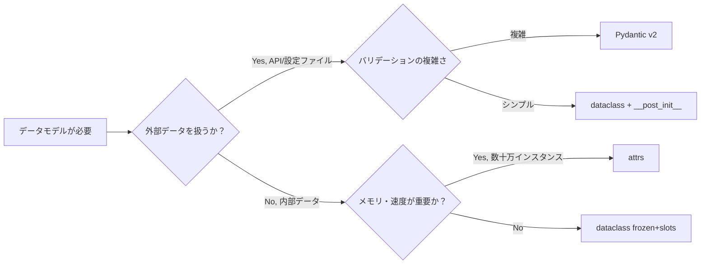

Python 3.7 で標準ライブラリに加わった `dataclasses` モジュールは、今や Python プロジェクトにおけるデータモデル設計の中心的な存在です。しかし「フィールド定義と `__init__` が自動生成される」という基本機能しか使っていない方も多いのではないでしょうか。

本記事では `field()` 関数のオプション全解説から、`__post_init__` によるバリデーション、`frozen=True` と `slots=True` による型安全なイミュータブル設計、継承パターン、JSON シリアライズ、そして Pydantic・attrs との使い分けまでを体系的に解説します。Python 3.10 以降の新機能も含め、実践で即使えるパターンを紹介します。

## 1. はじめに — dataclass がなぜ有用か

### namedtuple との違い

Python でシンプルなデータコンテナを作る方法はいくつかあります。`namedtuple`、通常のクラス、そして `dataclass` です。それぞれの特性をまとめると次のようになります。

| 特性 | `namedtuple` | 通常クラス | `dataclass` |
|------|-------------|-----------|-------------|
| ミュータブル | 不可 | 可 | 可（デフォルト）|
| `__init__` 自動生成 | 可 | 不可 | 可 |
| `__repr__` 自動生成 | 可 | 不可 | 可 |
| 型アノテーション | 限定的 | 可 | 可 |
| 継承 | 困難 | 可 | 可 |
| デフォルト値の柔軟性 | 低 | 高 | 高 |
| メモリ効率（slots） | タプル相当 | 低 | 高（3.10+）|
| デコレータ数 | 0 | 手書き | 1行 |

`namedtuple` はイミュータブルなタプルのサブクラスであり、フィールドへのインデックスアクセスや `_asdict()` などが使えます。しかしデフォルト値の扱いが煩雑で、継承時の挙動も直感的ではありません。

`dataclass` は通常のクラスをベースとしているため継承が自然であり、`field()` 関数による柔軟なフィールド設定、`__post_init__` によるバリデーション、そして Python 3.10 以降の `frozen=True` + `slots=True` の組み合わせによる高性能なイミュータブルオブジェクトの生成が可能です。

### dataclass が解決する問題

```python
# 従来のクラス定義 — ボイラープレートが多い
class UserLegacy:
    def __init__(self, name: str, age: int, email: str = ""):
        self.name = name
        self.age = age
        self.email = email

    def __repr__(self) -> str:
        return f"User(name={self.name!r}, age={self.age!r}, email={self.email!r})"

    def __eq__(self, other: object) -> bool:
        if not isinstance(other, UserLegacy):
            return NotImplemented
        return (self.name, self.age, self.email) == (other.name, other.age, other.email)


# dataclass — 本質だけを書く
from dataclasses import dataclass

@dataclass
class User:
    name: str
    age: int
    email: str = ""
```

`@dataclass` デコレータは `__init__`・`__repr__`・`__eq__` を自動生成します。コードは 3 分の 1 以下になり、かつ型アノテーションが強制されます。

---

## 2. 基本構文とデフォルト値

### デコレータのパラメータ全一覧

```python
@dataclass(
    init=True,          # __init__ を生成する（デフォルト True）
    repr=True,          # __repr__ を生成する（デフォルト True）
    eq=True,            # __eq__ を生成する（デフォルト True）
    order=False,        # __lt__ __le__ __gt__ __ge__ を生成する
    unsafe_hash=False,  # 強制的に __hash__ を生成する
    frozen=False,       # イミュータブルにする
    match_args=True,    # __match_args__ を生成する（3.10+）
    kw_only=False,      # 全フィールドをキーワード専用にする（3.10+）
    slots=False,        # __slots__ を使用する（3.10+）
    weakref_slot=False, # __weakref__ スロットを追加する（3.11+）
)
class MyDataClass:
    ...
```

### シンプルなデフォルト値

```python
from dataclasses import dataclass
from typing import ClassVar

@dataclass
class Config:
    host: str = "localhost"
    port: int = 8080
    debug: bool = False
    # ClassVar はフィールドとして扱われない
    VERSION: ClassVar[str] = "1.0.0"

cfg = Config()
print(cfg)  # Config(host='localhost', port=8080, debug=False)
print(Config.VERSION)  # 1.0.0 — インスタンス変数ではなくクラス変数
```

ミュータブルなオブジェクト（リスト・辞書）をデフォルト値として直接指定すると `ValueError` になります。これは `field(default_factory=...)` で解決します（次節で解説）。

```python
# これはエラー！
@dataclass
class Wrong:
    items: list = []  # ValueError: mutable default is not allowed

# 正しい書き方
from dataclasses import field

@dataclass
class Correct:
    items: list[str] = field(default_factory=list)
```

---

## 3. field() 関数の完全解説

`field()` 関数はフィールドの詳細な挙動を制御するためのヘルパーです。シグネチャは次のとおりです。

```python
field(
    *,
    default=MISSING,           # デフォルト値
    default_factory=MISSING,   # デフォルト値を返す callable
    init=True,                 # __init__ のパラメータとして含めるか
    repr=True,                 # __repr__ に含めるか
    hash=None,                 # __hash__ に含めるか（None = compare に従う）
    compare=True,              # __eq__ / __lt__ 等に含めるか
    metadata=None,             # 任意のメタデータ（読み取り専用 mappingproxy）
    kw_only=MISSING,           # このフィールドだけキーワード専用にする（3.10+）
    doc=None,                  # フィールドの docstring（3.13+）
)
```

### default_factory — ミュータブルなデフォルト値

```python
from dataclasses import dataclass, field
from datetime import datetime
from uuid import uuid4

@dataclass
class Order:
    id: str = field(default_factory=lambda: str(uuid4()))
    created_at: datetime = field(default_factory=datetime.now)
    items: list[str] = field(default_factory=list)
    tags: dict[str, str] = field(default_factory=dict)

o1 = Order()
o2 = Order()
print(o1.id == o2.id)  # False — 各インスタンスで独立した値
```

### init=False — 自動計算フィールド

```python
@dataclass
class Rectangle:
    width: float
    height: float
    area: float = field(init=False, repr=True)

    def __post_init__(self) -> None:
        self.area = self.width * self.height

r = Rectangle(3.0, 4.0)
print(r)  # Rectangle(width=3.0, height=4.0, area=12.0)
# Rectangle(width=3.0, height=4.0) として構築し、area は自動計算
```

### repr=False / compare=False — 除外制御

```python
from dataclasses import dataclass, field

@dataclass
class User:
    name: str
    email: str
    # パスワードは repr に表示しない、比較にも使わない
    _password_hash: str = field(repr=False, compare=False)
    # 内部 ID は比較には使うが repr には出さない
    _internal_id: int = field(repr=False, compare=True, default=0)
```

### metadata — スキーマ情報の付与

```python
from dataclasses import dataclass, field, fields

@dataclass
class Product:
    name: str = field(metadata={"description": "商品名", "max_length": 100})
    price: float = field(metadata={"description": "税込価格", "min": 0.0})

# メタデータはランタイムで参照可能
for f in fields(Product):
    print(f.name, "->", dict(f.metadata))
# name -> {'description': '商品名', 'max_length': 100}
# price -> {'description': '税込価格', 'min': 0.0}
```

---

## 4. `__post_init__` によるバリデーション

`__post_init__` は `__init__` の最後に自動的に呼び出されるフックです。フィールド値のバリデーション、依存フィールドの計算、型変換などに使います。

### 基本的なバリデーションパターン

```python
from dataclasses import dataclass, field
from typing import ClassVar

@dataclass
class Money:
    amount: float
    currency: str = "JPY"

    SUPPORTED_CURRENCIES: ClassVar[frozenset[str]] = frozenset(
        {"JPY", "USD", "EUR", "GBP"}
    )

    def __post_init__(self) -> None:
        if self.amount < 0:
            raise ValueError(f"amount は 0 以上でなければなりません: {self.amount}")
        if self.currency not in self.SUPPORTED_CURRENCIES:
            raise ValueError(
                f"サポートされていない通貨: {self.currency}. "
                f"使用可能: {self.SUPPORTED_CURRENCIES}"
            )
        # amount を小数点 2 桁に丸める
        object.__setattr__(self, "amount", round(self.amount, 2))

try:
    Money(-100, "JPY")
except ValueError as e:
    print(e)  # amount は 0 以上でなければなりません: -100
```

### InitVar — 初期化専用パラメータ

`InitVar[T]` で宣言したフィールドは `__init__` のパラメータになりますが、クラスの属性としては保存されません。`__post_init__` に引数として渡されます。

```python
from dataclasses import dataclass, InitVar, field

@dataclass
class HashedPassword:
    username: str
    plain_password: InitVar[str]   # 保存しない
    password_hash: str = field(init=False, repr=False)

    def __post_init__(self, plain_password: str) -> None:
        import hashlib
        self.password_hash = hashlib.sha256(plain_password.encode()).hexdigest()

user = HashedPassword("alice", "secret123")
print(user)  # HashedPassword(username='alice')
print(user.password_hash[:16])  # sha256 ハッシュ（先頭16文字）
# plain_password はインスタンスに残らない
```

### 複合バリデーションと型変換

```python
from dataclasses import dataclass
from datetime import date

@dataclass
class DateRange:
    start: date
    end: date

    def __post_init__(self) -> None:
        # 文字列から date に変換（型変換パターン）
        if isinstance(self.start, str):
            object.__setattr__(self, "start", date.fromisoformat(self.start))
        if isinstance(self.end, str):
            object.__setattr__(self, "end", date.fromisoformat(self.end))
        # バリデーション
        if self.start > self.end:
            raise ValueError(
                f"start ({self.start}) は end ({self.end}) 以前でなければなりません"
            )

    @property
    def days(self) -> int:
        return (self.end - self.start).days

dr = DateRange("2025-01-01", "2025-12-31")
print(dr.days)  # 364
```

---

## 5. frozen=True と slots=True の活用

### frozen=True — イミュータブルオブジェクト

`frozen=True` を指定すると、インスタンス生成後のフィールド変更が禁止されます。内部的には `__setattr__` と `__delattr__` が例外を送出するよう上書きされます。

```python
from dataclasses import dataclass

@dataclass(frozen=True)
class Point:
    x: float
    y: float

    def distance_to_origin(self) -> float:
        return (self.x**2 + self.y**2) ** 0.5

p = Point(3.0, 4.0)
print(p.distance_to_origin())  # 5.0

try:
    p.x = 10.0  # FrozenInstanceError
except Exception as e:
    print(type(e).__name__, e)
# FrozenInstanceError cannot assign to field 'x'
```

`frozen=True` にすると `__hash__` も自動生成されるため、辞書キーやセット要素として使えます。

```python
points = {Point(1, 2), Point(3, 4), Point(1, 2)}
print(len(points))  # 2 — 重複が除去される

lookup = {Point(0, 0): "原点", Point(1, 0): "X軸上"}
print(lookup[Point(0, 0)])  # 原点
```

### slots=True — メモリ効率と高速アクセス（Python 3.10+）

通常の Python クラスは各インスタンスに `__dict__` を持ち、これが属性の動的追加を可能にしている一方でメモリを消費します。`slots=True` を指定すると `__slots__` が自動的に定義され、インスタンスごとの `__dict__` が排除されます。

```python
import sys
from dataclasses import dataclass

@dataclass
class PointNormal:
    x: float
    y: float

@dataclass(slots=True)
class PointSlots:
    x: float
    y: float

n = PointNormal(1.0, 2.0)
s = PointSlots(1.0, 2.0)

print(sys.getsizeof(n))  # 48 bytes（__dict__ 分含む）
print(sys.getsizeof(s))  # 32 bytes 前後（環境依存）
```

メモリ削減の効果は 10〜30% 程度で、数十万インスタンスを生成する場合に顕著に現れます。

### frozen=True + slots=True の黄金コンビ

```python
from dataclasses import dataclass
from typing import ClassVar

@dataclass(frozen=True, slots=True)
class Currency:
    """イミュータブルな通貨値オブジェクト。"""
    amount: float
    code: str

    CODES: ClassVar[frozenset[str]] = frozenset({"JPY", "USD", "EUR"})

    def __post_init__(self) -> None:
        if self.amount < 0:
            raise ValueError("amount は負の値にできません")
        if self.code not in self.CODES:
            raise ValueError(f"未対応の通貨コード: {self.code}")

    def __add__(self, other: "Currency") -> "Currency":
        if self.code != other.code:
            raise TypeError("通貨コードが異なります")
        return Currency(self.amount + other.amount, self.code)

    def __mul__(self, factor: float) -> "Currency":
        return Currency(self.amount * factor, self.code)

jpy_100 = Currency(100.0, "JPY")
jpy_200 = Currency(200.0, "JPY")
print(jpy_100 + jpy_200)  # Currency(amount=300.0, code='JPY')
print(hash(jpy_100))       # ハッシュ可能
```

`frozen=True` + `slots=True` の組み合わせは、値オブジェクト（Value Object）パターンの実装に最適です。

---

## 6. dataclass の継承パターン

### フィールドの順序とデフォルト値の問題

dataclass の継承では、生成される `__init__` のパラメータ順は MRO 順に親クラスから子クラスへとフィールドが並びます。親クラスにデフォルト値を持つフィールドがあり、子クラスにデフォルト値を持たないフィールドを追加すると `TypeError` になります。

```python
# これはエラー！
@dataclass
class Base:
    name: str
    value: int = 0  # デフォルト値あり

@dataclass
class Child(Base):
    extra: str  # デフォルト値なし → TypeError: non-default follows default
```

この問題を解決する方法が 2 つあります。

### 解決策 1: kw_only=True（Python 3.10+ 推奨）

```python
from dataclasses import dataclass

@dataclass(kw_only=True)
class Base:
    name: str
    value: int = 0

@dataclass(kw_only=True)
class Child(Base):
    extra: str  # キーワード専用なので順序問題が発生しない

c = Child(name="test", extra="hello")
print(c)  # Child(name='test', value=0, extra='hello')
```

### 解決策 2: フィールドを持つ MixIn パターン

```python
from dataclasses import dataclass

@dataclass
class WithRequired:
    name: str

@dataclass
class WithDefaults:
    value: int = 0
    tag: str = ""

@dataclass
class Entity(WithRequired, WithDefaults):
    # WithRequired の必須フィールドが先、WithDefaults のデフォルト付きが後
    pass

e = Entity(name="item")
print(e)  # Entity(name='item', value=0, tag='')
```

### フィールドのオーバーライド

子クラスで親クラスのフィールドの型やデフォルト値を上書きできます。最終的な型は子クラスの定義が優先されます。

```python
from dataclasses import dataclass
from typing import Any

@dataclass
class BaseEntity:
    id: Any
    created_by: str = "system"

@dataclass
class UserEntity(BaseEntity):
    id: int  # Any から int に型を特化
    username: str = ""

u = UserEntity(id=42, username="alice")
print(u)  # UserEntity(id=42, created_by='system', username='alice')
```

### 継承と frozen — 親子で一致が必要

`frozen` は継承関係でも一貫していなければなりません。frozen クラスを非 frozen クラスが継承することも、非 frozen クラスを frozen クラスが継承することも許可されていません（ただし例外あり）。

```python
from dataclasses import dataclass

@dataclass(frozen=True)
class FrozenBase:
    x: int

@dataclass(frozen=True)
class FrozenChild(FrozenBase):
    y: int  # 親も子も frozen=True — OK

fc = FrozenChild(1, 2)
print(fc)  # FrozenChild(x=1, y=2)
```

---

## 7. 比較・ハッシュ・ソートの制御

### eq と order の関係

```python
from dataclasses import dataclass, field

@dataclass(order=True)
class Priority:
    # sort_index を比較に使い、他のフィールドは除外
    sort_index: int = field(init=False, repr=False)
    name: str = field(compare=False)
    level: int = field(compare=False)
    priority_name: str = field(compare=False)

    _PRIORITY_MAP: dict = field(
        default_factory=lambda: {"critical": 0, "high": 1, "medium": 2, "low": 3},
        init=False, repr=False, compare=False,
    )

    def __post_init__(self) -> None:
        self.sort_index = self._PRIORITY_MAP.get(self.priority_name, 99)

tasks = [
    Priority(name="タスクA", level=1, priority_name="low"),
    Priority(name="タスクB", level=2, priority_name="critical"),
    Priority(name="タスクC", level=3, priority_name="high"),
]
for t in sorted(tasks):
    print(t.priority_name, t.name)
# critical タスクB
# high タスクC
# low タスクA
```

### hash の制御

`eq=True` かつ `frozen=False`（デフォルト）の場合、`__hash__` は `None` に設定され、ハッシュ不可能になります。これはミュータブルなオブジェクトを誤ってハッシュキーに使う事故を防ぐための設計です。

| frozen | eq | unsafe_hash | __hash__ |
|--------|-----|-------------|----------|
| False | False | False | 継承（object の hash）|
| False | True | False | None（ハッシュ不可）|
| False | True | True | 生成される（非推奨）|
| True | True | False | 生成される（推奨）|

---

## 8. ClassVar と InitVar

### ClassVar — クラス変数の宣言

```python
from dataclasses import dataclass, field
from typing import ClassVar

@dataclass
class DatabaseModel:
    # ClassVar はフィールドとして認識されない
    TABLE_NAME: ClassVar[str] = "undefined"
    _registry: ClassVar[dict[str, "DatabaseModel"]] = {}

    id: int
    name: str

    def __post_init__(self) -> None:
        DatabaseModel._registry[str(self.id)] = self

    @classmethod
    def find(cls, id: int) -> "DatabaseModel | None":
        return cls._registry.get(str(id))

@dataclass
class UserModel(DatabaseModel):
    TABLE_NAME: ClassVar[str] = "users"
    email: str = ""

u = UserModel(1, "Alice", email="alice@example.com")
print(UserModel.find(1))  # UserModel(id=1, name='Alice', email='alice@example.com')
print(UserModel.TABLE_NAME)  # users
```

### InitVar と ClassVar の使い分け

```mermaid
flowchart TD
    A[フィールドに型アノテーションを付ける] --> B{インスタンス属性として保存するか？}
    B -->|Yes| C{__init__ パラメータとして受け取るか？}
    B -->|No, クラス全体で共有| D[ClassVar]
    C -->|Yes| E[通常のフィールド or field()]
    C -->|No, 自動計算| F[field(init=False)]
    E --> G{初期化時のみ使い、保存しないか？}
    G -->|Yes| H[InitVar]
    G -->|No| E
```

---

## 9. JSON シリアライズ

### dataclasses.asdict と astuple

```python
import json
from dataclasses import dataclass, field, asdict, astuple

@dataclass
class Address:
    street: str
    city: str
    zip_code: str

@dataclass
class Person:
    name: str
    age: int
    address: Address
    hobbies: list[str] = field(default_factory=list)

person = Person(
    name="田中太郎",
    age=30,
    address=Address("千代田1-1", "東京都千代田区", "100-0001"),
    hobbies=["読書", "プログラミング"],
)

# asdict は再帰的に辞書化する
d = asdict(person)
print(json.dumps(d, ensure_ascii=False, indent=2))
```

出力:
```json
{
  "name": "田中太郎",
  "age": 30,
  "address": {
    "street": "千代田1-1",
    "city": "東京都千代田区",
    "zip_code": "100-0001"
  },
  "hobbies": ["読書", "プログラミング"]
}
```

### datetime などの非シリアライズ型への対応

`asdict` は datetime などを変換しないため、カスタムエンコーダが必要です。

```python
import json
import dataclasses
from datetime import datetime, date
from dataclasses import dataclass

@dataclass
class Event:
    title: str
    start_at: datetime
    date_only: date

class DataclassEncoder(json.JSONEncoder):
    def default(self, o: object) -> object:
        if dataclasses.is_dataclass(o) and not isinstance(o, type):
            return dataclasses.asdict(o)
        if isinstance(o, datetime):
            return o.isoformat()
        if isinstance(o, date):
            return o.isoformat()
        return super().default(o)

event = Event(
    title="キックオフ",
    start_at=datetime(2025, 4, 1, 10, 0),
    date_only=date(2025, 4, 1),
)
print(json.dumps(event, cls=DataclassEncoder, ensure_ascii=False))
# {"title": "キックオフ", "start_at": "2025-04-01T10:00:00", "date_only": "2025-04-01"}
```

### dict_factory によるキー変換（camelCase）

```python
import re
from dataclasses import dataclass, asdict

def to_camel_case(s: str) -> str:
    components = s.split("_")
    return components[0] + "".join(x.capitalize() for x in components[1:])

def camel_dict_factory(items: list[tuple[str, object]]) -> dict:
    return {to_camel_case(k): v for k, v in items}

@dataclass
class ApiResponse:
    user_id: int
    display_name: str
    created_at: str

resp = ApiResponse(user_id=1, display_name="Alice", created_at="2025-01-01")
print(asdict(resp, dict_factory=camel_dict_factory))
# {'userId': 1, 'displayName': 'Alice', 'createdAt': '2025-01-01'}
```

---

## 10. Pydantic vs dataclass vs attrs の使い分け

3 つのライブラリはそれぞれ異なる問題を解決するために設計されています。



### 3 ライブラリの比較表

| 特性 | `dataclass` | `attrs` | `Pydantic v2` |
|------|------------|---------|---------------|
| 標準ライブラリ | Yes | No | No |
| 実行時バリデーション | なし | あり（validators） | あり（自動）|
| 型強制 | なし | なし | あり |
| JSON シリアライズ | 手動 | 手動 | 自動 |
| 速度（インスタンス生成） | 最速 | 速い | 遅い（約3倍）|
| 継承サポート | 可 | 可 | 可 |
| frozen/スロット | あり（3.10+）| あり | あり |
| スキーマ生成（OpenAPI） | なし | なし | あり |

### 使い分けの指針

```python
# ユースケース 1: 内部のドメインオブジェクト → dataclass
from dataclasses import dataclass

@dataclass(frozen=True, slots=True)
class ProductId:
    value: str

    def __post_init__(self) -> None:
        if not self.value.startswith("PRD-"):
            raise ValueError(f"無効な商品 ID: {self.value}")


# ユースケース 2: API リクエスト/レスポンス → Pydantic
from pydantic import BaseModel, field_validator

class CreateUserRequest(BaseModel):
    name: str
    email: str
    age: int

    @field_validator("age")
    @classmethod
    def age_must_be_positive(cls, v: int) -> int:
        if v < 0:
            raise ValueError("年齢は 0 以上でなければなりません")
        return v


# ユースケース 3: 大量インスタンス・詳細バリデーション → attrs
import attrs

@attrs.define(slots=True, frozen=True)
class Coordinate:
    lat: float = attrs.field(validator=attrs.validators.instance_of(float))
    lon: float = attrs.field(validator=attrs.validators.instance_of(float))
```

Pydantic は「信頼境界」を超えるデータ（API 入力、設定ファイル、ユーザー入力）のバリデーションに最適です。サービス内部のデータモデルに Pydantic を使いすぎると、パフォーマンス低下と不要な型変換が発生します。

---

## 11. 実践パターン

### Value Object — 値の同一性で比較するオブジェクト

```python
from dataclasses import dataclass
from typing import ClassVar

@dataclass(frozen=True, slots=True)
class Email:
    """メールアドレスを表す値オブジェクト。"""
    value: str

    def __post_init__(self) -> None:
        if "@" not in self.value or "." not in self.value.split("@")[-1]:
            raise ValueError(f"無効なメールアドレス: {self.value}")
        # 正規化
        object.__setattr__(self, "value", self.value.lower().strip())

    def __str__(self) -> str:
        return self.value

    @property
    def domain(self) -> str:
        return self.value.split("@")[1]

e1 = Email("Alice@Example.COM")
e2 = Email("alice@example.com")
print(e1 == e2)   # True — 正規化後は等しい
print(e1.domain)  # example.com
```

### DTO — レイヤー間のデータ転送

```python
from dataclasses import dataclass, field
from datetime import datetime

@dataclass(frozen=True, slots=True)
class UserDTO:
    """
    ユーザーデータをプレゼンテーション層へ転送するための DTO。
    DB エンティティから変換して使用する。
    """
    id: int
    name: str
    email: str
    created_at: datetime

    @classmethod
    def from_entity(cls, entity: object) -> "UserDTO":
        return cls(
            id=entity.id,  # type: ignore[attr-defined]
            name=entity.name,  # type: ignore[attr-defined]
            email=str(entity.email),  # type: ignore[attr-defined]
            created_at=entity.created_at,  # type: ignore[attr-defined]
        )
```

### 設定管理 — 環境変数との統合

```python
import os
from dataclasses import dataclass, field

@dataclass(frozen=True, slots=True)
class AppConfig:
    """アプリケーション設定。環境変数から構築する。"""
    database_url: str
    secret_key: str
    debug: bool = False
    allowed_hosts: tuple[str, ...] = field(default_factory=tuple)
    max_connections: int = 10

    def __post_init__(self) -> None:
        if not self.database_url:
            raise ValueError("DATABASE_URL が設定されていません")
        if not self.secret_key:
            raise ValueError("SECRET_KEY が設定されていません")
        if self.max_connections < 1:
            raise ValueError("max_connections は 1 以上でなければなりません")

    @classmethod
    def from_env(cls) -> "AppConfig":
        hosts_raw = os.getenv("ALLOWED_HOSTS", "localhost")
        return cls(
            database_url=os.getenv("DATABASE_URL", ""),
            secret_key=os.getenv("SECRET_KEY", ""),
            debug=os.getenv("DEBUG", "false").lower() == "true",
            allowed_hosts=tuple(h.strip() for h in hosts_raw.split(",")),
            max_connections=int(os.getenv("MAX_CONNECTIONS", "10")),
        )

# 利用側
# config = AppConfig.from_env()
```

### match ステートメントとの連携（Python 3.10+）

`match_args=True`（デフォルト）により、dataclass は構造的パターンマッチングに対応します。

```python
from dataclasses import dataclass

@dataclass
class Circle:
    radius: float

@dataclass
class Rectangle:
    width: float
    height: float

@dataclass
class Triangle:
    base: float
    height: float

def calculate_area(shape: Circle | Rectangle | Triangle) -> float:
    match shape:
        case Circle(radius=r):
            import math
            return math.pi * r ** 2
        case Rectangle(width=w, height=h):
            return w * h
        case Triangle(base=b, height=h):
            return 0.5 * b * h
        case _:
            raise TypeError(f"未知の図形: {type(shape)}")

print(calculate_area(Circle(5.0)))        # 78.53...
print(calculate_area(Rectangle(4.0, 3.0))) # 12.0
print(calculate_area(Triangle(6.0, 4.0))) # 12.0
```

---

## 12. まとめ

Python `dataclass` の活用ポイントをまとめます。

| 目的 | 推奨するアプローチ |
|------|-----------------|
| ボイラープレート削減 | `@dataclass` の基本利用 |
| ミュータブルなデフォルト値 | `field(default_factory=...)` |
| 自動計算フィールド | `field(init=False)` + `__post_init__` |
| バリデーション | `__post_init__` でルール実装 |
| 初期化専用パラメータ | `InitVar` |
| イミュータブルオブジェクト | `frozen=True` |
| メモリ効率化（3.10+）| `slots=True` |
| 型安全な値オブジェクト | `frozen=True` + `slots=True` |
| キーワード強制（3.10+）| `kw_only=True` |
| 継承での順序問題 | `kw_only=True` または MixIn |
| 外部データのバリデーション | Pydantic v2 |
| 大量インスタンス・詳細検証 | attrs |

Python 3.10 以降では、`@dataclass(frozen=True, slots=True, kw_only=True)` の 3 点セットが多くのユースケースで最適な起点となります。まずこの組み合わせから始め、ミュータビリティが必要な場合のみ `frozen=False` に戻す方針が、バグを防ぎやすいコードにつながります。

Pydantic との役割分担も明確にしましょう。外部から来るデータ（API リクエスト、設定ファイル、CSV）は Pydantic でバリデーション・型強制し、ドメイン内部のオブジェクトは `dataclass` で軽量に保つ設計が、パフォーマンスと保守性の両立につながります。

---

### 参考リンク

- [Python 公式ドキュメント: dataclasses](https://docs.python.org/3/library/dataclasses.html)
- [PEP 557 – Data Classes](https://peps.python.org/pep-0557/)
- [Real Python: Data Classes in Python](https://realpython.com/python-data-classes/)
- [Pydantic 公式ドキュメント: Dataclasses](https://docs.pydantic.dev/latest/concepts/dataclasses/)
- [attrs 公式ドキュメント](https://www.attrs.org/)
