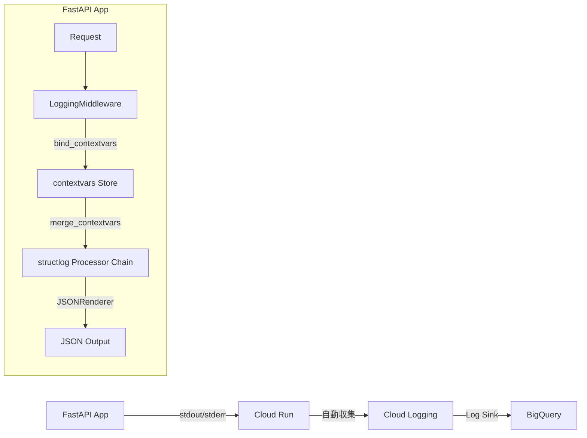

## はじめに

Python のバックエンド開発で最初に頭を悩ませるのが、ロギングの設計です。標準の `logging` モジュールは柔軟性が高い一方、設定が煩雑で、Cloud Run のようなコンテナ環境では次の課題が顕在化します。

- ログが単なるテキスト行として出力されるため、Cloud Logging でフィルタリングしにくい
- リクエストIDやユーザーIDなどのコンテキスト情報を毎回手動で付加しなければならない
- 開発環境では読みやすい出力を、本番環境では JSON を出力したいが切り替えが手間
- FastAPI の非同期処理でスレッドローカルが使えず、コンテキスト管理が難しい

これらをすべて解決するのが `structlog` です。structlog は Processor チェーンによって、ログイベントを JSON に変換するプロセスを宣言的に定義できます。

本記事では、Cloud Run 上の FastAPI アプリケーションに structlog を導入し、Cloud Logging との統合、contextvars を使ったリクエスト横断コンテキスト管理、そして BigQuery へのログ転送まで、実装コードを中心に解説します。

対象読者: Cloud Run / GCP を使う Python バックエンドエンジニア

動作環境:
- Python 3.11 以上
- structlog 24.x
- FastAPI 0.111 以上

---

## structlog の基本設定

まずはパッケージをインストールします。

```bash
pip install structlog
```

最小構成の設定から始めましょう。

```python
import structlog
import logging

structlog.configure(
    processors=[
        structlog.contextvars.merge_contextvars,
        structlog.processors.add_log_level,
        structlog.processors.TimeStamper(fmt="iso"),
        structlog.processors.JSONRenderer(),
    ],
    wrapper_class=structlog.make_filtering_bound_logger(logging.INFO),
    context_class=dict,
    logger_factory=structlog.PrintLoggerFactory(),
)

logger = structlog.get_logger()
logger.info("request_start", method="GET", path="/api/health")
```

出力:

```json
{"method": "GET", "path": "/api/health", "level": "info", "timestamp": "2025-10-01T09:00:00.000000Z", "event": "request_start"}
```

標準の `logging.info("request_start")` と違い、キーと値のペアとして構造化されています。Cloud Logging はこの JSON を解析して `jsonPayload` フィールドとして保存するため、特定のフィールドでフィルタリングやクエリが可能になります。

### Processor チェーンとは

structlog の中心的なコンセプトが Processor チェーンです。ログイベントは辞書として表現され、各 Processor が変換を加えながら最終的な出力形式になります。

```
logger.info("event", key="value")
         ↓
{event: "event", key: "value"}    # イベント辞書の生成
         ↓
merge_contextvars が適用            # contextvarsのコンテキストをマージ
         ↓
add_log_level が適用               # level: "info" を追加
         ↓
TimeStamper が適用                 # timestamp を追加
         ↓
JSONRenderer が適用                # 最終的なJSON文字列に変換
         ↓
{"event": "event", "key": "value", "level": "info", "timestamp": "..."}
```

各 Processor は `(logger, method, event_dict) -> event_dict` のシグネチャを持つ callable で、カスタム Processor も簡単に作れます。

---

## Cloud Logging との統合

Cloud Run では、stdout / stderr に出力された JSON を Cloud Logging が自動収集します。しかし Cloud Logging の severity マッピングを正しく機能させるには、`severity` フィールドを大文字で出力する必要があります。

structlog の `add_log_level` は小文字（`"info"`）で出力するため、カスタム Processor を作成します。

```python
import structlog
import logging
from typing import Any


def add_severity(logger: Any, method: str, event_dict: dict) -> dict:
    """Cloud Logging の severity フィールドを付加するカスタム Processor."""
    level = event_dict.get("level", "info").upper()
    # WARNING は Cloud Logging の規格に合わせる
    if level == "WARN":
        level = "WARNING"
    event_dict["severity"] = level
    return event_dict


def configure_logging(is_local: bool = False) -> None:
    shared_processors = [
        structlog.contextvars.merge_contextvars,
        structlog.stdlib.add_logger_name,
        structlog.processors.add_log_level,
        add_severity,
        structlog.processors.TimeStamper(fmt="iso"),
    ]

    if is_local:
        # 開発環境: 色付きの読みやすい出力
        processors = shared_processors + [
            structlog.dev.ConsoleRenderer(),
        ]
    else:
        # 本番環境: Cloud Logging 向け JSON
        processors = shared_processors + [
            structlog.processors.ExceptionRenderer(),
            structlog.processors.JSONRenderer(),
        ]

    structlog.configure(
        processors=processors,
        wrapper_class=structlog.make_filtering_bound_logger(logging.INFO),
        context_class=dict,
        logger_factory=structlog.PrintLoggerFactory(),
        cache_logger_on_first_use=True,
    )
```

`configure_logging(is_local=True)` を呼ぶとコンソールに色付きで出力され、`is_local=False` では JSON が出力されます。環境変数で切り替えるのが実践的です。

```python
import os

is_local = os.getenv("ENV", "production") == "local"
configure_logging(is_local=is_local)
```

### ローカル開発時の出力

`ConsoleRenderer` を使うと次のように表示されます。

```
2025-10-01 09:00:00 [info     ] request_start     method=GET path=/api/health request_id=abc123
```

JSON と同じ情報を人間が読みやすい形式で確認できます。デバッグ中にフィールドの内容を確認しやすいため、開発効率が大きく上がります。

---

## FastAPI への統合

FastAPI では `Middleware` でリクエストスコープのコンテキストを設定するのがベストプラクティスです。

```python
import uuid
import time
from fastapi import FastAPI, Request
from fastapi.middleware.base import BaseHTTPMiddleware
import structlog

logger = structlog.get_logger(__name__)

app = FastAPI()


class LoggingMiddleware(BaseHTTPMiddleware):
    async def dispatch(self, request: Request, call_next):
        request_id = request.headers.get("X-Request-ID", str(uuid.uuid4()))
        start_time = time.perf_counter()

        # contextvars をリクエストごとにクリアして新しいコンテキストを設定
        structlog.contextvars.clear_contextvars()
        structlog.contextvars.bind_contextvars(
            request_id=request_id,
            method=request.method,
            path=str(request.url.path),
        )

        logger.info("request_start")

        try:
            response = await call_next(request)
            elapsed_ms = int((time.perf_counter() - start_time) * 1000)
            logger.info(
                "request_end",
                status_code=response.status_code,
                latency_ms=elapsed_ms,
            )
            return response
        except Exception as exc:
            elapsed_ms = int((time.perf_counter() - start_time) * 1000)
            logger.exception(
                "request_error",
                latency_ms=elapsed_ms,
                exc_info=exc,
            )
            raise


app.add_middleware(LoggingMiddleware)


@app.get("/api/health")
async def health():
    logger.info("health_check")
    return {"status": "ok"}
```

`LoggingMiddleware` の中で `structlog.contextvars.clear_contextvars()` を呼んでいる点が重要です。FastAPI は非同期なので複数のリクエストが同時に処理されますが、contextvars はコルーチンコンテキスト単位で管理されるため、異なるリクエスト間でコンテキストが混在しません。

ヘルスチェックエンドポイント内で `logger.info("health_check")` と書くだけで、Middleware が設定した `request_id`, `method`, `path` が自動的にマージされて出力されます。

---

## contextvars でリクエスト横断コンテキスト

`structlog.contextvars.merge_contextvars` プロセッサを設定すると、Python の `contextvars` モジュールで管理されたコンテキストがすべてのログに自動マージされます。

```python
import structlog

logger = structlog.get_logger(__name__)


async def process_order(order_id: str, user_id: str) -> None:
    # コンテキストをバインド（以降のすべてのログに自動付加される）
    structlog.contextvars.bind_contextvars(
        order_id=order_id,
        user_id=user_id,
    )

    logger.info("order_processing_start")

    await validate_order(order_id)
    await charge_payment(order_id)
    await send_notification(user_id)

    logger.info("order_processing_complete")


async def validate_order(order_id: str) -> None:
    # request_id, order_id, user_id が自動的に付加される
    logger.info("order_validate", order_id=order_id)
    # ... 検証ロジック


async def charge_payment(order_id: str) -> None:
    # こちらも同じコンテキストが引き継がれる
    logger.info("payment_charge_start")
    # ... 決済処理
```

出力（JSON を整形して表示）:

```json
{"event": "order_processing_start", "request_id": "abc123", "order_id": "ord_001", "user_id": "usr_42", "level": "info", "severity": "INFO", "timestamp": "2025-10-01T09:00:00Z"}
{"event": "order_validate", "request_id": "abc123", "order_id": "ord_001", "user_id": "usr_42", "level": "info", "severity": "INFO", "timestamp": "2025-10-01T09:00:00.010Z"}
{"event": "payment_charge_start", "request_id": "abc123", "order_id": "ord_001", "user_id": "usr_42", "level": "info", "severity": "INFO", "timestamp": "2025-10-01T09:00:00.020Z"}
{"event": "order_processing_complete", "request_id": "abc123", "order_id": "ord_001", "user_id": "usr_42", "level": "info", "severity": "INFO", "timestamp": "2025-10-01T09:00:00.050Z"}
```

`order_id` や `user_id` を `validate_order()` や `charge_payment()` の引数として渡していなくても、ログには自動的に含まれています。コンテキスト情報を関数の引数で引き回す必要がないため、コードがすっきりします。

### unbind と一時的なコンテキスト上書き

特定のログにだけ追加情報を付加したい場合は、`bind()` をロガーに対して呼ぶか、引数として直接渡します。

```python
# 一時的な情報はキーワード引数で渡す（contextvarsに残らない）
logger.info("external_api_call", endpoint="https://api.example.com/v1/users", timeout_sec=5)

# contextvars からキーを削除したい場合
structlog.contextvars.unbind_contextvars("temporary_key")
```

---

## ログフローの全体像

Cloud Run から BigQuery までのログフローを整理します。



Cloud Run のコンテナが stdout に JSON を書き込むと、Cloud Logging エージェントが自動的に収集します。Log Sink を設定することで BigQuery テーブルへの自動転送が可能です。

---

## BigQuery へのログ転送設定

Cloud Logging の Log Sink を使って BigQuery にログをエクスポートします。

### Log Sink の作成

```bash
# BigQuery データセットを作成
gcloud bigquery datasets create app_logs \
    --location=asia-northeast1

# Log Sink を作成
gcloud logging sinks create cloudrun-to-bq \
    bigquery.googleapis.com/projects/YOUR_PROJECT_ID/datasets/app_logs \
    --log-filter='resource.type="cloud_run_revision" AND resource.labels.service_name="YOUR_SERVICE_NAME"' \
    --use-partitioned-tables
```

`--use-partitioned-tables` を指定すると、日付パーティション付きテーブルが自動生成されます。

### サービスアカウントへの権限付与

Sink 作成後、Cloud Logging のサービスアカウントに BigQuery の書き込み権限を付与します。

```bash
# Sink のサービスアカウントを確認
gcloud logging sinks describe cloudrun-to-bq \
    --format="value(writerIdentity)"

# 出力例: serviceAccount:p123456789-123456@gcp-sa-logging.iam.gserviceaccount.com

# BigQuery データセットへの書き込み権限を付与
gcloud projects add-iam-policy-binding YOUR_PROJECT_ID \
    --member="serviceAccount:p123456789-123456@gcp-sa-logging.iam.gserviceaccount.com" \
    --role="roles/bigquery.dataEditor"
```

### BigQuery でのクエリ例

転送されたログは `run_googleapis_com_stderr_YYYYMMDD` のようなテーブル名で保存されます。structlog で付加したフィールドは `jsonPayload` の配下に格納されます。

```sql
SELECT
  timestamp,
  jsonPayload.request_id,
  jsonPayload.method,
  jsonPayload.path,
  jsonPayload.latency_ms,
  jsonPayload.status_code,
  severity
FROM
  `YOUR_PROJECT.app_logs.run_googleapis_com_stderr_*`
WHERE
  _TABLE_SUFFIX BETWEEN '20251001' AND '20251031'
  AND jsonPayload.latency_ms IS NOT NULL
ORDER BY
  jsonPayload.latency_ms DESC
LIMIT 100
```

`jsonPayload.request_id` でフィルタすると、1つのリクエストに関連するすべてのログを時系列で取得できます。Cloud Logging の UI よりも BigQuery でクエリするほうが、大量ログの集計分析に向いています。

---

## よくある設定ミスとデバッグ

### 問題1: JSON が出力されず文字列になる

原因: `logger_factory` に `structlog.PrintLoggerFactory()` を指定しているが、`JSONRenderer` が最後のプロセッサになっていない。

```python
# 間違い: JSONRenderer の後に別のプロセッサがある
processors=[
    structlog.processors.JSONRenderer(),
    structlog.processors.add_log_level,  # ここには来ない
]

# 正しい: JSONRenderer は必ず最後
processors=[
    structlog.processors.add_log_level,
    structlog.processors.JSONRenderer(),
]
```

### 問題2: Cloud Logging で severity が DEFAULT になる

原因: `severity` フィールドが存在しないか、小文字になっている。

Cloud Logging は `jsonPayload.severity` フィールドを大文字で期待します。前述の `add_severity` カスタムプロセッサで対処します。

### 問題3: contextvars がリクエスト間で混ざる

原因: `clear_contextvars()` をリクエストの先頭で呼んでいない。

```python
async def dispatch(self, request: Request, call_next):
    # 必ずリクエスト先頭でクリア
    structlog.contextvars.clear_contextvars()
    structlog.contextvars.bind_contextvars(request_id=...)
    ...
```

### 問題4: 既存の logging ライブラリのログが structlog を通らない

原因: サードパーティライブラリ（`uvicorn`, `httpx` など）は Python 標準 `logging` を使うため、structlog の設定が適用されない。

解決策として、標準 `logging` との統合設定を追加します。

```python
import logging
import structlog

def configure_stdlib_logging() -> None:
    """標準 logging を structlog 経由にルーティングする."""
    handler = logging.StreamHandler()
    handler.setFormatter(
        structlog.stdlib.ProcessorFormatter(
            processor=structlog.processors.JSONRenderer(),
            foreign_pre_chain=[
                structlog.stdlib.add_log_level,
                structlog.processors.TimeStamper(fmt="iso"),
            ],
        )
    )
    root_logger = logging.getLogger()
    root_logger.handlers = [handler]
    root_logger.setLevel(logging.INFO)
```

この設定を追加すると、`uvicorn` のアクセスログも同じ JSON 形式で出力されます。

---

## まとめ

標準 `logging` と structlog の主な違いをまとめます。

| 項目 | 標準 logging | structlog |
|------|-------------|-----------|
| 出力形式 | テキスト（デフォルト） | JSON / ConsoleRenderer（設定可能） |
| コンテキスト管理 | LoggerAdapter / Filter | contextvars で自動マージ |
| Processor チェーン | Handler / Formatter | 宣言的な Processor リスト |
| 非同期対応 | スレッドローカル（非同期に不向き） | contextvars（async 対応） |
| Cloud Logging 連携 | 要カスタムFormatter | severity フィールドの追加のみ |
| 開発体験 | テキスト出力 | ConsoleRenderer で読みやすい出力 |
| 設定コスト | 低い（シンプルな用途） | やや高い（初期設定が必要） |

structlog は初期設定のコストはありますが、一度設定してしまえば `logger.info("event", key="value")` と書くだけで構造化ログが出力されます。Cloud Run × FastAPI の構成であれば、リクエストIDによるトレース、Cloud Logging での構造化検索、BigQuery での集計分析まで一気通貫で対応できます。

本記事のコードは単一ファイルにまとめると次の構成になります。

```
app/
├── main.py          # FastAPI アプリ + LoggingMiddleware
├── logging_config.py # configure_logging(), add_severity()
└── requirements.txt
```

```
# requirements.txt
fastapi>=0.111.0
uvicorn[standard]>=0.30.0
structlog>=24.0.0
```

Cloud Run にデプロイする際は `ENV=production` 環境変数を設定するだけで JSON ログに切り替わります。ローカルでは `ENV=local` を設定すると ConsoleRenderer の色付き出力になります。標準 `logging` からの移行コストは低いため、新規プロジェクトはもちろん、既存プロジェクトへの部分導入から始めるのもおすすめです。
