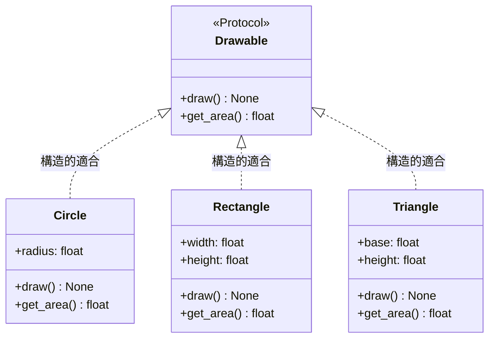
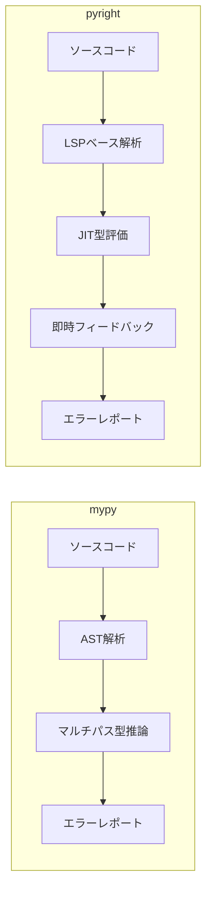
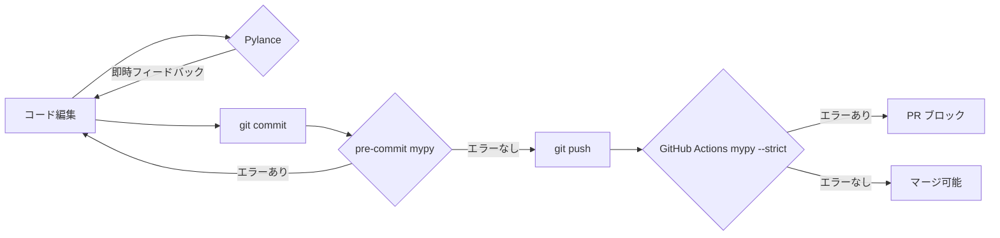

## はじめに

Pythonは動的型付け言語です。コードを書いた時点では型エラーが見えず、実行時になって初めて `AttributeError` や `TypeError` が発覚する——そんな経験は誰しも一度はあるはずです。

型ヒントは、そのギャップを静的解析の段階で埋めるための仕組みです。Python 3.5でPEP 484が導入されてから10年近くが経ち、型ヒントのエコシステムは劇的に成熟しました。mypy と pyright という2つの強力な型チェッカーが登場し、FastAPI や Pydantic のような型ヒントを中核に据えたフレームワークも普及しています。

そして Python 3.10〜3.12 にかけて、型システムはさらに大きな進化を遂げました。`match` 文との連携、`ParamSpec` や `TypeVarTuple` による高度なジェネリクス、そして Python 3.12 で導入された `type` 文による新しいシンタックス——これらを使いこなすことで、型安全性と表現力の両立が初めて現実的になってきました。

本記事では、型ヒントの基礎から実践的なパターンまでを体系的に整理します。コードベースに型を導入しようとしている方、すでに型ヒントを使っているが高度な使い方を知りたい方、両方を対象としています。

---

## 基本型から Union、Optional、Any まで

型ヒントの出発点は、関数の引数と戻り値への注釈です。

```python
def greet(name: str, repeat: int = 1) -> str:
    return (f"Hello, {name}! " * repeat).strip()
```

組み込み型（`int`、`str`、`float`、`bool`、`bytes`）はそのまま使えます。Python 3.10 以降では `|` 演算子で Union を表現できます。

```python
# Python 3.10+
def parse_id(value: str | int) -> int:
    return int(value)

# Python 3.9 以前の書き方（Union を明示）
from typing import Union
def parse_id_old(value: Union[str, int]) -> int:
    return int(value)
```

`Optional[X]` は `X | None` の糖衣構文です。「値が存在しない可能性がある」場合に使います。

```python
def find_user(user_id: int) -> str | None:
    users = {1: "Alice", 2: "Bob"}
    return users.get(user_id)

result = find_user(1)
# result は str | None
# result.upper() を呼ぶ前に None チェックが必要
if result is not None:
    print(result.upper())  # OK: ここでは str に絞り込まれている
```

`Any` は型チェックをすべて無効化する「脱出ハッチ」です。外部ライブラリとの接続点や、段階的な型導入の際には便利ですが、多用すると型ヒントの意味が失われます。

```python
from typing import Any

def legacy_process(data: Any) -> Any:
    # 型チェックなし
    return data
```

`Never` は「絶対に値が存在しない」ことを示す型です。例外を常に送出する関数や、到達不能なコードのマーキングに使います。

```python
from typing import Never

def raise_error(msg: str) -> Never:
    raise ValueError(msg)
```

---

## コレクション型

Python 3.9 以降では、`list[str]` や `dict[str, int]` のように組み込みのコレクション型に直接型パラメータを付けられます。Python 3.8 以前は `from typing import List, Dict` が必要でした。

```python
# Python 3.9+（推奨）
def process_names(names: list[str]) -> dict[str, int]:
    return {name: len(name) for name in names}

# Python 3.8 以前
from typing import List, Dict
def process_names_old(names: List[str]) -> Dict[str, int]:
    return {name: len(name) for name in names}
```

読み取り専用のシーケンスを受け取る関数には `Sequence` が適しています。`list` も `tuple` も `str` も `Sequence` を満たすため、より柔軟なインターフェースを定義できます。

```python
from collections.abc import Sequence, Mapping, Iterable, Iterator

def sum_values(nums: Sequence[float]) -> float:
    return sum(nums)

sum_values([1.0, 2.0])     # OK
sum_values((1.0, 2.0))     # OK: tuple も Sequence
sum_values({1.0, 2.0})     # エラー: set は Sequence でない
```

`Tuple` は固定長タプルの型を表現できます。

```python
# 固定長タプル
def get_coordinates() -> tuple[float, float]:
    return (35.6762, 139.6503)

# 可変長タプル（同じ型が続く）
def get_ids() -> tuple[int, ...]:
    return (1, 2, 3, 4, 5)
```

---

## TypedDict と dataclass

辞書を構造化されたデータとして扱う場合、`TypedDict` が有効です。

```python
from typing import TypedDict, Required, NotRequired

class UserProfile(TypedDict):
    id: int
    name: str
    email: str
    age: NotRequired[int]  # Python 3.11+: Optional フィールド

def display_user(user: UserProfile) -> str:
    age_str = f", {user['age']}歳" if "age" in user else ""
    return f"{user['name']} ({user['email']}){age_str}"

# 正しい使用
user: UserProfile = {"id": 1, "name": "Alice", "email": "alice@example.com"}
display_user(user)  # OK

# 型エラー（型チェッカーが検出）
bad_user: UserProfile = {"id": "not-an-int", "name": "Bob", "email": "bob@example.com"}
```

`TypedDict` の継承を使うと、基底の構造を共有しながら拡張できます。

```python
class BaseEntity(TypedDict):
    id: int
    created_at: str

class User(BaseEntity):
    name: str
    email: str

class Product(BaseEntity):
    title: str
    price: float
```

`dataclass` は型ヒントを構造体の定義として直接使います。`TypedDict` と違い、メソッドやバリデーションも持てます。

```python
from dataclasses import dataclass, field
from datetime import datetime

@dataclass
class Order:
    id: int
    customer_name: str
    items: list[str] = field(default_factory=list)
    total: float = 0.0
    created_at: datetime = field(default_factory=datetime.now)

    def add_item(self, item: str, price: float) -> None:
        self.items.append(item)
        self.total += price

order = Order(id=1, customer_name="Alice")
order.add_item("Python本", 3500.0)
```

---

## Generic 型と TypeVar

`TypeVar` を使うと、型間の関係を保持したままジェネリックな関数やクラスを定義できます。

```python
from typing import TypeVar

T = TypeVar("T")

def first_item(items: list[T]) -> T:
    if not items:
        raise ValueError("空のリスト")
    return items[0]

first_item([1, 2, 3])     # 戻り値は int
first_item(["a", "b"])    # 戻り値は str
```

Python 3.12 では PEP 695 により、TypeVar の宣言が大幅にシンプルになりました。

```python
# Python 3.12+（新シンタックス）
def first_item[T](items: list[T]) -> T:
    return items[0]

class Stack[T]:
    def __init__(self) -> None:
        self._items: list[T] = []

    def push(self, item: T) -> None:
        self._items.append(item)

    def pop(self) -> T:
        return self._items.pop()
```

型制約（`bound`）を設定すると、TypeVar が特定の型またはそのサブクラスのみを受け入れるよう制限できます。

```python
from typing import TypeVar
from numbers import Number

Numeric = TypeVar("Numeric", bound=Number)

def add(a: Numeric, b: Numeric) -> Numeric:
    return a + b  # type: ignore[operator]

# Python 3.12+ の書き方
def multiply[T: (int, float, complex)](a: T, b: T) -> T:
    return a * b
```

`ParamSpec` は Python 3.10 で追加されました。デコレーターのように関数をラップするとき、ラップ元の引数シグネチャを型チェッカーに正確に伝えられます。

```python
from typing import TypeVar, ParamSpec, Callable
import functools
import time

P = ParamSpec("P")
R = TypeVar("R")

def timer(func: Callable[P, R]) -> Callable[P, R]:
    @functools.wraps(func)
    def wrapper(*args: P.args, **kwargs: P.kwargs) -> R:
        start = time.perf_counter()
        result = func(*args, **kwargs)
        elapsed = time.perf_counter() - start
        print(f"{func.__name__}: {elapsed:.4f}s")
        return result
    return wrapper

@timer
def compute(x: int, y: int, label: str = "") -> float:
    return x / y

# compute の型シグネチャが保持されている
compute(10, 2, label="test")  # OK
compute("wrong", 2)           # 型エラー
```

`TypeVarTuple` は Python 3.11 で導入された「可変長の型タプル」です。任意個数の型パラメータを扱えます。

```python
from typing import TypeVarTuple, Unpack

Ts = TypeVarTuple("Ts")

def zip_strict(*iterables: Unpack[Ts]) -> zip[tuple[Unpack[Ts]]]:
    return zip(*iterables)
```

---

## Protocol（構造的部分型）

`Protocol` はダックタイピングを型システムで表現します。継承関係ではなく「インターフェースを持つか」で型を判定します。

```python
from typing import Protocol, runtime_checkable

class Drawable(Protocol):
    def draw(self) -> None: ...
    def get_area(self) -> float: ...

class Circle:
    def __init__(self, radius: float) -> None:
        self.radius = radius

    def draw(self) -> None:
        print(f"Circle(r={self.radius})")

    def get_area(self) -> float:
        import math
        return math.pi * self.radius ** 2

class Rectangle:
    def __init__(self, width: float, height: float) -> None:
        self.width = width
        self.height = height

    def draw(self) -> None:
        print(f"Rectangle({self.width}x{self.height})")

    def get_area(self) -> float:
        return self.width * self.height

def render_all(shapes: list[Drawable]) -> None:
    for shape in shapes:
        shape.draw()
        print(f"  Area: {shape.get_area():.2f}")

# Circle も Rectangle も Drawable を明示的に継承していないが OK
render_all([Circle(5.0), Rectangle(3.0, 4.0)])
```

`@runtime_checkable` を付けると、`isinstance` チェックも可能になります。ただし、このチェックはメソッドの存在のみを確認し、引数の型などは検証しません。

```python
@runtime_checkable
class Serializable(Protocol):
    def to_dict(self) -> dict[str, object]: ...

class User:
    def __init__(self, name: str) -> None:
        self.name = name

    def to_dict(self) -> dict[str, object]:
        return {"name": self.name}

user = User("Alice")
print(isinstance(user, Serializable))  # True（実行時）
```

以下の図は、Protocol を使った型関係を示します。



---

## Python 3.10+ 新機能

### Literal と Final

`Literal` は特定の値のみを受け入れる型を作ります。設定値や状態を表すのに有用です。

```python
from typing import Literal, Final

LogLevel = Literal["DEBUG", "INFO", "WARNING", "ERROR", "CRITICAL"]

def set_log_level(level: LogLevel) -> None:
    print(f"Log level set to: {level}")

set_log_level("INFO")     # OK
set_log_level("VERBOSE")  # 型エラー

# Final: 再代入不可の定数
MAX_RETRIES: Final = 3
BASE_URL: Final[str] = "https://api.example.com"

MAX_RETRIES = 5  # 型エラー: Final 変数への再代入
```

### Annotated

`Annotated` は型にメタデータを付加します。ランタイムのバリデーションライブラリや、ドキュメント生成ツールに情報を渡す際に使います。

```python
from typing import Annotated

# 型 + メタデータ（ツールが読み取る）
Positive = Annotated[int, "must be > 0"]
Email = Annotated[str, "valid email format"]

def create_user(
    name: Annotated[str, "1-50 chars"],
    age: Annotated[int, "18-120"],
    email: Email,
) -> dict[str, object]:
    return {"name": name, "age": age, "email": email}
```

Pydantic v2 では `Annotated` を活用してバリデーションルールを型に埋め込めます（後述）。

### TypeGuard

`TypeGuard` は型絞り込み（ナローイング）をカスタムする際に使います。

```python
from typing import TypeGuard

def is_string_list(val: list[object]) -> TypeGuard[list[str]]:
    return all(isinstance(x, str) for x in val)

def process(values: list[object]) -> None:
    if is_string_list(values):
        # この分岐内では values は list[str] として扱われる
        joined = ", ".join(values)
        print(joined)
```

### match 文との親和性

Python 3.10 で導入された `match` 文は、型チェッカーと連携してナローイングを実現します。

```python
from typing import NamedTuple

class Point(NamedTuple):
    x: float
    y: float

type Shape = Circle | Rectangle | Point  # Python 3.12+

def describe_shape(shape: Shape) -> str:
    match shape:
        case Circle(radius=r):
            return f"Circle with radius {r}"
        case Rectangle(width=w, height=h):
            return f"Rectangle {w}x{h}"
        case Point(x=x, y=y):
            return f"Point at ({x}, {y})"
```

### Python 3.12 の type 文

Python 3.12 では `type` 文が導入され、型エイリアスの定義がよりクリーンになりました。

```python
# Python 3.12+
type Vector = list[float]
type Matrix = list[Vector]
type JsonValue = str | int | float | bool | None | dict[str, "JsonValue"] | list["JsonValue"]

# ジェネリック型エイリアスも簡潔に書ける
type Pair[T] = tuple[T, T]
type Result[T, E] = tuple[T, None] | tuple[None, E]
```

### Self 型

Python 3.11 で導入された `Self` は、メソッドチェーンやコピー操作でよく登場します。

```python
from typing import Self

class QueryBuilder:
    def __init__(self) -> None:
        self._filters: list[str] = []
        self._limit: int | None = None

    def filter(self, condition: str) -> Self:
        self._filters.append(condition)
        return self

    def limit(self, n: int) -> Self:
        self._limit = n
        return self

    def build(self) -> str:
        where = " AND ".join(self._filters) if self._filters else "1=1"
        limit = f" LIMIT {self._limit}" if self._limit else ""
        return f"SELECT * FROM table WHERE {where}{limit}"

# メソッドチェーン。各メソッドの戻り値が Self なので型が保持される
query = QueryBuilder().filter("age > 18").filter("active = true").limit(100).build()
```

---

## mypy と pyright の設定と使い方

型チェッカーの2大勢力である mypy と pyright には、アーキテクチャと哲学の違いがあります。



| 比較項目 | mypy | pyright |
|---------|------|---------|
| 実行速度 | 標準 | 3〜5倍高速 |
| 未アノテーション関数 | デフォルトでスキップ | デフォルトで検査 |
| VS Code 連携 | pylance とは別途 | Pylance の基盤 |
| プラグインシステム | あり（豊富） | なし |
| strictモード | `--strict` | `strict: true` |

### mypy の設定（pyproject.toml）

```toml
[tool.mypy]
python_version = "3.12"
strict = true
warn_return_any = true
warn_unused_ignores = true
disallow_any_generics = true
check_untyped_defs = true
ignore_missing_imports = false

# サードパーティライブラリのスタブが不足している場合
[[tool.mypy.overrides]]
module = ["some_untyped_library.*"]
ignore_missing_imports = true
```

strict モードを一括で有効化すると、以下のオプションがすべてオンになります。

```
--disallow-any-generics
--disallow-subclassing-any
--disallow-untyped-calls
--disallow-untyped-defs
--disallow-incomplete-defs
--check-untyped-defs
--disallow-untyped-decorators
--warn-redundant-casts
--warn-unused-ignores
--warn-return-any
--no-implicit-reexport
--strict-equality
```

### pyright の設定（pyrightconfig.json）

```json
{
  "pythonVersion": "3.12",
  "typeCheckingMode": "strict",
  "reportMissingImports": true,
  "reportMissingTypeStubs": false,
  "reportUnknownMemberType": false,
  "venvPath": ".",
  "venv": ".venv",
  "include": ["src"],
  "exclude": ["**/__pycache__", "**/node_modules"]
}
```

`typeCheckingMode` は `"off"`、`"basic"`、`"standard"`、`"strict"` の4段階です。既存プロジェクトへ段階的に導入する場合は `"basic"` から始めて徐々に厳しくするのが現実的です。

### 段階的な型導入戦略

既存の大きなコードベースに型を後付けするには、次の順序が効果的です。

1. まず mypy を `--ignore-missing-imports` で実行し、エラー数を把握する
2. 最も重要なモジュール（ドメインロジック）から型を追加する
3. `# type: ignore` コメントを一時的なマーカーとして使い、後でクリーンアップする
4. `reveal_type(x)` を使って型チェッカーが推論している型を確認する

```python
# reveal_type はデバッグ用。型チェッカーが型を表示する（実行時は削除）
x = {"key": [1, 2, 3]}
reveal_type(x)  # Revealed type is "dict[str, list[int]]"
```

---

## FastAPI / Pydantic での実践活用

FastAPI は型ヒントを用いてリクエストのパース、バリデーション、OpenAPI ドキュメント生成を自動化します。Pydantic v2 との組み合わせで、型定義がそのままランタイムのバリデーションになります。

### 基本的なリクエスト・レスポンスモデル

```python
from fastapi import FastAPI, HTTPException
from pydantic import BaseModel, Field, EmailStr
from typing import Annotated
from datetime import datetime

app = FastAPI()

class UserCreate(BaseModel):
    name: Annotated[str, Field(min_length=1, max_length=50)]
    email: EmailStr
    age: Annotated[int, Field(ge=18, le=120)]

class UserResponse(BaseModel):
    id: int
    name: str
    email: str
    age: int
    created_at: datetime

    model_config = {"from_attributes": True}

@app.post("/users", response_model=UserResponse, status_code=201)
async def create_user(user: UserCreate) -> UserResponse:
    # DB保存処理（省略）
    return UserResponse(
        id=1,
        name=user.name,
        email=user.email,
        age=user.age,
        created_at=datetime.now(),
    )
```

### Annotated を使ったバリデーションの型埋め込み

```python
from typing import Annotated
from pydantic import BaseModel, Field, BeforeValidator
from pydantic.functional_validators import AfterValidator

def normalize_email(v: str) -> str:
    return v.lower().strip()

def check_domain(v: str) -> str:
    if not v.endswith("@example.com"):
        raise ValueError("example.com ドメインのみ許可")
    return v

# Annotated でバリデーションロジックを型に付与
NormalizedEmail = Annotated[
    str,
    BeforeValidator(normalize_email),
    AfterValidator(check_domain),
    Field(description="example.com ドメインのメールアドレス"),
]

class Employee(BaseModel):
    id: int
    email: NormalizedEmail
    department: Annotated[str, Field(min_length=1)]

emp = Employee(id=1, email="  Alice@EXAMPLE.COM  ", department="Engineering")
print(emp.email)  # "alice@example.com"
```

### Generic モデルを使った汎用レスポンス型

```python
from typing import Generic, TypeVar
from pydantic import BaseModel

T = TypeVar("T")

class PaginatedResponse(BaseModel, Generic[T]):
    items: list[T]
    total: int
    page: int
    per_page: int
    has_next: bool

    @property
    def total_pages(self) -> int:
        return -(-self.total // self.per_page)  # 切り上げ除算

class Product(BaseModel):
    id: int
    title: str
    price: float

@app.get("/products", response_model=PaginatedResponse[Product])
async def list_products(page: int = 1, per_page: int = 20) -> PaginatedResponse[Product]:
    # DB取得処理（省略）
    products = [Product(id=i, title=f"Product {i}", price=i * 100.0) for i in range(1, 6)]
    return PaginatedResponse(
        items=products,
        total=100,
        page=page,
        per_page=per_page,
        has_next=page * per_page < 100,
    )
```

### discriminated union によるポリモーフィックなモデル

```python
from typing import Literal, Annotated, Union
from pydantic import BaseModel, Field

class TextContent(BaseModel):
    type: Literal["text"]
    body: str
    word_count: int

class ImageContent(BaseModel):
    type: Literal["image"]
    url: str
    width: int
    height: int

class VideoContent(BaseModel):
    type: Literal["video"]
    url: str
    duration_seconds: int

# discriminator フィールドで型を自動判別
Content = Annotated[
    Union[TextContent, ImageContent, VideoContent],
    Field(discriminator="type"),
]

class Post(BaseModel):
    id: int
    title: str
    content: Content

# JSON から正しい型に自動デシリアライズ
post_data = {
    "id": 1,
    "title": "Hello",
    "content": {"type": "image", "url": "https://example.com/img.png", "width": 800, "height": 600},
}
post = Post.model_validate(post_data)
assert isinstance(post.content, ImageContent)  # True
```

---

## CI/CD への組み込み

型チェックをローカルだけでなく CI パイプラインに組み込むことで、型の劣化を防ぎます。

### pre-commit での設定

```yaml
# .pre-commit-config.yaml
repos:
  - repo: https://github.com/pre-commit/mirrors-mypy
    rev: v1.9.0
    hooks:
      - id: mypy
        additional_dependencies:
          - pydantic>=2.0
          - fastapi
          - types-requests
        args: ["--config-file", "pyproject.toml"]

  # pyright は RobertCraigie/pyright-python 経由
  - repo: https://github.com/RobertCraigie/pyright-python
    rev: v1.1.350
    hooks:
      - id: pyright
        additional_dependencies:
          - pydantic>=2.0
          - fastapi
```

mypy と pre-commit の相性に関して注意が必要です。pre-commit は hooks を隔離された仮想環境で実行するため、プロジェクトの依存関係が見えなくなります。`additional_dependencies` にスタブパッケージや型付きライブラリを列挙することで解決できます。

### GitHub Actions でのセットアップ

```yaml
# .github/workflows/type-check.yml
name: Type Check

on:
  push:
    branches: [main]
  pull_request:
    branches: [main]

jobs:
  mypy:
    runs-on: ubuntu-latest
    steps:
      - uses: actions/checkout@v4

      - uses: actions/setup-python@v5
        with:
          python-version: "3.12"
          cache: "pip"

      - name: Install dependencies
        run: |
          pip install -e ".[dev]"
          pip install mypy

      - name: Run mypy
        run: mypy src/ --config-file pyproject.toml

  pyright:
    runs-on: ubuntu-latest
    steps:
      - uses: actions/checkout@v4

      - uses: actions/setup-python@v5
        with:
          python-version: "3.12"
          cache: "pip"

      - name: Install dependencies
        run: pip install -e ".[dev]"

      - uses: jakebailey/pyright-action@v2
        with:
          version: "1.1.350"
```

### 推奨構成: ローカル pyright + CI mypy

実運用でよく使われる構成は次のとおりです。

- ローカル開発: Pylance（pyright ベース）が VS Code でリアルタイムにエラーを表示
- コミット前: pre-commit で mypy を実行（厳格なルールのゲート）
- CI: mypy を `--strict` で実行し、PR マージをブロック



`pyproject.toml` でツール設定を一元管理します。

```toml
[project]
name = "my-project"
requires-python = ">=3.12"

[project.optional-dependencies]
dev = [
    "mypy>=1.9",
    "pyright>=1.1.350",
    "pre-commit>=3.7",
    "types-requests",
]

[tool.mypy]
python_version = "3.12"
strict = true
plugins = ["pydantic.mypy"]

[tool.mypy.pydantic-mypy]
init_forbid_extra = true
init_typed = true
warn_required_dynamic_aliases = true

[tool.pyright]
pythonVersion = "3.12"
typeCheckingMode = "standard"
```

---

## まとめ

Python の型ヒントは、単なる「ドキュメントのコメント」から、本格的な静的解析基盤へと進化しました。

| 機能 | 導入バージョン | 主な用途 |
|------|--------------|---------|
| `Union` / `Optional` | 3.5+ | 複数型・Null 安全 |
| `TypedDict` | 3.8+ | 辞書のスキーマ定義 |
| `Protocol` | 3.8+ | 構造的部分型 |
| `ParamSpec` | 3.10 | デコレーターの型保持 |
| `TypeAlias` | 3.10 | 明示的型エイリアス |
| `Self` | 3.11 | メソッドチェーン |
| `TypeVarTuple` | 3.11 | 可変長型パラメータ |
| `type` 文 | 3.12 | 新型エイリアス構文 |
| 新 Generic 構文 | 3.12 | TypeVar 宣言の簡略化 |

型ヒントの導入は一度に完璧を目指す必要はありません。まずは重要なモジュールに `str`、`int`、`list` などの基本型を付け、mypy を `--ignore-missing-imports` で試すところから始めましょう。次に Protocol で依存を逆転させ、Generic で汎用コンポーネントを定義し、最終的に CI で `--strict` を通せるようになれば、型安全性は実質的なものになります。

型は嘘をつきません。コードの意図を正確に表現する型ヒントは、将来の自分やチームメンバーへの最良のドキュメントでもあります。

---

### 参考リソース

- [Python typing モジュール公式ドキュメント](https://docs.python.org/3/library/typing.html)
- [mypy 公式ドキュメント](https://mypy.readthedocs.io/)
- [pyright 公式リポジトリ](https://github.com/microsoft/pyright)
- [PEP 695 — Type Parameter Syntax](https://peps.python.org/pep-0695/)
- [FastAPI — Python Types Intro](https://fastapi.tiangolo.com/python-types/)
- [Pydantic v2 ドキュメント](https://docs.pydantic.dev/latest/)
