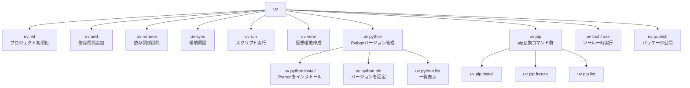

## はじめに

Python のパッケージ管理は長らく `pip` が中心でしたが、近年は `poetry` や `pipenv` など多くの代替ツールが登場しています。そこに 2024 年から急速に普及しているのが **uv** です。

uv は、[Ruff](https://docs.astral.sh/ruff/)（高速 Python リンター）の開発元として知られる **Astral** が Rust で実装したパッケージ管理ツールです。公式ベンチマークによると、キャッシュなしの状態でも pip 比で約 10 倍、キャッシュ活用時には 100 倍近い速度を実現しています。

### uv がなぜ速いのか

- **Rust 実装**: バイナリとして動作し、Python インタープリタのオーバーヘッドがない
- **並列ダウンロード**: 依存パッケージを並列取得
- **グローバルキャッシュ**: プロジェクト間でパッケージキャッシュを共有し、再インストールを最小化
- **差分解決**: 変更のある依存関係のみを再計算するインクリメンタルリゾルバー

本記事では、インストールから実務での活用まで、uv の全機能を体系的に解説します。

---

## 1. インストール

### スタンドアロンインストーラー（推奨）

```bash
# macOS / Linux
curl -LsSf https://astral.sh/uv/install.sh | sh

# Windows (PowerShell)
powershell -ExecutionPolicy ByPass -c "irm https://astral.sh/uv/install.ps1 | iex"
```

インストール後、シェルを再起動するか `source ~/.zshrc`（または `~/.bashrc`）を実行してパスを反映させます。

```bash
uv --version
# uv 0.5.x (例)
```

### Homebrew（macOS）

```bash
brew install uv
```

### pip からのインストール

既存の Python 環境に追加する場合は以下でも可能です。

```bash
pip install uv
```

ただし、スタンドアロンインストーラーの使用が公式推奨です。uv 自体の更新も簡単に行えます。

```bash
uv self update
```

---

## 2. 基本パッケージ管理（pip 互換モード）

uv は `uv pip` サブコマンドで pip と同じ操作感を提供します。既存プロジェクトへの最小コストな導入に適しています。

```bash
# パッケージのインストール
uv pip install fastapi

# バージョン指定
uv pip install "fastapi>=0.100.0"

# requirements.txt からインストール
uv pip install -r requirements.txt

# 開発用依存のインストール
uv pip install -r requirements-dev.txt

# パッケージのアンインストール
uv pip uninstall fastapi

# インストール済みパッケージ一覧
uv pip list

# requirements.txt の生成（freeze）
uv pip freeze > requirements.txt
```

---

## 3. プロジェクト管理（推奨モード）

uv の真価は `pyproject.toml` を中心としたプロジェクト管理モードにあります。

### プロジェクトの初期化

```bash
uv init my-project
cd my-project
```

生成される `pyproject.toml`:

```toml
[project]
name = "my-project"
version = "0.1.0"
description = "Add your description here"
readme = "README.md"
requires-python = ">=3.12"
dependencies = []
```

### パッケージの追加・削除

```bash
# パッケージ追加（pyproject.toml と uv.lock を自動更新）
uv add fastapi httpx

# バージョン制約付きで追加
uv add "fastapi>=0.100.0"

# 開発用依存として追加
uv add --dev pytest ruff mypy

# オプション依存グループに追加
uv add --group lint ruff

# パッケージ削除
uv remove httpx
```

`uv add` を実行すると `pyproject.toml` の `dependencies` と、完全な依存グラフを記録した `uv.lock` が自動的に更新されます。

```toml
[project]
name = "my-project"
version = "0.1.0"
requires-python = ">=3.12"
dependencies = [
    "fastapi>=0.100.0",
    "httpx>=0.27.0",
]

[dependency-groups]
dev = [
    "pytest>=8.0.0",
    "ruff>=0.9.0",
    "mypy>=1.0.0",
]
```

### 依存関係の同期

```bash
# uv.lock の内容を環境に反映
uv sync

# 開発用依存を除いて同期（本番環境向け）
uv sync --no-dev

# 特定グループのみ同期
uv sync --group lint
```

---

## 4. 仮想環境管理

### 仮想環境の作成

```bash
# カレントディレクトリに .venv を作成
uv venv

# Python バージョンを指定
uv venv --python 3.12

# 名前を指定して作成
uv venv .venv-prod
```

### uv run による自動実行

仮想環境を手動でアクティベートしなくても、`uv run` を使えば自動的に仮想環境を利用します。

```bash
# スクリプトの実行
uv run python main.py

# モジュールとして実行
uv run python -m pytest

# uvicorn で FastAPI アプリを起動
uv run uvicorn main:app --reload

# 環境変数と組み合わせ
uv run --env-file .env python main.py
```

### ツールの一時実行（uvx）

```bash
# インストールなしでツールを一時実行
uvx ruff check .
uvx black --check .
uvx mypy src/
```

`uvx` は `uv tool run` のエイリアスです。グローバルインストール不要で使い捨て実行ができます。

---

## 5. Python バージョン管理

uv は Python バージョン自体の管理も行えます。`pyenv` の代替として機能します。

```bash
# 利用可能な Python バージョン一覧
uv python list

# Python 3.12 のインストール
uv python install 3.12

# 複数バージョンを一括インストール
uv python install 3.11 3.12 3.13

# プロジェクトの Python バージョンを固定（.python-version を生成）
uv python pin 3.12

# インストール済みバージョンの確認
uv python list --only-installed
```

`.python-version` ファイルが存在すると、そのディレクトリ以下では自動的に指定バージョンが使用されます。

---

## 6. pip / poetry からの移行ガイド

### コマンド対応表

| 操作 | pip | poetry | uv（プロジェクトモード） |
|------|-----|--------|------------------------|
| 初期化 | — | `poetry init` | `uv init` |
| パッケージ追加 | `pip install X` | `poetry add X` | `uv add X` |
| 開発用追加 | `pip install -e .[dev]` | `poetry add --group dev X` | `uv add --dev X` |
| パッケージ削除 | `pip uninstall X` | `poetry remove X` | `uv remove X` |
| 依存解決・同期 | `pip install -r requirements.txt` | `poetry install` | `uv sync` |
| 仮想環境作成 | `python -m venv .venv` | 自動 | `uv venv` |
| スクリプト実行 | `source .venv/bin/activate && python` | `poetry run python` | `uv run python` |
| ロックファイル生成 | `pip freeze > requirements.txt` | `poetry lock` | 自動（uv add 時） |
| パッケージ公開 | `twine upload` | `poetry publish` | `uv publish` |
| バージョン管理 | pyenv 等を別途利用 | — | `uv python install` |

### poetry からの移行手順

```bash
# 1. 既存の poetry.lock を削除
rm poetry.lock

# 2. pyproject.toml はそのまま流用可能（[tool.poetry] セクションは削除推奨）
# uv は [project] セクションを使用

# 3. uv で依存関係を再解決
uv sync

# 4. 動作確認
uv run python -c "import fastapi; print(fastapi.__version__)"
```

### pip + requirements.txt からの移行手順

```bash
# 1. プロジェクトを初期化
uv init .

# 2. requirements.txt から依存関係をインポート
uv add $(cat requirements.txt | grep -v '^#' | grep -v '^$' | tr '\n' ' ')

# または uv pip install 経由で移行期を設ける
uv pip install -r requirements.txt
```

---

## 7. GitHub Actions での活用

```yaml
name: CI

on:
  push:
    branches: [main]
  pull_request:

jobs:
  test:
    runs-on: ubuntu-latest
    steps:
      - uses: actions/checkout@v4

      - name: Install uv
        uses: astral-sh/setup-uv@v5
        with:
          version: "latest"
          enable-cache: true

      - name: Set up Python
        run: uv python install

      - name: Install dependencies
        run: uv sync --frozen

      - name: Run tests
        run: uv run pytest tests/ -v

      - name: Run linter
        run: uv run ruff check .

      - name: Type check
        run: uv run mypy src/
```

### キャッシュの活用

`astral-sh/setup-uv` アクションには `enable-cache: true` を指定することで、uv のグローバルキャッシュが GitHub Actions のキャッシュに保存されます。2 回目以降の実行で大幅な時間短縮が期待できます。

---

## 8. Dockerfile での活用（Cloud Run 対応）

### マルチステージビルドの例

```dockerfile
# syntax=docker/dockerfile:1

# ビルドステージ
FROM python:3.12-slim AS builder

# uv のインストール
COPY --from=ghcr.io/astral-sh/uv:latest /uv /uvx /bin/

WORKDIR /app

# 依存関係のみ先にコピー（キャッシュ最適化）
COPY pyproject.toml uv.lock ./

# 本番用依存のみインストール（仮想環境を /app/.venv に作成）
RUN uv sync --frozen --no-dev

# ソースコードをコピー
COPY src/ ./src/

# 実行ステージ
FROM python:3.12-slim AS runner

WORKDIR /app

# ビルドステージから仮想環境をコピー
COPY --from=builder /app/.venv /app/.venv
COPY --from=builder /app/src ./src

# PATH に仮想環境を追加
ENV PATH="/app/.venv/bin:$PATH"

# Cloud Run はポート 8080 を使用
ENV PORT=8080
EXPOSE 8080

CMD ["uvicorn", "src.main:app", "--host", "0.0.0.0", "--port", "8080"]
```

### Cloud Run でのポイント

- `uv sync --frozen`: `uv.lock` と完全一致する依存関係のみインストール（意図しない更新を防止）
- `--no-dev`: 開発用パッケージを除外してイメージサイズを削減
- マルチステージビルドで最終イメージに uv バイナリ自体を含めない設計

### docker-compose での開発環境

```yaml
services:
  app:
    build: .
    volumes:
      - .:/app
    environment:
      - ENV=development
    command: uv run uvicorn src.main:app --host 0.0.0.0 --port 8080 --reload
    ports:
      - "8080:8080"
```

---

## 9. コマンド体系図



---

## まとめ

uv の主なメリットを整理します。

| 観点 | 内容 |
|------|------|
| 速度 | 公式ベンチマークによると pip 比で最大 100 倍高速（キャッシュ活用時） |
| 統合性 | パッケージ管理・プロジェクト管理・Python バージョン管理を一本化 |
| 互換性 | pip 互換 API で段階的移行が可能 |
| 再現性 | `uv.lock` による完全なロック、`--frozen` フラグで本番環境を保護 |
| CI/CD | `setup-uv` アクションとキャッシュ連携で CI 高速化 |
| Docker | マルチステージビルドとの組み合わせで最小イメージサイズを実現 |

poetry や pip からの移行は `uv sync` を起点に比較的スムーズに行えます。既存プロジェクトでも `uv pip install -r requirements.txt` から始めて段階的に移行することができます。

公式ドキュメント（https://docs.astral.sh/uv/）には本記事で触れていない詳細な設定オプションも掲載されています。ぜひ参照してみてください。
