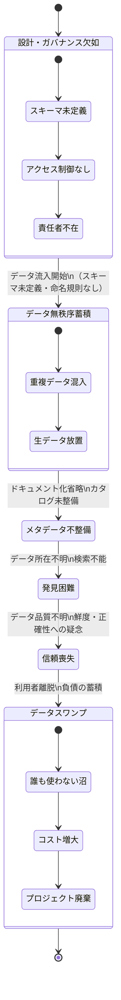
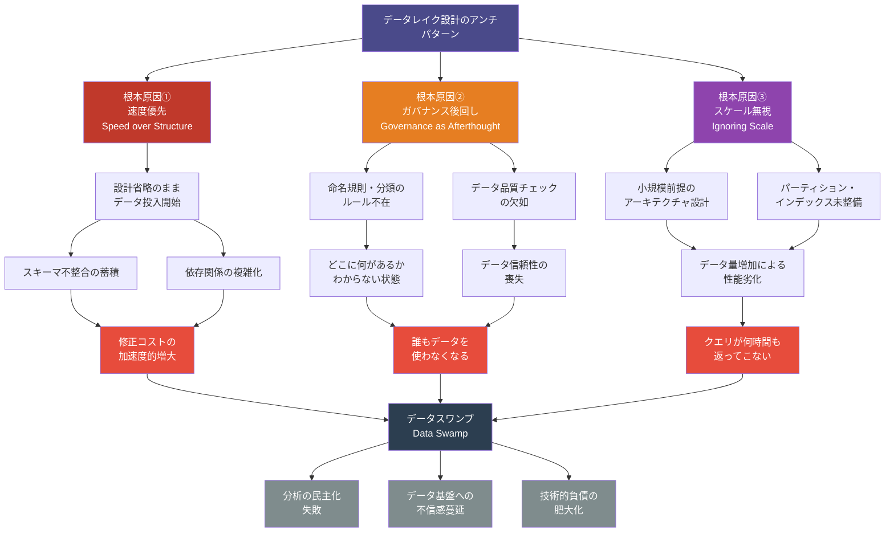
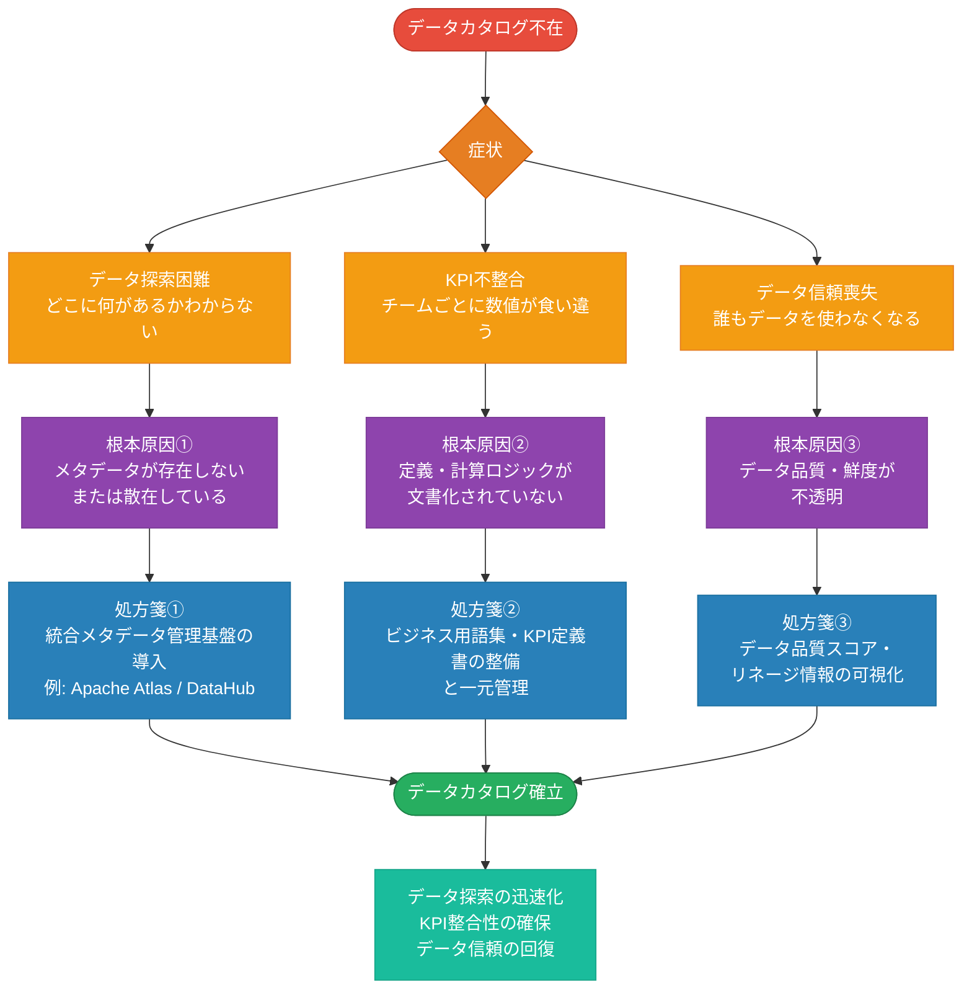
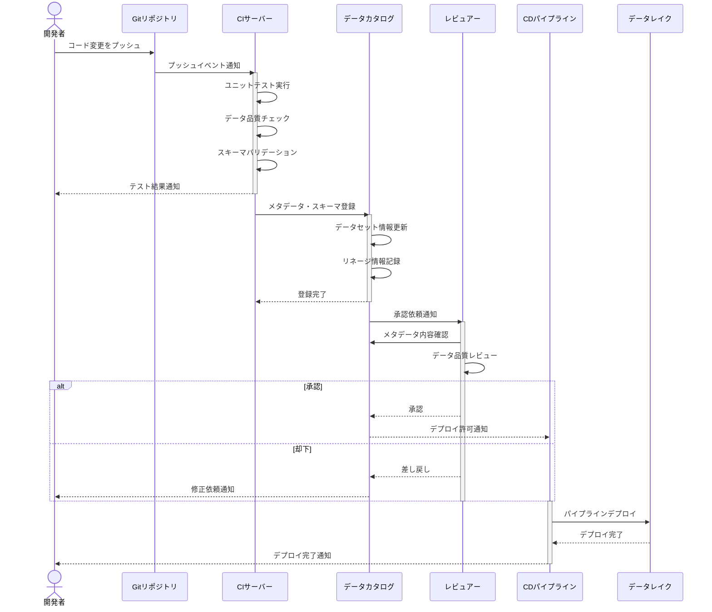
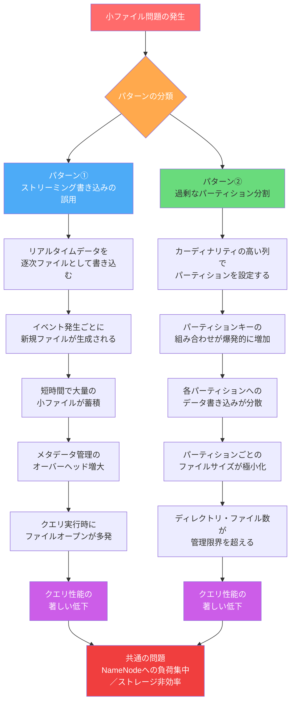
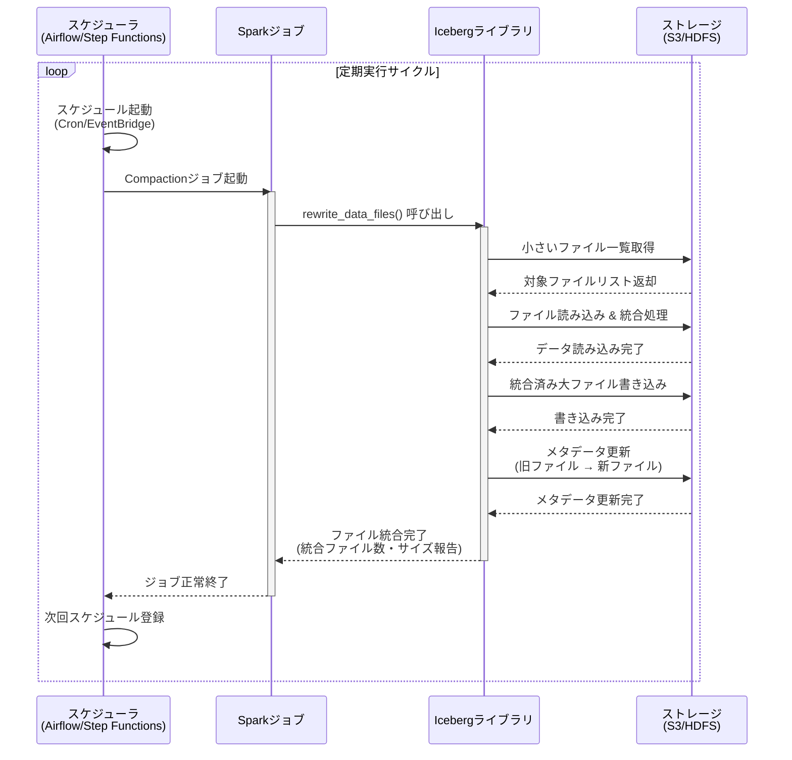

# データレイク設計のアンチパターン：「沼」に落ちないための10の教訓

---

## なぜデータレイクは「沼」になるのか



### データレイクとデータスワンプの境界線

「データを一か所に集めれば、分析の民主化が実現できる」——そう信じてデータレイクを構築したものの、1年後には誰もそのデータを使いこなせなくなっていた。そんな経験をしたエンジニアは、決して少なくありません。

データレイク（Data Lake）とは、構造化・半構造化・非構造化を問わず、あらゆるデータを生の形式でまとめて蓄積するストレージアーキテクチャです。RDBのように事前にスキーマを定義する必要がなく、「とりあえず全部貯めておいて、使うときに解釈する」という柔軟性が最大の売りです。

しかしその柔軟性は、ガバナンスなき運用のもとでは呪いに変わります。データが積み上がるにつれ、「どこに何があるかわからない」「このデータは信頼できるのか」「クエリを投げたら何時間も返ってこない」という状況が生まれ、データレイクはやがて **データスワンプ（Data Swamp：データの沼）** へと転落します。

データレイクとデータスワンプの境界線は、技術的な複雑さにあるのではありません。 **ガバナンス、設計規律、そして組織的な意思決定の有無** にあります。まったく同じツールスタックを使っていても、一方は価値を生み出すデータ基盤になり、もう一方は誰も近づかない負債の山になる。その違いを生み出すのが、本記事で解説する「アンチパターン」です。

### アンチパターンが生まれる3つの根本原因



筆者がこれまで見てきたデータレイクの失敗事例を振り返ると、その根本原因はほぼ例外なく以下の3つに集約されます。

**① 急いで作る（Speed over Structure）**
「まず動くものを作れ」というプレッシャーのもと、設計を省略してデータを流し込み始める。初速は出るが、後から修正するコストがデータ量・依存関係の増加に伴い加速度的に増大する。

**② ガバナンスを後回しにする（Governance as an afterthought）**
「ガバナンスは安定したら考えよう」という先送りが常態化する。しかし安定するころには、ガバナンスなき慣習が組織に深く根付いてしまっている。

**③ スケールを想定しない（Ignoring scale from day one）**
100GBのデータで動いた設計が、100TBでは壊滅的に機能しなくなる。データ量・ユーザー数・クエリ頻度の成長を設計段階で織り込まなかった結果、後から根本的な作り直しを迫られる。

### この記事の読み方・対象読者

本記事はデータエンジニア・データアーキテクトを主な読者として想定しています。データ基盤を所管するエンジニアリングマネージャーやテックリード、あるいはデータ基盤を利用する立場のデータサイエンティストにとっても、自分たちの環境を診断するうえで有益な視点を提供できます。

各アンチパターンは「症状 → 根本原因 → 処方箋」の構成で解説します。「うちのデータレイク、なんか遅い」「このデータ、誰も信用していない」といった **症状から逆引き** して、自社の問題と照合する読み方をお勧めします。

記事後半には診断チェックリストを用意しています。読後すぐに自社環境の健康状態を評価してみてください。

---

## アンチパターン1 ── データカタログなきデータレイク



> **影響度: High ／ 発生頻度: 非常に多い**

### 症状：「あのデータ、どこにあるか知ってる？」が日常になる

`s3://data-lake-prod/` 以下に数千ものフォルダが並んでいるのに、どのフォルダに何が入っているか誰も把握していない。新しいデータサイエンティストがジョインするたびに「使えるデータをリストアップしてほしい」という依頼がSlackに飛んでくる。月に何時間も「データ探し」に費やされている——これがデータカタログ不在のデータレイクで起きることです。

データ発見の困難さは、単なる不便にとどまりません。同じデータを別々のチームが独自に再加工し始め、微妙に異なる複数の「真実」が組織内に乱立します。やがて「このKPIとあのKPIの数値が合わない」という問題が経営会議で発覚し、データへの信頼が根底から崩れます。

### 根本原因：メタデータ管理を「後でやる」にした

データカタログの整備は、目に見える価値を即座に生まない地味な作業です。「まずデータを流すパイプラインを作ろう」「カタログは後でまとめてやろう」という判断は、短期的には合理的に見えます。しかし後でまとめてやろうとしたとき、すでにデータセットは数百に膨れ上がり、各データセットの文脈を知っているメンバーは半分異動していたりします。メタデータは、データと同時に生成されない限り、永遠に後回しになります。

### 処方箋：Data Catalogの導入戦略とDataHub/Glueの使い分け



処方箋は明確です。 **データの取り込みと同時にメタデータを登録する仕組みを作ること** 、そして **カタログの整備をエンジニアの義務にすること** です。

ツールの選択肢としては、以下のものが代表的です。

- **AWS Glue Data Catalog** ：AWSエコシステム内で完結するシンプルなカタログ。Athena・EMR・Glue ETLとの統合が強い。
- **Apache Atlas** ：オープンソースのメタデータ・ガバナンスフレームワーク。ただし2023年以降は開発活動が著しく低下しており、新規導入には適さない。HDP/CDPなどのレガシーHadoop環境との統合が既存要件として存在する場合に限り選択肢となるが、それ以外の場合はDataHubまたはOpenMetadataを推奨する。
- **DataHub** （LinkedIn発OSS）：リネージュ（データの来歴）まで含めた包括的なメタデータ管理が可能。モダンなデータスタックとの統合が豊富。新規導入の第一候補。
- **OpenMetadata** ：DataHubと並ぶモダンなOSSカタログ。APIファーストな設計で拡張性が高く、新規導入に適した選択肢の一つ。
- **Unity Catalog** （Databricks）：Delta Lakeを使う環境でのガバナンスを一元管理。列レベルのアクセス制御・行フィルタリングといった細粒度のセキュリティ機能を備える。なお2024年にOSS化されており（[unity-catalog on GitHub](https://github.com/unitycatalog/unitycatalog)）、Databricksライセンスなしでも利用可能になりつつある点も注目に値する。

ツール選択より重要なのは **運用の仕組み化** です。データパイプラインのコードとカタログ登録を同一のCI/CDプロセスに組み込み、登録なしではデプロイできない状態にすることが、カタログを形骸化させないための最も有効な手段です。

---

## アンチパターン2 ── 小ファイル爆増問題



> **影響度: High ／ 発生頻度: 非常に多い**

### 症状：クエリが異常に遅い、Sparkジョブがタスク地獄に

特定のパーティション配下に100万個のファイルが存在し、1ファイルあたりの平均サイズが数KB——このような状況に気づいたとき、すでに問題は相当深刻です。Apache Sparkでこのデータを読もうとすると、HDFSのNameNodeあるいはAWS S3のAPI呼び出しが爆発的に増加し、タスクのオーバーヘッドがデータ処理本体を超えてしまいます。クエリエンジン（Trino/Prestoなど）でも同様で、ファイルのオープン・クローズだけで処理時間の大半が消費されます。

### 根本原因：ストリーミング書き込み・細粒度パーティションの誤用

小ファイル問題が生まれる典型的なパターンは2つあります。

1つ目は **ストリーミング書き込みの誤用** です。Apache KafkaやKinesis等からリアルタイムでデータをS3に書き込む際、数秒〜数分おきにマイクロバッチとして書き出すと、あっという間に大量の小ファイルが蓄積されます。

2つ目は **過剰なパーティション分割** です。`year/month/day/hour/minute` と時刻で細かくパーティションを切り、さらにそこに小さなファイルを書き込むと、ディレクトリ数とファイル数が乗算的に増加します。

### 処方箋：Compaction戦略とIcebergによるファイル管理自動化



根本的な解決策は **Compaction（コンパクション：小さなファイルを大きなファイルに統合する処理）** です。

Apache Icebergを使用している場合、以下のようなCompaction処理を定期的に実行することで、ファイル数を適切な水準に保てます。

> **注記**: 以下のコードはApache Iceberg 1.4.x時点の `rewrite_data_files` プロシージャの挙動に基づきます。バージョンによって仕様が変わる可能性があるため、実際の導入時は使用バージョンのリリースノートを必ず確認してください。また、SparkSession設定は一部抜粋です。完全な設定については後述の補足を参照してください。

```python
# Apache Iceberg 1.4.x
from pyspark.sql import SparkSession

spark = SparkSession.builder \
    .appName("IcebergCompaction") \
    .config("spark.sql.extensions",
            "org.apache.iceberg.spark.extensions.IcebergSparkSessionExtensions") \
    .config("spark.sql.catalog.glue_catalog",
            "org.apache.iceberg.spark.SparkCatalog") \
    .config("spark.sql.catalog.glue_catalog.type",
            "glue") \
    .getOrCreate()

# ターゲットファイルサイズを128MBに設定してCompactionを実行
# rewrite_data_files: 小さなファイルを結合して最適なサイズに再編成する
spark.sql("""
    CALL glue_catalog.system.rewrite_data_files(
        table => 'my_database.my_table',
        options => map(
            'target-file-size-bytes', '134217728',  -- 目標出力ファイルサイズ: 128MB
            'min-file-size-bytes',    '33554432',   -- この値未満のファイルをCompaction対象とする: 32MB
            'max-file-size-bytes',    '268435456'   -- この値を超えるファイルも分割対象とする: 256MB
        )
    )
""")
```

このCompactionジョブをAirflowやAWS Step Functionsで定期実行（例：日次深夜バッチ）することで、ファイル数の爆増を継続的に抑制できます。Delta Lakeの場合は `OPTIMIZE` コマンド、Apache Hudiでは `HoodieSparkClient` のcleaningとclusteringが対応する機能です。

また、ストリーミング取り込みの段階での小ファイル生成を抑える設計も重要です。ただし、バッファリング時間を延ばすアプローチはユースケースによってトレードオフがあるため、以下のように使い分けることを推奨します。

- **Apache Kafka → S3 の構成** ：Kafka Connect の S3 Sink Connector を使用し、`flush.size`（レコード数によるフラッシュ閾値）や `rotate.interval.ms`（時間によるローテーション間隔）でバッファリングを制御するのが主要な対策です。
- **Spark Structured Streaming の構成** ：`trigger(processingTime='1 hour')` でバッチ間隔を広げる方法もありますが、より現代的なアプローチとして `trigger(availableNow=True)` を使い、溜まったデータをバッチ的に処理する設計パターンも有効です。
- **リアルタイム性要件がある場合** ：バッファ時間を長くすることは遅延許容度との兼ね合いになります。厳格なリアルタイム性が求められるシステムでは、Compactionによる後処理を前提とした設計が現実的な落とし所となります。
