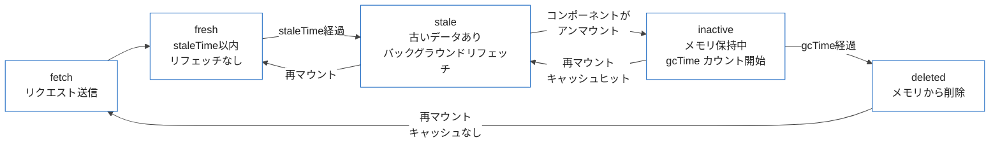

## はじめに

フロントエンドでAPIデータを管理するとき、次のような課題に直面することがあります。

- データの取得タイミングと再取得のタイミングをどう制御するか
- ユーザー操作の結果を即座に画面に反映しつつ、サーバー側の失敗に備えてロールバックするにはどうするか
- 無限スクロールのようなページネーションをシンプルに実装するにはどうするか

これらの課題に対する実用的な解答を提供するのが TanStack Query（旧称 React Query）です。

本記事では、TanStack Query v5 の以下の実践パターンを解説します。

- QueryClient のデフォルト設定（staleTime / gcTime の設計指針）
- Query Key Factory Pattern によるキャッシュキーの型安全な管理
- 楽観的更新（Optimistic Updates）の実装とロールバック
- 無限スクロール（`useInfiniteQuery`）
- Suspense と ErrorBoundary との統合
- Next.js App Router との組み合わせ（HydrationBoundary）

サンプルコードはすべて TypeScript で記述し、TanStack Query v5 の API に対応しています。

---

## 1. QueryClient の設定

TanStack Query のキャッシュ挙動はすべて `QueryClient` のデフォルトオプションで制御します。最初にここを設計することが、その後のコード品質に大きく影響します。

```typescript
// lib/query-client.ts
import { QueryClient } from '@tanstack/react-query'

export const queryClient = new QueryClient({
  defaultOptions: {
    queries: {
      staleTime: 1000 * 60 * 5,    // 5分
      gcTime: 1000 * 60 * 10,      // 10分
      retry: 2,
      refetchOnWindowFocus: false,
    },
  },
})
```

### staleTime と gcTime の設計指針

以下の表を参考に、エンドポイントの性質に応じて設定値を調整してください。

| データの性質 | staleTime の目安 | 設定例 |
|-------------|-----------------|--------|
| リアルタイム性が重要（株価、チャット） | 0〜30秒 | `staleTime: 0` |
| 一般的なAPIデータ | 1〜5分 | `staleTime: 60 * 1000 * 5` |
| 静的に近いマスターデータ | 30分〜1時間 | `staleTime: 60 * 1000 * 60` |
| ユーザー設定・プロフィール | 10〜30分 | `staleTime: 60 * 1000 * 15` |

`gcTime` は `staleTime` の 2 倍を目安にします。`gcTime` はキャッシュがメモリから削除されるまでの時間で、コンポーネントがアンマウントされた後もキャッシュを保持し続ける期間を制御します。

v5 では v4 の `cacheTime` が `gcTime` にリネームされています。既存コードを移行する際は置き換えが必要です。

---

## 2. Query Key Factory Pattern

TanStack Query のキャッシュはキーで識別されます。プロジェクトが大きくなると、キーの命名が散らばってバグの温床になります。Query Key Factory Pattern を使うことで、キャッシュキーを一箇所で型安全に管理できます。

```typescript
// lib/query-keys.ts
type TodoFilters = {
  status?: 'all' | 'active' | 'completed'
  page?: number
}

export const todoKeys = {
  all: ['todos'] as const,
  lists: () => [...todoKeys.all, 'list'] as const,
  list: (filters: TodoFilters) => [...todoKeys.lists(), filters] as const,
  details: () => [...todoKeys.all, 'detail'] as const,
  detail: (id: number) => [...todoKeys.details(), id] as const,
}
```

使い方はシンプルです。

```typescript
// データ取得
useQuery({
  queryKey: todoKeys.list({ status: 'active' }),
  queryFn: () => fetchTodos({ status: 'active' }),
})

// 詳細取得
useQuery({
  queryKey: todoKeys.detail(42),
  queryFn: () => fetchTodo(42),
})

// リスト全体のキャッシュを無効化
queryClient.invalidateQueries({ queryKey: todoKeys.lists() })
```

このパターンのメリットは、キーの構造を変更したいときに `query-keys.ts` だけを修正すれば済む点です。また、`as const` によってキーが文字列リテラル型として推論されるため、補完が効きます。

---

## 3. 楽観的更新（Optimistic Updates）

楽観的更新とは、サーバーのレスポンスを待たずに UI を先に更新し、エラーが発生した場合にロールバックするパターンです。

TanStack Query では `useMutation` の `onMutate`、`onError`、`onSettled` の 3 つのコールバックを組み合わせて実装します。

```typescript
// hooks/use-update-todo.ts
import { useMutation, useQueryClient } from '@tanstack/react-query'
import { todoKeys } from '@/lib/query-keys'
import { updateTodo, type Todo, type TodoFilters } from '@/lib/api'

type UpdateTodoInput = {
  id: number
  title: string
  completed: boolean
}

export function useUpdateTodo(filters: TodoFilters = {}) {
  const queryClient = useQueryClient()

  return useMutation({
    mutationFn: (input: UpdateTodoInput) => updateTodo(input),

    onMutate: async (newTodo) => {
      // 1. 進行中のリフェッチをキャンセルして競合を防ぐ
      await queryClient.cancelQueries({ queryKey: todoKeys.list(filters) })

      // 2. 現在のキャッシュを退避
      const previousTodos = queryClient.getQueryData<Todo[]>(
        todoKeys.list(filters)
      )

      // 3. キャッシュを楽観的に更新
      queryClient.setQueryData<Todo[]>(todoKeys.list(filters), (old = []) =>
        old.map((todo) =>
          todo.id === newTodo.id ? { ...todo, ...newTodo } : todo
        )
      )

      // 4. コンテキストとして退避データを返す（onError で使用）
      return { previousTodos }
    },

    onError: (_err, _newTodo, context) => {
      // サーバーエラー時にキャッシュをロールバック
      if (context?.previousTodos !== undefined) {
        queryClient.setQueryData(todoKeys.list(filters), context.previousTodos)
      }
    },

    onSettled: () => {
      // 成功・失敗にかかわらずサーバーのデータで同期
      queryClient.invalidateQueries({ queryKey: todoKeys.list(filters) })
    },
  })
}
```

コンポーネント側では次のように使います。

```typescript
// components/todo-item.tsx
'use client'

import { useUpdateTodo } from '@/hooks/use-update-todo'

type Props = {
  todo: { id: number; title: string; completed: boolean }
}

export function TodoItem({ todo }: Props) {
  const { mutate: updateTodo, isPending } = useUpdateTodo()

  return (
    <li>
      <input
        type="checkbox"
        checked={todo.completed}
        disabled={isPending}
        onChange={(e) =>
          updateTodo({
            id: todo.id,
            title: todo.title,
            completed: e.target.checked,
          })
        }
      />
      <span>{todo.title}</span>
    </li>
  )
}
```

チェックボックスを操作した瞬間に UI が更新され、サーバー側でエラーが起きた場合には自動的に元の状態に戻ります。

---

## 4. 無限スクロール（useInfiniteQuery）

ページネーションを持つリストの無限スクロールは `useInfiniteQuery` で実装します。v5 では `initialPageParam` が必須パラメータになりました。

まず API レスポンスの型を定義します。

```typescript
// lib/api.ts
type TodosPage = {
  todos: Todo[]
  nextPage: number | null
  totalCount: number
}

export async function fetchTodosPage(page: number): Promise<TodosPage> {
  const res = await fetch(`/api/todos?page=${page}&limit=20`)
  if (!res.ok) throw new Error('Failed to fetch todos')
  return res.json()
}
```

次に `useInfiniteQuery` でデータを取得するフックを作ります。

```typescript
// hooks/use-infinite-todos.ts
import { useInfiniteQuery } from '@tanstack/react-query'
import { todoKeys } from '@/lib/query-keys'
import { fetchTodosPage } from '@/lib/api'

export function useInfiniteTodos() {
  return useInfiniteQuery({
    queryKey: todoKeys.lists(),
    queryFn: ({ pageParam }) => fetchTodosPage(pageParam),
    initialPageParam: 1,
    getNextPageParam: (lastPage) => lastPage.nextPage ?? undefined,
  })
}
```

コンポーネントでは Intersection Observer を使って自動的に次のページを読み込みます。

```typescript
// components/infinite-todo-list.tsx
'use client'

import { useEffect, useRef } from 'react'
import { useInfiniteTodos } from '@/hooks/use-infinite-todos'

export function InfiniteTodoList() {
  const {
    data,
    fetchNextPage,
    hasNextPage,
    isFetchingNextPage,
    status,
  } = useInfiniteTodos()

  const observerRef = useRef<HTMLDivElement>(null)

  useEffect(() => {
    const observer = new IntersectionObserver(
      (entries) => {
        if (entries[0].isIntersecting && hasNextPage && !isFetchingNextPage) {
          fetchNextPage()
        }
      },
      { threshold: 0.1 }
    )

    const current = observerRef.current
    if (current) observer.observe(current)
    return () => {
      if (current) observer.unobserve(current)
    }
  }, [fetchNextPage, hasNextPage, isFetchingNextPage])

  if (status === 'pending') return <p>読み込み中...</p>
  if (status === 'error') return <p>エラーが発生しました</p>

  const todos = data.pages.flatMap((page) => page.todos)

  return (
    <ul>
      {todos.map((todo) => (
        <li key={todo.id}>{todo.title}</li>
      ))}
      <div ref={observerRef} style={{ height: 20 }} />
      {isFetchingNextPage && <p>次のページを読み込み中...</p>}
      {!hasNextPage && <p>すべてのタスクを表示しました</p>}
    </ul>
  )
}
```

`data.pages` は各ページのレスポンスの配列です。`flatMap` で全ページのデータをフラットにして表示します。`hasNextPage` は `getNextPageParam` が `undefined` を返すと `false` になります。

---

## 5. Suspense と ErrorBoundary の統合

TanStack Query v5 では `useSuspenseQuery` が正式に提供されました。`suspense: true` オプションは廃止されているため、v5 では専用フックを使います。

```typescript
// hooks/use-todo-detail.ts
import { useSuspenseQuery } from '@tanstack/react-query'
import { todoKeys } from '@/lib/query-keys'
import { fetchTodo } from '@/lib/api'

export function useTodoDetail(id: number) {
  return useSuspenseQuery({
    queryKey: todoKeys.detail(id),
    queryFn: () => fetchTodo(id),
  })
}
```

`useSuspenseQuery` を使うと、ローディング状態は最も近い `<Suspense>` が、エラー状態は最も近い `<ErrorBoundary>` がそれぞれ処理します。コンポーネント側で `status` を確認する処理が不要になります。

```typescript
// components/todo-detail.tsx
'use client'

import { useTodoDetail } from '@/hooks/use-todo-detail'

type Props = { id: number }

// このコンポーネントは Suspense と ErrorBoundary で囲む前提
export function TodoDetail({ id }: Props) {
  const { data: todo } = useTodoDetail(id)

  return (
    <div>
      <h2>{todo.title}</h2>
      <p>{todo.completed ? '完了' : '未完了'}</p>
    </div>
  )
}
```

```typescript
// app/todos/[id]/page.tsx
import { Suspense } from 'react'
import { ErrorBoundary } from 'react-error-boundary'
import { TodoDetail } from '@/components/todo-detail'

export default function TodoDetailPage({ params }: { params: { id: string } }) {
  return (
    <ErrorBoundary fallback={<p>データの取得に失敗しました</p>}>
      <Suspense fallback={<p>読み込み中...</p>}>
        <TodoDetail id={Number(params.id)} />
      </Suspense>
    </ErrorBoundary>
  )
}
```

キャッシュライフサイクルの全体像は以下のとおりです。



---

## 6. Next.js App Router + HydrationBoundary

Next.js App Router のサーバーコンポーネントで事前にデータを取得し、クライアントにキャッシュを引き渡すことで、ページ初回表示時のローディング状態を排除できます。

まず、`QueryClient` を毎リクエストごとに生成するユーティリティを作ります。

```typescript
// lib/get-query-client.ts
import { QueryClient } from '@tanstack/react-query'
import { cache } from 'react'

export const getQueryClient = cache(
  () =>
    new QueryClient({
      defaultOptions: {
        queries: {
          staleTime: 1000 * 60 * 5,
        },
      },
    })
)
```

`cache()` は React の API で、同一リクエスト内での `QueryClient` の再生成を防ぎます。

サーバーコンポーネントでプリフェッチします。

```typescript
// app/todos/page.tsx
import { dehydrate, HydrationBoundary } from '@tanstack/react-query'
import { getQueryClient } from '@/lib/get-query-client'
import { todoKeys } from '@/lib/query-keys'
import { fetchTodosServer } from '@/lib/api-server'
import { TodoList } from '@/components/todo-list'

export default async function TodosPage() {
  const queryClient = getQueryClient()

  await queryClient.prefetchQuery({
    queryKey: todoKeys.list({}),
    queryFn: fetchTodosServer,
  })

  return (
    <HydrationBoundary state={dehydrate(queryClient)}>
      <TodoList />
    </HydrationBoundary>
  )
}
```

クライアントコンポーネントでは通常どおり `useQuery` を使います。

```typescript
// components/todo-list.tsx
'use client'

import { useQuery } from '@tanstack/react-query'
import { todoKeys } from '@/lib/query-keys'
import { fetchTodos } from '@/lib/api'

export function TodoList() {
  // サーバー側でプリフェッチされたデータがキャッシュに存在するため、
  // 初回レンダリング時にローディング状態にならない
  const { data: todos = [] } = useQuery({
    queryKey: todoKeys.list({}),
    queryFn: fetchTodos,
  })

  return (
    <ul>
      {todos.map((todo) => (
        <li key={todo.id}>{todo.title}</li>
      ))}
    </ul>
  )
}
```

プロバイダーの設定は `app/providers.tsx` で行います。

```typescript
// app/providers.tsx
'use client'

import { QueryClientProvider } from '@tanstack/react-query'
import { getQueryClient } from '@/lib/get-query-client'

export function Providers({ children }: { children: React.ReactNode }) {
  const queryClient = getQueryClient()

  return (
    <QueryClientProvider client={queryClient}>
      {children}
    </QueryClientProvider>
  )
}
```

```typescript
// app/layout.tsx
import { Providers } from './providers'

export default function RootLayout({
  children,
}: {
  children: React.ReactNode
}) {
  return (
    <html lang="ja">
      <body>
        <Providers>{children}</Providers>
      </body>
    </html>
  )
}
```

---

## 7. DevTools でデバッグする

開発時は React Query DevTools を導入することで、キャッシュの状態をリアルタイムに確認できます。

```bash
npm install @tanstack/react-query-devtools
```

```typescript
// app/providers.tsx
'use client'

import { QueryClientProvider } from '@tanstack/react-query'
import { ReactQueryDevtools } from '@tanstack/react-query-devtools'
import { getQueryClient } from '@/lib/get-query-client'

export function Providers({ children }: { children: React.ReactNode }) {
  const queryClient = getQueryClient()

  return (
    <QueryClientProvider client={queryClient}>
      {children}
      <ReactQueryDevtools initialIsOpen={false} />
    </QueryClientProvider>
  )
}
```

DevTools では各クエリの状態（fresh / stale / inactive / fetching）、キャッシュの内容、最終更新時刻を確認できます。`staleTime` の調整や楽観的更新の動作確認をするときに役立ちます。

本番ビルドでは自動的に除外されるため、条件分岐は不要です。

---

## まとめ

本記事で紹介したパターンをまとめます。

| パターン | 目的 | 主なAPI |
|----------|------|---------|
| QueryClient 設定 | staleTime/gcTime の一元管理 | `QueryClient` |
| Query Key Factory | キャッシュキーの型安全な管理 | `as const` |
| 楽観的更新 | UI の即時反映とロールバック | `onMutate / onError / onSettled` |
| 無限スクロール | ページネーションの自動化 | `useInfiniteQuery` |
| Suspense 統合 | ローディング処理の分離 | `useSuspenseQuery` |
| HydrationBoundary | SSR とキャッシュの引き渡し | `prefetchQuery / dehydrate` |

TanStack Query は「データ取得ライブラリ」というより「サーバー状態管理ライブラリ」として設計されています。ローカル状態（UI の開閉、フォームの入力値など）は引き続き `useState` や Zustand で管理し、サーバーのデータは TanStack Query に任せるという役割分担を意識すると、コードが整理されます。

v5 ではフック名の変更（`cacheTime` → `gcTime`、`suspense` オプション廃止）がいくつかあります。既存プロジェクトを移行する際は公式のマイグレーションガイドを参照してください。
