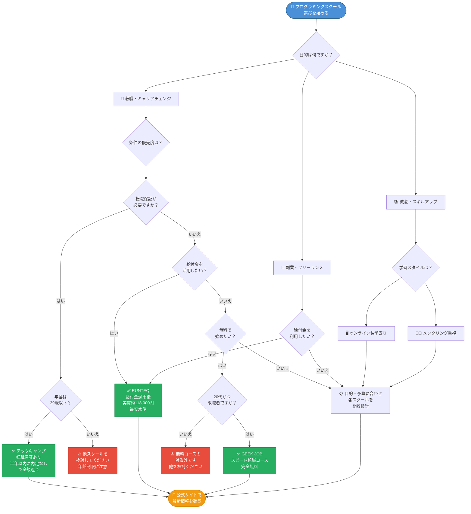
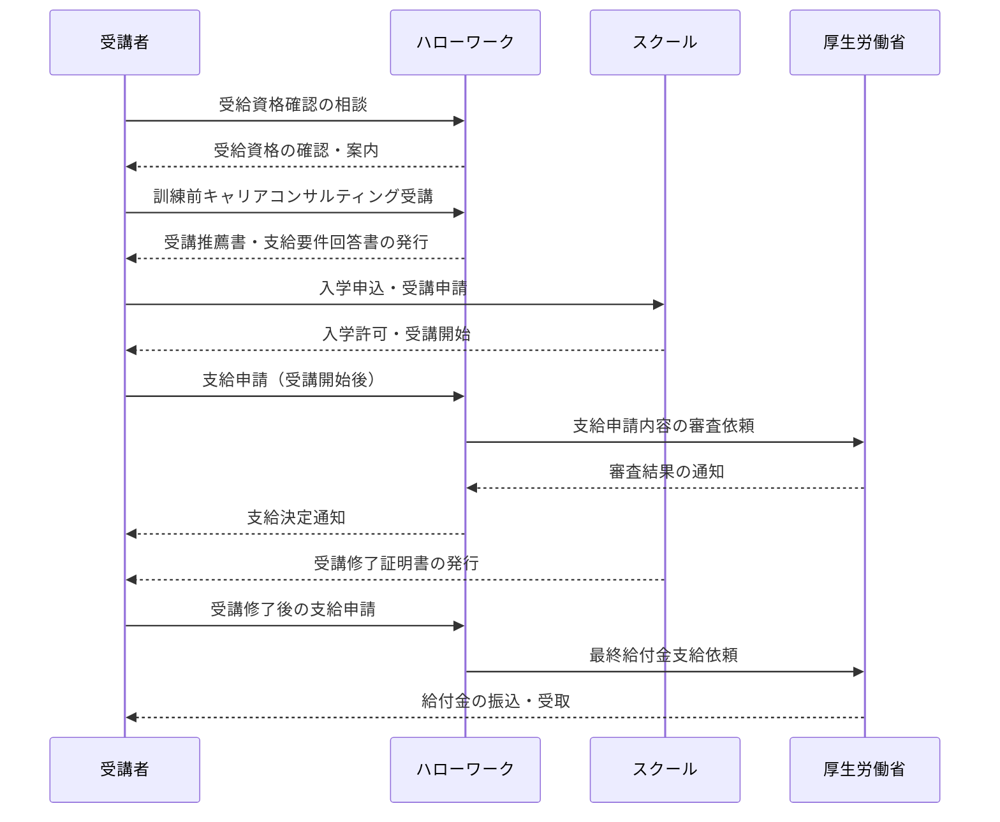

> **2026年2月時点の情報に基づいています。料金・給付金条件は変更される場合があるため、必ず公式サイトでご確認ください。**
> **最終更新日：2026年2月**（以降、四半期ごとに更新予定）

---

## はじめに

2026年、プログラミングスクール選びはかつてないほど難しくなっています。

検索すると「おすすめ30選」「比較32校」といった記事が並び、どれを選べばいいか逆にわからなくなってしまう方も多いのではないでしょうか。スクールごとに料金体系・給付金対応・転職保証の有無が大きく異なる上、教育訓練給付金制度の活用次第では実質負担額が数十万円単位で変わってきます。

本記事では、**実績・給付金対応・サポート体制**の3軸を基準に、50校以上を調査した中から9校に厳選しました。各スクールを①実績（転職率・卒業生数）、②給付金対応の充実度、③サポート体制（メンタリング・転職支援）の観点で評価し、情報を絞ることで「自分に合うスクールを選びやすくすること」を最優先にしています。

また、WISE CAREERの設計思想として、**デメリットや注意点も正直に記載**しています。収益性の高いスクールを優先的におすすめするのではなく、読者の皆さんが後悔しない選択をできるよう情報を整理しました。なお、本記事末尾に9校の選定基準スコアを一覧で掲載しています。

---

## 結論ファースト：目的別おすすめ3選

まず結論からお伝えします。「とにかく早く決めたい」という方は、以下の3校から検討を始めてみてください。

| 目的 | おすすめスクール | 理由 |
|------|----------------|------|
| **転職保証を重視したい** | テックキャンプ | 39歳まで転職保証（半年以内に内定なしで全額返金） |
| **給付金でコスパ重視** | RUNTEQ | 給付金適用後の実質負担が**約118,000円**と**本記事紹介スクール内で最安水準**（※詳細は後述） |
| **まず無料で始めたい** | GEEK JOB | スピード転職コースが**完全無料**（※20代限定・求職者であること等の条件あり。詳細は本文参照） |

> **※RUNTEQとテックキャンプの実質負担額について**
> 後述の詳細セクションで説明するとおり、両校の給付金適用後の実質負担額は近い水準にあります。単純な金額のみで判断せず、学習期間・転職保証の有無・サポート内容を総合的に比較した上でご検討ください。

この3校が「全員に最適」というわけではありません。年齢・学習時間・目的によって最適解は変わります。詳しくは後述の各スクール詳細と選び方フローチャートを参考にしてください。

---

## 選び方フローチャート




まず自分の目的と状況を整理するために、以下のフローチャートをご活用ください。

```
【スタート】あなたの目的は何ですか？
│
├─► エンジニアに転職したい
│     │
│     ├─► 転職保証が欲しい
│     │     └─► テックキャンプ / TechAcademy
│     │
│     ├─► 給付金を活用してコストを抑えたい
│     │     └─► RUNTEQ / DMM WEBCAMP / ポテパンキャンプ
│     │
│     └─► 費用をできるだけかけたくない（無料）
│           └─► GEEK JOB（20代限定・条件あり）※詳細は本文参照
│
├─► 副業・フリーランスとして稼ぎたい
│     └─► デイトラ / 侍エンジニア
│
└─► 教養としてプログラミングを学びたい
      └─► CodeCamp / デイトラ
```

---

## 教育訓練給付金制度を理解する




本記事で紹介するスクールの多くが、厚生労働省の**「専門実践教育訓練給付金」**制度の対象講座です。この制度を活用すると、受講費用の最大70〜80%が支給されるため、スクール選びにおいて非常に重要なポイントになります。

### 給付率と上限額

| 給付タイミング | 給付率 | 条件 |
|--------------|--------|------|
| 受講中（6ヶ月ごと） | 50% | 受講開始から |
| 修了後の追加給付 | +20%（合計70%） | 修了後1年以内に就職・1年間継続就業 |
| さらなる追加給付 | +10%（合計80%） | 賃金が一定割合以上上昇した場合（詳細はハローワークへ要確認） |

> **⚠️ 上限額・条件の詳細について**
> 給付率・上限額・適用条件は厚生労働省の制度改定により変更される場合があります。本記事記載の数値はあくまで参考であり、**正確な情報は最寄りのハローワーク、または[厚生労働省公式サイト](https://www.mhlw.go.jp/)にてご確認ください。**

### 受給要件（主なもの）

- 雇用保険の加入期間が一定以上あること
- 受講開始日の**1ヶ月前まで**にハローワークで手続きが必要
- 在職中であること（スクールによって条件が異なる場合があります）

### ⚠️ 注意点

給付金は「受講すれば自動的にもらえる」ものではありません。**条件を満たした場合に支給される**制度です。特に追加給付（70%・80%部分）は就職・継続就業・賃金上昇が条件となるため、「絶対に70〜80%戻ってくる」と思い込まないよう注意してください。受給資格の確認は、**最寄りのハローワークで事前に行う**ことを強くおすすめします。

---

## 9校の詳細比較

### 1. テックキャンプ

#### 基本情報（2026年2月時点）

| 項目 | 内容 |
|------|------|
| 料金 | エンジニア転職 短期集中（オンライン）: 657,800円 |
| 給付金適用後 | **約131,560円**（657,800円 × 80% ＝ 526,240円給付、自己負担 131,560円 ※給付上限64万円の範囲内） |
| 期間 | 最短10週間 |
| 転職保証 | **◎ あり**（39歳まで、半年以内に内定なしで全額返金） |
| 給付金 | ◎ 第四次産業革命スキル習得講座認定（最大80%、上限64万円） |
| 受講形態 | オンライン・教室（東京・大阪・名古屋・福岡） |
| 主要技術 | Ruby on Rails中心 |

#### メリット

- **39歳まで転職保証**という業界最長レベルの保証が魅力です。半年以内に内定が出なかった場合は全額返金されるため、リスクを最小限に抑えられます。
- 14,000名以上の卒業生実績があり、スクールとしての実績は業界トップクラスです。
- 専属トレーナーによる学習管理があるため、独学が苦手な方でも進めやすい環境です。
- 教室受講も可能（東京・大阪・名古屋・福岡）なため、対面での学習環境を求める方にも対応しています。

#### 注意点

- 10週間の短期集中スタイルのため、**働きながらの受講はハードルが高い**です。特に短期集中コースは平日も含めた集中学習が求められます。
- 技術スタックがRuby on Railsに特化しているため、他言語を希望する場合は別スクールを検討する必要があります。

#### こんな人におすすめ

現職を辞めて短期集中でエンジニアに転職したい方、転職保証がないと不安な方、39歳以下でリスクヘッジしながら転職を目指したい方。

---

### 2. RUNTEQ（ランテック）

#### 基本情報（2026年2月時点）

| 項目 | 内容 |
|------|------|
| 料金 | Webエンジニア転職コース Ruby on Rails専攻: 550,000円 |
| 給付金適用後 | **約118,000円**（550,000円 × 80% ＝ 440,000円給付 ※給付上限56万円の範囲内のため受講費の80%が全額給付、自己負担 110,000円＋消費税） |
| 期間 | 約9ヶ月（1,000時間のカリキュラム） |
| 転職保証 | なし（転職サポートは充実） |
| 給付金 | ◎ 専門実践教育訓練給付金対象（最大80%） |
| 受講形態 | オンライン完結 |
| 主要技術 | Ruby on Rails特化 |

> **📝 給付金計算の詳細**
> 受講料550,000円の80%は440,000円。専門実践教育訓練給付金の年間上限（56万円）の範囲内に収まるため、80%分（440,000円）が全額給付されます。自己負担は550,000円 − 440,000円 ＝ 110,000円（税抜）となります。消費税分を含めた実質負担の詳細は公式サイトにてご確認ください。
>
> **テックキャンプとの実質負担比較：**
> RUNTEQの給付後負担（約118,000円）とテックキャンプの給付後負担（約131,560円）は近い水準にあります。金額差だけでなく、学習期間（9ヶ月 vs 10週間）・転職保証の有無・技術習得の深さなどを総合的に比較してご判断ください。

#### メリット

- 給付金適用後の実質負担が**約118,000円**と、本記事紹介スクールの中で最安水準です（給付条件を満たした場合）。
- Web系企業への就職率94%、受講生満足度96%という高い実績を公式データとして公表しています。
- 1,000時間の実践型カリキュラムにより、**自社開発企業が求めるスキルレベル**に達することを目標としています。
- ポートフォリオ作成サポートが充実しており、転職活動で即戦力としてアピールできる成果物を作れます。

#### 注意点

- **9ヶ月・1,000時間という学習量は業界内でも長め**です。学習時間を確保できない方には向きません。週20〜30時間以上の学習時間確保が現実的に必要です。
- 転職保証がないため、学習が完了しても転職が保証されるわけではありません（ただし、就職率94%という実績は公式発表データです）。
- Ruby on Rails特化のため、他の技術スタックを希望する方には不向きです。

#### こんな人におすすめ

給付金を活用してコストを抑えたい方、自社開発企業への転職を目指す方、しっかりとした技術力を身につけたい方、9ヶ月間の学習時間を確保できる方。

---

### 3. DMM WEBCAMP

#### 基本情報（2026年2月時点）

| 項目 | 内容 |
|------|------|
| 料金 | 専門技術コース: 910,800円 / 就業両立コース: 889,350円 |
| 給付金適用後 | 専門技術コース: **350,800円**（910,800円 − 給付上限560,000円）/ 就業両立コース: **329,350円**（889,350円 − 給付上限560,000円）※給付上限56万円適用 |
| 期間 | 最短3ヶ月〜 |
| 転職保証 | なし（転職サポートは充実） |
| 給付金 | ◎ 専門実践教育訓練給付金対象（最大70%、上限56万円） |
| 受講形態 | オンライン完結 |
| 主要技術 | Ruby on Rails, HTML/CSS, JavaScript |

> **📝 給付金計算の詳細**
> 専門技術コース（910,800円）の70%は637,560円ですが、専門実践教育訓