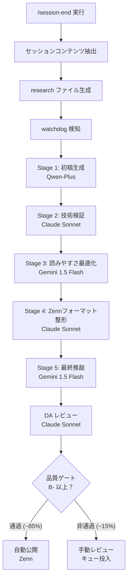
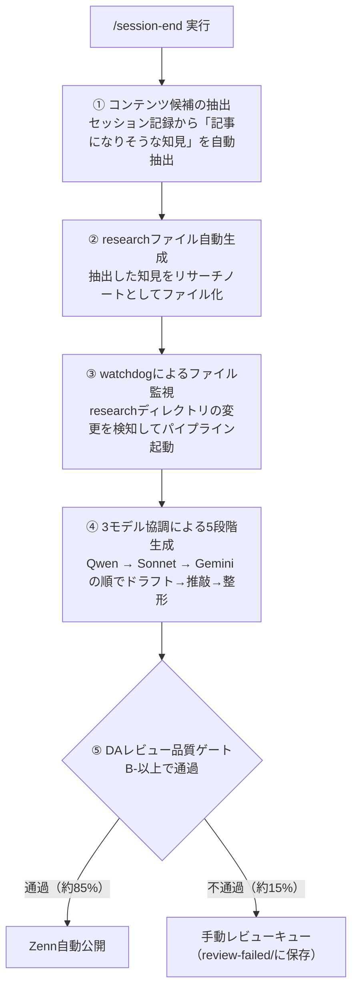
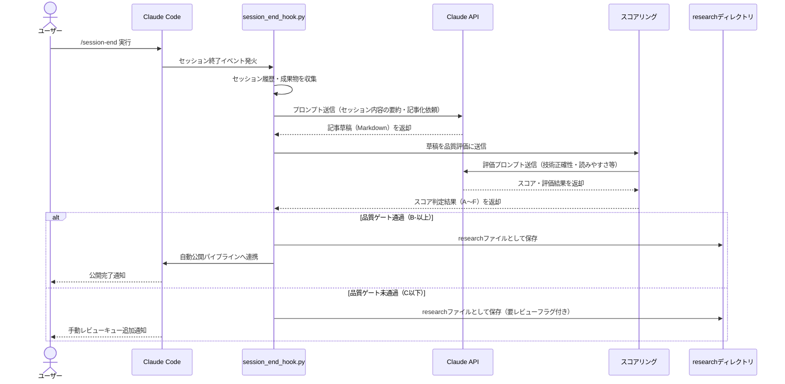
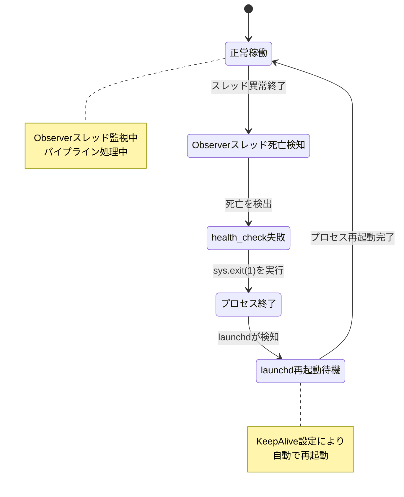
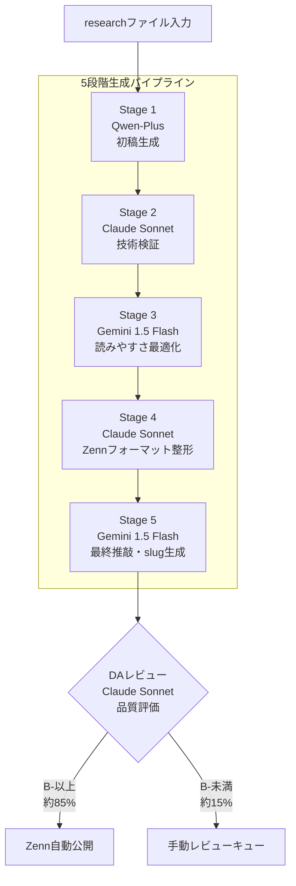

## はじめに

「記事を書きたいけど時間がない」という問題を、前回の記事（「Claude Code × Agent Teamsで1日5本のZenn記事を書いた話」）ではAIエージェントの並列活用で解決しました。しかしあの方法には、まだ人手が介在するステップが残っていました。

今回はその発展形として、 **`/session-end`コマンドを叩くだけで、セッションの知見が自動的にZenn記事として公開されるまでのパイプライン** を構築しました。人間がやることは、セッション終了時に1つのコマンドを実行するだけです。品質ゲートを通過した記事（B-以上の評価）は自動公開され、通過しなかった記事は手動レビューのキューに入ります。実績として、約85%の記事が品質ゲートを通過しており、実質的な自動化が実現できています。

コスト試算は **約$0.10/記事** です。以下がその内訳です。

| モデル | ステージ | トークン数（目安） | コスト |
|--------|---------|-----------------|--------|
| Qwen-Plus | Stage 1: 初稿生成 | 〜8k tokens | $0.008 |
| Claude Sonnet | Stage 2: 技術検証 | 〜12k tokens | $0.036 |
| Gemini 1.5 Flash | Stage 3: 読みやすさ最適化 | 〜12k tokens | $0.012 |
| Claude Sonnet | Stage 4: Zennフォーマット整形 | 〜10k tokens | $0.030 |
| Gemini 1.5 Flash | Stage 5: 最終推敲 | 〜8k tokens | $0.008 |
| Claude Sonnet | DAレビュー | 〜5k tokens | $0.015 |
| 合計 | | | 〜$0.109 |

※トークン数・コストはresearchファイル1本あたりの実測平均値。記事の長さにより±30%程度変動します。

---

## 全体アーキテクチャ



パイプラインは大きく5つのフェーズで構成されています。



各フェーズの詳細を順に説明します。

---

## フェーズ①② : /session-endトリガーとresearchファイル生成



### カスタムコマンドの設定方法

Claude Codeのカスタムコマンド機能を使い、`/session-end`を定義しています。まず`.claude/commands/session-end.md`を以下の内容で作成します。

```markdown
---
description: セッション終了時にresearchファイルを自動生成する
---

以下の処理を実行してください：

1. 本日の作業ログ（`logs/YYYY-MM-DD.md`）を読み込む
2. `python session_end_hook.py --log logs/YYYY-MM-DD.md` を実行する
3. 生成されたresearchファイルのパスを報告する
```

このファイルを設置すると、Claude Code上で`/session-end`コマンドが利用可能になります。コマンドが実行されると`session_end_hook.py`が呼び出され、以下の処理が連鎖的に走ります。

1. 当日のセッション記録（`.md`ファイル）を読み込む
2. 「記事化できる知見」のスコアリングを行う
3. スコアが閾値を超えた候補について、リサーチノートのテンプレートを自動生成する
4. `research/`ディレクトリに`YYYY-MM-DD-{slug}.md`形式で保存する

`session_end_hook.py`のClaude API呼び出し部分の実装例を以下に示します。

```python
# session_end_hook.py（抜粋）
import anthropic
import json

client = anthropic.Anthropic()  # ANTHROPIC_API_KEY環境変数から自動取得

def call_claude(prompt: str, content: str) -> list[dict]:
    """Claude APIを呼び出してJSON形式のレスポンスを返す"""
    message = client.messages.create(
        model="claude-sonnet-4-5",
        max_tokens=2048,
        messages=[
            {
                "role": "user",
                "content": f"{prompt}\n\n---\n{content}"
            }
        ]
    )
    return json.loads(message.content[0].text)

def extract_content_candidates(session_log: str) -> list[dict]:
    """セッションログから記事候補を抽出する"""
    prompt = """
    以下のセッション記録から、Zenn記事として価値のある知見を抽出してください。
    評価基準:
    - 具体的な実装上の課題と解決策があるか
    - 再現性があるか（読者が試せるか）
    - 独自性があるか

    以下のJSON形式で返してください:
    [{"title": "...", "score": 8.5, "summary": "..."}]
    """
    candidates = call_claude(prompt, session_log)
    return [c for c in candidates if c["score"] >= 7.0]
```

### researchファイルのテンプレート

生成されるresearchファイルには、以下のセクションが自動で埋められます。

- セッション知見サマリー
- キーワード（SEO観点で自動抽出）
- 競合分析の方向性
- ソース（セッション記録ファイルへの参照）

この時点ではまだ「素材」です。次のフェーズでこのファイルの保存を検知して、本格的な生成が始まります。

---

## フェーズ③ : watchdogによるファイル監視



### asyncioとスレッドの橋渡し問題

最も実装で苦労したのが、 **watchdogのObserverスレッドとasyncioメインループのスレッド間安全通信** です。

watchdogの`FileSystemEventHandler`はバックグラウンドスレッドで動きます。一方、パイプラインの後続処理（API呼び出し、ファイル操作）はasyncioで書いています。この2つを直接つなぐと、スレッドセーフティの問題が発生します。

解決策は **`queue.Queue`を橋渡しに使う** パターンです。

```python
import asyncio
import queue
from watchdog.observers import Observer
from watchdog.events import FileSystemEventHandler

# スレッド間共有キュー
event_queue = queue.Queue()

class ResearchFileHandler(FileSystemEventHandler):
    def on_created(self, event):
        if event.src_path.endswith(".md"):
            # スレッドセーフにキューへ積む
            event_queue.put(event.src_path)

async def pipeline_worker():
    """asyncioループからキューをポーリングする"""
    loop = asyncio.get_event_loop()
    while True:
        try:
            # run_in_executorでブロッキングのqueue.getをラップ
            file_path = await loop.run_in_executor(
                None,
                lambda: event_queue.get(timeout=1.0)
            )
            await run_pipeline(file_path)
        except queue.Empty:
            continue

def main():
    observer = Observer()
    observer.schedule(ResearchFileHandler(), path="./research", recursive=False)
    observer.start()

    asyncio.run(pipeline_worker())
```

`asyncio.Queue`ではなく`queue.Queue`を使い、`run_in_executor`でラップすることで、スレッドをまたいだ安全な受け渡しが実現できます。

### launchd KeepAliveの落とし穴

このウォッチャープロセスをmacOSのlaunchdで常駐させる際に、 **KeepAliveの検知漏れ** という罠がありました。

launchdはメインプロセスの死活監視はしますが、 **ワーカースレッド（Observerスレッド）が死んでもメインプロセスが生きていれば再起動しない** という仕様です。

```xml
<!-- launchd plist（抜粋） -->
<key>KeepAlive</key>
<true/>
```

これだけではObserverスレッドが例外で落ちてもlaunchdは気づきません。対策として、Observerスレッドの死活をメインスレッドから定期的にチェックし、死んでいれば`sys.exit(1)`でメインプロセスごと落とす実装を加えました。

```python
async def health_check(observer: Observer):
    """Observerスレッドの死活監視"""
    while True:
        await asyncio.sleep(30)
        if not observer.is_alive():
            print("Observer thread died. Exiting to trigger launchd restart.")
            sys.exit(1)
```

launchdに意図的にプロセスを落とさせてから再起動させる、という設計で安定運用できるようになりました。

---

## フェーズ④ : 3モデル協調による5段階生成



### なぜ3モデルを使うのか

1モデルで全部やれば安いのでは？という疑問はもっともです。この判断を裏付けるために、「1モデル（Claude Sonnet）で全ステージ処理」と「3モデル協調」をそれぞれ20記事ずつ生成し、DAレビュースコアで比較しました。

| 比較条件 | 平均グレード | B-以上通過率 |
|---------|------------|------------|
| Sonnet単体（5ステージ） | B | 70% |
| 3モデル協調（5ステージ） | A- | 85% |

通過率が15ポイント向上し、特に「技術的正確性」と「読みやすさ」のスコアが改善しました。各モデルの強みを活かした役割分担が有効に機能しています。

| ステージ | モデル | 役割 |
|---------|--------|------|
| Stage 1 | Qwen | 高速・低コストな初稿生成 |
| Stage 2 | Claude Sonnet | 技術的正確性の検証・補強 |
| Stage 3 | Gemini | 読みやすさ・構成の最適化 |
| Stage 4 | Claude Sonnet | Zennフォーマット整形・コードブロック確認 |
| Stage 5 | Gemini | 最終推敲・タイトル・slug生成 |

Qwenを初稿生成に使うのはコスト効率のためです。長い記事の粗削りな骨格を安く作り、その後のステージで高品質なモデルが肉付けと検証を行います。

### パイプラインの実装

各モデルの呼び出し関数（`call_qwen` / `call_sonnet` / `call_gemini`）の実装例を示します。

```python
import anthropic
import google.generativeai as genai
from openai import OpenAI  # Qwen は OpenAI互換APIで呼び出し

# 各クライアントの初期化
anthropic_client = anthropic.Anthropic()
genai.configure(api_key=os.environ["GEMINI_API_KEY"])
qwen_client = OpenAI(
    api_key=os.environ["DASHSCOPE_API_KEY"],
    base_url="https://dashscope-intl.aliyuncs.com/compatible-mode/v1"
)

async def call_qwen(prompt: str, content: str) -> str:
    loop = asyncio.get_event_loop()
    def _call():
        response = qwen_client.chat.completions.create(
            model="qwen-plus",
            messages=[{"role": "user", "content": f"{prompt}\n\n---\n{content}"}],
            max_tokens=4096
        )
        return response.choices[0].message.content
    return await loop.run_in_executor(None, _call)

async def call_sonnet(prompt: str, content: str) -> str:
    loop = asyncio.get_event_loop()
    def _call():
        message = anthropic_client.messages.create(
            model="claude-sonnet-4-5",
            max_tokens=4096,
            messages=[{"role": "user", "content": f"{prompt}\n\n---\n{content}"}]
        )
        return message.content[0].text
    return await loop.run_in_executor(None, _call)

async def call_gemini(prompt: str, content: str) -> str:
    loop = asyncio.get_event_loop()
    def _call():
        model = genai.GenerativeModel("gemini-1.5-flash")
        response = model.generate_content(f"{prompt}\n\n---\n{content}")
        return response.text
    return await loop.run_in_executor(None, _call)
```

これらを使ったパイプライン実行フローについては、実装の詳細を次フェーズで説明します。
