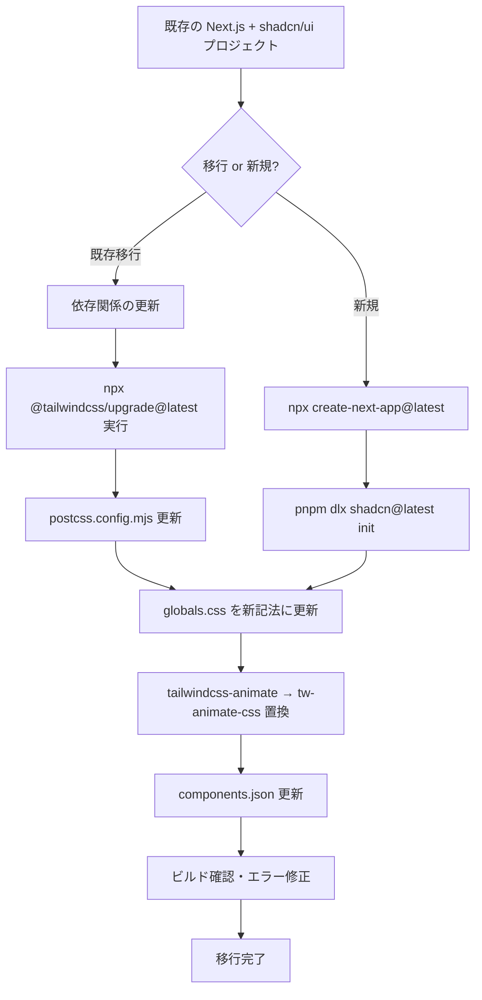

## はじめに

Tailwind CSS v4がリリースされ、Next.js + shadcn/ui の構成で開発しているエンジニアには「移行してみたら動かない」という経験をした方も多いのではないでしょうか。

Tailwind CSS v4は単なるマイナーアップデートではありません。設定ファイルの廃止、インポート記法の完全変更、PostCSSプラグインの分離など、根本的なアーキテクチャ変更が含まれています。特に `tailwind.config.js` への依存が深い shadcn/ui プロジェクトでは、何も準備せずに移行すると確実に詰まります。

この記事では、Next.js 15 + shadcn/ui + Tailwind CSS v4 の構成における移行手順を、実際に詰まったポイントとその対処法を交えて解説します。

:::message
**この記事で対象とするバージョン**
- Tailwind CSS: v4.x（v4.0以降）
- shadcn/ui: 最新版（Tailwind v4対応済み）
- Next.js: 15.x
- React: 19.x
:::

---

## Tailwind CSS v4の主要変更点（v3との比較）

まず、v3からv4で何が変わったかを把握しましょう。変更の規模を理解することが、移行成功の第一歩です。

### 変更点一覧表

| 項目 | v3 | v4 |
|------|----|----|
| 設定ファイル | `tailwind.config.js` 必須 | CSS内の `@theme` に統合（設定ファイル不要） |
| インポート記法 | `@tailwind base/components/utilities` | `@import "tailwindcss"` |
| PostCSSプラグイン | `tailwindcss` パッケージ内包 | `@tailwindcss/postcss` に分離 |
| テーマ定義場所 | `tailwind.config.js` の `theme.extend` | CSSの `@theme` ディレクティブ |
| アニメーション | `tailwindcss-animate` | `tw-animate-css` |
| カラーフォーマット | HSL | OKLCH（より予測可能） |
| デフォルトborder色 | `gray-200` | `currentColor` |
| Placeholderテキスト色 | `gray-400` | 現在のテキストカラー×50%透明度 |
| ビルドエンジン | JavaScript | Rust（Oxide）2〜5倍高速化 |
| ブラウザサポート | 広範 | Safari 16.4+, Chrome 111+, Firefox 128+ |

### 最大の変更: CSS-first コンフィグへの移行

v4の最も大きな哲学的変化は「JavaScript設定ファイルからCSSへの移行」です。

**v3の設定（廃止）:**
```javascript
// tailwind.config.js
module.exports = {
  content: ["./src/**/*.{ts,tsx}"],
  theme: {
    extend: {
      colors: {
        brand: {
          500: "#3490dc",
        },
      },
    },
  },
  plugins: [require("tailwindcss-animate")],
}
```

**v4の設定（新方式）:**
```css
/* globals.css */
@import "tailwindcss";

@theme {
  --color-brand-500: #3490dc;
}
```

設定がCSSに統合されたことで、ビルドツールとの統合もシンプルになりました。一方で、既存プロジェクトとの互換性は壊れます。

---

## セットアップ手順（Next.js 15 + shadcn/ui + Tailwind v4）

新規プロジェクトの場合と既存プロジェクトの移行の場合に分けて説明します。

### 移行フロー



### 新規プロジェクトの場合

```bash
# Next.js 15 プロジェクト作成
npx create-next-app@latest my-app \
  --typescript \
  --tailwind \
  --eslint \
  --app \
  --src-dir \
  --import-alias "@/*"

cd my-app

# shadcn/ui 初期化（Tailwind v4を自動検出して対応設定を生成）
pnpm dlx shadcn@latest init
```

`shadcn@latest init` の実行時にTailwind v4が検出されると、自動的にv4対応の `globals.css` と `components.json` が生成されます。

### 既存プロジェクトの移行

公式のアップグレードツールを使うことが推奨されます。

```bash
# アップグレードコードモッドを実行（設定ファイルの自動変換）
npx @tailwindcss/upgrade@latest

# 手動で依存関係を更新する場合
pnpm add tailwindcss@latest @tailwindcss/postcss@latest
pnpm add tw-animate-css
pnpm remove tailwindcss-animate
```

### package.json の依存関係

```json
{
  "dependencies": {
    "next": "^15.0.0",
    "react": "^19.0.0",
    "react-dom": "^19.0.0"
  },
  "devDependencies": {
    "@tailwindcss/postcss": "^4.0.0",
    "tailwindcss": "^4.0.0",
    "tw-animate-css": "^1.0.0",
    "typescript": "^5.0.0",
    "@types/node": "^22.0.0",
    "@types/react": "^19.0.0",
    "@types/react-dom": "^19.0.0"
  }
}
```

---

## @import記法の変更（@tailwind directiveから@importへ）

### v3の記法（廃止）

v3では3つのディレクティブを使っていました。

```css
/* globals.css（v3スタイル - 廃止） */
@tailwind base;
@tailwind components;
@tailwind utilities;
```

### v4の記法（新方式）

v4では単一の `@import` 文に統一されました。

```css
/* globals.css（v4スタイル） */
@import "tailwindcss";
```

`@import "tailwindcss"` 1行で、v3の3行相当の機能（base、components、utilities）がすべて読み込まれます。

### PostCSS設定の更新

v4ではPostCSSプラグインが `@tailwindcss/postcss` として分離されました。

```javascript
// postcss.config.mjs（v3スタイル - 変更必要）
export default {
  plugins: {
    tailwindcss: {},        // これは v3 の設定
    autoprefixer: {},
  },
}
```

```javascript
// postcss.config.mjs（v4スタイル）
export default {
  plugins: {
    "@tailwindcss/postcss": {},
    // autoprefixer は不要（v4が内包）
  },
}
```

:::message alert
`autoprefixer` は v4 に内包されているため、個別インストール・設定は不要になりました。残していても動作しますが、不要な依存関係となります。
:::

---

## @theme directiveでのカスタムテーマ定義

`@theme` ディレクティブは v4 の核心機能です。CSS変数としてデザイントークンを定義すると、対応するTailwindユーティリティクラスが自動生成されます。

### 基本的な @theme の使い方

```css
@import "tailwindcss";

@theme {
  /* カラー: --color-* → bg-brand-500, text-brand-500 等が使えるようになる */
  --color-brand-50: oklch(0.97 0.01 250);
  --color-brand-100: oklch(0.93 0.03 250);
  --color-brand-500: oklch(0.55 0.15 250);
  --color-brand-900: oklch(0.25 0.08 250);

  /* フォント: --font-* → font-display 等が使えるようになる */
  --font-display: "Inter", "sans-serif";
  --font-mono: "JetBrains Mono", "monospace";

  /* ブレークポイント: --breakpoint-* */
  --breakpoint-xs: 30rem;
  --breakpoint-3xl: 120rem;

  /* スペーシング: --spacing-* */
  --spacing-18: 4.5rem;
  --spacing-22: 5.5rem;

  /* ボーダー半径 */
  --radius-sm: 0.25rem;
  --radius-md: 0.375rem;
  --radius-lg: 0.5rem;
  --radius-xl: 0.75rem;
}
```

### @theme inline（shadcn/uiで重要）

`@theme inline` は既存のCSS変数をTailwindのデザイントークンとして「参照」させる記法です。実際の色値を重複定義せずに済みます。

```css
@theme inline {
  /* CSS変数への参照として定義（値をコピーしない） */
  --color-background: var(--background);
  --color-foreground: var(--foreground);
  --color-primary: var(--primary);
  --color-primary-foreground: var(--primary-foreground);
  --color-secondary: var(--secondary);
  --color-secondary-foreground: var(--secondary-foreground);
  --color-muted: var(--muted);
  --color-muted-foreground: var(--muted-foreground);
  --color-accent: var(--accent);
  --color-accent-foreground: var(--accent-foreground);
  --color-destructive: var(--destructive);
  --color-border: var(--border);
  --color-input: var(--input);
  --color-ring: var(--ring);
}
```

これにより、`:root` と `.dark` でCSS変数を切り替えるだけで、Tailwindのユーティリティクラス（`bg-background`, `text-foreground` など）の色が自動的に変わります。

---

## CSS変数ベースのshadcn/ui テーマ設定

shadcn/ui はCSS変数を使ってテーマを管理しています。Tailwind v4との統合では、CSS変数の定義場所と形式が変わります。

### v3スタイルのglobals.css（変更前）

```css
@tailwind base;
@tailwind components;
@tailwind utilities;

@layer base {
  :root {
    --background: 0 0% 100%;
    --foreground: 222.2 84% 4.9%;
    --primary: 221.2 83.2% 53.3%;
    --primary-foreground: 210 40% 98%;
    --border: 214.3 31.8% 91.4%;
    /* ... HSL形式の値 ... */
  }

  .dark {
    --background: 222.2 84% 4.9%;
    --foreground: 210 40% 98%;
    /* ... */
  }
}
```

### v4スタイルのglobals.css（完全版）

```css
@import "tailwindcss";
@import "tw-animate-css";

/* Tailwind v4でdarkクラスによるダークモード切り替えを有効化 */
@custom-variant dark (&:is(.dark *));

/* CSS変数をTailwindユーティリティクラスとして公開 */
@theme inline {
  --radius-sm: calc(var(--radius) - 4px);
  --radius-md: calc(var(--radius) - 2px);
  --radius-lg: var(--radius);
  --radius-xl: calc(var(--radius) + 4px);

  --color-background: var(--background);
  --color-foreground: var(--foreground);
  --color-card: var(--card);
  --color-card-foreground: var(--card-foreground);
  --color-popover: var(--popover);
  --color-popover-foreground: var(--popover-foreground);
  --color-primary: var(--primary);
  --color-primary-foreground: var(--primary-foreground);
  --color-secondary: var(--secondary);
  --color-secondary-foreground: var(--secondary-foreground);
  --color-muted: var(--muted);
  --color-muted-foreground: var(--muted-foreground);
  --color-accent: var(--accent);
  --color-accent-foreground: var(--accent-foreground);
  --color-destructive: var(--destructive);
  --color-border: var(--border);
  --color-input: var(--input);
  --color-ring: var(--ring);

  /* チャート用カラー（shadcn/ui recharts対応） */
  --color-chart-1: var(--chart-1);
  --color-chart-2: var(--chart-2);
  --color-chart-3: var(--chart-3);
  --color-chart-4: var(--chart-4);
  --color-chart-5: var(--chart-5);

  /* サイドバー用カラー */
  --color-sidebar: var(--sidebar);
  --color-sidebar-foreground: var(--sidebar-foreground);
  --color-sidebar-primary: var(--sidebar-primary);
  --color-sidebar-primary-foreground: var(--sidebar-primary-foreground);
  --color-sidebar-accent: var(--sidebar-accent);
  --color-sidebar-accent-foreground: var(--sidebar-accent-foreground);
  --color-sidebar-border: var(--sidebar-border);
  --color-sidebar-ring: var(--sidebar-ring);
}

/* ライトモードのカラー定義（OKLCH形式） */
:root {
  --radius: 0.625rem;
  --background: oklch(1 0 0);
  --foreground: oklch(0.145 0 0);
  --card: oklch(1 0 0);
  --card-foreground: oklch(0.145 0 0);
  --popover: oklch(1 0 0);
  --popover-foreground: oklch(0.145 0 0);
  --primary: oklch(0.205 0 0);
  --primary-foreground: oklch(0.985 0 0);
  --secondary: oklch(0.97 0 0);
  --secondary-foreground: oklch(0.205 0 0);
  --muted: oklch(0.97 0 0);
  --muted-foreground: oklch(0.556 0 0);
  --accent: oklch(0.97 0 0);
  --accent-foreground: oklch(0.205 0 0);
  --destructive: oklch(0.577 0.245 27.325);
  --border: oklch(0.922 0 0);
  --input: oklch(0.922 0 0);
  --ring: oklch(0.708 0 0);
  --chart-1: oklch(0.646 0.222 41.116);
  --chart-2: oklch(0.6 0.118 184.704);
  --chart-3: oklch(0.398 0.07 227.392);
  --chart-4: oklch(0.828 0.189 84.429);
  --chart-5: oklch(0.769 0.188 70.08);
  --sidebar: oklch(0.985 0 0);
  --sidebar-foreground: oklch(0.145 0 0);
  --sidebar-primary: oklch(0.205 0 0);
  --sidebar-primary-foreground: oklch(0.985 0 0);
  --sidebar-accent: oklch(0.97 0 0);
  --sidebar-accent-foreground: oklch(0.205 0 0);
  --sidebar-border: oklch(0.922 0 0);
  --sidebar-ring: oklch(0.708 0 0);
}

/* ダークモードのカラー定義 */
.dark {
  --background: oklch(0.145 0 0);
  --foreground: oklch(0.985 0 0);
  --card: oklch(0.205 0 0);
  --card-foreground: oklch(0.985 0 0);
  --popover: oklch(0.205 0 0);
  --popover-foreground: oklch(0.985 0 0);
  --primary: oklch(0.985 0 0);
  --primary-foreground: oklch(0.205 0 0);
  --secondary: oklch(0.269 0 0);
  --secondary-foreground: oklch(0.985 0 0);
  --muted: oklch(0.269 0 0);
  --muted-foreground: oklch(0.708 0 0);
  --accent: oklch(0.269 0 0);
  --accent-foreground: oklch(0.985 0 0);
  --destructive: oklch(0.704 0.191 22.216);
  --border: oklch(1 0 0 / 10%);
  --input: oklch(1 0 0 / 15%);
  --ring: oklch(0.556 0 0);
  --chart-1: oklch(0.488 0.243 264.376);
  --chart-2: oklch(0.696 0.17 162.48);
  --chart-3: oklch(0.769 0.188 70.08);
  --chart-4: oklch(0.627 0.265 303.9);
  --chart-5: oklch(0.645 0.246 16.439);
  --sidebar: oklch(0.205 0 0);
  --sidebar-foreground: oklch(0.985 0 0);
  --sidebar-primary: oklch(0.488 0.243 264.376);
  --sidebar-primary-foreground: oklch(0.985 0 0);
  --sidebar-accent: oklch(0.269 0 0);
  --sidebar-accent-foreground: oklch(0.985 0 0);
  --sidebar-border: oklch(1 0 0 / 10%);
  --sidebar-ring: oklch(0.439 0 0);
}

@layer base {
  * {
    @apply border-border outline-ring/50;
  }
  body {
    @apply bg-background text-foreground;
  }
}
```

### なぜHSLからOKLCHへ？

OKLCH（Oklab Lightness Chroma Hue）はHSLより知覚的に均一なカラースペースです。

```css
/* HSL: 同じ輝度値でも見た目の明るさが大きく違う */
--color-yellow: hsl(60 100% 50%);  /* かなり明るく見える */
--color-blue: hsl(240 100% 50%);   /* 暗く見える */

/* OKLCH: 同じL値なら視覚的に均等な明るさ */
--color-yellow: oklch(0.85 0.2 90);
--color-blue: oklch(0.45 0.2 264);
```

shadcn/ui のテーマカスタマイザー（https://ui.shadcn.com/themes）からOKLCH形式のテーマをコピーして使うことができます。

---

## コンポーネントのカスタマイズ（new-yorkスタイル、stone/zincカラー）

### components.json の設定

shadcn/ui の挙動は `components.json` で制御します。

```json
{
  "$schema": "https://ui.shadcn.com/schema.json",
  "style": "new-york",
  "rsc": true,
  "tsx": true,
  "tailwind": {
    "config": "",
    "css": "src/app/globals.css",
    "baseColor": "zinc",
    "cssVariables": true
  },
  "iconLibrary": "lucide",
  "aliases": {
    "components": "@/components",
    "utils": "@/lib/utils",
    "ui": "@/components/ui",
    "lib": "@/lib",
    "hooks": "@/hooks"
  }
}
```

**重要な変更点:**
- `style`: `"default"` は非推奨 → `"new-york"` を使用
- `tailwind.config`: Tailwind v4では空文字列 `""` にする（設定ファイルが不要なため）
- `baseColor`: `"zinc"` または `"stone"` など。ベースカラーのプリセットを選択

### スタイルの違い

| 項目 | default | new-york |
|------|---------|----------|
| ボーダー | 細め | やや太め |
| シャドウ | あり | 最小限 |
| ボタン | sm padding | md padding |
| 全体的な印象 | やわらか | シャープ・クラシック |

### stone と zinc の使い分け

```css
/* zinc ベースのテーマ（青みがかったグレー） */
:root {
  --primary: oklch(0.205 0 0);  /* zinc-900相当 */
  --secondary: oklch(0.97 0 0); /* zinc-100相当 */
}

/* stone ベースのテーマ（暖色系グレー） */
:root {
  --primary: oklch(0.216 0.006 56.043);   /* stone-900相当 */
  --secondary: oklch(0.974 0.001 106.424); /* stone-100相当 */
}
```

- **zinc**: クールでモダン。テック系、SaaSに合う
- **stone**: 温かみがある。メディア系、ドキュメントに合う

### コンポーネントの追加とカスタマイズ

```bash
# コンポーネントの追加
pnpm dlx shadcn@latest add button
pnpm dlx shadcn@latest add card
pnpm dlx shadcn@latest add dialog
```

追加されたコンポーネントは `src/components/ui/` に配置されます。Tailwind v4対応版はOKLCH変数を使ったスタイルで生成されます。

```tsx
// src/components/ui/button.tsx（Tailwind v4対応版の例）
import * as React from "react"
import { Slot } from "@radix-ui/react-slot"
import { cva, type VariantProps } from "class-variance-authority"

import { cn } from "@/lib/utils"

const buttonVariants = cva(
  "inline-flex items-center justify-center gap-2 whitespace-nowrap rounded-md text-sm font-medium transition-all disabled:pointer-events-none disabled:opacity-50 [&_svg]:pointer-events-none [&_svg:not([class*='size-'])]:size-4 shrink-0 [&_svg]:shrink-0 outline-none focus-visible:border-ring focus-visible:ring-ring/50 focus-visible:ring-[3px] aria-invalid:ring-destructive/20 dark:aria-invalid:ring-destructive/40 aria-invalid:border-destructive",
  {
    variants: {
      variant: {
        default:
          "bg-primary text-primary-foreground shadow-xs hover:bg-primary/90",
        destructive:
          "bg-destructive text-white shadow-xs hover:bg-destructive/90 focus-visible:ring-destructive/20 dark:focus-visible:ring-destructive/40 dark:bg-destructive/60",
        outline:
          "border bg-background shadow-xs hover:bg-accent hover:text-accent-foreground dark:bg-input/30 dark:border-input dark:hover:bg-input/50",
        secondary:
          "bg-secondary text-secondary-foreground shadow-xs hover:bg-secondary/80",
        ghost:
          "hover:bg-accent hover:text-accent-foreground dark:hover:bg-accent/50",
        link: "text-primary underline-offset-4 hover:underline",
      },
      size: {
        default: "h-9 px-4 py-2 has-[>svg]:px-3",
        sm: "h-8 rounded-md gap-1.5 px-3 has-[>svg]:px-2.5",
        lg: "h-10 rounded-md px-6 has-[>svg]:px-4",
        icon: "size-9",
      },
    },
    defaultVariants: {
      variant: "default",
      size: "default",
    },
  }
)

export interface ButtonProps
  extends React.ButtonHTMLAttributes<HTMLButtonElement>,
    VariantProps<typeof buttonVariants> {
  asChild?: boolean
}

const Button = React.forwardRef<HTMLButtonElement, ButtonProps>(
  ({ className, variant, size, asChild = false, ...props }, ref) => {
    const Comp = asChild ? Slot : "button"
    return (
      <Comp
        className={cn(buttonVariants({ variant, size, className }))}
        ref={ref}
        {...props}
      />
    )
  }
)
Button.displayName = "Button"

export { Button, buttonVariants }
```

### カスタムコンポーネントの例

```tsx
// src/components/feature-card.tsx
import { Card, CardContent, CardHeader, CardTitle } from "@/components/ui/card"
import { Badge } from "@/components/ui/badge"

interface FeatureCardProps {
  title: string
  description: string
  badge?: string
}

export function FeatureCard({ title, description, badge }: FeatureCardProps) {
  return (
    <Card className="transition-shadow hover:shadow-md">
      <CardHeader className="pb-3">
        <div className="flex items-start justify-between gap-4">
          <CardTitle className="text-base font-semibold leading-tight">
            {title}
          </CardTitle>
          {badge && (
            <Badge variant="secondary" className="shrink-0 text-xs">
              {badge}
            </Badge>
          )}
        </div>
      </CardHeader>
      <CardContent>
        <p className="text-sm text-muted-foreground">{description}</p>
      </CardContent>
    </Card>
  )
}
```

---

## よくあるエラーと対処法

移行時に遭遇しやすいエラーパターンを7つ紹介します。

### エラー 1: PostCSSプラグインが見つからない

**症状:**
```
Error: Cannot find module 'tailwindcss'
  at PostCSS runner
```

**原因:** PostCSS設定が v3 のまま（`tailwindcss` をプラグインとして指定）

**対処法:**
```javascript
// Before（v3スタイル - NG）
export default {
  plugins: {
    tailwindcss: {},
    autoprefixer: {},
  },
}

// After（v4スタイル - OK）
export default {
  plugins: {
    "@tailwindcss/postcss": {},
  },
}
```

```bash
# パッケージの追加
pnpm add -D @tailwindcss/postcss
```

---

### エラー 2: tailwindcss-animate が見つからない

**症状:**
```
Module not found: Can't resolve 'tailwindcss-animate'
```

**原因:** `tailwindcss-animate` は v4 では非推奨。shadcn/ui の新バージョンは `tw-animate-css` を使用

**対処法:**
```bash
# 旧パッケージを削除して新パッケージをインストール
pnpm remove tailwindcss-animate
pnpm add tw-animate-css
```

```css
/* globals.css の更新 */
/* Before */
/* tailwindcss-animate の設定は tailwind.config.js で行っていた */

/* After */
@import "tw-animate-css";  /* @import "tailwindcss"; の直後に追加 */
```

---

### エラー 3: ボーダーが突然消える・色がおかしくなる

**症状:** 移行後にUIのボーダーが消えたり、予期しない色になる

**原因:** Tailwind v4でデフォルトの border-color が `gray-200` から `currentColor` に変更された

**対処法:**

方法A: 明示的なカラークラスを付与（推奨）
```tsx
{/* Before（暗黙的にgray-200が適用されていた） */}
<div className="border rounded-md">...</div>

{/* After（明示的にborder-borderを指定） */}
<div className="border border-border rounded-md">...</div>
```

方法B: base layerで上書き（既存コードが多い場合）
```css
/* globals.css に追加 */
@layer base {
  *, ::after, ::before, ::backdrop, ::file-selector-button {
    border-color: var(--color-gray-200, currentColor);
  }
}
```

---

### エラー 4: @tailwind ディレクティブが認識されない

**症状:**
```
Unknown at rule @tailwindcss(unknownAtRules)
```

**原因:** v3記法の `@tailwind base/components/utilities` を v4 環境で使用

**対処法:**
```css
/* Before（v3 - 削除） */
@tailwind base;
@tailwind components;
@tailwind utilities;

/* After（v4） */
@import "tailwindcss";
```

---

### エラー 5: カスタムカラーがユーティリティクラスとして使えない

**症状:** `@theme` で定義したカラーが `bg-xxx` や `text-xxx` として機能しない

**原因:** `tailwind.config.js` のカラー設定が残っており競合、または `@theme` 記法が間違っている

**対処法:**
```css
/* NG: カラーネームスペースの間違い */
@theme {
  --brand-500: oklch(0.55 0.15 250);  /* --color- プレフィックスが必要 */
}

/* OK: 正しい記法 */
@theme {
  --color-brand-500: oklch(0.55 0.15 250);
  /* これで bg-brand-500, text-brand-500 等が使える */
}
```

---

### エラー 6: npmでのERESOLVEエラー

**症状:**
```
npm error ERESOLVE could not resolve
npm error Found: react@18.x.x
npm error Could not resolve dependency: react@^19.x.x
```

**原因:** React 18 と React 19 の peerDependency 競合。shadcn/ui 最新版は React 19 を要求

**対処法:**
```bash
# 方法A: --legacy-peer-deps フラグ
npm install --legacy-peer-deps

# 方法B: pnpm を使用（推奨）
pnpm add shadcn@latest

# 方法C: React を 19 にアップグレード
pnpm add react@^19.0.0 react-dom@^19.0.0
```

---

### エラー 7: shadcn/ui CLI がTailwind v4を認識しない

**症状:** `shadcn add` コマンドでコンポーネントを追加すると、v3形式のコンポーネントが生成される

**原因:** `components.json` の `tailwind.config` フィールドに値が設定されていてv3と誤認識

**対処法:**
```json
{
  "tailwind": {
    "config": "",
    "css": "src/app/globals.css",
    "baseColor": "zinc",
    "cssVariables": true
  }
}
```

`"config": ""` （空文字列）にすることで、CLIがTailwind v4環境と正しく認識します。

---

## まとめ（移行チェックリスト）

移行作業を始める前に、以下のチェックリストを確認してください。

### 依存関係チェックリスト

- [ ] `tailwindcss` を v4.x に更新
- [ ] `@tailwindcss/postcss` をインストール
- [ ] `tailwindcss-animate` を削除
- [ ] `tw-animate-css` をインストール
- [ ] `autoprefixer` の個別設定を削除（v4に内包）

### 設定ファイルチェックリスト

- [ ] `postcss.config.mjs`: `"@tailwindcss/postcss": {}` に変更
- [ ] `tailwind.config.js`: 削除または内容を `globals.css` の `@theme` に移行
- [ ] `components.json`: `style: "new-york"`, `tailwind.config: ""` に更新
- [ ] `globals.css`: `@tailwind` ディレクティブを `@import "tailwindcss"` に変更

### globals.css チェックリスト

- [ ] `@import "tailwindcss"` が先頭にある
- [ ] `@import "tw-animate-css"` が続く
- [ ] `@custom-variant dark` でダークモードの設定がある
- [ ] `@theme inline` でCSS変数がTailwindに公開されている
- [ ] `:root` と `.dark` のカラー変数がOKLCH形式である

### コンポーネントチェックリスト

- [ ] ボーダーを使うコンポーネントに `border-border` が明示されているか
- [ ] カスタムカラーが `@theme` 内で `--color-*` 形式で定義されているか
- [ ] `tailwindcss-animate` のクラスが `tw-animate-css` のクラスに対応しているか

### 動作確認チェックリスト

- [ ] `pnpm build` がエラーなく完了する
- [ ] ダークモードが正しく切り替わる
- [ ] アニメーションが動作する
- [ ] カスタムカラーのユーティリティクラスが機能する

---

Tailwind CSS v4への移行は一見ハードルが高く見えますが、変更点を理解すれば筋道が見えてきます。特に「設定をCSSに寄せる」という思想転換を受け入れれば、むしろ設定がシンプルになる場面も多いです。

shadcn/ui も公式でTailwind v4を完全サポートしているため、新規プロジェクトは積極的にv4を採用することをお勧めします。既存プロジェクトの移行は、この記事のチェックリストを参考に段階的に進めてみてください。
