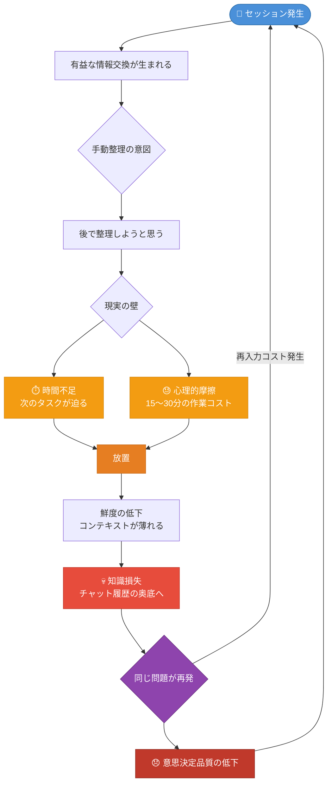
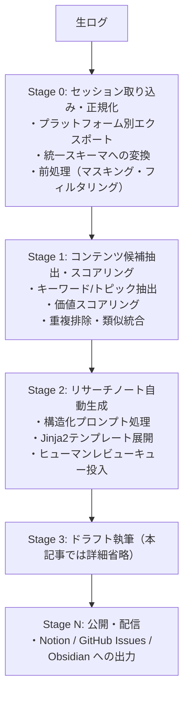

## なぜ「会話は使い捨て」になるのか — 知識損失問題の構造



### セッション記録の現状

AIアシスタントの利用が日常化した現在、AIを業務活用するナレッジワーカーの多くは1日に複数回のセッションをこなしています。コードのデバッグ、設計の相談、技術調査、文章の推敲——それぞれのセッションで、かなりの量の「有益な情報交換」が発生しています。

しかし、そのうち後から再活用されているセッションは、肌感覚としてもごく一部ではないでしょうか。筆者の観測範囲における主観的推定であり統計的根拠はありませんが、**日常的なAI利用者のセッションのうち、何らかの形でナレッジとして残されているのはごく一部**と考えられます。残りの大部分は、チャット履歴の奥底に眠ったまま、事実上「なかったこと」になっています。

この損失は単なる「記録の欠如」ではありません。「あの設計判断の根拠、どこかで話したはずなのに見つからない」「同じ質問をまた一から聞き直した」——こうした再入力コストや意思決定品質の低下を積み重ねると、一人のエンジニアが年間で失う知的資産の量は決して小さくありません。

### 既存の手動ソリューションとその限界

現状の「解決策」として多くの人が取り組んでいるのは、手動によるコピペ保存やNotionへの整理です。しかし、これらには共通した構造的な問題があります。

**工数の問題**：有益なセッションをMarkdownに整形し、適切なタグをつけてNotionに保存する作業は、それだけで15〜30分を要します。1日3セッション保存するだけで、週に2〜3時間が「整理」に消えます。

**心理的摩擦の問題**：「後でやろう」は実現しません。セッション直後は「あとで整理する」と思っていても、次のタスクに移った瞬間に優先度が下がります。人間の意志力に依存した仕組みは、例外なく形骸化します。

**鮮度の問題**：時間が経つほど「どのコンテキストでその話をしたか」が薄れ、整理の質が落ちます。セッション直後でなければ意味のある構造化はできないのに、直後には時間がない——この矛盾が知識損失を構造的に生み出しています。

### 自動化で解決できる範囲・できない範囲

本記事で設計するシステムは、この問題を**意識の問題ではなくシステム設計の問題**として捉え直します。意志力に頼らず、自動的にナレッジが蓄積・資産化される仕組みを構築することが目的です。

自動化が有効に機能する範囲は明確です。

- **抽出**: セッション記録からトピック・キーワード・価値ある断片を取り出す
- **分類**: 内容をクラスタリングしてコンテンツ候補として整理する
- **下書き生成**: リサーチノートや記事ドラフトの骨格を自動生成する

一方で、**人間が必ず判断すべきポイント**も存在します。

- **品質の判断**: 「このセッションの内容は公開に値するか」という価値判断
- **公開可否の確認**: 機密情報・個人情報・未確認情報の混入チェック
- **文脈の補完**: 自動抽出では拾えない背景知識の追記

自動化は「人間の判断を代替する」のではなく、「人間が判断すべき対象を適切に準備して差し出す」ものです。この設計思想を念頭に置きながら、システムの全体像を見ていきましょう。

---

## システム全体設計 — コンテンツパイプラインのアーキテクチャ

### 前提環境とファイル構成

```bash
# 前提: Python 3.11+
pip install pydantic>=2.0 apscheduler jinja2
```

```
ファイル構成:
pipeline/
├── models.py       # Pydanticスキーマ定義
├── stage0.py       # 正規化処理
├── stage1.py       # スコアリング（後述）
└── stage2.py       # ノート生成（後述）
```

### Stage 0〜N の状態遷移モデル

本システムは、セッション記録を「コンテンツ資産」へと変換するパイプラインを、複数のStageとして定義します。各Stageは独立したモジュールとして実装でき、段階的に構築・運用できます。



各Stageの境界には**状態オブジェクト**が存在します。Stage 0の出力は「正規化済みSessionRecord」、Stage 1の出力は「スコアリング済みContentCandidate」、Stage 2の出力は「レビュー待ちResearchNote」です。この設計により、パイプラインの途中から再実行したり、特定のStageだけを差し替えたりすることが容易になります。

### データモデル設計（Pydantic スキーマ）

パイプライン全体を通じて流れるデータの型を、Pydanticで定義します。型安全性を担保することで、Stage間のインターフェースを明確にし、デバッグコストを下げられます。

```python
from pydantic import BaseModel, Field
from datetime import datetime, timezone
from typing import Optional
from enum import Enum


class MessageRole(str, Enum):
    USER = "user"
    ASSISTANT = "assistant"
    SYSTEM = "system"


class Message(BaseModel):
    role: MessageRole
    content: str
    timestamp: Optional[datetime] = None


class SessionRecord(BaseModel):
    """Stage 0 の出力: 正規化済みセッション記録"""
    session_id: str
    platform: str  # "chatgpt" | "claude" | "gemini" | "local"
    created_at: datetime
    messages: list[Message]
    token_count: int
    tags: list[str] = Field(default_factory=list)
    is_filtered: bool = False  # フィルタリング済みフラグ


class ContentCandidate(BaseModel):
    """Stage 1 の出力: コンテンツ候補"""
    candidate_id: str
    source_session_ids: list[str]  # 複数セッションの統合も可
    title_draft: str
    keywords: list[str]
    topic_cluster: str
    uniqueness_score: float = Field(ge=0.0, le=1.0)
    demand_score: float = Field(ge=0.0, le=1.0)
    feasibility_score: float = Field(ge=0.0, le=1.0)
    total_score: float = Field(ge=0.0, le=1.0)
    summary: str


class ReviewStatus(str, Enum):
    PENDING = "pending"
    APPROVED = "approved"
    REJECTED = "rejected"
    EDITING = "editing"


class ResearchNote(BaseModel):
    """Stage 2 の出力: リサーチノート（レビュー待ち）"""
    note_id: str
    candidate: ContentCandidate
    content_markdown: str  # Jinja2で生成されたMarkdown本文
    review_status: ReviewStatus = ReviewStatus.PENDING
    created_at: datetime = Field(default_factory=lambda: datetime.now(timezone.utc))
    reviewer_notes: Optional[str] = None
```

### トリガー設計とスケジューリング

パイプラインの起動方式は、用途に応じて2種類を使い分けます。

**定期バッチ方式**は、毎日深夜や週次などの決まったタイミングで全セッションを処理します。実装がシンプルで、APSchedulerやcronで簡単に実現できます。個人利用や小規模運用に適しています。

**イベントドリブン方式**は、新しいセッションが追加されたタイミングで即座にパイプラインを起動します。リアルタイム性は高いですが、APIコストが増加する点に注意が必要です。チーム利用や、鮮度を重視するケースに向いています。

本記事では、実装の複雑性を抑えるために**定期バッチ方式をベースラインとして設計**し、必要に応じてイベントドリブンに移行できる構造を意識します。

---

## Stage 0 実装詳細 — セッション記録の取得と正規化

### プラットフォーム別エクスポート手順

**ChatGPT**

最も実装しやすいプラットフォームです。公式のデータエクスポート機能を使います。

1. ChatGPT にログインし、画面左下のアカウントアイコン → **「設定」** を開く
2. **「データコントロール」** → **「データをエクスポート」** をクリック
3. メールアドレスに確認メールが届いたら、リンクからZIPをダウンロード
4. ZIPを展開すると `conversations.json` が含まれており、全会話履歴が入っています

`conversations.json` の構造は以下のような形式です（簡略化）。

```json
[
  {
    "id": "session-uuid-xxxx",
    "title": "Pythonの非同期処理について",
    "create_time": 1700000000.0,
    "mapping": {
      "node-uuid-1": {
        "message": {
          "author": { "role": "user" },
          "content": { "parts": ["asyncioとThreadPoolExecutorの違いを教えて"] },
          "create_time": 1700000001.0
        }
      }
    }
  }
]
```

**Claude**

執筆時点では公式エクスポート機能は提供されていません。推奨する代替手段は以下の2つです。

**推奨①: Anthropic公式APIを使い、アプリ側でセッションを保存する**
自前でセッションIDと会話ログをSQLiteやJSONLに記録します。Claude.aiのUIを経由しないため、利用規約の問題が生じません。

**推奨②: Claude.ai の会話エクスポート要望をAnthropicに送る**
公式フィードバックフォームから機能要望を送ることを推奨します。

**ローカルLLM (LM Studio / Ollama)**

LM Studio のデータ保存先はバージョンおよびOSによって異なります。

- macOS: `~/Library/Application Support/LM Studio/`
- Windows: `%APPDATA%\LM Studio\`

公式ドキュメントまたはアプリのSettings画面で実際のパスを確認してください。Ollama は標準では会話履歴を保存しないため、呼び出し側のコードでセッションをSQLiteやJSONLに記録するラッパーを実装します。

### JSON → 統一スキーマへの正規化コード

プラットフォームごとに異なるJSON構造を、先述の `SessionRecord` スキーマに統一します。

```python
import json
import uuid
import logging
from datetime import datetime
from pathlib import Path
from models import SessionRecord, Message, MessageRole  # 先述のPydanticモデル

logger = logging.getLogger(__name__)


def parse_chatgpt_export(filepath: str) -> list[SessionRecord]:
    """ChatGPTのconversations.jsonを正規化する"""
    with open(filepath, "r", encoding="utf-8") as f:
        raw_sessions = json.load(f)

    records = []
    for session in raw_sessions:
        messages = []

        # mappingはツリー構造なのでDFSで順序を復元する
        mapping = session.get("mapping", {})
        ordered_nodes = _flatten_mapping(mapping)

        for node in ordered_nodes:
            msg_data = node.get("message")
            if not msg_data or not msg_data.get("content"):
                continue

            role_str = msg_data.get("author", {}).get("role", "")
            if role_str not in ("user", "assistant", "system"):
                continue

            parts = msg_data.get("content", {}).get("parts", [])
            content = " ".join([p for p in parts if isinstance(p, str)])
            if not content.strip():
                continue

            create_time = msg_data.get("create_time")
            timestamp = datetime.fromtimestamp(create_time) if create_time else None

            messages.append(
                Message(
                    role=MessageRole(role_str),
                    content=content,
                    timestamp=timestamp,
                )
            )

        if not messages:
            continue

        records.append(
            SessionRecord(
                session_id=session.get("id", str(uuid.uuid4())),
                platform="chatgpt",
                created_at=datetime.fromtimestamp(session.get("create_time", 0)),
                messages=messages,
                token_count=sum(len(m.content.split()) for m in messages),
            )
        )

    logger.info(f"Parsed {len(records)} sessions from {filepath}")
    return records


def _flatten_mapping(mapping: dict) -> list[dict]:
    """ChatGPTのmapping（ツリー構造）をDFSで時系列順に平坦化する"""
    # ルートノードを探す（parentがNoneのノード）
    root_id = None
    for node_id, node in mapping.items():
        if node.get("parent") is None:
            root_id = node_id
            break

    if root_id is None:
        return []

    result = []
    stack = [root_id]
    while stack:
        current_id = stack.pop()
        node = mapping.get(current_id, {})
        result.append(node)
        children = node.get("children", [])
        # childrenを逆順にスタックへ（DFSで正順を維持）
        stack.extend(reversed(children))

    return result
```

---

> **注**: 本記事のドラフトはStage 0（正規化）までの実装詳細を扱っています。Stage 1（スコアリング）以降の実装については続編記事を予定しています。
