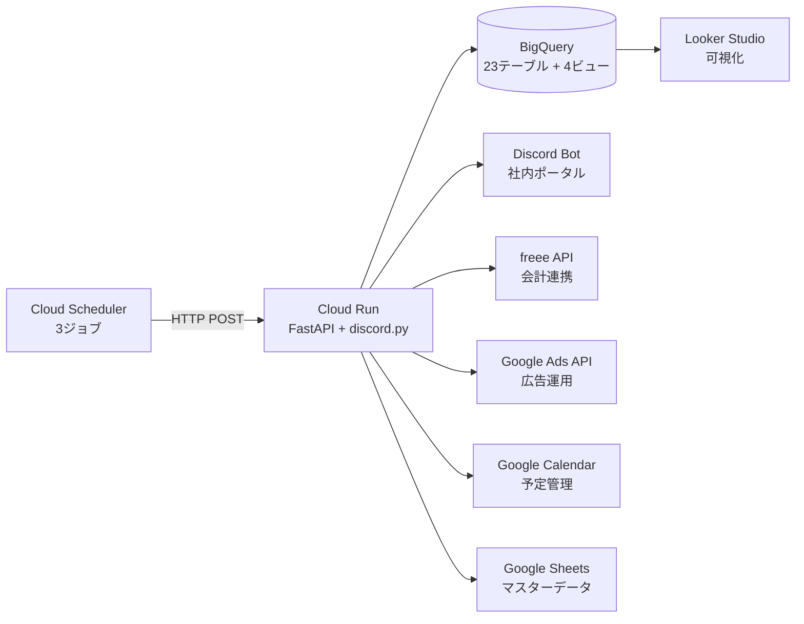

## 会計・営業・開発を全部1人でやるということ

合同会社を1人で運営していると、コードを書く以外の業務が想像以上に多い。会計処理、請求書発行、案件管理、工数記録、KPIの集計。それぞれにSaaSを使っていても、毎朝freeeを開き、Googleカレンダーを確認し、スプレッドシートで進捗を追い、Discordで連絡を返す。この「確認のハシゴ」だけで30分以上かかっていました。

「これ、全部1つの基盤にまとめられないか？」

その発想から始まった試行錯誤の結果、Cloud Run + BigQuery + Discord Botで業務基盤を構築し、月額5ドル以下で運用しています。この記事ではその全体像と、1人法人ならではの設計判断を共有します。

## 全部GCPでまかなうという発想

最初に検討したのは、どのクラウドに寄せるかという問題。AWSもAzureも候補でしたが、GCPを選んだ理由は3つあります。

1. BigQueryの無料枠が強力 -- 毎月10GBストレージ + 1TBクエリが無料。1人法人のデータ量なら余裕で収まる
2. Cloud Runの従量課金 -- リクエストがないときはコストゼロ。常駐Bot用にmin-instances=1にしても月額数ドル
3. Google Workspaceとの親和性 -- Calendar、Sheets、Driveとの連携がネイティブに近い

要するに、「ほぼ無料でエンタープライズ級の分析基盤が手に入る」という点が決め手でした。

## アーキテクチャ全体像

現在稼働しているシステムの全体像はこのようになっています。



ポイントはCloud Runのコンテナ1つに全機能を載せていること。APIサーバー、Discord Bot、定期バッチ処理、SaaS連携のすべてが1つのFastAPIアプリケーションに統合されています。

## Cloud Run: 1つのコンテナに全部載せる

「マイクロサービスにすべきでは？」という声が聞こえてきそうですが、1人法人の場合、分割するメリットよりデメリットのほうが大きい。

| 観点 | モノリス（現構成） | マイクロサービス |
|:--|:--|:--|
| デプロイ | 1回で完結 | サービスごとに個別管理 |
| 認証情報 | 1箇所で管理 | サービス間で共有が必要 |
| コスト | コンテナ1つ分 | 複数コンテナ分 |
| デバッグ | ログが1箇所 | 分散トレーシングが必要 |
| 運用負荷 | 低い | 1人では厳しい |

実際の構成はこのようになっています。

```
correlate-workspace/cloud-run/api/
├── main.py                    # FastAPIエントリーポイント
├── morning_briefing.py        # 朝会ブリーフィングモジュール
├── Dockerfile
└── requirements.txt
```

`main.py`がAPIエンドポイントとDiscord Botの起動を担い、`morning_briefing.py`が朝会ロジックを担当する構成。機能が増えてきたらモジュール分割で対応し、サービス分割は最後の手段として温存しています。

:::message
1人法人の場合、「正しいアーキテクチャ」より「自分が運用できるアーキテクチャ」を優先するのが正解だと感じています。完璧な設計は、運用する人間がいなければ意味がありません。
:::

### Cloud Runの設定

最小構成で十分なパフォーマンスが出ています。

```yaml
# Cloud Run サービス設定
cpu: 1
memory: 512Mi
min-instances: 1          # Discord Bot常駐のため
max-instances: 3          # スパイク時の上限
concurrency: 80           # 同時リクエスト数
timeout: 300s             # 長時間バッチ対応
region: asia-northeast1   # 東京リージョン
```

`min-instances: 1`はDiscord Botを常時接続するための設定。これがなければCloud Runはアイドル時にインスタンスを0にスケールダウンし、Bot接続が切れてしまいます。このコストが月額のほぼ全額を占めているのが実情です。

## BigQuery: 無料枠で十分な分析基盤

1人法人のデータ量でBigQueryを使うのは大げさに感じるかもしれません。しかし実際に運用してみると、無料枠の範囲内で驚くほど多くのことが可能でした。その実態を紹介します。

### 現在のテーブル構成

23テーブル + 4つの集計ビューが稼働中。主要なものを挙げます。

| テーブル | 用途 | データ量 |
|:--|:--|:--|
| `fire_kpi_history` | FIRE達成度KPI（月次） | 24行 |
| `work_logs` | 工数記録 | 数百行/月 |
| `projects_detailed` | 案件詳細 | 5件 |
| `estimation_records` | 見積もりデータ | 25件 |
| `content_articles` | 記事メタデータ | 13行 |
| `invoices_history` | 請求書履歴 | 数十行 |

合計しても数MBの世界。BigQueryの無料枠（10GBストレージ + 1TBクエリ/月）に対して、使用量は1%にも満たない水準です。

### 4つの集計ビュー

生テーブルの上に集計ビューを作り、ダッシュボード用のデータを効率的に取得しています。

| ビュー | 目的 |
|:--|:--|
| `fire_progress` | FIRE達成進捗（前月比・目標到達予測） |
| `work_time_analysis` | 案件別工数分析（計画vs実績） |
| `work_time_weekly` | 週次工数サマリー |
| `project_health` | 案件健全性スコア（30点満点） |

特に`project_health`ビューは、収益性（粗利率）・工数管理（超過率）・支払健全性（入金遵守率）の3軸で案件をスコアリングし、受注判断の材料に使えるようにしたもの。FIRE基準（粗利率35%以上）との照合も自動で行われます。

:::message
BigQueryの真の価値は「安さ」ではなく「SQLだけでここまでできる」という点にあります。Pythonスクリプトで集計処理を書く必要がなく、ビュー定義だけで複雑な分析が完結する。保守コストがほぼゼロなのが1人法人にとって大きなメリットでしょう。
:::

### データ投入の仕組み

Cloud RunのFastAPIエンドポイント経由でデータを投入しています。

```
Cloud Scheduler (06:00 JST)
  → POST /api/sync/fire-kpi     → BigQuery
Cloud Scheduler (06:30 JST)
  → POST /api/sync/work-logs    → BigQuery
Cloud Scheduler (07:00 JST)
  → POST /api/morning-briefing  → Discord
```

syncエンドポイントは5本稼働中。freee、Google Sheets（GAS経由）、Google Adsなど外部SaaSからデータを取得し、BigQueryにMERGE（upsert）で投入する方式を採用しています。

:::message alert
データ投入にはINSERTではなくMERGE（upsert）を使うことを強く推奨します。INSERT onlyだと、syncエンドポイントを複数回呼んだ場合にデータが重複蓄積されます。冪等性の確保は定期バッチ処理の基本中の基本。
:::

## Discord: チャットが社内ポータルになる

1人法人にSlackやTeamsは過剰。Discordなら無料で、APIも充実しており、Botを自作すればあらゆる業務を集約できます。

### 朝会ブリーフィングBot

毎朝7時に`#日報`チャンネルへブリーフィングを自動配信。6つのデータソースから情報を集約し、今日やるべきことを一目で把握できるようにしています。

配信内容は以下の5つのEmbed（色分けされたカード）で構成されます。

1. 今日のカレンダー（青） -- Google Calendarから予定を取得
2. アラート（赤） -- 未入金請求書、納期接近、補助金期限
3. KPIサマリー（緑） -- 可処分キャッシュ月数、売上、手残り率
4. タスク進捗（黄） -- 優先タスク、昨日の完了、遅延リスク
5. 案件状況（紫） -- 進行中案件の進捗率、工数実績

:::details 朝会Botのデータ収集コード（抜粋）
```python
async def collect_data(self) -> dict:
    """全データソースから並列でデータ収集"""
    import asyncio
    calendar, tasks, projects, kpi, work_logs, alerts = await asyncio.gather(
        self.fetch_calendar_events(),
        self.fetch_tasks(),
        self.fetch_projects(),
        self.fetch_kpi(),
        self.fetch_work_logs(),
        self.fetch_alerts(),
        return_exceptions=True  # 1つ失敗しても他は継続
    )
    return {
        "calendar": calendar if not isinstance(calendar, Exception) else [],
        "tasks": tasks if not isinstance(tasks, Exception) else [],
        "projects": projects if not isinstance(projects, Exception) else [],
        "kpi": kpi if not isinstance(kpi, Exception) else {},
        "work_logs": work_logs if not isinstance(work_logs, Exception) else {},
        "alerts": alerts if not isinstance(alerts, Exception) else {},
    }
```
:::

`asyncio.gather`で6つのAPI呼び出しを並列実行し、1つが失敗しても他のデータで配信を継続する設計。全データソースが失敗した場合のみ、エラー通知に切り替わります。

### CRUDエンドポイント

Discord Botからだけでなく、REST APIとしても各種データにアクセス可能。

| エンドポイント | 用途 |
|:--|:--|
| `/api/sync/fire-kpi` | FIRE KPI同期 |
| `/api/sync/work-logs` | 工数データ同期 |
| `/api/sync/projects-detailed` | 案件データ同期 |
| `/api/subsidy-tracking` | 補助金管理CRUD |
| `/api/retrospectives` | 振り返りCRUD |

同期系5本 + CRUD系3セットで、業務に必要なデータ操作はほぼ網羅しています。

## 月額コスト: 実際の数字を公開

2026年2月時点の実際の月額コストです。

| サービス | 月額 | 備考 |
|:--|:--|:--|
| Cloud Run | $2〜5 | min-instances=1、CPU 1コア、512MB |
| BigQuery | $0 | 無料枠内（ストレージ数MB、クエリ数GB/月） |
| Cloud Scheduler | $0 | 3ジョブ（無料枠内。超過分は$0.10/ジョブ） |
| Artifact Registry | $0〜1 | Dockerイメージ保管 |
| Secret Manager | $0 | 少量のシークレット管理 |
| **合計** | **$2〜6程度** | 無料枠の活用が鍵 |

:::message
Cloud Runの`min-instances=0`にすればさらにコストを下げられますが、Discord Botの常時接続が切れるトレードオフがあります。Botが不要であれば、Cloud Schedulerからの定時呼び出しだけで運用でき、月額$1以下も十分可能。
:::

比較対象として、同等の機能をSaaSで揃えた場合の概算を出してみます。

| SaaS構成 | 月額目安 |
|:--|:--|
| Notion（チーム）+ Zapier（Pro） | $30〜50 |
| Slack（Pro）+ n8n（Cloud） | $25〜40 |
| 会計freee + kintone | $30〜50 |

もちろん機能の深さや使い勝手は異なりますが、「自分でコードを書ける」ならGCP基盤のコストパフォーマンスは圧倒的でしょう。

## Before / After: この構成で何が変わったか

| | Before | After |
|:--|:--|:--|
| 朝の確認作業 | 30分以上（各SaaSを順番に確認） | 5分（Discord朝会で完結） |
| 経理作業 | 月4〜6時間（freee手作業） | 月2時間（API自動化+最終確認） |
| KPI把握 | スプレッドシートで手動集計 | BigQueryビューで自動更新 |
| 案件健全性 | 感覚ベースの判断 | 30点満点のスコアリング |
| データ分析 | やりたいけど手が回らない | SQLを書けば即座に結果が出る |

数字以上に大きかったのは「頭の中のタスクリスト」が減ったこと。朝会Botが毎朝リマインドしてくれるので、「あれ忘れてないかな」という不安が消えました。1人で仕事をしていると、この心理的な負荷の軽減が一番効いてきます。

## 構築のハードル: 正直に書く

良いことばかり書きましたが、この基盤の構築には正直それなりの工数がかかっています。

### かかった時間

朝会ブリーフィングBotだけで約35〜45時間。BigQueryのテーブル設計、各SaaS APIの認証設定、エラーハンドリングの作り込みを含めると、基盤全体で100時間は超えているはずです。

### ハマったポイント

1. freee APIのリフレッシュトークン -- 使い捨て方式のため、Cloud Runの再起動で消失するリスクがある。Secret Managerへの永続化が必須（詳細は「[freee APIをCloud Runで動かして経理作業を月2時間に減らした話](https://zenn.dev/correlate/articles/freee-api-cloud-run)」を参照）
2. Cloud Runのコールドスタート -- min-instances=0だとDiscord Botの接続確立に時間がかかる。定時バッチの成功率が下がる
3. BigQueryのタイムゾーン -- `CURRENT_DATE()`はUTC基準。日本時間で扱うには全クエリで`CURRENT_DATE('Asia/Tokyo')`を明示する必要がある

:::message alert
GCPの無料枠は魅力的ですが、構築にかかる時間は無料ではありません。コードを書ける前提でも、API認証の設定だけで丸1日かかることもあります。「時間 vs お金」のトレードオフは意識しておくべきでしょう。
:::

## まとめ: 1人でも「仕組み」は作れる

1人法人だからといって、業務基盤が手作業の集合体である必要はありません。

Cloud Run + BigQuery + Discordの組み合わせは、小規模法人にとって驚くほどコストパフォーマンスが高い選択肢。月額5ドル以下で、エンタープライズ企業が使うのと同じ分析基盤が手に入ります。

ただし、これは「コードを書くのが苦にならない人」向けの選択肢であることは間違いありません。構築には100時間以上の投資が必要であり、ノーコードツールで同じことを実現したほうが早いケースも多いでしょう。

それでも、一度作ってしまえば運用コストはほぼゼロ。自分のビジネスに最適化された業務基盤が手に入り、データに基づいた意思決定ができるようになる。1人法人のエンジニアにとって、この投資は十分にペイすると実感しています。

始めるなら、まずはCloud Runに1つのFastAPIアプリをデプロイするところから。BigQueryのテーブルは後から増やせばいい。最初の一歩は、想像よりずっと小さくて大丈夫です。

## 参考資料

https://cloud.google.com/run/docs

https://cloud.google.com/run/pricing

https://cloud.google.com/bigquery/docs/introduction?hl=ja

https://cloud.google.com/bigquery/pricing

https://cloud.google.com/scheduler/docs

https://discordpy.readthedocs.io/

https://fastapi.tiangolo.com/

https://developer.freee.co.jp/reference/accounting/reference
