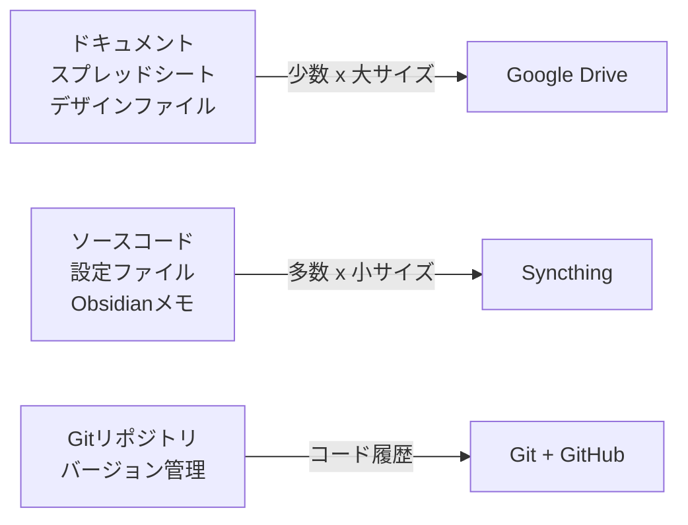

## Mac 2台で開発していると、必ずぶつかる壁

Mac mini M4 Proをメイン機に、MacBook Proを外出用に。2台体制で開発していると、ある問題に必ず直面します。

「さっきMac miniで書いたコード、MacBookに入ってない」

Gitで管理しているソースコードはpush/pullで済みますが、実際の開発環境にはローカル設定、Obsidianのメモ、スクリプト類など、Gitに載せないファイルが大量にあります。これらを2台の間でどう同期するかが、地味に厄介な課題でした。

最初に試したのがGoogle Drive。結果は[167GBの無駄な書き込みとマシンのフリーズ](https://zenn.dev/correlate000/articles/google-drive-incident)。次にiCloudを検討しましたが、開発フォルダとの相性の悪さは同様。rsyncで一時しのぎをした後、最終的にたどり着いたのがSyncthingでした。

この記事では、Syncthingを使ってMac 2台の `~/dev/` フォルダを双方向同期した実践手順と運用ノウハウをまとめています。

## なぜSyncthingなのか

同期ツールの選択肢はいくつかあります。なぜSyncthingを選んだのか、簡単に整理しておきましょう。

| 観点 | Google Drive | rsync | Syncthing | Resilio Sync |
|:--|:--|:--|:--|:--|
| 双方向同期 | あり | なし（片方向） | あり | あり |
| 除外フィルタ | 限定的 | `--exclude` | `.stignore` | あり |
| 継続的な自動同期 | あり | cron等で対応 | あり | あり |
| node_modules対応 | 不可（暴走する） | 除外可能 | 除外可能 | 除外可能 |
| クラウド依存 | あり | SSH必要 | なし（P2P） | リレーサーバー（補助的） |
| コスト | 有料（容量次第） | 無料 | 無料 | 無料版/有料版 |
| オープンソース | -- | あり | あり（MPL-2.0） | なし |

rsyncは片方向の転送には優秀ですが、「Mac miniで編集したファイルをMacBookにも反映し、逆も同様」という双方向同期には向いていません。Google Driveは前回の記事の通り、開発フォルダの大量小ファイルでfileproviderdが暴走するリスクがあります。Resilio SyncはBitTorrentプロトコルベースで高性能ですが、クローズドソースで有料版への誘導が強めです。

Syncthingはオープンソース、無料、P2P方式でクラウドを経由しない。ローカルネットワーク内なら転送も高速で、`.stignore` による柔軟な除外設定がある。開発フォルダの同期という用途には、最もバランスの取れた選択肢でしょう。

:::message
Syncthingはデータがクラウドに保存されません。プライバシーの観点でも安心ですし、クラウドストレージの容量制限も気にする必要がなくなります。通信はTLS 1.2/1.3でエンドツーエンド暗号化されています。
:::

## インストール

macOSでのインストール方法は2つあります。

### 方法1: Homebrewでインストール（推奨）

```bash
# インストール
brew install syncthing

# サービスとして起動（ログイン時に自動起動）
brew services start syncthing
```

これだけで `http://127.0.0.1:8384` にWeb GUIが立ち上がります。

### 方法2: macOSネイティブアプリ

[syncthing-macos](https://github.com/syncthing/syncthing-macos)のリリースページからDMGをダウンロードし、`/Applications` にドラッグするだけ。メニューバーにアイコンが表示され、そこからWeb GUIにアクセスできます。

:::message alert
Homebrew版とネイティブアプリ版を同時に動かすと、ポートやインスタンスが競合して正常に動作しません。どちらか一方を選んでください。
:::

### 両方のMacにインストール

同期する2台それぞれにSyncthingをインストールする必要があります。Mac miniとMacBook Pro、両方で上記の手順を実行してください。

## 初期設定: 2台を接続する

### 1. Device IDを確認

各マシンのWeb GUI（`http://127.0.0.1:8384`）を開き、右上の「操作」→「IDを表示」でDevice IDを確認できます。

Device IDは以下のような文字列で、Syncthingが生成したTLS証明書のSHA-256ハッシュをbase32エンコードしたものです。これが接続認証の鍵になります。

```
XXXXXXX-XXXXXXX-XXXXXXX-XXXXXXX-XXXXXXX-XXXXXXX-XXXXXXX-XXXXXXX
```

### 2. リモートデバイスを追加

Mac mini側のWeb GUIで「リモートデバイスの追加」をクリックし、MacBook ProのDevice IDを入力。逆にMacBook Pro側でもMac miniのDevice IDを追加します。

同じローカルネットワーク内にいれば、自動検出で接続先が見つかるはず。数十秒待つとステータスが「接続済み」に変わります。

### 3. 共有フォルダを追加

Mac mini側で「フォルダの追加」をクリックし、以下を設定します。

| 設定項目 | 値 |
|:--|:--|
| フォルダラベル | dev |
| フォルダパス | `/Users/naoya/dev` |
| 共有するデバイス | MacBook Pro（チェックを入れる） |

MacBook Pro側で承認ダイアログが表示されるので、「承諾」をクリック。フォルダパスはMacBook Pro側でも同じ `~/dev/` を指定します。

## 除外設定（.stignore）: 開発フォルダの必須設定

ここが最も重要なポイントです。開発フォルダには同期すべきでないファイルが大量に含まれています。除外設定なしでSyncthingを動かすのは、Google Driveの二の舞になりかねません。

`~/dev/.stignore` ファイルを作成し、以下を記述します。

```text
// 依存パッケージ（最大の容量削減効果）
node_modules
vendor

// バージョン管理（Git管理はGitに任せる）
.git

// ビルド成果物
dist
.next
__pycache__
*.pyc

// OS・エディタ生成ファイル
.DS_Store
Thumbs.db
.vscode
.idea

// ログ・一時ファイル
*.log
*.tmp
*.swp

// 環境変数（セキュリティポリシーに応じて判断してください）
// 機密情報を含む場合は除外推奨、チーム内で共有したい場合はコメントアウトを外す
// .env
// .env.local
// .env.*.local

// DDEV（Docker Compose + nginxベースのローカル開発環境。マシン固有の設定を含む）
.ddev
```

:::message
`.stignore` は同期フォルダのルートに配置します。このファイル自体は他のデバイスに同期されません。そのため、各マシンで個別に作成する必要があります。全マシンで同じパターンを使いたい場合は、`#include .stglobalignore` と記述して、任意のファイル（この例では `.stglobalignore`）を読み込む方法が便利です。なお、`#include` で指定するファイル名は自由に決められます。
:::

### 除外パターンの書き方

`.stignore` では、いくつかの便利なパターンが使えます。

```text
// ワイルドカード: 特定の拡張子を除外
*.log
*.tmp

// ディレクトリ指定（末尾スラッシュなしでもディレクトリにマッチ）
node_modules

// 否定パターン: 特定のファイルだけ同期対象に戻す
!important.log

// 大文字小文字を無視
(?i)thumbs.db

// ディレクトリ削除を許可（OS生成ファイル向け）
(?d).DS_Store
```

### なぜこれらを除外するのか

| 除外対象 | 理由 |
|:--|:--|
| `node_modules` / `vendor` | `npm install` / `composer install` で再生成可能。数万ファイルで同期負荷が極端に高い |
| `.git` | Gitリポジトリの内部データ。Git操作はGitに任せるべき |
| `.env` | APIキーやシークレットを含む可能性がある。セキュリティポリシーに応じて判断 |
| `.ddev` | Docker Compose + nginxベースのローカル開発環境（DDEV）。マシン固有の設定を含む |
| `dist` / `.next` | ビルド成果物。ビルドコマンドで再生成可能 |

これらを除外するだけで、同期対象のファイル数とサイズが劇的に減ります。

## バージョニング設定: うっかり上書きへの保険

Syncthingにはファイルバージョニング機能があり、ファイルが更新・削除されたときに旧バージョンを自動保持してくれます。

Web GUIでフォルダの「編集」→「ファイルバージョン管理」から設定できます。

| タイプ | 特徴 | 推奨用途 |
|:--|:--|:--|
| Trash Can | 削除・上書きされたファイルを `.stversions/` に保持 | 一般的な用途 |
| Simple | 指定回数分のバージョンを保持 | バージョン数を制御したい場合 |
| Staggered | 時間経過に応じて保持間隔が変わる（直近は密、古いほど疎） | 長期運用 |
| External | 外部スクリプトに処理を委任 | カスタム処理が必要な場合 |

私の設定はStaggeredで、最大保持期間を30日にしています。開発中にファイルを誤って上書きしても、30日以内なら復元できる安心感があります。

## 実際の運用データ

Syncthingで `~/dev/` 全体を同期した結果がこちらです。

| 項目 | 数値 |
|:--|:--|
| 同期対象フォルダ | `~/dev/`（Obsidian, プロジェクト, スクリプト等すべて） |
| 同期ファイル数 | 87,716 |
| 同期データサイズ | 10.3GiB |
| 除外対象 | .git, node_modules, vendor, .DS_Store, *.log, .env, .ddev |
| バージョン管理 | Staggered（30日保持） |
| 初回同期後の動作 | 差分のみ転送（変更ファイルだけ） |

87,716ファイルと聞くと多く感じるかもしれません。ただしこれは除外設定適用後の数字です。node_modulesやvendorを含めた場合、ファイル数はこの数倍になります。除外設定の効果は大きいと実感しています。

初回同期が完了した後は、ファイルを保存するたびに数秒で相手側に反映されるようになります。Mac miniでコードを書いて保存すると、MacBook Pro側にもほぼリアルタイムで届きます。この「意識しなくても同期されている」状態が、Syncthingの最大の利点でしょう。

## コンフリクト（競合）への対処

2台で同時に同じファイルを編集した場合、Syncthingはコンフリクトを検出します。

コンフリクトが発生すると、古い方のファイルが `.sync-conflict-<date>-<time>-<modifiedBy>.<ext>` というファイル名にリネームされ、新しい方がそのまま残る仕組みです。なお、コンフリクトファイル（`.sync-conflict-*`）は通常のファイルとして扱われるため、他のデバイスにも同期されます。

```
example.ts                           ← 新しい方（そのまま）
example.sync-conflict-20260208-143022-XXXXXXX.ts  ← 古い方（リネーム）
```

実運用では、ソースコードはGitで管理しているのでコンフリクトが問題になることはほぼありません。Syncthingでコンフリクトが起きるのは、Obsidianのメモを2台で同時に編集したときくらい。その場合も `.sync-conflict` ファイルを確認して手動マージすれば済む話です。

:::message
コンフリクトを自動解決したい場合、`git merge-file` を使った三方マージスクリプトを組む方法もあります。ただし開発フォルダの同期において、そこまで凝った仕組みが必要になるケースは稀でしょう。
:::

## トラブルシューティング

### 同期が始まらない

1. 両方のデバイスがSyncthingを起動しているか確認
2. 同じネットワークに接続されているか確認（同一Wi-Fi / 有線LAN）
3. Web GUIでデバイスのステータスが「接続済み」になっているか確認
4. ファイアウォールで22000番ポート（TCP/UDP）と21027番ポート（UDP）がブロックされていないか確認

### 同期が遅い

Syncthingはデフォルトでファイルシステムの変更通知（FSEvents）を使っていますが、これが効かない場合はフルスキャンにフォールバックし、同期が遅くなることがあります。

Web GUIのフォルダ設定で「フルスキャン間隔」を確認してみてください。デフォルトは3600秒（1時間）です。開発中はもう少し短くしてもよいかもしれません。ただし、FSEventsが正常に動作しているなら変更は不要です。

### ディスクI/Oが高い

同期対象のファイル数が多すぎる可能性があります。`.stignore` の設定を見直し、不要なファイルが同期対象に含まれていないか確認してください。

Spotlightのインデックス対象から `~/dev/` を除外するのも効果的です。

```
システム設定 → Siri と Spotlight → Spotlightのプライバシー → ~/dev/ を追加
```

※ macOSのバージョンによってメニューのパスが異なります。macOS Ventura以降では「Siri と Spotlight」、それ以前は「Spotlight」から設定できます。

## Google Driveとの使い分け

Google Driveが悪いわけではありません。用途を使い分ければ共存できます。



| データの特性 | 推奨ツール |
|:--|:--|
| 少数の大きなファイル（PDF、PSD、動画） | Google Drive |
| 大量の小さなファイル（ソースコード、設定） | Syncthing |
| バージョン管理が必要なコード | Git + GitHub |
| 機密情報（.env、APIキー） | 1Password / Secret Manager |

判断基準はシンプルで、「ファイル数が多く、サイズが小さい」データにはSyncthing、「ファイル数が少なく、サイズが大きい」データにはGoogle Driveです。この原則さえ守れば、167GBの書き込み事故は起きないはずです。

## まとめ

- Syncthingはオープンソース・無料のP2P同期ツール。クラウドを経由せず、ローカルネットワーク内で高速に双方向同期ができます
- `.stignore` の設定が最重要。node_modules、.git、vendor、.envを除外することで、同期負荷を大幅に削減できます
- バージョニングを有効にしておく。誤上書きからの復元が可能になり、運用の安心感が段違いです
- 実績として87,716ファイル / 10.3GiBを問題なく同期中。初回同期後はファイル保存から数秒で相手側に反映されます
- Google Driveとは用途で使い分ける。大量小ファイルにはSyncthing、少数大ファイルにはGoogle Drive

Google Driveでのフリーズ事件から学んだのは、「万能な同期ツールは存在しない」ということです。データの特性に合ったツールを選ぶ。この当たり前の判断が、無駄なトラブルを防ぐ最善策なのだと実感しています。

:::message
前回のGoogle Drive事件の詳細は[こちらの記事](https://zenn.dev/correlate000/articles/google-drive-incident)にまとめています。なぜ開発フォルダとクラウドストレージの相性が悪いのか、技術的な背景から解説しているので、併せてご覧ください。
:::

## 参考資料

https://syncthing.net/

https://docs.syncthing.net/

https://github.com/syncthing/syncthing-macos

https://docs.syncthing.net/users/ignoring.html

https://docs.syncthing.net/users/security.html

https://docs.syncthing.net/users/tuning.html

https://forum.syncthing.net/t/useful-stignore-patterns/1175

https://www.rafa.ee/articles/resolve-syncthing-conflicts-using-three-way-merge/
