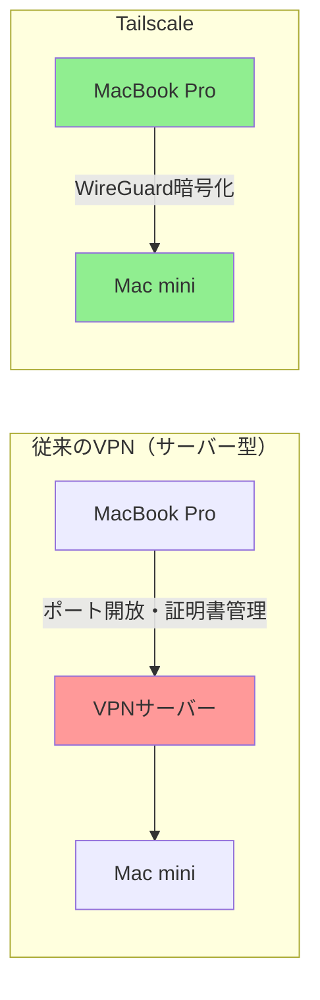
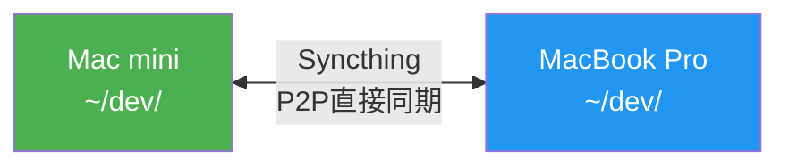
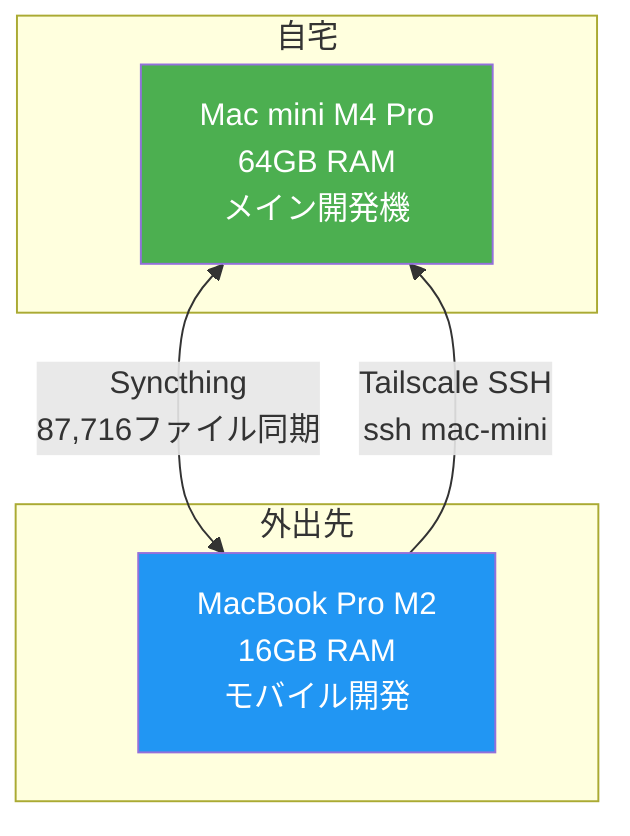

---
title:" "Mac miniとMBPをTailscale+Syncthingで同期したら開発効率が激変した話""
emoji: "🔗"
type: "tech"
topics: ["tailscale", "macos", "syncthing", "ssh"]
published: true
publication_name: "correlate_dev"
published_at: "2026-02-16 19:00"
---

## カフェからMac miniのターミナルを開く

VPN構築に数時間かかっていた環境が、30分のセットアップで`ssh mac-mini`一発になりました。

ある日、カフェでMacBook Proを開き、ターミナルにコマンドを1行打ちました。

```bash
ssh mac-mini
```

数秒後、自宅のMac mini M4 Pro（64GB RAM）のシェルが目の前に現れます。VPNの設定画面を開くことも、IPアドレスを調べることも不要です。ただホスト名を打つだけです。

この環境を手に入れるまでに、私は一度盛大に失敗しています。Google Drive for Desktopで開発フォルダを同期しようとして、167GBのディスク書き込みを発生させました[^1]。あの経験があったからこそ、「正しいツールを正しい用途に使う」という当たり前の原則に立ち返れたのだと思います。

[^1]: 詳しくは[Google Driveで開発フォルダを同期したら167GB書き込まれた話](https://zenn.dev/correlate000/articles/google-drive-incident)をご覧ください。

## 2台のMacを使い分けたい、でも同期が難しい

### マシン構成

私の開発環境はMac 2台体制です。

| マシン | スペック | 役割 |
|--------|---------|------|
| Mac mini | M4 Pro / 64GB RAM | メイン開発機（自宅据え置き） |
| MacBook Pro | M2 / 16GB RAM | モバイル開発 |

Mac miniのパワーでビルドやAI関連の重い処理を回し、外出先ではMacBook Proで作業します。理想はシンプルなのに、「2台の環境をどう同期するか」という問題が立ちはだかりました。

### Google Driveという選択肢の罠

最初に試したのがGoogle Drive for Desktopです。`~/dev/`フォルダをクラウド経由で同期すれば、どちらのマシンからでも同じファイルにアクセスできるはず――そう考えたわけですが、結果は惨憺たるものでした。

:::message alert
fileproviderdプロセスが167GBのディスク書き込みを発生。実データはわずか10.3GiB。マシンは完全フリーズし、SSDの寿命を無駄に消費しました。
:::

原因は、開発フォルダに含まれる大量の小ファイル（node_modules、.git、vendorなど）です。macOSのfileproviderdがこれらを1つずつ処理しようとして暴走しました。Google Driveには`.gitignore`のようなフィルタリング機能がなく、同期が始まった時点で止められません。

この失敗で学んだことは明確でした。クラウドストレージは「少数の大きなファイル」向きであり、開発フォルダのような「大量の小ファイル」には別の手段が必要です。

### Before / After

| 項目 | Before | After |
|------|--------|-------|
| 外出先からのアクセス | 不可（Google Drive失敗後） | `ssh mac-mini` で即座に接続 |
| ファイル同期 | 手動rsync or Git push/pull | Syncthing自動同期 |
| セットアップ時間 | VPN構築に数時間 | Tailscale + Syncthing で30分 |
| ネットワーク設定 | ポート開放・DynamicDNS | 一切不要 |
| 月額コスト | VPSなら$5〜/月 | 無料（Tailscale Personal + Syncthing） |
| SSD書き込み | 167GB（Google Drive暴走） | 差分同期のみ |

## Tailscaleを入れてみる

### 従来のVPNとの違い

外出先から自宅のMac miniにアクセスするには、何らかのネットワーク接続手段が必要です。従来のVPNだとサーバーの構築、証明書の管理、ポート開放といった手間がかかります。正直、個人の開発環境にそこまでの労力をかけたくはありません。

Tailscaleは、その面倒をほぼすべて取り除いてくれるツールです。



従来のVPNが中央サーバーを経由するのに対し、TailscaleはWireGuardベースのメッシュネットワークを構築してデバイス同士を直接つなぎます（NAT環境によってはDERPリレーサーバーを経由する場合もありますが、多くの場合P2P接続が成立します）。P2P接続なので、中央サーバーがボトルネックになることもありません。

| 比較項目 | 従来のVPN | Tailscale |
|----------|-----------|-----------|
| セットアップ | サーバー構築・証明書管理 | アプリインストール+ログイン |
| NAT越え | ポート開放が必要な場合あり | 自動 |
| 速度 | 中央サーバー経由 | P2P直接接続 |
| 料金 | サーバー費用が発生 | 個人利用は無料[^2] |

[^2]: Tailscaleの個人向けPersonalプランは無料で、3ユーザー・100デバイスまで利用可能です。詳細は[Tailscale Pricing](https://tailscale.com/pricing)を参照してください。

### 導入手順

セットアップは拍子抜けするほど簡単でした。

**1. 両方のMacにTailscaleをインストール**

```bash
# Homebrew経由（Mac mini / MBP 両方で実行）
brew install --cask tailscale
```

App Storeからもインストールできます。

**2. 両方のMacでログイン**

Tailscaleアプリを起動し、Googleアカウント等でログインします。同じアカウントでログインしたデバイスは、自動的に同一のtailnet（Tailscaleのプライベートネットワーク）に参加する仕組みです。

**3. Mac miniでSSHを有効化**

macOSの設定画面からリモートログインを有効にします。

- システム設定 → 一般 → 共有 → リモートログイン → ON

**4. 接続テスト**

```bash
# MacBook Proから実行
ssh ユーザー名@mac-mini
```

MagicDNS機能により、デバイス名だけでアクセスできます。IPアドレスを覚える必要はありません。`~/.ssh/config`に以下を書いておけば、さらに短くなります。

```text
Host mac-mini
    HostName mac-mini
    User naoya
```

これで`ssh mac-mini`の一言でMac miniに入れるようになりました。ルーターの設定を触ることも、ポートを開けることも、一切不要です。所要時間はインストールからSSH接続まで、正味5分程度でした。

:::message
Tailscale SSHを有効にすれば、SSHキーの管理すら不要になります。WireGuardの暗号化に加え、Tailscaleの認証基盤がアクセスを制御するため、公開鍵の配布や`authorized_keys`の管理から解放されます。ただし今回はmacOS標準のSSHをそのまま使っています。
:::

## Syncthingでファイルを同期する

### SSHだけでは足りない理由

Tailscaleのおかげで、外出先からMac miniにSSH接続できるようになりました。ただしこれだけでは、「MacBook Pro側にもファイルを持っておきたい」というニーズには応えられません。

たとえばカフェでMacBook Proを開いてコーディングし、帰宅後にMac miniで続きをやります。このワークフローでは、両方のマシンにソースコードが存在している必要があります。Gitのpush/pullでもある程度は対応できますが、コミットしていない作業中のファイルや、Obsidianのノートなど、Git管理外のファイルも同期したいところです。

そこでSyncthingの出番です。

### Syncthingとは

SyncthingはオープンソースのP2Pファイル同期ツールです。クラウドを経由せず、デバイス間で直接ファイルを同期します。Google Driveとの決定的な違いは、`.stignore`ファイルによる除外設定が使える点です。



### .stignoreの設定

Google Drive事件の教訓を活かし、開発フォルダ特有の「同期してはいけないファイル」を徹底的に除外しました。以下の手順は両方のMacで実行してください。

`~/dev/.stignore` の内容:

```text
.git
node_modules
vendor
.DS_Store
*.log
.env
.ddev
```

:::details 除外対象の選定理由
| 除外対象 | 理由 |
|----------|------|
| `.git` | 各マシンで独立管理。GitHubが正本 |
| `node_modules` | `npm install`で再生成可能。大量小ファイルの元凶 |
| `vendor` | `composer install`で再生成可能 |
| `.DS_Store` | macOS固有のメタデータ。同期する意味なし |
| `*.log` | ログファイル。環境固有の情報を含む |
| `.env` | シークレット情報。同期はセキュリティリスク |
| `.ddev` | DDEV（Docker開発環境）の設定。マシン固有 |
:::

### 同期結果

設定完了後の同期状況がこちらです。

| 項目 | 数値 |
|------|------|
| 同期対象 | `~/dev/` 全体（Obsidian Vault含む） |
| 同期ファイル数 | 87,716 |
| 同期サイズ | 10.3GiB |
| バージョン管理 | 30日間保持 |
| 初回同期後 | 差分のみの増分同期 |

87,716ファイル、10.3GiBの双方向同期が安定稼働しています。Google Driveで167GBの書き込みを起こしたのと同じデータが、Syncthingなら何の問題もなく同期されます。除外設定の有無がこれほど大きな差を生むとは、正直なところ想像以上でした。

Syncthingのバージョン管理機能（30日間保持）も地味に助かっています。誤ってファイルを削除してしまっても、Syncthingの管理画面から復元可能です。Gitで管理していないファイル（Obsidianのノートなど）のセーフティネットとして機能しています。

## 完成した開発環境

Tailscale + Syncthingの組み合わせで、以下のような開発環境が出来上がりました。



### 日常のワークフロー

自宅作業時はMac miniで開発します。64GBのメモリを活かして、Dockerコンテナを複数起動しながらビルドできます。変更はSyncthingでMBPにリアルタイム同期されます。

外出時の軽作業ではMacBook Proで直接コーディングします。ソースコードはSyncthing経由で手元にあるので、オフラインでも作業可能です。帰宅すれば変更が自動的にMac miniに反映されます。

外出時に重い処理が必要な場合は、MacBook ProからTailscale経由でMac miniにSSH接続します。ビルドやAI関連の処理はMac mini側で実行し、結果だけ手元で確認できます。

## Tailscale + Syncthingの使い分け

ここまで読んで、「TailscaleとSyncthingは役割が違うの？」と思われるかもしれません。端的に言えば、以下のような使い分けです。

| ツール | 役割 | 例 |
|--------|------|-----|
| Tailscale | ネットワーク接続（デバイスを繋ぐ） | SSH接続、リモートデスクトップ、ポートフォワード |
| Syncthing | ファイル同期（データを揃える） | ソースコード、Obsidianノート、設定ファイル |

Tailscaleは「どこにいてもMac miniに入れる道」を作り、Syncthingは「どちらのマシンにも同じファイルがある状態」を維持します。この2つは補完関係にあり、どちらか一方では足りません。

:::message
Tailscale経由でSyncthingを動かすことも可能ですが、Syncthingは同一LAN内なら直接通信するため、自宅での同期にはTailscaleを経由する必要がありません。外出先でもSyncthingのリレーサーバー経由で同期が継続するので、実用上はそれぞれ独立して動かす形で問題なく運用できています。
:::

## Mac 2台構成を始める方へ

大がかりな構成に見えるかもしれませんが、最初の一歩は小さくて構いません。

### Step 1: Tailscaleを入れる（5分）

両方のMacにTailscaleをインストールしてログインします。これだけでSSH接続が可能になります。

```bash
brew install --cask tailscale
```

### Step 2: Syncthingでフォルダを1つ同期する（15分）

いきなり`~/dev/`全体を同期する必要はありません。Obsidianのvaultや特定のプロジェクトフォルダから始めるのがお勧めです。`.stignore`ファイルで除外設定を忘れないようにしてください。なお、Syncthingのインストールと設定は両方のMacで行う必要があります。

```bash
brew install syncthing
# Syncthingの起動
brew services start syncthing
# ブラウザで管理画面を開く（http://localhost:8384）
```

### Step 3: 運用しながら拡大する

小さく始めて問題がなければ、同期対象を増やしていきましょう。私の場合、最終的に`~/dev/`全体（87,716ファイル）をSyncthingで同期するに至りましたが、最初は1つのプロジェクトフォルダだけでした。

:::message
Google Drive、Dropbox、iCloudなどのクラウドストレージで開発フォルダを同期するのは避けてください。node_modulesや.gitディレクトリが含まれていると、ファイルプロバイダーデーモンが暴走するリスクがあります。
:::

## おわりに

Google Drive for Desktopで167GBの書き込みを食らったとき、「2台のMacを同期するのはこんなに難しいのか」と途方に暮れました。しかし振り返ってみると、難しかったのではなく、ツールの選択を間違えていただけでした。

「ネットワーク接続」と「ファイル同期」を分けて考え、それぞれに適したツールを当てます。Tailscaleで接続し、Syncthingで同期する。このシンプルな構成が、167GB事件以降ずっと安定して稼働しています。

Mac 2台を使い分けている方、あるいはこれからデスクトップ+ラップトップの構成を検討している方の参考になれば幸いです。

## 参考資料

https://tailscale.com/

https://tailscale.com/kb/1193/tailscale-ssh

https://tailscale.com/pricing

https://syncthing.net/

https://zenn.dev/correlate000/articles/google-drive-incident

https://zenn.dev/ikumasudo/articles/08550be5edcd7e

https://note.com/cozy_in_da_house/n/nf0cb09a0cf28
