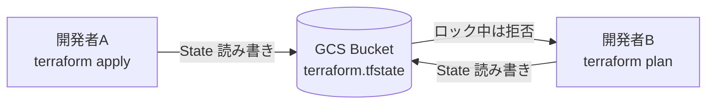
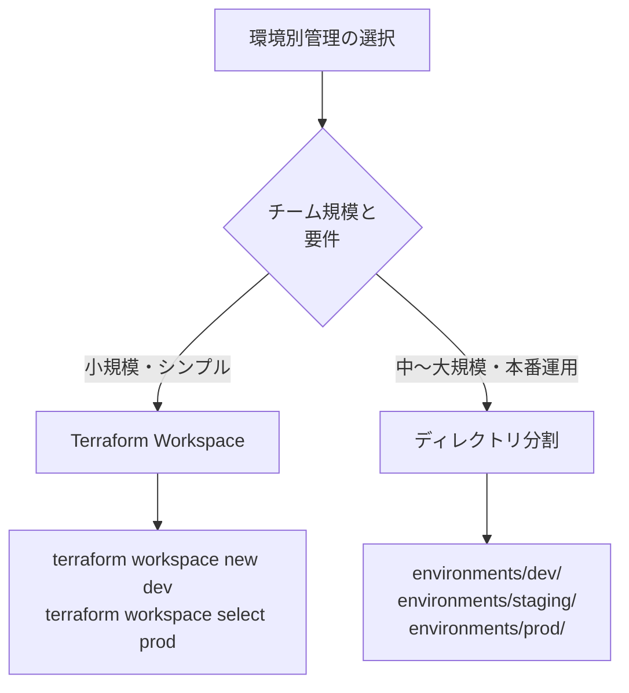
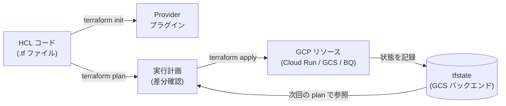

## はじめに ─ IaC と Terraform の位置づけ

クラウドインフラを「手でポチポチ」構築した経験は誰にでもあるでしょう。GCP コンソールから Cloud Run サービスを作り、Cloud Storage バケットを追加し、BigQuery データセットを設定する。最初は手軽ですが、環境が増えるにつれて問題が浮上します。「開発環境と本番環境で何が違うのかわからない」「メンバーが誤って本番リソースを削除した」「同じ構成を別プロジェクトに再現するのに 2 時間かかった」── これらはすべて Infrastructure as Code（IaC）で解消できる問題です。

IaC とは、インフラの構成をコードとして記述・管理するアプローチです。コードはバージョン管理でき、レビューでき、テストでき、自動化できます。手動操作とは根本的に異なる再現性と安全性をもたらします。

### Terraform とは

Terraform は HashiCorp（現 IBM）が開発するオープンソースの IaC ツールです。HCL（HashiCorp Configuration Language）という宣言的な構文でインフラを定義し、AWS・GCP・Azure・Kubernetes など 1,000 以上のプロバイダに対応しています。

他の IaC ツールとの比較を整理しておきましょう。

| ツール | 言語 | 対象 | 特徴 |
|--------|------|------|------|
| Terraform | HCL | マルチクラウド | 宣言的、State 管理、豊富なProvider |
| Deployment Manager | YAML/Python | GCP のみ | GCP ネイティブ、非推奨化が進む |
| Pulumi | Python/TypeScript | マルチクラウド | プログラミング言語で記述可 |
| Ansible | YAML | サーバー設定 | 手続き的、Terraform と併用されることが多い |

GCP で IaC を始めるなら Terraform が現在のデファクトスタンダードです。Google 自身も公式ドキュメントで Terraform を前提とした解説を多く提供しています。

この記事では、Terraform を使って GCP インフラをコード管理する方法を、基礎から CI/CD 統合まで一気通貫で解説します。

---

## インストールとセットアップ

### Terraform CLI のインストール

macOS では Homebrew を使うのが最も簡単です。

```bash
brew tap hashicorp/tap
brew install hashicorp/tap/terraform

# バージョン確認
terraform version
# Terraform v1.9.x
```

Linux（Ubuntu/Debian）の場合は APT リポジトリを使います。

```bash
wget -O- https://apt.releases.hashicorp.com/gpg | \
  sudo gpg --dearmor -o /usr/share/keyrings/hashicorp-archive-keyring.gpg

echo "deb [signed-by=/usr/share/keyrings/hashicorp-archive-keyring.gpg] \
  https://apt.releases.hashicorp.com $(lsb_release -cs) main" | \
  sudo tee /etc/apt/sources.list.d/hashicorp.list

sudo apt update && sudo apt install terraform
```

### gcloud 認証の設定

GCP Provider が使用する認証情報を設定します。ローカル開発では Application Default Credentials（ADC）を使うのが推奨です。サービスアカウントキーをファイルに保存する方法は現在非推奨となっており、ADC + 権限借用（Impersonation）が安全なベストプラクティスです。

```bash
# Google Cloud CLI のインストール（未インストールの場合）
# https://cloud.google.com/sdk/docs/install

# ADC を設定（ブラウザが開いてログイン）
gcloud auth application-default login

# プロジェクトを設定
gcloud config set project YOUR_PROJECT_ID
```

CI/CD 環境では Workload Identity Federation を使ったキーレス認証が推奨です（詳細は後述の CI/CD セクションで解説します）。

---

## 基本構文 ─ Provider・Resource・Variable・Output

まずプロジェクト構造を作ります。

```
my-gcp-infra/
├── main.tf          # メインの構成ファイル
├── variables.tf     # 変数定義
├── outputs.tf       # 出力値定義
├── versions.tf      # Terraform/Provider バージョン固定
└── terraform.tfvars # 変数の値（Git 管理外にする場合もある）
```

### versions.tf ─ バージョンを固定する

```hcl
terraform {
  required_version = "~> 1.9.0"

  required_providers {
    google = {
      source  = "hashicorp/google"
      version = "~> 6.10.0"
    }
  }
}
```

`~>` は「マイナーバージョンは上げてよいがメジャーバージョンは固定」という意味です。チーム開発では必ずバージョンを固定しましょう。

### Provider ─ GCP への接続設定

```hcl
# main.tf
provider "google" {
  project = var.project_id
  region  = var.region
}
```

### variables.tf ─ 変数を定義する

```hcl
variable "project_id" {
  description = "GCP プロジェクト ID"
  type        = string
}

variable "region" {
  description = "デフォルトリージョン"
  type        = string
  default     = "asia-northeast1"
}

variable "environment" {
  description = "環境名（dev / staging / prod）"
  type        = string
  validation {
    condition     = contains(["dev", "staging", "prod"], var.environment)
    error_message = "environment は dev / staging / prod のいずれかを指定してください。"
  }
}
```

### terraform.tfvars ─ 変数の値を渡す

```hcl
project_id  = "my-gcp-project-12345"
region      = "asia-northeast1"
environment = "dev"
```

### outputs.tf ─ 作成したリソースの情報を出力する

```hcl
output "cloud_run_url" {
  description = "Cloud Run サービスの URL"
  value       = google_cloud_run_v2_service.api.uri
}

output "storage_bucket_name" {
  description = "GCS バケット名"
  value       = google_storage_bucket.assets.name
}
```

### 基本ワークフロー

```bash
# 1. 初期化（Provider プラグインのダウンロード）
terraform init

# 2. 実行計画の確認（実際には何も変更しない）
terraform plan

# 3. インフラを実際に作成・更新
terraform apply

# 4. 特定のリソースを削除したい場合
terraform destroy -target=google_storage_bucket.assets
```

`terraform plan` の出力には `+`（追加）、`~`（変更）、`-`（削除）のプレフィックスが付くので、適用前に必ず目視確認しましょう。

---

## GCS バックエンドで tfstate を管理する

### tfstate とは

Terraform は現在のインフラの状態を `terraform.tfstate` というファイルに記録します。このファイルがあることで、Terraform は「実際に何が存在するか」を把握し、次回の `plan` 時に差分だけを計算できます。

ローカルに `terraform.tfstate` を置いたままチーム開発するとすぐに問題が発生します。誰かが古い state で `apply` すると、他のメンバーが作ったリソースが削除される危険があります。そこでリモートバックエンドとして GCS を使います。



### GCS バックエンドの設定手順

まず状態管理用のバケットを GCS に作成します（このバケット自体は手動 or 別の Terraform 構成で管理するのが一般的です）。

```bash
# state 管理用バケットを作成
gcloud storage buckets create gs://my-tfstate-bucket \
  --project=YOUR_PROJECT_ID \
  --location=asia-northeast1 \
  --uniform-bucket-level-access

# バージョニングを有効化（state の履歴を保持するため）
gcloud storage buckets update gs://my-tfstate-bucket \
  --versioning
```

次に `versions.tf` にバックエンド設定を追加します。

```hcl
terraform {
  required_version = "~> 1.9.0"

  required_providers {
    google = {
      source  = "hashicorp/google"
      version = "~> 6.10.0"
    }
  }

  backend "gcs" {
    bucket = "my-tfstate-bucket"
    prefix = "terraform/dev"
  }
}
```

`prefix` でディレクトリを切ることで、複数の Terraform 構成が同じバケットを共有できます。

```bash
# バックエンドを変更したら再初期化が必要
terraform init -reconfigure
```

### ロック機能について

GCS バックエンドはデフォルトでロック機能が有効です。`terraform apply` 中に別の誰かが同時に `apply` しようとしてもロックで弾かれます。GCS はオブジェクトの世代番号を使った楽観的ロックで実現しているため、追加の DynamoDB テーブル（AWS の場合に必要）などは不要です。

Terraform がクラッシュしてロックが残った場合は以下で解除できます。

```bash
terraform force-unlock LOCK_ID
```

---

## Cloud Run リソースの定義

Cloud Run は GCP のサーバーレスコンテナ実行環境です。Terraform では `google_cloud_run_v2_service` リソース（V2 API）を使います。

```hcl
# Cloud Run サービス
resource "google_cloud_run_v2_service" "api" {
  name     = "${var.environment}-api"
  location = var.region

  # すべてのトラフィックを許可（認証なしの公開サービスの場合）
  ingress = "INGRESS_TRAFFIC_ALL"

  template {
    service_account = google_service_account.cloud_run_sa.email

    scaling {
      min_instance_count = var.environment == "prod" ? 1 : 0
      max_instance_count = var.environment == "prod" ? 10 : 3
    }

    containers {
      image = "asia-northeast1-docker.pkg.dev/${var.project_id}/app/api:latest"

      resources {
        limits = {
          cpu    = "1"
          memory = "512Mi"
        }
        cpu_idle = true  # リクエストがない時は CPU を割り当てない
      }

      env {
        name  = "ENV"
        value = var.environment
      }

      # Secret Manager からシークレットを注入
      env {
        name = "DATABASE_URL"
        value_source {
          secret_key_ref {
            secret  = google_secret_manager_secret.db_url.secret_id
            version = "latest"
          }
        }
      }
    }
  }

  # デプロイのたびに新しいリビジョンを作成
  lifecycle {
    ignore_changes = [
      template[0].containers[0].image,
    ]
  }
}

# Cloud Run に割り当てるサービスアカウント
resource "google_service_account" "cloud_run_sa" {
  account_id   = "${var.environment}-cloud-run-sa"
  display_name = "${var.environment} Cloud Run Service Account"
}

# 公開アクセスを許可する IAM バインディング（認証不要の場合）
resource "google_cloud_run_v2_service_iam_member" "public_invoker" {
  project  = var.project_id
  location = var.region
  name     = google_cloud_run_v2_service.api.name
  role     = "roles/run.invoker"
  member   = "allUsers"
}
```

`lifecycle.ignore_changes` で `image` を除外しているのは、イメージの更新は CI/CD パイプライン（`gcloud run deploy`）で行い、Terraform のスコープ外として扱うためです。インフラ設定（メモリ、CPU、スケーリング設定など）だけを Terraform で管理するパターンが実務では一般的です。

---

## Cloud Storage バケット定義

```hcl
# アセット配信用バケット
resource "google_storage_bucket" "assets" {
  name          = "${var.project_id}-${var.environment}-assets"
  location      = "ASIA-NORTHEAST1"
  storage_class = "STANDARD"

  # 均一なバケットレベルのアクセス制御（推奨）
  uniform_bucket_level_access = true

  # バージョニング（誤削除時の復元用）
  versioning {
    enabled = true
  }

  # ライフサイクルルール：古いバージョンを 30 日後に削除
  lifecycle_rule {
    condition {
      num_newer_versions = 3
      with_state         = "ARCHIVED"
    }
    action {
      type = "Delete"
    }
  }

  # 90 日以上経過したオブジェクトを Nearline に移行
  lifecycle_rule {
    condition {
      age        = 90
      with_state = "LIVE"
    }
    action {
      type          = "SetStorageClass"
      storage_class = "NEARLINE"
    }
  }

  # Terraform 管理外で削除されないよう保護
  lifecycle {
    prevent_destroy = true
  }

  labels = {
    environment = var.environment
    managed_by  = "terraform"
  }
}

# tfstate 保存用バケット（このバケット自体も Terraform で管理する場合）
resource "google_storage_bucket" "tfstate" {
  name          = "${var.project_id}-tfstate"
  location      = "ASIA-NORTHEAST1"
  storage_class = "STANDARD"

  uniform_bucket_level_access = true

  versioning {
    enabled = true
  }

  lifecycle {
    prevent_destroy = true
  }
}
```

`prevent_destroy = true` は誤って `terraform destroy` してしまっても Terraform がエラーを出して停止する保護機能です。本番のデータを含むバケットには必ず設定しましょう。

---

## BigQuery データセット・テーブル定義

```hcl
# BigQuery データセット
resource "google_bigquery_dataset" "analytics" {
  dataset_id  = "${var.environment}_analytics"
  description = "アナリティクス用データセット (${var.environment})"
  location    = "asia-northeast1"

  # デフォルトのテーブル有効期限（dev 環境では 30 日、prod では無制限）
  default_table_expiration_ms = var.environment == "prod" ? null : 2592000000

  labels = {
    environment = var.environment
    managed_by  = "terraform"
  }

  # アクセス制御
  access {
    role          = "OWNER"
    special_group = "projectOwners"
  }

  access {
    role          = "READER"
    special_group = "projectReaders"
  }
}

# BigQuery テーブル（パーティション + クラスタリング）
resource "google_bigquery_table" "events" {
  dataset_id          = google_bigquery_dataset.analytics.dataset_id
  table_id            = "events"
  description         = "ユーザーイベントテーブル"
  deletion_protection = var.environment == "prod"

  # 日付パーティション（コスト削減に有効）
  time_partitioning {
    type  = "DAY"
    field = "event_date"
  }

  # クラスタリング（パーティション内のスキャン効率化）
  clustering = ["user_id", "event_type"]

  schema = jsonencode([
    {
      name = "event_date"
      type = "DATE"
      mode = "REQUIRED"
    },
    {
      name = "user_id"
      type = "STRING"
      mode = "REQUIRED"
    },
    {
      name        = "event_type"
      type        = "STRING"
      mode        = "REQUIRED"
      description = "例: page_view, click, purchase"
    },
    {
      name = "properties"
      type = "JSON"
      mode = "NULLABLE"
    },
    {
      name = "created_at"
      type = "TIMESTAMP"
      mode = "REQUIRED"
    }
  ])

  labels = {
    environment = var.environment
    managed_by  = "terraform"
  }
}

# BigQuery テーブル（外部テーブル: GCS のファイルを直接クエリ）
resource "google_bigquery_table" "raw_logs" {
  dataset_id = google_bigquery_dataset.analytics.dataset_id
  table_id   = "raw_logs"

  external_data_configuration {
    autodetect    = true
    source_format = "NEWLINE_DELIMITED_JSON"
    source_uris   = ["gs://${google_storage_bucket.assets.name}/logs/*.json"]
  }
}
```

BigQuery テーブルのスキーマは `jsonencode` を使って HCL 内に直接記述できます。外部ファイル（`schema.json`）を参照することも可能で、大規模なスキーマの場合はそちらが見やすくなります。

```hcl
# 外部 JSON ファイルを参照するパターン
resource "google_bigquery_table" "users" {
  dataset_id = google_bigquery_dataset.analytics.dataset_id
  table_id   = "users"
  schema     = file("${path.module}/schemas/users.json")
}
```

---

## モジュール化パターン

コードが増えてきたら、再利用可能なモジュールに分割します。モジュールとは単なる Terraform ファイルのディレクトリです。

### モジュールのディレクトリ構造

```
infrastructure/
├── modules/
│   ├── cloud-run/
│   │   ├── main.tf
│   │   ├── variables.tf
│   │   └── outputs.tf
│   ├── storage/
│   │   ├── main.tf
│   │   ├── variables.tf
│   │   └── outputs.tf
│   └── bigquery/
│       ├── main.tf
│       ├── variables.tf
│       └── outputs.tf
└── environments/
    ├── dev/
    │   ├── main.tf
    │   ├── versions.tf
    │   └── terraform.tfvars
    ├── staging/
    │   ├── main.tf
    │   ├── versions.tf
    │   └── terraform.tfvars
    └── prod/
        ├── main.tf
        ├── versions.tf
        └── terraform.tfvars
```

### モジュールの定義（modules/cloud-run/main.tf）

```hcl
resource "google_cloud_run_v2_service" "this" {
  name     = var.service_name
  location = var.region

  ingress = var.ingress

  template {
    service_account = var.service_account_email

    scaling {
      min_instance_count = var.min_instances
      max_instance_count = var.max_instances
    }

    containers {
      image = var.image

      resources {
        limits = {
          cpu    = var.cpu
          memory = var.memory
        }
      }

      dynamic "env" {
        for_each = var.env_vars
        content {
          name  = env.key
          value = env.value
        }
      }
    }
  }
}
```

### モジュールの variables.tf

```hcl
variable "service_name"         { type = string }
variable "region"               { type = string }
variable "image"                { type = string }
variable "service_account_email" { type = string }
variable "ingress"              { type = string; default = "INGRESS_TRAFFIC_ALL" }
variable "min_instances"        { type = number; default = 0 }
variable "max_instances"        { type = number; default = 5 }
variable "cpu"                  { type = string; default = "1" }
variable "memory"               { type = string; default = "512Mi" }
variable "env_vars"             { type = map(string); default = {} }
```

### 環境からモジュールを呼び出す（environments/dev/main.tf）

```hcl
module "api" {
  source = "../../modules/cloud-run"

  service_name          = "dev-api"
  region                = "asia-northeast1"
  image                 = "asia-northeast1-docker.pkg.dev/my-project/app/api:latest"
  service_account_email = "dev-cloud-run-sa@my-project.iam.gserviceaccount.com"
  min_instances         = 0
  max_instances         = 3

  env_vars = {
    ENV        = "development"
    LOG_LEVEL  = "debug"
  }
}
```

モジュールを使うことで、同じ構成パターンを dev / staging / prod で安全に再利用でき、環境間の差分が明確になります。

---

## 環境別管理 ─ dev / staging / prod

### ディレクトリ分割とワークスペースの使い分け

環境管理には大きく 2 つのアプローチがあります。



実務では「ディレクトリ分割」が推奨されます。ワークスペースは state を切り替えるだけなので、環境間で設定値を誤って適用するリスクがあります。ディレクトリ分割なら構成ファイル自体が分離されているため安全です。

### environments/prod/terraform.tfvars

```hcl
project_id  = "my-project-prod"
region      = "asia-northeast1"
environment = "prod"
```

### environments/staging/terraform.tfvars

```hcl
project_id  = "my-project-staging"
region      = "asia-northeast1"
environment = "staging"
```

各環境のバックエンド設定（`versions.tf`）では異なる `prefix` を指定します。

```hcl
# environments/dev/versions.tf
terraform {
  backend "gcs" {
    bucket = "my-project-tfstate"
    prefix = "terraform/dev"
  }
}

# environments/prod/versions.tf
terraform {
  backend "gcs" {
    bucket = "my-project-tfstate"
    prefix = "terraform/prod"
  }
}
```

---

## CI/CD 統合 ─ GitHub Actions

### Workload Identity Federation による認証

サービスアカウントキーをファイルに保存せず、GitHub Actions の OIDC トークンを使って GCP に認証するのが現在の推奨方式です。

まず Workload Identity Pool と Provider を Terraform で作成します。

```hcl
# Workload Identity Pool
resource "google_iam_workload_identity_pool" "github_pool" {
  workload_identity_pool_id = "github-actions-pool"
  display_name              = "GitHub Actions Pool"
}

# Workload Identity Provider
resource "google_iam_workload_identity_pool_provider" "github_provider" {
  workload_identity_pool_id          = google_iam_workload_identity_pool.github_pool.workload_identity_pool_id
  workload_identity_pool_provider_id = "github-provider"

  oidc {
    issuer_uri = "https://token.actions.githubusercontent.com"
  }

  attribute_mapping = {
    "google.subject"       = "assertion.sub"
    "attribute.actor"      = "assertion.actor"
    "attribute.repository" = "assertion.repository"
  }

  attribute_condition = "assertion.repository == 'YOUR_ORG/YOUR_REPO'"
}

# GitHub Actions に権限を付与
resource "google_service_account_iam_member" "github_wif" {
  service_account_id = google_service_account.terraform_sa.name
  role               = "roles/iam.workloadIdentityUser"
  member = "principalSet://iam.googleapis.com/${google_iam_workload_identity_pool.github_pool.name}/attribute.repository/YOUR_ORG/YOUR_REPO"
}
```

### GitHub Actions ワークフロー

```yaml
# .github/workflows/terraform.yml
name: Terraform CI/CD

on:
  pull_request:
    branches: [main]
    paths:
      - 'infrastructure/**'
  push:
    branches: [main]
    paths:
      - 'infrastructure/**'

permissions:
  contents: read
  id-token: write   # OIDC トークンの取得に必要
  pull-requests: write

jobs:
  terraform:
    runs-on: ubuntu-latest
    defaults:
      run:
        working-directory: infrastructure/environments/prod

    steps:
      - uses: actions/checkout@v4

      - name: Authenticate to GCP
        uses: google-github-actions/auth@v2
        with:
          workload_identity_provider: ${{ secrets.WIF_PROVIDER }}
          service_account: ${{ secrets.TF_SERVICE_ACCOUNT }}

      - name: Setup Terraform
        uses: hashicorp/setup-terraform@v3
        with:
          terraform_version: "~1.9.0"

      - name: Terraform Init
        run: terraform init

      - name: Terraform Format Check
        run: terraform fmt -check -recursive

      - name: Terraform Validate
        run: terraform validate

      - name: Terraform Plan
        id: plan
        run: terraform plan -no-color -out=tfplan
        continue-on-error: true

      - name: Comment Plan on PR
        if: github.event_name == 'pull_request'
        uses: actions/github-script@v7
        with:
          script: |
            const output = `#### Terraform Plan 結果
            \`\`\`
            ${{ steps.plan.outputs.stdout }}
            \`\`\`
            `;
            github.rest.issues.createComment({
              issue_number: context.issue.number,
              owner: context.repo.owner,
              repo: context.repo.repo,
              body: output
            });

      - name: Terraform Apply
        if: github.ref == 'refs/heads/main' && github.event_name == 'push'
        run: terraform apply -auto-approve tfplan
```

このワークフローのポイントは以下の 3 点です。

| ステップ | 目的 |
|----------|------|
| PR 時に `terraform plan` を実行 | 変更内容をレビューで確認できるようにする |
| Plan 結果を PR コメントに投稿 | コンソールを見なくても差分がわかる |
| main マージ後に `terraform apply` | レビュー済みの変更だけを本番に適用 |

---

## まとめ

この記事では Terraform を使った GCP インフラのコード管理について、基礎概念から実践的な CI/CD 統合まで解説しました。



重要なポイントを整理します。

| トピック | 要点 |
|----------|------|
| 認証 | ローカルは ADC、CI/CD は Workload Identity Federation でキーレス化 |
| State 管理 | GCS バックエンドでチーム共有、バージョニングで履歴保持 |
| 環境別管理 | Workspace より環境ディレクトリ分割が安全で明確 |
| モジュール化 | 再利用可能なコンポーネントに分割して DRY を実現 |
| CI/CD | PR で plan を確認、マージ後に apply の安全なフロー |

### 次のステップ

Terraform を導入したら、以下のツールと組み合わせると運用品質がさらに上がります。

- `tflint` ── HCL の静的解析ツール（バグや非推奨な設定を検出）
- `tfsec` ── セキュリティスキャン（IAM 設定ミスなどを検出）
- `terraform-docs` ── モジュールのドキュメントを自動生成
- Atlantis ── Pull Request ベースの Terraform 自動化サーバー

IaC は「一度書いたら終わり」ではなく、コードと同様にリファクタリングと改善を繰り返すものです。まずは小さなリソースから始めて、チームにとって持続可能な Terraform 運用を構築していきましょう。
