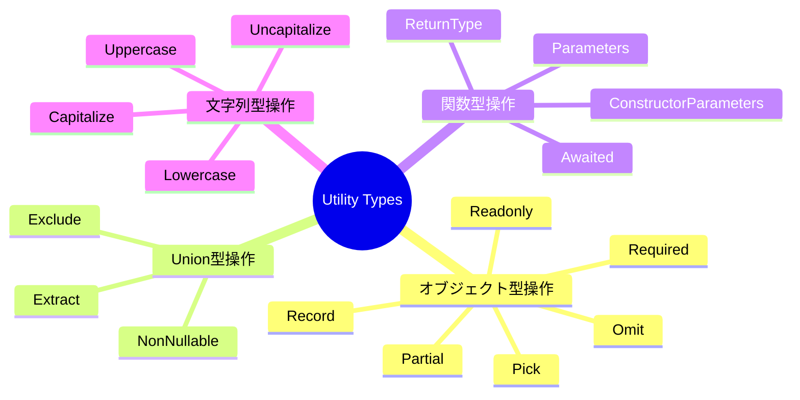
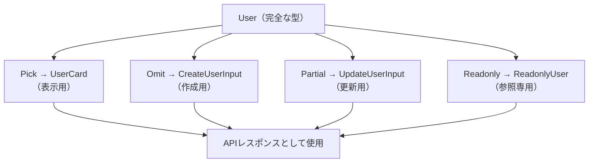

## はじめに

TypeScriptの型システムは、コードの安全性と保守性を大幅に高めてくれます。その中でも「ユーティリティ型（Utility Types）」は、既存の型から新しい型を導出するための強力なビルトイン機能です。

ユーティリティ型を使わない場合、同じようなインターフェース定義を複数箇所に書き、変更のたびに全ての定義を修正するという作業が生じます。ユーティリティ型を活用することで、単一の型定義から複数のバリエーションを安全に導出でき、型の一貫性を保ちながら開発速度を向上させることができます。

本記事では、TypeScript 5.x で利用できるユーティリティ型を体系的に整理し、実際のプロジェクトで役立つパターンを紹介します。



---

## 1. オブジェクト型操作

オブジェクト型操作系のユーティリティ型は、既存の型のプロパティを変換・絞り込みする際に使います。まず基本となる `User` 型を定義しておきます。

```typescript
interface User {
  id: number;
  name: string;
  email: string;
  role: "admin" | "editor" | "viewer";
  createdAt: Date;
  updatedAt: Date;
}
```

### Partial — 全プロパティをオプショナルに

`Partial<T>` は、型 `T` の全プロパティを省略可能（`?`）にします。更新処理のペイロード型として頻繁に使います。

```typescript
// Partial の内部実装（参考）
// type Partial<T> = { [K in keyof T]?: T[K] }

function updateUser(id: number, updates: Partial<User>): Promise<User> {
  // updatesは全プロパティがoptional
  return fetch(`/api/users/${id}`, {
    method: "PATCH",
    body: JSON.stringify(updates),
  }).then((r) => r.json());
}

// 呼び出し時は必要なプロパティだけ渡せる
updateUser(1, { name: "Taro Yamada", role: "editor" });
```

### Required — 全プロパティを必須に

`Required<T>` は `Partial` の逆で、全プロパティを必須にします。外部から受け取った型にデフォルト値を保証したい場合などに使います。

```typescript
interface Config {
  timeout?: number;
  retries?: number;
  baseUrl?: string;
}

// デフォルト値適用後は全て存在することを保証
function applyDefaults(config: Config): Required<Config> {
  return {
    timeout: config.timeout ?? 5000,
    retries: config.retries ?? 3,
    baseUrl: config.baseUrl ?? "https://api.example.com",
  };
}
```

### Readonly — 全プロパティを読み取り専用に

`Readonly<T>` は全プロパティを読み取り専用にします。意図しない変更を型レベルで防止できます。

```typescript
type ReadonlyUser = Readonly<User>;

const user: ReadonlyUser = {
  id: 1,
  name: "Taro",
  email: "taro@example.com",
  role: "admin",
  createdAt: new Date(),
  updatedAt: new Date(),
};

// コンパイルエラー: Cannot assign to 'name' because it is a read-only property.
// user.name = "Jiro";
```

### Pick — 特定プロパティだけを抽出

`Pick<T, K>` は、型 `T` から指定したキー `K` のプロパティだけを抽出します。

```typescript
// カード表示用の軽量な型
type UserCard = Pick<User, "id" | "name" | "role">;
// => { id: number; name: string; role: "admin" | "editor" | "viewer" }

// セレクトボックス用の型
type UserOption = Pick<User, "id" | "name">;
// => { id: number; name: string }
```

### Omit — 特定プロパティを除外

`Omit<T, K>` は `Pick` の逆で、型 `T` から指定したキー `K` を除いた型を作ります。

```typescript
// 新規作成時は id と日時系は不要
type CreateUserInput = Omit<User, "id" | "createdAt" | "updatedAt">;
// => { name: string; email: string; role: "admin" | "editor" | "viewer" }

async function createUser(input: CreateUserInput): Promise<User> {
  return fetch("/api/users", {
    method: "POST",
    body: JSON.stringify(input),
  }).then((r) => r.json());
}
```

### Record — キーと値の型を指定したオブジェクト

`Record<K, V>` は、キーの型が `K`、値の型が `V` のオブジェクト型を作ります。

```typescript
type Role = "admin" | "editor" | "viewer";

type RolePermissions = Record<Role, string[]>;

const permissions: RolePermissions = {
  admin: ["read", "write", "delete"],
  editor: ["read", "write"],
  viewer: ["read"],
};
```

---

## 2. Union型操作

Union型を絞り込んだり、特定の型を除外したりする際に使うユーティリティ型です。

```typescript
type Status = "active" | "inactive" | "pending" | null | undefined;
```

### Exclude — Union から特定の型を除外

`Exclude<T, U>` は、Union型 `T` から `U` に代入可能な型を取り除きます。

```typescript
// nullとundefinedを除外
type ActiveStatus = Exclude<Status, null | undefined>;
// => "active" | "inactive" | "pending"

// 特定の値を除外
type NonAdminRole = Exclude<Role, "admin">;
// => "editor" | "viewer"
```

### Extract — Union から特定の型を抽出

`Extract<T, U>` は `Exclude` の逆で、`T` の中から `U` に代入可能な型だけを残します。

```typescript
type StringOrNumber = string | number | boolean | null;

// stringとnumberだけ抽出
type Primitives = Extract<StringOrNumber, string | number>;
// => string | number
```

### NonNullable — null と undefined を除去

`NonNullable<T>` は、`null` と `undefined` を型から取り除きます。

```typescript
type MaybeString = string | null | undefined;

type DefinitelyString = NonNullable<MaybeString>;
// => string

// 実用例: APIレスポンスのnullableフィールドを確実な型に
function assertDefined<T>(value: T): NonNullable<T> {
  if (value == null) {
    throw new Error("Value is null or undefined");
  }
  return value as NonNullable<T>;
}
```

---

## 3. 関数型操作

関数の型情報を抽出するユーティリティ型です。既存関数の型を再利用する際に非常に便利です。

### ReturnType — 関数の戻り値の型を抽出

```typescript
async function fetchUsers(): Promise<User[]> {
  return fetch("/api/users").then((r) => r.json());
}

// ReturnType で戻り値の型を取得
type FetchUsersResult = ReturnType<typeof fetchUsers>;
// => Promise<User[]>

// Awaited と組み合わせてPromiseをアンラップ
type ResolvedUsers = Awaited<ReturnType<typeof fetchUsers>>;
// => User[]
```

### Parameters — 関数の引数の型を抽出

```typescript
function createPost(
  title: string,
  content: string,
  authorId: number,
  tags: string[]
) {
  /* ... */
}

type CreatePostParams = Parameters<typeof createPost>;
// => [title: string, content: string, authorId: number, tags: string[]]

// 特定の引数だけ取り出す
type PostTitle = Parameters<typeof createPost>[0];
// => string
```

### ConstructorParameters — コンストラクタの引数の型を抽出

```typescript
class ApiClient {
  constructor(
    private baseUrl: string,
    private apiKey: string,
    private timeout: number = 5000
  ) {}
}

type ApiClientArgs = ConstructorParameters<typeof ApiClient>;
// => [baseUrl: string, apiKey: string, timeout?: number]
```

### Awaited — Promise の解決型を取得

TypeScript 4.5 で追加された `Awaited<T>` は、ネストされた Promise も再帰的にアンラップします。

```typescript
type A = Awaited<Promise<string>>;
// => string

type B = Awaited<Promise<Promise<number>>>;
// => number

// 非Promise型はそのまま
type C = Awaited<boolean>;
// => boolean
```

---

## 4. 条件型と infer

条件型（Conditional Types）は `T extends U ? X : Y` の形で、型に対する条件分岐を表現します。`infer` キーワードと組み合わせることで、複合型から部分的な型を抽出できます。

### infer の基本

```typescript
// 配列の要素型を取り出す
type ArrayElement<T> = T extends (infer U)[] ? U : never;

type Numbers = ArrayElement<number[]>;     // => number
type Strings = ArrayElement<string[]>;     // => string
type Mixed  = ArrayElement<(number | string)[]>; // => number | string

// Promiseの解決型を取り出す（Awaitedの自作版）
type UnwrapPromise<T> = T extends Promise<infer U> ? UnwrapPromise<U> : T;

type Resolved = UnwrapPromise<Promise<Promise<string>>>;
// => string
```

### 関数型から情報を抽出する

```typescript
// 非同期関数の解決型を取り出す
type AsyncReturnType<T extends (...args: any[]) => Promise<any>> =
  T extends (...args: any[]) => Promise<infer R> ? R : never;

async function getUser(id: number): Promise<User> {
  return fetch(`/api/users/${id}`).then((r) => r.json());
}

type GetUserResult = AsyncReturnType<typeof getUser>;
// => User
```

### 条件型によるディスクリミネーテッドユニオン

```typescript
type ApiResponse<T> =
  | { status: "success"; data: T }
  | { status: "error"; message: string; code: number };

// statusがsuccessの場合のみdataの型を取り出す
type ExtractData<T extends ApiResponse<any>> =
  T extends { status: "success"; data: infer D } ? D : never;

type UserResponse = ApiResponse<User>;
type ExtractedUser = ExtractData<UserResponse>;
// => User
```

---

## 5. テンプレートリテラル型

TypeScript 4.1 から利用可能なテンプレートリテラル型は、文字列リテラル型を組み合わせた新しい型を作成できます。

### 基本的な使い方

```typescript
type EventName = "click" | "focus" | "blur";

// "on" プレフィックスを付けた型を生成
type EventHandler = `on${Capitalize<EventName>}`;
// => "onClick" | "onFocus" | "onBlur"

// CSSクラス名の型安全な生成
type Size = "sm" | "md" | "lg";
type Color = "primary" | "secondary" | "danger";
type ButtonClass = `btn-${Size}` | `btn-${Color}`;
// => "btn-sm" | "btn-md" | "btn-lg" | "btn-primary" | "btn-secondary" | "btn-danger"
```

### 組み込みの文字列変換型

| ユーティリティ型 | 変換内容 | 例 |
|---|---|---|
| `Uppercase<S>` | 全文字を大文字に | `"hello"` → `"HELLO"` |
| `Lowercase<S>` | 全文字を小文字に | `"HELLO"` → `"hello"` |
| `Capitalize<S>` | 先頭を大文字に | `"hello"` → `"Hello"` |
| `Uncapitalize<S>` | 先頭を小文字に | `"Hello"` → `"hello"` |

### Mapped Types と組み合わせたゲッター型生成

```typescript
type Getters<T> = {
  [K in keyof T as `get${Capitalize<string & K>}`]: () => T[K];
};

interface UserState {
  name: string;
  age: number;
  email: string;
}

type UserGetters = Getters<UserState>;
// => {
//   getName: () => string;
//   getAge: () => number;
//   getEmail: () => string;
// }
```

---

## 6. Mapped Types のカスタム実装

Mapped Types は `{ [K in keyof T]: ... }` の構文で、型のプロパティを変換するカスタムユーティリティ型を作成できます。

### 基本構文

```typescript
// 全プロパティをnullableにする
type Nullable<T> = { [K in keyof T]: T[K] | null };

// 全プロパティを関数に変換する
type Getterized<T> = { [K in keyof T]: () => T[K] };

// 特定の条件に合うプロパティだけ抽出する（フィルタリング）
type PickByValue<T, V> = {
  [K in keyof T as T[K] extends V ? K : never]: T[K];
};

type StringProps = PickByValue<User, string>;
// => { name: string; email: string }
```

### Deep Partial — 再帰的な Partial

```typescript
// 標準のPartialはネストされたオブジェクトに効かない
// Deep Partialで再帰的に全プロパティをオプショナルにする
type DeepPartial<T> = T extends object
  ? { [K in keyof T]?: DeepPartial<T[K]> }
  : T;

interface DeepConfig {
  server: {
    host: string;
    port: number;
    ssl: {
      enabled: boolean;
      cert: string;
    };
  };
  database: {
    url: string;
    poolSize: number;
  };
}

type PartialConfig = DeepPartial<DeepConfig>;
// server.ssl.enabled も省略可能になる
```

### Mutable — Readonly を解除する

```typescript
// Readonlyの逆（-readonly で修飾子を削除）
type Mutable<T> = { -readonly [K in keyof T]: T[K] };

type ReadonlyConfig = Readonly<DeepConfig>;
type WritableConfig = Mutable<ReadonlyConfig>;
// 再び書き込み可能な型に戻る
```

---

## 7. 実践パターン1: APIレスポンス型の派生

実際のプロジェクトでは、バックエンドAPIのレスポンス型から複数のフロントエンド用型を派生させることが多くあります。



```typescript
// 1. ベースとなる完全な型（バックエンドのレスポンス形式に合わせる）
interface UserEntity {
  id: string;
  name: string;
  email: string;
  passwordHash: string; // フロントには渡さない
  role: "admin" | "editor" | "viewer";
  isActive: boolean;
  createdAt: string; // ISO 8601形式
  updatedAt: string;
  deletedAt: string | null;
}

// 2. フロントエンド向けの公開型（機密情報を除外）
type UserPublic = Omit<UserEntity, "passwordHash" | "deletedAt">;

// 3. UI表示用の最小限の型
type UserSummary = Pick<UserPublic, "id" | "name" | "email" | "role">;

// 4. 作成フォーム用の型
type CreateUserDto = Pick<UserEntity, "name" | "email" | "role"> & {
  password: string; // 平文パスワードはフォームにのみ存在
};

// 5. 更新フォーム用の型（全フィールドが任意）
type UpdateUserDto = Partial<Pick<UserEntity, "name" | "email" | "role" | "isActive">>;

// 6. ページネーション付きリストレスポンスの汎用型
interface PaginatedResponse<T> {
  data: T[];
  total: number;
  page: number;
  perPage: number;
  hasNextPage: boolean;
}

type UserListResponse = PaginatedResponse<UserSummary>;

// 7. APIクライアント関数
async function getUsers(
  page: number,
  perPage: number
): Promise<UserListResponse> {
  const res = await fetch(`/api/users?page=${page}&perPage=${perPage}`);
  if (!res.ok) throw new Error("Failed to fetch users");
  return res.json();
}

// 8. コンポーネント側ではReturnTypeで型を再利用
type UsersData = Awaited<ReturnType<typeof getUsers>>;
// => UserListResponse
```

---

## 8. 実践パターン2: フォーム型の自動生成

フォームの値の型をエンティティ型から自動的に導出することで、バリデーションと型安全性を両立できます。

```typescript
// バリデーションルールの型
interface ValidationRule<T> {
  required?: boolean;
  min?: T extends number ? number : never;
  max?: T extends number ? number : never;
  minLength?: T extends string ? number : never;
  maxLength?: T extends string ? number : never;
  pattern?: T extends string ? RegExp : never;
}

// フォームフィールドの型（元の型にメタ情報を付加）
type FormField<T> = {
  value: T;
  error: string | null;
  touched: boolean;
  validation?: ValidationRule<T>;
};

// エンティティ型からフォーム型を自動生成
type FormState<T> = {
  [K in keyof T]: FormField<T[K]>;
};

// 使用例
type CreateUserFormState = FormState<CreateUserDto>;
// => {
//   name:     FormField<string>
//   email:    FormField<string>
//   role:     FormField<"admin" | "editor" | "viewer">
//   password: FormField<string>
// }

// フォームの初期値を生成するユーティリティ関数
function createInitialFormState<T extends Record<string, unknown>>(
  initialValues: T
): FormState<T> {
  return Object.fromEntries(
    Object.entries(initialValues).map(([key, value]) => [
      key,
      { value, error: null, touched: false },
    ])
  ) as FormState<T>;
}

const initialState = createInitialFormState<CreateUserDto>({
  name: "",
  email: "",
  role: "viewer",
  password: "",
});
```

---

## 9. 実践パターン3: Next.js での活用

Next.js の App Router では、コンポーネントの Props 型や Server Actions の型を安全に定義するためにユーティリティ型が活躍します。

```typescript
// app/users/[id]/page.tsx

// Next.js の Page コンポーネントの Props 型
interface PageProps {
  params: Promise<{ id: string }>;
  searchParams: Promise<{ [key: string]: string | string[] | undefined }>;
}

// searchParamsの特定のキーだけを使う型
type UserPageSearchParams = Pick<
  Awaited<PageProps["searchParams"]>,
  never  // 使用するキーをここで指定
> & {
  tab?: "profile" | "settings" | "activity";
  highlight?: string;
};

// Server Action の型定義
type ActionResult<T> =
  | { success: true; data: T }
  | { success: false; error: string };

type CreateUserAction = (
  input: CreateUserDto
) => Promise<ActionResult<UserPublic>>;

// エラーハンドリング付きのServer Action
const createUserAction: CreateUserAction = async (input) => {
  try {
    const user = await createUser(input);
    return { success: true, data: user };
  } catch (err) {
    return {
      success: false,
      error: err instanceof Error ? err.message : "Unknown error",
    };
  }
};

// useFormState / useActionState との連携
type FormActionState = ActionResult<UserPublic> | null;

// Next.js の Route Handler での型安全なレスポンス
import { NextResponse } from "next/server";

function createApiResponse<T>(
  data: T,
  options?: Partial<{ status: number; headers: Record<string, string> }>
): NextResponse<ApiResponse<T>> {
  return NextResponse.json(
    { status: "success", data },
    { status: options?.status ?? 200, headers: options?.headers }
  );
}
```

---

## まとめ

TypeScript のユーティリティ型を体系的にまとめると、以下のように整理できます。

| カテゴリ | ユーティリティ型 | 主な用途 |
|---|---|---|
| オブジェクト操作 | `Partial`, `Required`, `Readonly`, `Pick`, `Omit`, `Record` | 型の変形・絞り込み |
| Union操作 | `Exclude`, `Extract`, `NonNullable` | 型の絞り込み・除外 |
| 関数型操作 | `ReturnType`, `Parameters`, `ConstructorParameters`, `Awaited` | 関数型から情報を抽出 |
| 文字列変換 | `Uppercase`, `Lowercase`, `Capitalize`, `Uncapitalize` | 文字列リテラル型の変換 |

ユーティリティ型を活用する上で意識したいポイントは以下の3つです。

まず、「型の単一責任」を守ることです。ベースとなる型を1つ定義し、そこから `Pick`・`Omit`・`Partial` などで派生型を作ることで、型定義の変更が全体に自動的に伝播します。

次に、`infer` と条件型を活用して、関数やクラスの型情報を動的に抽出することです。`ReturnType` や `Parameters` はその代表例ですが、自作のユーティリティ型でも同じ仕組みを使えます。

最後に、テンプレートリテラル型と Mapped Types を組み合わせることで、文字列パターンに基づいた型安全なAPIを設計できます。イベントハンドラの型定義やゲッター型の自動生成は、実際のプロジェクトでコードの品質を大きく向上させます。

ユーティリティ型は「使い方を覚える」だけでなく、「なぜその型が必要か」を考えながら設計することで、保守性の高いコードベースを実現できます。

---

## 参考リソース

- [TypeScript 公式ドキュメント - Utility Types](https://www.typescriptlang.org/docs/handbook/utility-types.html)
- [TypeScript 公式ドキュメント - Conditional Types](https://www.typescriptlang.org/docs/handbook/2/conditional-types.html)
- [TypeScript 公式ドキュメント - Template Literal Types](https://www.typescriptlang.org/docs/handbook/2/template-literal-types.html)
