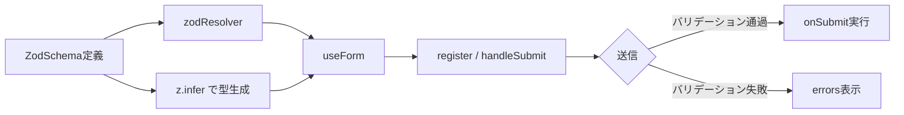

## はじめに — TypeScriptの型だけでは不十分な理由

TypeScriptの静的型チェックは、コンパイル時に型の誤りを検出する強力な仕組みです。しかし、ランタイムで外部からやってくるデータに対しては無力です。

たとえば、外部APIのレスポンスを `fetch` で受け取る場合を考えてみましょう。

```typescript
// NG: any を使うと型安全が完全に崩壊する
const response = await fetch('/api/user');
const data = await response.json(); // any 型

// OK に見えるが、実際には型チェックされていない
const user = data as User;
console.log(user.name.toUpperCase()); // nameが null だったら？
```

`as User` のキャストは TypeScript コンパイラを黙らせるだけで、ランタイムでの型保証はゼロです。APIのレスポンス形式が変わった瞬間、予期せぬ実行時エラーが発生します。

この問題を根本から解決するのが [Zod](https://zod.dev/) です。Zod はランタイムでデータを検証し、その結果を TypeScript の型として扱えるようにするバリデーションライブラリです。

本記事では、Zod を使った以下の3つの実践的なユースケースを解説します。

- APIレスポンスのランタイムバリデーション
- React Hook Form との連携によるフォームバリデーション
- 環境変数の起動時バリデーション

---

## Zod の基本スキーマ定義

まずインストールから始めましょう。

```bash
npm install zod
# または
pnpm add zod
```

### プリミティブ型

```typescript
import { z } from 'zod';

const nameSchema = z.string();
const ageSchema = z.number();
const activeSchema = z.boolean();

// バリデーション
nameSchema.parse('Naoya');    // 'Naoya' を返す
nameSchema.parse(123);        // ZodError をスロー
```

### オブジェクトとネスト

```typescript
const UserSchema = z.object({
  id: z.number(),
  name: z.string(),
  email: z.string().email(),
  age: z.number().min(0).max(150).optional(),
  role: z.enum(['admin', 'user', 'guest']),
  createdAt: z.string().datetime(),
});

// z.infer で TypeScript 型を自動生成
type User = z.infer<typeof UserSchema>;
// {
//   id: number;
//   name: string;
//   email: string;
//   age?: number | undefined;
//   role: "admin" | "user" | "guest";
//   createdAt: string;
// }
```

`z.infer<typeof UserSchema>` が Zod の核心です。スキーマ定義から TypeScript 型を自動生成するため、型定義を2箇所に書く必要がなくなります。

### 配列とユニオン

```typescript
const TagsSchema = z.array(z.string());
const IdSchema = z.union([z.string(), z.number()]);

// ショートハンド
const StatusSchema = z.enum(['active', 'inactive', 'pending']);
type Status = z.infer<typeof StatusSchema>;
// "active" | "inactive" | "pending"
```

---

## ユースケース1: APIレスポンスのバリデーション

### parse と safeParse の違い

Zod には2種類のバリデーション実行メソッドがあります。

| メソッド | 成功時 | 失敗時 | 用途 |
|---------|--------|--------|------|
| `.parse()` | 値を返す | ZodError をスロー | 失敗が致命的な場合 |
| `.safeParse()` | `{ success: true, data }` | `{ success: false, error }` | エラーを制御したい場合 |

外部 API のレスポンスには `safeParse` を使うのが推奨です。

### 実装例

```typescript
import { z } from 'zod';

// スキーマ定義
const PostSchema = z.object({
  id: z.number(),
  title: z.string(),
  body: z.string(),
  userId: z.number(),
});

const PostsSchema = z.array(PostSchema);

// 型を自動生成
type Post = z.infer<typeof PostSchema>;

// バリデーション付きフェッチ関数
async function fetchPosts(): Promise<Post[]> {
  const response = await fetch('https://jsonplaceholder.typicode.com/posts');

  if (!response.ok) {
    throw new Error(`HTTP error: ${response.status}`);
  }

  const rawData = await response.json();

  // ランタイムバリデーション
  const result = PostsSchema.safeParse(rawData);

  if (!result.success) {
    // エラー詳細を構造化して取得
    console.error('Validation failed:', result.error.issues);
    throw new Error('API response validation failed');
  }

  // result.data は Post[] 型として安全に使える
  return result.data;
}
```

### Next.js App Router での活用

```typescript
// app/posts/page.tsx
import { z } from 'zod';

const PostSchema = z.object({
  id: z.number(),
  title: z.string(),
  excerpt: z.string(),
  publishedAt: z.string().datetime(),
  author: z.object({
    name: z.string(),
    avatarUrl: z.string().url(),
  }),
});

type Post = z.infer<typeof PostSchema>;

async function getPosts(): Promise<Post[]> {
  const res = await fetch(`${process.env.API_BASE_URL}/posts`, {
    next: { revalidate: 60 },
  });

  const json = await res.json();
  const parsed = z.array(PostSchema).safeParse(json.data);

  if (!parsed.success) {
    throw new Error('Invalid API response');
  }

  return parsed.data;
}
```

---

## ユースケース2: React Hook Form × Zod

React Hook Form と Zod を組み合わせると、スキーマ1つでバリデーションルールと TypeScript 型を同時に管理できます。

### セットアップ

```bash
npm install react-hook-form @hookform/resolvers zod
```

### バリデーションフロー



### 実装例

```typescript
import { useForm } from 'react-hook-form';
import { zodResolver } from '@hookform/resolvers/zod';
import { z } from 'zod';

// スキーマ定義（バリデーションルールと型を同時に定義）
const SignUpSchema = z
  .object({
    name: z
      .string()
      .min(1, '名前は必須です')
      .max(50, '名前は50文字以内で入力してください'),
    email: z
      .string()
      .min(1, 'メールアドレスは必須です')
      .email('有効なメールアドレスを入力してください'),
    password: z
      .string()
      .min(8, 'パスワードは8文字以上で入力してください')
      .regex(
        /^(?=.*[A-Za-z])(?=.*\d)/,
        'パスワードは英字と数字を含む必要があります'
      ),
    confirmPassword: z.string().min(1, '確認用パスワードは必須です'),
  })
  .refine((data) => data.password === data.confirmPassword, {
    message: 'パスワードが一致しません',
    path: ['confirmPassword'],
  });

// フォームの型を自動生成
type SignUpFormData = z.infer<typeof SignUpSchema>;

export function SignUpForm() {
  const {
    register,
    handleSubmit,
    formState: { errors, isSubmitting },
  } = useForm<SignUpFormData>({
    resolver: zodResolver(SignUpSchema),
  });

  const onSubmit = async (data: SignUpFormData) => {
    // data は SignUpFormData 型として型安全
    await registerUser(data);
  };

  return (
    <form onSubmit={handleSubmit(onSubmit)}>
      <div>
        <label htmlFor="name">名前</label>
        <input id="name" {...register('name')} />
        {errors.name && <p role="alert">{errors.name.message}</p>}
      </div>

      <div>
        <label htmlFor="email">メールアドレス</label>
        <input id="email" type="email" {...register('email')} />
        {errors.email && <p role="alert">{errors.email.message}</p>}
      </div>

      <div>
        <label htmlFor="password">パスワード</label>
        <input id="password" type="password" {...register('password')} />
        {errors.password && <p role="alert">{errors.password.message}</p>}
      </div>

      <div>
        <label htmlFor="confirmPassword">パスワード（確認）</label>
        <input
          id="confirmPassword"
          type="password"
          {...register('confirmPassword')}
        />
        {errors.confirmPassword && (
          <p role="alert">{errors.confirmPassword.message}</p>
        )}
      </div>

      <button type="submit" disabled={isSubmitting}>
        {isSubmitting ? '登録中...' : '登録する'}
      </button>
    </form>
  );
}
```

### shadcn/ui との組み合わせ

```typescript
import {
  Form,
  FormControl,
  FormField,
  FormItem,
  FormLabel,
  FormMessage,
} from '@/components/ui/form';
import { Input } from '@/components/ui/input';
import { Button } from '@/components/ui/button';

export function ContactForm() {
  const form = useForm<SignUpFormData>({
    resolver: zodResolver(SignUpSchema),
    defaultValues: {
      name: '',
      email: '',
      password: '',
      confirmPassword: '',
    },
  });

  return (
    <Form {...form}>
      <form onSubmit={form.handleSubmit(onSubmit)}>
        <FormField
          control={form.control}
          name="email"
          render={({ field }) => (
            <FormItem>
              <FormLabel>メールアドレス</FormLabel>
              <FormControl>
                <Input type="email" {...field} />
              </FormControl>
              <FormMessage />
            </FormItem>
          )}
        />
        <Button type="submit">送信</Button>
      </form>
    </Form>
  );
}
```

---

## ユースケース3: 環境変数のバリデーション

### 問題: process.env はすべて `string | undefined`

TypeScript では `process.env.API_KEY` の型は `string | undefined` です。必要な変数が設定されていなくても、コンパイル時には検出できません。よくある問題パターンを見てみましょう。

```typescript
// NG: 起動時に検証していないと、実行時に突然エラーが発生する
const apiKey = process.env.API_KEY;
// apiKey の型は string | undefined

// undefined チェックを毎回書くのは非現実的
const client = new SomeClient(apiKey!); // Non-null assertion でごまかす
```

### Zod で起動時に一括バリデーション

```typescript
// lib/env.ts
import { z } from 'zod';

const EnvSchema = z.object({
  // サーバーサイド専用
  DATABASE_URL: z.string().url('DATABASE_URL は有効なURLである必要があります'),
  API_SECRET_KEY: z.string().min(32, 'API_SECRET_KEY は32文字以上が必要です'),

  // 外部API
  STRIPE_SECRET_KEY: z.string().startsWith('sk_'),
  SENDGRID_API_KEY: z.string().startsWith('SG.'),

  // クライアントサイドでも使用可能（NEXT_PUBLIC_ プレフィックス）
  NEXT_PUBLIC_API_BASE_URL: z.string().url(),
  NEXT_PUBLIC_APP_ENV: z
    .enum(['development', 'staging', 'production'])
    .default('development'),

  // オプショナル
  REDIS_URL: z.string().url().optional(),
  LOG_LEVEL: z.enum(['debug', 'info', 'warn', 'error']).default('info'),
});

// 型を自動生成
type Env = z.infer<typeof EnvSchema>;

function parseEnv(): Env {
  const result = EnvSchema.safeParse(process.env);

  if (!result.success) {
    console.error('環境変数の設定が不正です:');
    result.error.issues.forEach((issue) => {
      console.error(`  ${issue.path.join('.')}: ${issue.message}`);
    });
    // 起動を中止する
    process.exit(1);
  }

  return result.data;
}

// アプリ起動時に一度だけ検証・エクスポート
export const env = parseEnv();
```

アプリ全体で `env` オブジェクトを使うことで、型安全な環境変数アクセスが実現します。

```typescript
// 使用例
import { env } from '@/lib/env';

// env.DATABASE_URL は string 型（undefined の可能性なし）
const client = new DatabaseClient(env.DATABASE_URL);

// env.NEXT_PUBLIC_APP_ENV は "development" | "staging" | "production" 型
if (env.NEXT_PUBLIC_APP_ENV === 'production') {
  enableAnalytics();
}
```

---

## カスタムバリデーション（refine / superRefine）

### refine: 単一フィールドのカスタムルール

組み込みのバリデーターでは対応できないケースに `refine` を使います。

```typescript
const SlugSchema = z
  .string()
  .min(1)
  .refine(
    (val) => /^[a-z0-9]+(?:-[a-z0-9]+)*$/.test(val),
    {
      message: 'スラッグは小文字英数字とハイフンのみ使用できます',
    }
  );

const PhoneSchema = z
  .string()
  .refine(
    (val) => /^0\d{9,10}$/.test(val.replace(/-/g, '')),
    {
      message: '有効な日本の電話番号を入力してください',
    }
  );

// 非同期バリデーション（DBでの重複チェックなど）
const UniqueEmailSchema = z.string().email().refine(
  async (email) => {
    const exists = await checkEmailExists(email);
    return !exists;
  },
  { message: 'このメールアドレスはすでに登録されています' }
);
```

### superRefine: クロスフィールドバリデーション

複数フィールドをまたぐバリデーション（日付の前後関係、パスワード確認など）には `superRefine` が適しています。

```typescript
const DateRangeSchema = z
  .object({
    startDate: z.string().datetime(),
    endDate: z.string().datetime(),
    maxDays: z.number().default(90),
  })
  .superRefine((data, ctx) => {
    const start = new Date(data.startDate);
    const end = new Date(data.endDate);

    if (end <= start) {
      ctx.addIssue({
        code: z.ZodIssueCode.custom,
        message: '終了日は開始日より後の日付を指定してください',
        path: ['endDate'],
      });
    }

    const diffDays = (end.getTime() - start.getTime()) / (1000 * 60 * 60 * 24);
    if (diffDays > data.maxDays) {
      ctx.addIssue({
        code: z.ZodIssueCode.custom,
        message: `期間は${data.maxDays}日以内で指定してください`,
        path: ['endDate'],
      });
    }
  });
```

---

## エラーハンドリングパターン

### ZodError の構造

`safeParse` が失敗した場合、`error.issues` にフィールドごとのエラー情報が格納されます。

```typescript
const result = UserSchema.safeParse({
  id: 'not-a-number',
  name: '',
  email: 'invalid-email',
});

if (!result.success) {
  result.error.issues.forEach((issue) => {
    console.log(issue.path);    // ['id']
    console.log(issue.code);    // 'invalid_type'
    console.log(issue.message); // 'Expected number, received string'
  });
}
```

### フラットなエラーオブジェクトに変換

React のフォームや API レスポンスで扱いやすい形式に変換できます。

```typescript
function formatZodError(error: z.ZodError): Record<string, string> {
  return error.issues.reduce(
    (acc, issue) => {
      const key = issue.path.join('.');
      acc[key] = issue.message;
      return acc;
    },
    {} as Record<string, string>
  );
}

// 使用例
const result = UserSchema.safeParse(rawData);
if (!result.success) {
  const errors = formatZodError(result.error);
  // { 'id': 'Expected number, received string', 'email': 'Invalid email' }
  return Response.json({ errors }, { status: 422 });
}
```

### Next.js API Route での活用

```typescript
// app/api/users/route.ts
import { z } from 'zod';
import { NextRequest, NextResponse } from 'next/server';

const CreateUserSchema = z.object({
  name: z.string().min(1).max(100),
  email: z.string().email(),
  role: z.enum(['admin', 'user']).default('user'),
});

export async function POST(request: NextRequest) {
  const body = await request.json();

  const result = CreateUserSchema.safeParse(body);

  if (!result.success) {
    return NextResponse.json(
      {
        error: 'Validation failed',
        issues: result.error.issues.map((issue) => ({
          field: issue.path.join('.'),
          message: issue.message,
        })),
      },
      { status: 422 }
    );
  }

  // result.data は型安全
  const user = await createUser(result.data);
  return NextResponse.json(user, { status: 201 });
}
```

---

## まとめ — 型定義の二重管理をなくす

Zod を導入することで得られる最大のメリットは「型定義の二重管理からの解放」です。

| 従来の課題 | Zod による解決 |
|-----------|--------------|
| `interface User {}` と型ガード関数を別々に管理 | `UserSchema` 1つで型とバリデーションを一元管理 |
| API レスポンスへの `as Type` キャスト | `safeParse` によるランタイム検証 |
| フォームの型とバリデーションルールが分散 | `zodResolver` でスキーマを共有 |
| 環境変数の `undefined` チェックが散乱 | 起動時一括検証で型安全な `env` オブジェクト |

本記事で紹介した3つのユースケースを整理します。

1. APIレスポンスには `safeParse` でランタイム検証し、`z.infer` で型を自動生成する
2. React Hook Form には `zodResolver` を使い、スキーマ1つでバリデーションと型を共有する
3. 環境変数はアプリ起動時に `parseEnv` で一括検証し、型安全な `env` オブジェクトをエクスポートする

TypeScript の静的型チェックと Zod のランタイムバリデーションを組み合わせることで、コンパイル時からランタイムまで一貫した型安全を実現できます。ぜひ既存プロジェクトに段階的に導入してみてください。
