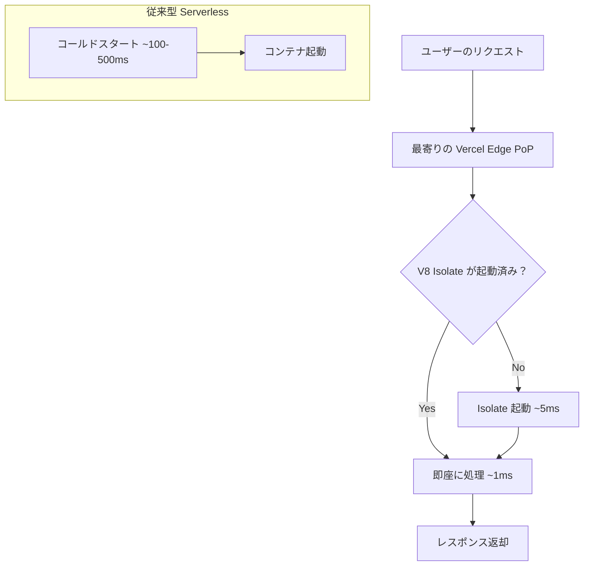
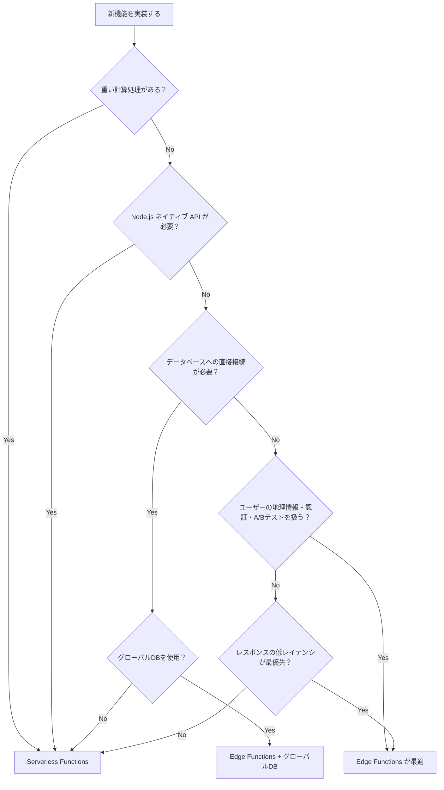

## はじめに

Webアプリケーションのパフォーマンス改善において、レイテンシの削減は永遠の課題です。従来のサーバーレス関数は「東京リージョンにデプロイすれば日本ユーザーへのレスポンスが速くなる」という考え方でしたが、欧米ユーザーからは依然として高レイテンシが問題になります。

Vercel Edge Functions はこの問題を根本から解決するアプローチです。世界中に分散された Vercel のエッジネットワーク上でコードを実行することで、ユーザーの物理的な場所に最も近いサーバーからレスポンスを返せます。コールドスタートはほぼゼロ、レイテンシは従来の1/6以下——これが Edge Functions のもたらす変革です。

本記事では Edge Functions の内部アーキテクチャから実践的なコードパターンまでを網羅します。A/Bテスト、JWT認証、ジオルーティングといった実際のユースケースを TypeScript のコードとともに解説します。

---

## 1. アーキテクチャと制約

### V8 Isolate とは何か

Edge Functions は Node.js コンテナではなく、V8 Isolate という軽量な実行環境上で動作します。V8 は Chrome ブラウザと同じ JavaScript エンジンです。Isolate はその中で独立した JavaScript の実行コンテキストを作り出します。

コンテナ型のサーバーレス関数（AWS Lambda など）は1インスタンスあたり約 10MB のメモリを消費しますが、V8 Isolate は約 10KB——1,000倍の軽量化です。この差がコールドスタート時間の劇的な短縮につながっています。



### Edge Runtime が提供する API

Edge Runtime は Web 標準 API のサブセットを提供します。Node.js の `fs`、`path`、`child_process` といった API は使用できません。利用可能な主要 API は以下のとおりです。

| カテゴリ | 利用可能な API |
|---------|--------------|
| ネットワーク | `fetch`, `Request`, `Response`, `Headers`, `FormData` |
| エンコーディング | `TextEncoder`, `TextDecoder`, `atob`, `btoa` |
| ストリーム | `ReadableStream`, `WritableStream`, `TransformStream` |
| 暗号 | `crypto`, `SubtleCrypto`, `CryptoKey` |
| その他 | `URL`, `URLSearchParams`, `setTimeout`, `structuredClone` |

Node.js モジュールの中では `async_hooks`、`events`、`buffer`、`assert`、`util` が限定的に利用できます。

### 主要な制約事項

Edge Runtime にはいくつかの重要な制約があります。設計段階で把握しておくことが重要です。

| 制約 | 内容 |
|------|------|
| バンドルサイズ | Hobby: 1MB、Pro: 2MB、Enterprise: 4MB（gzip後） |
| 最大実行時間 | レスポンス送信開始まで 25 秒 |
| ストリーミング | 最大 300 秒まで継続可能 |
| TCP/UDP | 直接接続は不可（`fetch` 経由のみ） |
| 動的コード実行 | `eval`、`new Function()` は使用禁止 |
| ファイルシステム | 読み書き不可 |
| リクエストボディ | 最大 4MB |

---

## 2. Edge Functions vs Serverless Functions

### パフォーマンス比較

実際の測定データによると、Edge Functions はウォームスタート時に平均 167ms（対して Serverless は 287ms）、コールドスタート時は 9倍以上の速度差があります。グローバルユーザーへのレイテンシは 100-300ms から 10-50ms へと削減されます。



### 使い分けの基準

Edge Functions が適しているケースは、認証トークンの検証、リクエストのルーティング制御、ジオロケーションベースのコンテンツ配信、A/Bテストのバリアント割り当てなど、軽量かつ高頻度に実行される処理です。

Serverless Functions（Node.js ランタイム）が適しているのは、外部データベースへの複数クエリ、画像処理や PDF 生成、重い npm パッケージの使用、ファイルシステムアクセスが必要なケースです。

---

## 3. 基本実装

### Hello World

App Router での最もシンプルな Edge Function です。

```typescript
// app/api/hello/route.ts
export const runtime = 'edge';

export function GET(request: Request) {
  return new Response(
    JSON.stringify({ message: 'Hello from the Edge!', region: process.env.VERCEL_REGION }),
    {
      status: 200,
      headers: { 'Content-Type': 'application/json' },
    }
  );
}
```

Pages Router を使う場合は以下のように config オブジェクトでランタイムを指定します。

```typescript
// pages/api/hello.ts
import { NextResponse } from 'next/server';
import type { NextRequest } from 'next/server';

export const config = {
  runtime: 'edge',
};

export default function handler(request: NextRequest) {
  return NextResponse.json({
    message: 'Hello from the Edge!',
    region: process.env.VERCEL_REGION,
  });
}
```

### リクエストパラメータの操作

URL パラメータ、ヘッダー、クエリストリングを扱う典型的なパターンです。

```typescript
// app/api/user/route.ts
export const runtime = 'edge';

export async function GET(request: Request) {
  const { searchParams } = new URL(request.url);
  const userId = searchParams.get('id');
  const userAgent = request.headers.get('user-agent') ?? 'unknown';
  const country = request.headers.get('x-vercel-ip-country') ?? 'unknown';

  if (!userId) {
    return new Response(JSON.stringify({ error: 'id is required' }), {
      status: 400,
      headers: { 'Content-Type': 'application/json' },
    });
  }

  return new Response(
    JSON.stringify({ userId, userAgent, country }),
    {
      status: 200,
      headers: {
        'Content-Type': 'application/json',
        'Cache-Control': 'no-store',
      },
    }
  );
}

export async function POST(request: Request) {
  const body = await request.json();

  // バリデーション
  if (!body.name || typeof body.name !== 'string') {
    return new Response(JSON.stringify({ error: 'name is required' }), {
      status: 422,
      headers: { 'Content-Type': 'application/json' },
    });
  }

  return new Response(
    JSON.stringify({ created: true, name: body.name }),
    {
      status: 201,
      headers: { 'Content-Type': 'application/json' },
    }
  );
}
```

---

## 4. 実践パターン 1: A/Bテスト実装

Edge Middleware は静的コンテンツに対して動的なルーティングを追加できます。A/Bテストの実装は Edge Functions の最も強力なユースケースの1つです。クライアントサイドで処理する従来の方法（サードパーティスクリプトの読み込み）と比較して、フリッカー（ちらつき）が発生せず、パフォーマンスも向上します。

```typescript
// middleware.ts
import { NextResponse } from 'next/server';
import type { NextRequest } from 'next/server';

// A/Bテストの設定
const AB_TEST_COOKIE = 'ab-variant';
const VARIANTS = ['control', 'experiment'] as const;
type Variant = (typeof VARIANTS)[number];

// バリアントを均等にランダム割り当て
function assignVariant(): Variant {
  return Math.random() < 0.5 ? 'control' : 'experiment';
}

export function middleware(request: NextRequest) {
  const pathname = request.nextUrl.pathname;

  // A/Bテスト対象のパスのみ処理
  if (!pathname.startsWith('/landing')) {
    return NextResponse.next();
  }

  // 既存のクッキーからバリアントを取得
  const existingVariant = request.cookies.get(AB_TEST_COOKIE)?.value as Variant | undefined;
  const variant = existingVariant ?? assignVariant();

  // バリアントに応じてURLを書き換え
  const variantPath = variant === 'experiment'
    ? pathname.replace('/landing', '/landing-experiment')
    : pathname;

  const response = NextResponse.rewrite(new URL(variantPath, request.url));

  // クッキーが未設定の場合は設定する（30日間）
  if (!existingVariant) {
    response.cookies.set(AB_TEST_COOKIE, variant, {
      maxAge: 60 * 60 * 24 * 30,
      httpOnly: true,
      sameSite: 'lax',
    });
  }

  // バリアント情報をヘッダーに追加（分析用）
  response.headers.set('x-ab-variant', variant);

  return response;
}

export const config = {
  matcher: ['/landing/:path*'],
};
```

Edge Config を使うとリアルタイムでトラフィック比率を変更できます。再デプロイ不要でフィーチャーフラグを制御できるため、実験の素早い開始・停止が可能です。

```typescript
// middleware.ts（Edge Config 連携版）
import { NextResponse } from 'next/server';
import type { NextRequest } from 'next/server';
import { get } from '@vercel/edge-config';

interface ABTestConfig {
  enabled: boolean;
  trafficRatio: number; // 0.0 〜 1.0
}

export async function middleware(request: NextRequest) {
  const pathname = request.nextUrl.pathname;

  if (!pathname.startsWith('/landing')) {
    return NextResponse.next();
  }

  // Edge Config からリアルタイムで設定を読み取る（レイテンシ < 1ms）
  const abConfig = await get<ABTestConfig>('ab-test-landing');

  if (!abConfig?.enabled) {
    return NextResponse.next();
  }

  const existingVariant = request.cookies.get('ab-variant')?.value;
  const variant = existingVariant ?? (Math.random() < abConfig.trafficRatio ? 'experiment' : 'control');

  const variantPath = variant === 'experiment'
    ? pathname.replace('/landing', '/landing-experiment')
    : pathname;

  const response = NextResponse.rewrite(new URL(variantPath, request.url));

  if (!existingVariant) {
    response.cookies.set('ab-variant', variant, {
      maxAge: 60 * 60 * 24 * 30,
      httpOnly: true,
    });
  }

  return response;
}
```

---

## 5. 実践パターン 2: 認証・認可（JWT検証）

JWT の検証は Edge Functions の典型的なユースケースです。Web Crypto API（`SubtleCrypto`）が使えるため、外部ライブラリなしで署名検証が実装できます。

```typescript
// lib/jwt.ts
export interface JWTPayload {
  sub: string;
  email: string;
  role: 'user' | 'admin';
  iat: number;
  exp: number;
}

// Base64URL デコード
function base64UrlDecode(str: string): Uint8Array {
  const base64 = str.replace(/-/g, '+').replace(/_/g, '/');
  const padded = base64 + '='.repeat((4 - (base64.length % 4)) % 4);
  const binary = atob(padded);
  return new Uint8Array(binary.split('').map((c) => c.charCodeAt(0)));
}

// HMAC-SHA256 で JWT を検証
export async function verifyJWT(token: string, secret: string): Promise<JWTPayload | null> {
  try {
    const parts = token.split('.');
    if (parts.length !== 3) return null;

    const [headerB64, payloadB64, signatureB64] = parts;

    // 署名検証
    const encoder = new TextEncoder();
    const key = await crypto.subtle.importKey(
      'raw',
      encoder.encode(secret),
      { name: 'HMAC', hash: 'SHA-256' },
      false,
      ['verify']
    );

    const data = encoder.encode(`${headerB64}.${payloadB64}`);
    const signature = base64UrlDecode(signatureB64);

    const isValid = await crypto.subtle.verify('HMAC', key, signature, data);
    if (!isValid) return null;

    // ペイロードをデコード
    const payload = JSON.parse(
      new TextDecoder().decode(base64UrlDecode(payloadB64))
    ) as JWTPayload;

    // 有効期限チェック
    if (payload.exp < Math.floor(Date.now() / 1000)) return null;

    return payload;
  } catch {
    return null;
  }
}
```

```typescript
// middleware.ts
import { NextResponse } from 'next/server';
import type { NextRequest } from 'next/server';
import { verifyJWT } from './lib/jwt';

// 認証が必要なパスのパターン
const PROTECTED_PATHS = ['/dashboard', '/api/protected', '/settings'];

function isProtectedPath(pathname: string): boolean {
  return PROTECTED_PATHS.some((path) => pathname.startsWith(path));
}

export async function middleware(request: NextRequest) {
  const { pathname } = request.nextUrl;

  if (!isProtectedPath(pathname)) {
    return NextResponse.next();
  }

  // Authorization ヘッダーまたはクッキーからトークンを取得
  const token =
    request.headers.get('authorization')?.replace('Bearer ', '') ??
    request.cookies.get('auth-token')?.value;

  if (!token) {
    // APIリクエストは 401、ページリクエストはログインページへリダイレクト
    if (pathname.startsWith('/api/')) {
      return new Response(JSON.stringify({ error: 'Unauthorized' }), {
        status: 401,
        headers: { 'Content-Type': 'application/json' },
      });
    }
    return NextResponse.redirect(new URL('/login', request.url));
  }

  const payload = await verifyJWT(token, process.env.JWT_SECRET!);

  if (!payload) {
    if (pathname.startsWith('/api/')) {
      return new Response(JSON.stringify({ error: 'Invalid token' }), {
        status: 401,
        headers: { 'Content-Type': 'application/json' },
      });
    }
    const redirectUrl = new URL('/login', request.url);
    redirectUrl.searchParams.set('reason', 'invalid_token');
    return NextResponse.redirect(redirectUrl);
  }

  // 管理者専用パスのロールチェック
  if (pathname.startsWith('/admin') && payload.role !== 'admin') {
    return new Response(JSON.stringify({ error: 'Forbidden' }), {
      status: 403,
      headers: { 'Content-Type': 'application/json' },
    });
  }

  // ユーザー情報をヘッダーに追加して次のハンドラーへ
  const requestHeaders = new Headers(request.headers);
  requestHeaders.set('x-user-id', payload.sub);
  requestHeaders.set('x-user-email', payload.email);
  requestHeaders.set('x-user-role', payload.role);

  return NextResponse.next({ request: { headers: requestHeaders } });
}

export const config = {
  matcher: ['/dashboard/:path*', '/api/protected/:path*', '/settings/:path*', '/admin/:path*'],
};
```

---

## 6. 実践パターン 3: ジオロケーションベースのルーティング

Vercel はリクエストヘッダーに地理情報を自動で付与します。`x-vercel-ip-country` や `x-vercel-ip-city` などのヘッダーを使ってコンテンツのルーティングやパーソナライゼーションが実現できます。

```typescript
// middleware.ts
import { NextResponse } from 'next/server';
import type { NextRequest } from 'next/server';

// 国コードとロケールのマッピング
const COUNTRY_LOCALE_MAP: Record<string, string> = {
  JP: 'ja',
  US: 'en',
  GB: 'en',
  DE: 'de',
  FR: 'fr',
  KR: 'ko',
  CN: 'zh',
  TW: 'zh-TW',
} as const;

// 国コードとリダイレクト先のマッピング（地域限定コンテンツ）
const REGION_RESTRICTED: Record<string, string> = {
  CN: '/region-unavailable',
} as const;

export function middleware(request: NextRequest) {
  const { pathname } = request.nextUrl;

  // 静的アセットや既存のロケールパスはスキップ
  if (
    pathname.startsWith('/_next') ||
    pathname.startsWith('/static') ||
    /^\/[a-z]{2}(-[A-Z]{2})?\//.test(pathname)
  ) {
    return NextResponse.next();
  }

  // Vercel が自動設定するジオロケーションヘッダーを取得
  const country = request.headers.get('x-vercel-ip-country') ?? 'US';
  const region = request.headers.get('x-vercel-ip-country-region') ?? '';
  const city = request.headers.get('x-vercel-ip-city') ?? '';

  // 地域制限チェック
  if (country in REGION_RESTRICTED) {
    return NextResponse.redirect(new URL(REGION_RESTRICTED[country], request.url));
  }

  // ロケール検出とリダイレクト
  const acceptLanguage = request.headers.get('accept-language') ?? '';
  const preferredLang = acceptLanguage.split(',')[0]?.split('-')[0]?.toLowerCase();

  const locale = COUNTRY_LOCALE_MAP[country] ?? preferredLang ?? 'en';

  // ルートパスの場合、ロケールパスにリダイレクト
  if (pathname === '/') {
    return NextResponse.redirect(new URL(`/${locale}`, request.url));
  }

  // リライトでロケールを適用
  const response = NextResponse.rewrite(new URL(`/${locale}${pathname}`, request.url));

  // デバッグ用ヘッダー（本番では削除推奨）
  response.headers.set('x-geo-country', country);
  response.headers.set('x-geo-region', region);
  response.headers.set('x-geo-city', city);
  response.headers.set('x-resolved-locale', locale);

  return response;
}

export const config = {
  matcher: ['/((?!api|_next/static|_next/image|favicon.ico).*)'],
};
```

### Vercel が提供するジオロケーションヘッダー一覧

| ヘッダー | 内容 | 例 |
|---------|------|---|
| `x-vercel-ip-country` | 国コード（ISO 3166-1） | `JP` |
| `x-vercel-ip-country-region` | 地域コード | `13`（東京都） |
| `x-vercel-ip-city` | 都市名（URLエンコード済み） | `Tokyo` |
| `x-vercel-ip-latitude` | 緯度 | `35.6895` |
| `x-vercel-ip-longitude` | 経度 | `139.6917` |
| `x-vercel-ip-timezone` | タイムゾーン | `Asia/Tokyo` |

---

## 7. Edge Middleware 実装（Next.js middleware.ts）

### Middleware の配置と matcher

`middleware.ts` はプロジェクトルートに配置します。`matcher` 設定で処理対象のパスを絞り込むことがパフォーマンス上重要です。不要なパスに対して Middleware が実行されるとオーバーヘッドが増えます。

```typescript
// middleware.ts
import { NextResponse } from 'next/server';
import type { NextRequest } from 'next/server';

export function middleware(request: NextRequest) {
  const response = NextResponse.next();

  // セキュリティヘッダーの追加
  response.headers.set('X-Frame-Options', 'DENY');
  response.headers.set('X-Content-Type-Options', 'nosniff');
  response.headers.set('Referrer-Policy', 'strict-origin-when-cross-origin');
  response.headers.set(
    'Content-Security-Policy',
    "default-src 'self'; script-src 'self' 'unsafe-eval' 'unsafe-inline';"
  );

  return response;
}

// パス指定の書き方バリエーション
export const config = {
  matcher: [
    // 特定パス以外すべてにマッチ（_next と static を除外）
    '/((?!_next/static|_next/image|favicon.ico).*)',

    // 特定パスのみにマッチ
    // '/dashboard/:path*',
    // '/api/:path*',
  ],
};
```

### レート制限の実装（Vercel KV 連携）

Vercel KV（Redis 互換）と組み合わせることでステートフルなレート制限が実装できます。IP アドレスごとにリクエスト数をカウントし、閾値を超えた場合は 429 を返します。

```typescript
// middleware.ts
import { NextResponse } from 'next/server';
import type { NextRequest } from 'next/server';
import { kv } from '@vercel/kv';

const RATE_LIMIT = 100;    // 最大リクエスト数
const WINDOW_SEC = 60;     // ウィンドウ幅（秒）

export async function middleware(request: NextRequest) {
  // API エンドポイントのみレート制限を適用
  if (!request.nextUrl.pathname.startsWith('/api/')) {
    return NextResponse.next();
  }

  const ip = request.headers.get('x-forwarded-for')?.split(',')[0]?.trim()
    ?? request.headers.get('x-real-ip')
    ?? '127.0.0.1';

  const key = `rate-limit:${ip}`;

  try {
    // Redis の INCR + EXPIRE でアトミックにカウント
    const count = await kv.incr(key);

    if (count === 1) {
      // 初回リクエスト時にウィンドウの有効期限を設定
      await kv.expire(key, WINDOW_SEC);
    }

    const remaining = Math.max(0, RATE_LIMIT - count);
    const headers = {
      'X-RateLimit-Limit': String(RATE_LIMIT),
      'X-RateLimit-Remaining': String(remaining),
      'X-RateLimit-Reset': String(Math.floor(Date.now() / 1000) + WINDOW_SEC),
    };

    if (count > RATE_LIMIT) {
      return new Response(
        JSON.stringify({ error: 'Too Many Requests', retryAfter: WINDOW_SEC }),
        {
          status: 429,
          headers: {
            'Content-Type': 'application/json',
            'Retry-After': String(WINDOW_SEC),
            ...headers,
          },
        }
      );
    }

    const response = NextResponse.next();
    Object.entries(headers).forEach(([k, v]) => response.headers.set(k, v));
    return response;
  } catch (error) {
    // KV エラー時はフェイルオープン（リクエストを通す）
    console.error('Rate limit error:', error);
    return NextResponse.next();
  }
}

export const config = {
  matcher: ['/api/:path*'],
};
```

---

## 8. Vercel KV / Edge Config との統合

### Edge Config：設定値の超低レイテンシ読み取り

Edge Config は機能フラグやリダイレクトルールなど、「頻繁に読まれるが書き込みは少ない」データの格納に特化したグローバルキーバリューストアです。P99 で 15ms 以下、多くの場合 1ms 以下という驚異的な読み取り速度を実現します。

```typescript
// app/api/feature-flag/route.ts
import { get, getAll } from '@vercel/edge-config';

export const runtime = 'edge';

interface FeatureFlags {
  newCheckoutFlow: boolean;
  betaFeatures: string[];
  maintenanceMode: boolean;
  maintenanceMessage?: string;
}

export async function GET() {
  // 全フラグを一度に取得
  const flags = await getAll<FeatureFlags>();

  if (flags.maintenanceMode) {
    return new Response(
      JSON.stringify({
        maintenanceMode: true,
        message: flags.maintenanceMessage ?? 'メンテナンス中です',
      }),
      { status: 503, headers: { 'Content-Type': 'application/json' } }
    );
  }

  return new Response(JSON.stringify(flags), {
    status: 200,
    headers: {
      'Content-Type': 'application/json',
      'Cache-Control': 'no-store',
    },
  });
}
```

Edge Config の値は Vercel ダッシュボードまたは REST API から更新できます。更新は再デプロイなしにリアルタイムで反映されます。

```bash
# Edge Config の値を更新する（REST API 経由）
curl -X PATCH "https://api.vercel.com/v1/edge-config/{edgeConfigId}/items" \
  -H "Authorization: Bearer $VERCEL_TOKEN" \
  -H "Content-Type: application/json" \
  -d '{
    "items": [
      { "operation": "update", "key": "maintenanceMode", "value": false },
      { "operation": "update", "key": "newCheckoutFlow", "value": true }
    ]
  }'
```

### Vercel KV：セッション管理とキャッシング

Vercel KV は Redis 互換のサーバーレスキーバリューストアです。Edge Config が「設定値」向けであるのに対し、KV は「ユーザーセッション」「キャッシュ」「レート制限カウンター」のような動的データの格納に適しています。

```typescript
// app/api/session/route.ts
import { kv } from '@vercel/kv';
import { verifyJWT } from '@/lib/jwt';

export const runtime = 'edge';

interface UserSession {
  userId: string;
  email: string;
  lastSeen: number;
  preferences: {
    theme: 'light' | 'dark';
    language: string;
  };
}

export async function GET(request: Request) {
  const token = request.headers.get('authorization')?.replace('Bearer ', '');
  if (!token) {
    return new Response(JSON.stringify({ error: 'Unauthorized' }), { status: 401 });
  }

  const payload = await verifyJWT(token, process.env.JWT_SECRET!);
  if (!payload) {
    return new Response(JSON.stringify({ error: 'Invalid token' }), { status: 401 });
  }

  const sessionKey = `session:${payload.sub}`;

  // KV からセッションを取得
  let session = await kv.get<UserSession>(sessionKey);

  if (!session) {
    // セッションが存在しない場合は新規作成
    session = {
      userId: payload.sub,
      email: payload.email,
      lastSeen: Date.now(),
      preferences: { theme: 'light', language: 'ja' },
    };
  } else {
    // lastSeen を更新
    session.lastSeen = Date.now();
  }

  // セッションを 24 時間で更新
  await kv.set(sessionKey, session, { ex: 60 * 60 * 24 });

  return new Response(JSON.stringify(session), {
    status: 200,
    headers: { 'Content-Type': 'application/json' },
  });
}
```

### Edge Config vs Vercel KV の使い分け

| 特徴 | Edge Config | Vercel KV |
|------|-------------|-----------|
| 主な用途 | 機能フラグ、設定値、リダイレクトルール | セッション、キャッシュ、カウンター |
| 読み取りレイテンシ | 超低速（<1ms が多い） | 低速（数ms〜数十ms） |
| 書き込み | 低頻度向け（API or ダッシュボード） | 高頻度書き込み可 |
| サイズ制限 | 8KB/アイテム、512KB/ストア | Redis の制約に準拠 |
| データの性質 | 不変・グローバル | 可変・ユーザー固有 |

---

## 9. パフォーマンス測定とモニタリング

### Vercel Analytics と観測可能性

Vercel ダッシュボードの Observability セクションで Edge Functions の実行状況を監視できます。Functions Logs からはリアルタイムのログストリームと実行時間、リージョンごとの呼び出し数が確認できます。

```typescript
// app/api/metrics/route.ts
export const runtime = 'edge';

export async function GET(request: Request) {
  const start = performance.now();

  // 処理の実行
  const data = await fetchSomeData();

  const duration = performance.now() - start;

  const response = new Response(JSON.stringify(data), {
    status: 200,
    headers: { 'Content-Type': 'application/json' },
  });

  // カスタムメトリクスをヘッダーに追加
  response.headers.set('Server-Timing', `db;dur=${duration.toFixed(2)}`);
  response.headers.set('X-Execution-Region', process.env.VERCEL_REGION ?? 'unknown');

  return response;
}

async function fetchSomeData() {
  const res = await fetch('https://api.example.com/data', {
    // Edge Functions では fetch がネイティブにサポートされている
    next: { revalidate: 60 }, // Next.js の ISR キャッシュと連携
  });
  return res.json();
}
```

### ローカル開発での確認

Edge Runtime のローカル開発は `next dev` で直接対応しています。ただし、ローカル環境では Vercel の地理情報ヘッダーが付与されないため、テスト用のヘッダーを手動で追加する必要があります。

```typescript
// middleware.ts（開発環境向けモック）
import { NextResponse } from 'next/server';
import type { NextRequest } from 'next/server';

export function middleware(request: NextRequest) {
  const isDev = process.env.NODE_ENV === 'development';

  // 開発環境ではモックの地理情報を注入
  const requestHeaders = new Headers(request.headers);

  if (isDev) {
    requestHeaders.set('x-vercel-ip-country', request.headers.get('x-mock-country') ?? 'JP');
    requestHeaders.set('x-vercel-ip-city', 'Tokyo');
  }

  return NextResponse.next({ request: { headers: requestHeaders } });
}
```

### Fluid Compute とコスト最適化

2025年に導入された Fluid Compute モデルにより、Edge Functions は複数の同時リクエストを同じインスタンスで処理できるようになりました。Active CPU Pricing により、実際に CPU を使用した時間のみ課金されます。

I/O 待機（外部 API 呼び出しや KV 読み取りの待ち時間）は課金対象外となるため、I/O 集約型の処理では特にコスト効率が向上します。

---

## 10. まとめ

Vercel Edge Functions は、V8 Isolate による超低コールドスタートと世界中のエッジノードでの実行によって、グローバルユーザーへのレイテンシを根本から削減します。本記事で扱ったパターンを振り返ります。

| パターン | 効果 |
|---------|------|
| A/Bテスト（Edge Middleware） | クライアントサイドフリッカーの排除、Edge Config との組み合わせで再デプロイ不要のフラグ制御 |
| JWT 認証 | Web Crypto API によるゼロ依存の署名検証、全リクエストのエッジでの事前認証 |
| ジオルーティング | ユーザーの国・地域情報を使った動的ルーティング、コンテンツローカライゼーション |
| レート制限（Vercel KV） | IP 単位でのアクセス制御、Redis INCR によるアトミックなカウント |
| Edge Config 連携 | 機能フラグのリアルタイム更新、再デプロイなしの設定変更 |

一点注意すべきは、Vercel 公式ドキュメントが「Node.js ランタイムへの移行を推奨」と記載していることです。Fluid Compute の導入により Node.js ランタイムでもエッジに近い実行が可能になり、Edge Runtime の制約（Node.js API 非対応、バンドルサイズ制限）を避けられるケースが増えています。

新規実装では「まず Node.js ランタイムを検討し、レイテンシや制約の観点で Edge が明確に優れている場合に Edge を選択する」という判断基準が現実的です。Edge Middleware については引き続き認証・ルーティング・A/Bテストで有力な選択肢であり続けます。

エッジコンピューティングの活用は、単なるパフォーマンス最適化を超えて、アーキテクチャ設計の新しい選択肢となっています。本記事のパターンを参考に、プロジェクトの要件に応じた最適な実装を選択してください。
