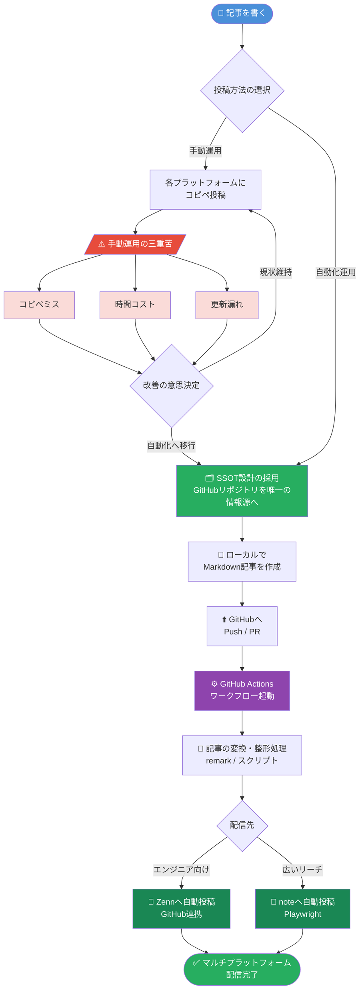

## はじめに

> 📌 **本記事の対象読者**: Git/GitHubの操作に慣れており、Node.jsの基礎知識がある方を対象としています。GitHub Actions・Playwright・remarkといったツールを扱います。

技術記事を書いても、届く読者は限られています。Zennに投稿すればエンジニアには届くが、それ以外の層には届きにくい。noteに投稿すれば広いリーチは得られるが、技術者コミュニティへの訴求力が弱い。

この問題を解決するのが**マルチプラットフォーム配信**です。

ただし、「同じ記事を2つのサイトに手動でコピペする」という運用は、ミス・時間コスト・更新漏れという三重苦を抱えています。本記事では、**ローカルで一度書いた記事をGitHub Actionsが自動でZennとnoteの両方に届ける**パイプラインを実装レベルで解説します。

概念説明だけでなく、**コピペで動くコード**と**サンプルリポジトリ**をセットで提供します。サンプルリポジトリは → [https://github.com/yourname/content-pipeline-sample](https://github.com/yourname/content-pipeline-sample)（記事公開時に更新予定）

---

## H2-1: なぜマルチプラットフォーム配信が必要か




### ZennとnoteのOーディエンス特性の違い

ZennとnoteはRE、同じ「記事投稿プラットフォーム」でありながら、集まる読者層が明確に異なります。

**Zenn**は、GitHubと連携したMarkdownベースの投稿フローからもわかるように、**エンジニア特化のプラットフォーム**です。技術記事・実装解説・ライブラリの紹介といったコンテンツとの親和性が高く、読者の多くが「手を動かすことを前提とした技術情報」を求めています。

**note**は、クリエイター全般を対象とした**広いリーチを持つプラットフォーム**です。技術記事だけでなく、キャリア・思考・エッセイといった多様なコンテンツが共存しており、エンジニア以外の読者にも訴求できます。また、月額課金やサポート機能によるマネタイズが整っている点も特徴です。

同じ技術記事でも、「実装の詳細を知りたいエンジニア」はZennで、「技術トレンドを広く知りたいビジネス層」はnoteで読む、という棲み分けが成立しています。両プラットフォームを活用することで、**一つのコンテンツが届く読者を最大化**できます。

### 二重管理の課題と「一元管理」の考え方

両プラットフォームへの投稿を手動で行う場合、以下の問題が発生します。

- **コピペミス**: Markdown記法の細部がプラットフォーム間で異なるため、そのまま貼り付けると表示が崩れる
- **時間コスト**: 記事1本あたり、変換・確認・投稿の作業で数十分程度の追加作業が発生する
- **更新漏れ**: 片方の記事を修正したが、もう片方は古いまま放置されるケースが頻発する

これらを解決する設計思想が**Single Source of Truth（SSOT）**です。「唯一の正となる情報源を一か所に定め、そこから各出力先に自動的に配信する」という考え方です。

本記事では、**GitHubリポジトリ上のMarkdownファイル**をSSOTとして扱います。記事の執筆・修正はすべてここで行い、GitHub Actionsがトリガーとなって各プラットフォームへの配信を自動実行します。

---

## H2-2: 本記事で実装するシステム概要

```mermaid
sequenceDiagram
    participant Author as 執筆者
    participant Repo as GitHubリポジトリ
    participant Actions as GitHub Actions
    participant Zenn as Zenn
    participant Note as note

    Author->>Repo: git push（記事ファイル）
    Repo->>Actions: プッシュイベント検知・ワークフロー起動

    rect rgb(220, 235, 255)
        Note over Actions: textlint校正フェーズ
        Actions->>Actions: textlintによる文章校正チェック
        alt 校正エラーあり
            Actions-->>Author: エラー通知・ワークフロー停止
        else 校正通過
            Actions->>Actions: 校正完了
        end
    end

    rect rgb(220, 255, 230)
        Note over Actions: 変換スクリプト実行フェーズ
        Actions->>Actions: Markdownをnote用フォーマットに変換
        Actions->>Actions: 画像・リンクの最適化処理
    end

    rect rgb(255, 245, 210)
        Note over Actions,Zenn: Zenn自動反映フェーズ
        Actions->>Zenn: GitHub連携による記事の自動反映
        Zenn-->>Actions: 反映完了レスポンス
    end

    rect rgb(255, 225, 225)
        Note over Actions,Note: note自動投稿フェーズ
        Actions->>Note: Playwrightで自動ログイン
        Actions->>Note: 変換済み記事を投稿
        Note-->>Actions: 投稿完了レスポンス
    end

    Actions-->>Author: デプロイ完了通知（Zenn・note両方）
```


実装するパイプラインの全体像は以下のとおりです。

```
【アーキテクチャ全体図】

  ローカル環境
  ┌─────────────────────────────┐
  │  articles/my-article.md     │
  │  （frontmatter + Markdown）  │
  └──────────────┬──────────────┘
                 │ git push
                 ▼
  ┌─────────────────────────────┐
  │        GitHub Repository    │
  │                             │
  │  ┌─── GitHub Actions ────┐  │
  │  │ 1. textlint（校正）    │  │
  │  │ 2. 変換スクリプト実行  │  │
  │  │ 3. デプロイ           │  │
  │  └───────────────────────┘  │
  └──────┬──────────────┬───────┘
         │              │
         ▼              ▼
  ┌────────────┐  ┌──────────────────┐
  │    Zenn    │  │  note            │
  │ （GitHub   │  │ （Playwright     │
  │  連携で    │  │  ブラウザ自動化） │
  │  自動反映）│  └──────────────────┘
  └────────────┘
```

---

## H2-3: プラットフォーム仕様の差異を把握する

### Zennの技術仕様

**GitHub連携の仕組み**

ZennはGitHubリポジトリと連携することで、`articles/`ディレクトリ以下のMarkdownファイルを自動的に記事として公開します。`git push`するだけでデプロイが完了するため、CI/CDパイプラインとの相性が抜群です。

リポジトリ構造は以下が標準です。

```
zenn-content/
├── articles/
│   └── my-first-article.md
├── books/
└── .github/
```

**Zenn独自のMarkdown記法**

Zennは標準Markdownに加え、独自の記法をサポートしています。

```markdown
:::message
これはメッセージブロックです
:::

:::message alert
これは警告ブロックです
:::

:::details 折りたたみタイトル
折りたたまれる内容
:::
```

**frontmatterフィールド定義**

```yaml
---
title: "記事タイトル"
emoji: "📝"
type: "tech"        # tech or idea
topics: ["python", "github-actions"]
published: true
---
```

### noteの技術仕様

**公式APIの現状**

> ⚠️ **本情報は筆者確認時点（2024年時点）のものです。APIの提供状況は変化する可能性があります。最新情報は[note公式ドキュメント](https://note.com/)を参照してください。**

noteは本記事執筆時点において、**一般向けの公式投稿APIを公開していません**。読み取り系のAPIは一部存在しますが、記事の作成・更新に使える書き込みAPIは提供されていない状況です。

このため、noteへの自動投稿を実現するには、**ブラウザ操作の自動化（Playwright等）** を使う方法が現実的な選択肢となります。

ただし、**Playwright方式には以下の制約・リスクがある点に注意が必要です**。

- noteはログイン・投稿フローにBot対策（reCAPTCHA等）を実装しており、本番運用での安定動作が保証されない
- noteのエディタUIが変更された際に、Playwrightが参照するセレクタが壊れる可能性がある（定期的な動作確認と更新が必要）
- セッション切れによる認証失敗が発生しうる

上記リスクを踏まえ、以下の代替手段も選択肢として検討してください。

| 方式 | 安定性 | 実装コスト | 備考 |
|------|--------|-----------|------|
| Playwright自動投稿 | △（Bot対策リスクあり） | 高 | 本記事で解説 |
| 手動投稿サポートツール化 | ◎ | 低 | 変換・クリップボード貼り付けまでを自動化し、投稿操作のみ手動で行う |
| note公式API（将来） | ◎（提供された場合） | 低 | 現時点では未提供 |

**エディタの特性**

noteのエディタはリッチテキストベースです。Markdownを直接貼り付けることはできますが、コードブロックのシンタックスハイライトや独自記法（Zennの`:::message`等）はそのままでは表示されません。HTML変換を挟む必要があります。

**画像・埋め込みの扱い**

画像は外部URLの参照が可能ですが、``タグよりもnoteのエディタ上でのアップロードが推奨されます。埋め込みはTwitter/X、YouTube等の主要サービスに対応しています。

**canonical URLの設定について**

frontmatterの`canonical_url`フィールドで正規URLを定義していますが、**noteはUI上でcanonical URLを手動設定する機能を提供していません**（本記事執筆時点）。Playwright自動化でのcanonical URL設定も現時点では困難です。

同一コンテンツをZennとnoteの両方に投稿すると、検索エンジンが重複コンテンツとして認識するリスクがあります。これを軽減するために、**Zennを正規URLとして扱い、noteの記事末尾に「元記事: [Zenn記事URL]」を明記する**運用を推奨します。

### 互換・非互換マッピング表

| 要素 | Zenn | note | 変換の要否 | note変換先の例 |
|------|------|------|----------|--------------|
| 見出し（H1〜H4） | Markdown標準 | 対応あり | ✅ 不要 | — |
| 段落・改行 | Markdown標準 | 対応あり | ✅ 不要 | — |
| 太字・斜体 | Markdown標準 | 対応あり | ✅ 不要 | — |
| コードブロック | \```言語名\``` | 対応あり（ハイライト制限） | ⚠️ 一部変換 | 言語指定を除去して貼り付け等 |
| 画像 | `` | 外部URL参照可 | ⚠️ 一部変換 | CDN URLへ差し替え |
| リンクカード | `@[card](URL)` | 非対応 | ❌ 要変換 | `[URL](URL)` 形式のリンクへ変換 |
| `:::message` | 対応 | 非対応 | ❌ 要変換 | `> 💡 メモ:` 形式のblockquoteへ変換 |
| `:::message alert` | 対応 | 非対応 | ❌ 要変換 | `> ⚠️ 注意:` 形式のblockquoteへ変換 |
| `:::details` | 対応 | 非対応 | ❌ 要変換 | 折りたたみなしの平文として展開 |
| 引用（blockquote） | `>` | 対応あり | ✅ 不要 | — |
| テーブル | 対応 | 対応あり | ✅ 不要 | — |
| 数式（KaTeX） | 対応 | 非対応 | ❌ 要変換 | 画像化またはテキスト表記に置換・削除 |
| frontmatter | Zenn専用フィールドあり | 非対応 | ❌ 要除去 | 全フィールドを除去 |

変換が必要な箇所は主に「Zenn独自記法」と「画像パス」の2点に集約されます。この2点を適切に変換できれば、記事の大部分はそのまま流用できます。

---

## H2-4: ローカル執筆環境の構築

### リポジトリ構造の設計

マルチプラットフォーム配信を前提とした場合、標準のZennリポジトリ構造に`scripts/`と`images/`を追加した以下の設計を推奨します。

```
content-pipeline/
├── articles/                  # 記事ソース（SSOT）
│   └── 2024-my-article.md
├── images/                    # ローカル画像ストレージ
│   └── 2024-my-article/
│       └── hero.png
├── scripts/                   # 変換・デプロイスクリプト
│   ├── convert.js             # Markdown変換スクリプト
│   ├── upload-images.js       # 画像CDNアップロード
│   └── post-to-note.js        # note自動投稿スクリプト
├── .github/
│   └── workflows/
│       └── deploy.yml         # GitHub Actionsワークフロー
├── .textlintrc                # textlint設定
├── .gitignore
└── package.json
```

**`.gitignore`の設定**

```gitignore
node_modules/
.env                    # 認証情報は必ずgit管理から除外
dist/
*.log
```

認証情報（noteのログイン
