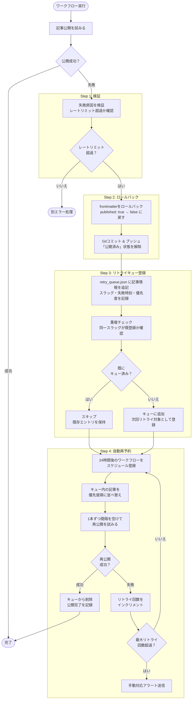
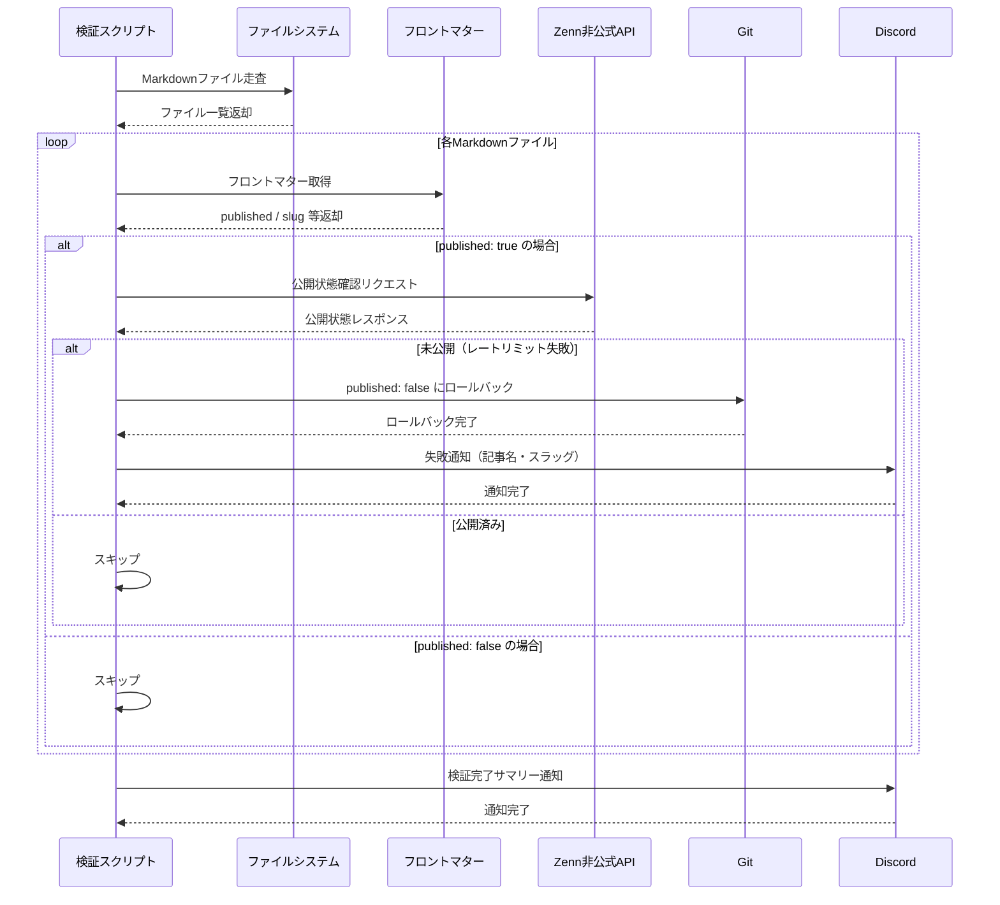
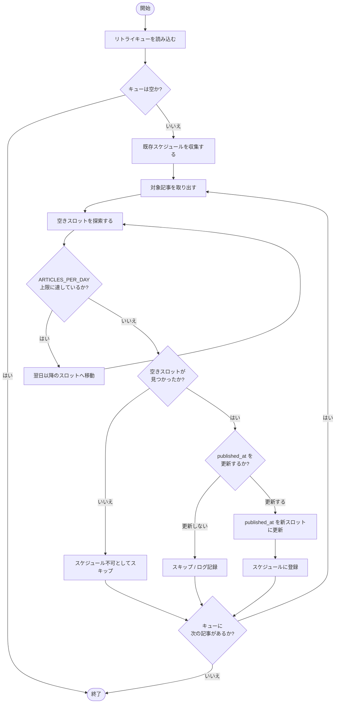

## 1. はじめに — レートリミットで記事が消えた日

2026年2月14日、7本分の記事予約公開が一斉にブロックされました。

その日はGitHub Actionsのワークフローが正常完了しているにもかかわらず、Zenn上では記事が公開されていない状態が続きました。ローカルのMarkdownファイルには `published: true` が書き込まれているのに、Zennのダッシュボードには記事が表示されない——これがレートリミット超過による失敗の実態です。

さらに問題が深刻なのは、`published: true` のまま放置された記事はzenn-post-schedulerから「公開済み」として扱われ、次回の実行時にスキップされる点です。つまり何も対処しなければ、それらの記事は永遠に公開されないまま放置されることになります。

本記事では、この失敗を受けて構築した **自動リトライ機構** の設計と実装を紹介します。

---

## 2. Zennのレートリミット仕様

### 公式FAQの内容

Zennの公式FAQには、次のような記載があります。

> コンテンツの粗製乱造を防止する観点から、コンテンツの投稿数には一定時間あたりの上限数（レートリミット）が設けられています。上限はさまざまな要素を組み合わせたロジックにより決定されますが、このロジックは不正防止のため開示しておりません。

具体的な数字は非公開ですが、仕様の骨格は次のとおりです。

- **判定方式**: 直近24時間以内の投稿数（投稿予約中を含む）で判定
- **回復タイミング**: 最後の投稿から24時間経過で再投稿可能
- **対象コンテンツ**: 記事・本（スクラップは上限が緩い）

### 24時間ローリングウィンドウ

レートリミットは「午前0時リセット」型ではなく、**最後の投稿時刻を起点とした24時間ローリングウィンドウ**で管理されています。そのため、日付が変わっても投稿できない場合があります。

### 経験則：24時間に5本以内

公式には明示されていませんが、運用経験から **24時間あたり5本以内** に収めると安全に動作することが多いです。ただしこの数値はZenn側のロジック変更で変わり得るため、あくまで参考値として扱ってください。

---

## 3. 失敗の根本原因

### zenn-post-schedulerの動作フロー

[zenn-post-scheduler](https://zenn.dev/x_color/articles/create-zenn-post-scheduler) は、Markdownファイルのフロントマターにある `published_at` を参照し、現在時刻が公開予定時刻を過ぎていれば `published: true` に書き換えてコミット・プッシュする仕組みです。

```
published_at チェック
  → 現在時刻 >= published_at の場合
    → published: true に変更
      → git commit & push
        → Zennが変更を検知して公開処理
```

### レートリミット超過時の挙動

7本分の記事が同一の `published_at` または近接したタイムスタンプを持っていた場合、スケジューラーは一度にすべての記事を `published: true` に変更します。この変更をZennが受け取った時点でレートリミットが発動し、**一部または全部のデプロイがブロック**されます。

### 取り残された記事の問題

GitHubリポジトリ上のMarkdownファイルは `published: true` になっているため、次回のスケジューラー実行では「公開済み」と判定されてスキップされます。

```
【失敗後の状態】
GitHub: published: true  ← スケジューラーはスキップ
Zenn:   未公開           ← ユーザーには見えない

→ 手動で修正しない限り永遠に公開されない
```

---

## 4. 解決策の設計



根本的な解決には、次の4ステップからなる **自動リトライ機構** が必要です。

```
Step 1: 検証スクリプト
  └─ Zenn APIで実際の公開状態を確認

Step 2: ロールバック
  └─ 未公開なのにpublished: trueの記事をfalseに戻す

Step 3: リトライキュー
  └─ 失敗した記事をJSONファイルに記録

Step 4: 自動再予約
  └─ 既存予約との競合を避けて次の空きスロットに再スケジュール
```

この仕組みを **GitHub Actions** で定期実行することで、失敗から回復までを完全自動化します。

---

## 5. 実装詳細

### 5.1 検証スクリプト（zenn-verify-published.py）



検証スクリプトは、GitHubリポジトリの `published: true` な記事がZenn上で実際に公開されているかどうかを確認します。

> **注意**: `check_zenn_published()` が使用する `/api/articles/{slug}` エンドポイントは、Zennが正式に公開しているパブリックAPIではなく、**非公式エンドポイント**です。仕様は予告なく変更・廃止される可能性があります。将来的にスクリプトが動作しなくなった場合は、まずエンドポイントの仕様変更を疑ってください。
>
> 現時点での正常レスポンス例（HTTP 200）:
> ```json
> {
>   "article": {
>     "id": 123456,
>     "slug": "your-article-slug",
>     "title": "記事タイトル",
>     "published": true,
>     ...
>   }
> }
> ```

```python
import os
import json
import glob
import requests
import yaml
from datetime import datetime, timezone
from pathlib import Path

ZENN_API_BASE = "https://zenn.dev/api"
DISCORD_WEBHOOK_URL = os.getenv("DISCORD_WEBHOOK_URL")
RETRY_QUEUE_PATH = "retry_queue.json"

def get_front_matter(filepath: str) -> dict:
    """MarkdownファイルからYAMLフロントマターを取得する"""
    with open(filepath, "r", encoding="utf-8") as f:
        content = f.read()
    if content.startswith("---"):
        parts = content.split("---", 2)
        if len(parts) < 3:
            return {}
        _, fm, _ = parts
        return yaml.safe_load(fm)
    return {}

def check_zenn_published(slug: str) -> bool:
    """Zenn非公式APIで記事の公開状態を確認する。

    使用エンドポイント: GET /api/articles/{slug}
    ※正式公開APIではないため、仕様変更により動作しなくなる可能性があります。
    """
    url = f"{ZENN_API_BASE}/articles/{slug}"
    try:
        response = requests.get(url, timeout=10)
        if response.status_code == 200:
            data = response.json()
            return data.get("article", {}).get("published", False)
        return False
    except requests.RequestException:
        return False

def rollback_to_draft(filepath: str) -> None:
    """フロントマターの published: true を published: false に戻す。

    YAMLパーサーを使用してフロントマターのみを対象に書き換えるため、
    本文中に 'published: true' という文字列が含まれていても安全に動作します。
    """
    with open(filepath, "r", encoding="utf-8") as f:
        content = f.read()

    parts = content.split("---", 2)
    if len(parts) < 3:
        return
    _, fm_str, body = parts

    fm = yaml.safe_load(fm_str)
    if fm is None:
        fm = {}
    fm["published"] = False

    new_fm_str = yaml.dump(fm, allow_unicode=True, default_flow_style=False, sort_keys=False)
    new_content = f"---\n{new_fm_str}---{body}"

    with open(filepath, "w", encoding="utf-8") as f:
        f.write(new_content)

def add_to_retry_queue(slug: str, original_path: str) -> None:
    """失敗した記事をリトライキューに追加する"""
    queue = []
    if Path(RETRY_QUEUE_PATH).exists():
        with open(RETRY_QUEUE_PATH, "r") as f:
            queue = json.load(f)

    # 重複チェック
    if not any(item["slug"] == slug for item in queue):
        queue.append({
            "slug": slug,
            "path": original_path,
            "failed_at": datetime.now(timezone.utc).isoformat(),
            "retry_count": 0  # 将来的な最大リトライ回数チェック用（現時点では未使用）
        })

    with open(RETRY_QUEUE_PATH, "w") as f:
        json.dump(queue, f, ensure_ascii=False, indent=2)

def notify_discord(message: str) -> None:
    """Discord Webhookで通知を送る"""
    if not DISCORD_WEBHOOK_URL:
        return
    payload = {"content": message}
    try:
        requests.post(DISCORD_WEBHOOK_URL, json=payload, timeout=10)
    except requests.RequestException as e:
        print(f"[WARN] Discord通知の送信に失敗しました: {e}")

def main():
    failed_articles = []

    for filepath in glob.glob("articles/*.md"):
        fm = get_front_matter(filepath)
        if not fm.get("published", False):
            continue

        slug = fm.get("slug") or Path(filepath).stem
        if check_zenn_published(slug):
            continue  # 正常に公開済み

        # 未公開ならロールバックしてキューに追加
        print(f"[FAIL] {slug} は公開されていません。ロールバックします。")
        rollback_to_draft(filepath)
        add_to_retry_queue(slug, filepath)
        failed_articles.append(slug)

    if failed_articles:
        message = (
            f"⚠️ Zenn公開失敗を検知しました\n"
            f"対象記事: {', '.join(failed_articles)}\n"
            f"リトライキューに追加し、ロールバックを実施しました。"
        )
        notify_discord(message)

if __name__ == "__main__":
    main()
```

**ポイント**:
- Zenn非公式APIのレスポンスで `published` フラグを直接確認します（エンドポイント仕様は変更される可能性があります）
- `rollback_to_draft()` はYAMLパーサーを用いてフロントマターのみを書き換えるため、本文中に `published: true` という文字列が含まれていても安全です
- ロールバックは **ファイル編集のみ** で、コミットはGitHub Actions側で行います
- Discord通知には `os.getenv()` を使い、Webhook URLをコードに直書きしません

### 5.2 リトライスクリプト（zenn-retry-failed.py）



リトライスクリプトは、キューに積まれた失敗記事を読み込み、既存の予約スロットと競合しない日時を自動選択して `published_at` を更新します。

```python
import os
import json
import glob
import yaml
from datetime import datetime, timedelta, timezone
from pathlib import Path

RETRY_QUEUE_PATH = "retry_queue.json"
ARTICLES_PER_DAY = 4        # 公式上限5本に対して安全マージン1本を確保
PUBLISH_HOUR = 9             # 公開時刻（9:00 JST）
JST_OFFSET = timedelta(hours=9)

def get_existing_scheduled_dates() -> list[datetime]:
    """既存のpublished_atスケジュールを収集する"""
    scheduled = []
    for filepath in glob.glob("articles/*.md"):
        with open(filepath, "r", encoding="utf-8") as f:
            content = f.read()
        parts = content.split("---", 2)
        if len(parts) < 3:
            continue
        _, fm_str, _ = parts
        fm = yaml.safe_load(fm_str)
        if fm is None:
            continue
        if fm.get("published") or fm.get("published_at"):
            published_at = fm.get("published_at")
            if published_at:
                if isinstance(published_at, str):
                    published_at = datetime.fromisoformat(published_at)
                # timezone-naiveの場合はUTCとして扱い、awareに統一する
                if isinstance(published_at, datetime) and published_at.tzinfo is None:
                    published_at = published_at.replace(tzinfo=timezone.utc)
                scheduled.append(published_at)
    return scheduled

def find_next_available_slot(scheduled_dates: list[datetime]) -> datetime:
    """既存スケジュールと競合しない最も近い空きスロットを返す"""
    jst_now = datetime.now(timezone.utc) + JST_OFFSET
    candidate = jst_now.replace(hour=PUBLISH_HOUR, minute=0, second=0, microsecond=0)
    if candidate <= jst_now:
        candidate += timedelta(days=1)

    while True:
        # 同じ日に何件の予約があるか確認
        same_day_count = sum(
            1 for d in scheduled_dates
            if d.date() == candidate.date()
        )
        if same_day_count < ARTICLES_PER_DAY:
            return candidate
        candidate += timedelta(days=1)

def update_published_at(filepath: str, new_dt: datetime) -> None:
    """フロントマターのpublished_atを更新する"""
    with open(filepath, "r", encoding="utf-8") as f:
        content = f.read()
    lines = content.split("\n")
    updated_lines = []
    for line in lines:
        if line.startswith("published_at:"):
            line = f"published_at: {new_dt.strftime('%Y-%m-%dT%H:%M:%S+09:00')}"
        updated_lines.append(line)
    with open(filepath, "w", encoding="utf-8") as f:
        f.write("\n".join(updated_lines))

def main():
    if not Path(RETRY_QUEUE_PATH).exists():
        print("リトライキューが空です。")
        return

    with open(RETRY_QUEUE_PATH, "r") as f:
        queue = json.load(f)

    if not queue:
        print("リトライキューが空です。")
        return

    scheduled_dates = get_existing_scheduled_dates()
    processed = []

    for item in queue:
        filepath = item["path"]
        if not Path(filepath).exists():
            print(f"[SKIP] ファイルが見つかりません: {filepath}")
            continue

        next_slot = find_next_available_slot(scheduled_dates)
        update_published_at(filepath, next_slot)
        scheduled_dates.append(next_slot)  # 追加したスロットを反映

        print(f"[RETRY] {item['slug']} → {next_slot.strftime('%Y-%m-%d %H:%M')} に再予約しました")
        processed.append(item["slug"])

    # 処理済みをキューから除去
    remaining = [item for item in queue if item["slug"] not in processed]
    with open(RETRY_QUEUE_PATH, "w") as f:
        json.dump(remaining, f, ensure_ascii=False, indent=2)

if __name__ == "__main__":
    main()
```

**競合回避アルゴリズムのポイント**:
- 既存の `published_at` を全記事から収集し、同日の予約数を数えます
- 1日あたりの上限（`ARTICLES_PER_DAY = 4`）を超える日はスキップします
- 新規記事を後から追加しても、`get_existing_scheduled_dates()` が自動的に反映するため手動調整は不要です

---

## 6. まとめ

今回の障害で明らかになった問題と解決策を整理します。

| 問題 | 解決策 |
|------|--------|
| レートリミット超過で記事が未公開のまま残る | 検証スクリプトで未公開を検知してロールバック |
| ロールバック後に再公開を忘れる | リトライキューに自動登録 |
| 再公開もレートリミットに引っかかる | 空きスロット探索で1日4本以内に制限 |
| 障害に気づかない | Discord通知で即座にアラート |

**運用上の推奨事項**:
- `ARTICLES_PER_DAY = 4` は公式上限5本に対する安全マージンです。状況に応じて調整してください
- Zenn非公式APIのエンドポイントは予告なく変更される可能性があります。スクリプトが動作しなくなった場合はまずこの点を確認してください
- GitHub Actionsの定期実行（`schedule`トリガー）を組み合わせることで、完全自動化を実現できます
